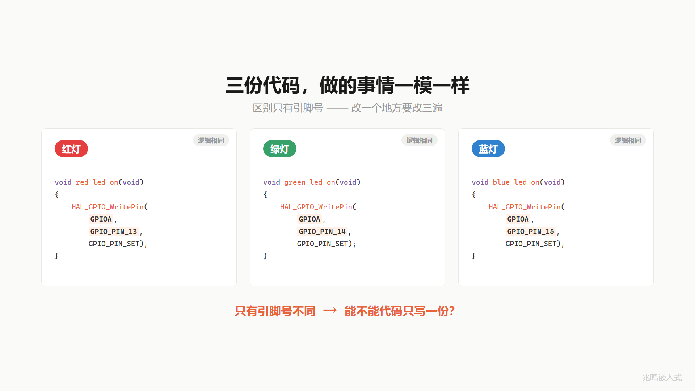
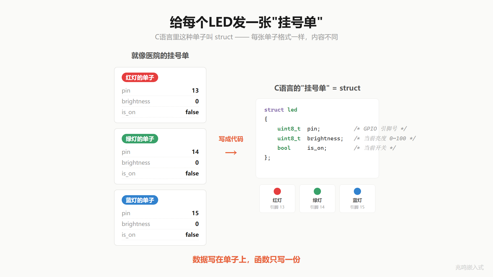
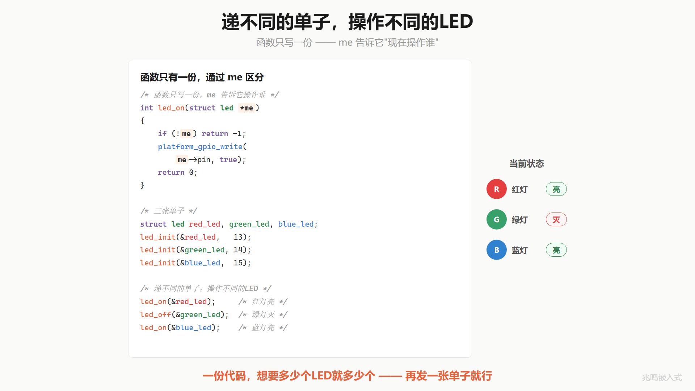
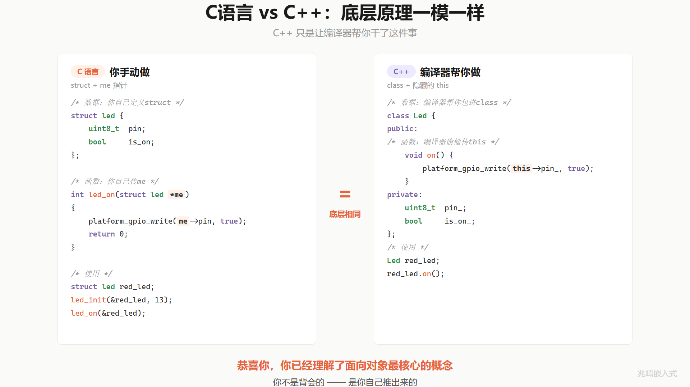

# 第 1 章 · 三个 LED 三份代码 · 第一次面对重复

配套代码：[`oop-in-c/code/01-three-leds/`](https://github.com/ZhaoChengBo/zhaoming-embedded/tree/master/oop-in-c/code/01-three-leds/)

## 1.1 一个真实场景

接手新项目。硬件工程师跟你说：板子上有三个状态指示灯，红灯接 GPIO Pin 13，绿灯接 Pin 14，蓝灯接 Pin 15。红灯指示心跳，绿灯指示运行正常，蓝灯指示有错误。

简单。打开 IDE，5 分钟敲完：

```c
void red_led_on(void)  { HAL_GPIO_WritePin(GPIOA, GPIO_PIN_13, GPIO_PIN_SET);   }
void red_led_off(void) { HAL_GPIO_WritePin(GPIOA, GPIO_PIN_13, GPIO_PIN_RESET); }

void green_led_on(void)  { HAL_GPIO_WritePin(GPIOA, GPIO_PIN_14, GPIO_PIN_SET);   }
void green_led_off(void) { HAL_GPIO_WritePin(GPIOA, GPIO_PIN_14, GPIO_PIN_RESET); }

void blue_led_on(void)  { HAL_GPIO_WritePin(GPIOA, GPIO_PIN_15, GPIO_PIN_SET);   }
void blue_led_off(void) { HAL_GPIO_WritePin(GPIOA, GPIO_PIN_15, GPIO_PIN_RESET); }
```

提交、编译、烧录、跑通。下班。

到这里看起来一切正常。这段代码也不会被 code review 打回。但工程上的麻烦才刚开始。

## 1.2 三个月后硬件改版

PM 跟你说：为了 EMC 通过，红灯改接 Pin 7。

简单，改一行：

```c
void red_led_on(void)  { HAL_GPIO_WritePin(GPIOA, GPIO_PIN_7, GPIO_PIN_SET);   }
void red_led_off(void) { HAL_GPIO_WritePin(GPIOA, GPIO_PIN_7, GPIO_PIN_RESET); }
```

注意，你改了两个地方。

如果还要支持调亮度，你写过 `red_led_set_brightness()`，里面也用了 Pin 13，那是第三个地方。如果再加反初始化函数 `red_led_deinit()`，第四个地方。

你能保证每次都改全？改漏一个，红灯有时候是 Pin 13、有时候是 Pin 7，这个 bug 你能找一下午。

PM 又来了：要再加 5 个 LED 做电量指示。

你打算怎么办？把 `red_led_on / red_led_off / ...` 复制 5 遍，前缀改成 `bat_1_led_ / bat_2_led_ / ...`？

那是 8 个 LED 乘以 4 个函数等于 32 个几乎一模一样的函数。每个函数体只有一行不一样：引脚号。



这就是绑死的代码。它能跑，但只能在 PM 不改硬件、不加 LED 的世界里跑。

## 1.3 把"区别"和"代码"分开

冷静下来问一个问题：这 32 个函数，到底有什么区别？

仔细看，区别只有一个东西：引脚号。

代码的逻辑（对一个 GPIO 写高电平、写低电平）完全一样。

那问题就清楚了：能不能代码只写一份，引脚号另外告诉它？

去医院看过病。前台给你一张挂号单，上面填名字、年龄、挂什么科。每个病人一张单子，单子上的内容不同，单子的格式相同。

医生只有一个，他怎么知道现在给谁看病？你把挂号单递给他，他看的是你单子上的信息。

给 LED 也发挂号单。红灯一张，写着 Pin 13。绿灯一张，写着 Pin 14。蓝灯一张，写着 Pin 15。三张单子，内容不同，格式一样。

医生（`led_on` 函数）只有一份。你想点哪个 LED，就把哪张单子递给他。



C 语言里这种"把一组相关数据装在一起"的东西叫 `struct`。给 LED 定义一份挂号单：

```c
struct led {
	uint8_t pin;            /* GPIO 引脚号 */
	uint8_t brightness;     /* 当前亮度 0~100 */
	bool    is_on;          /* 当前开关状态 */
};
```

然后给三颗 LED 各开一张单子：

```c
struct led red_led;
struct led green_led;
struct led blue_led;
```

每个 `struct led` 变量，就是一颗 LED 的全部信息。

## 1.4 函数怎么知道现在是哪张单子

挂号单有了，但函数怎么知道自己在操作哪个 LED？

你递给它。

C 语言里"递"东西给函数，用的是指针。`led_on` 这样写：

```c
int led_on(struct led *me)
{
	if (!me)
		return -1;

	me->is_on = true;
	platform_gpio_write(me->pin, true);
	return 0;
}
```

第一个参数 `struct led *me`，字面意思就是"我"：我现在操作的是哪张挂号单。

调用的时候：

```c
led_on(&red_led);
led_on(&green_led);
led_on(&blue_led);
```

`&` 在 C 里读作"取地址"，物理意义是"这张挂号单放在内存的哪个位置"。现在不需要纠结这个底层，就当它是"递这张单子"。

> **关于 `pin` 这个参数**
>
> 看到 `platform_gpio_write(me->pin, true)` 你可能会奇怪：真实 STM32 上 GPIO 既有 port (A/B/C/D)、又有 pin no (0-15)，怎么这里只有一个 `pin`？
>
> 教学版用一个 `uint8_t pin` 同时表示 port 和 pin 号：高 4 位是 port (A=0、B=1、...、I=8)，低 4 位是 pin 号 (0-15)。比如 `pin = 0x0D` 就是 PA.13、`pin = 0x3C` 就是 PD.12、`pin = 0x8E` 就是 PI.14。一个字节里塞两条信息。
>
> 编码宏长这样：
>
> ```c
> #define PIN_NUM(port, num)   ((((port) - 'A') << 4) | ((num) & 0x0F))
> /* PIN_NUM('A', 13) = 0x0D, PIN_NUM('D', 12) = 0x3C */
> ```
>
> 这套编码不是教学专用：和 `industrial/stm32_full/app/platform/arch/board/pin_board.c` 字节级一致（见附录 B）。读者过渡到工业版只多一层「字符串名 → uint8_t 编码」的解析（`platform_pin_get("PA.13")` 返回 `0x0D`），核心编码不变。
>
> 早期章节为什么不直接上字符串名？因为字符串解析 + 查表机制 ch15 platform 层才登场，这里先用编码让「换 port + 换 pin」的概念跑通。Linux 内核 `gpio_set_value(unsigned int gpio, ...)` 用的是另一种类似思路（全局 gpio number），都是把 port + num 折成一个整数让接口签名干净。第 15 章和附录 B 会把这条工业纪律展开。



把这个思路推广到所有操作（初始化、开、关、翻转、调亮度），就有了一个完整的 LED 模块。下面是节选自 [`oop-in-c/code/01-three-leds/pc/led.c`](https://github.com/ZhaoChengBo/zhaoming-embedded/tree/master/oop-in-c/code/01-three-leds/pc/led.c)：

```c
int led_init(struct led *me, uint8_t pin)
{
	if (!me)
		return -1;

	me->pin = pin;
	me->brightness = 0;
	me->is_on = false;

	platform_gpio_init(pin, GPIO_MODE_OUTPUT);
	platform_gpio_write(pin, false);

	return 0;
}

int led_on(struct led *me)
{
	if (!me)
		return -1;

	me->is_on = true;
	platform_gpio_write(me->pin, true);
	return 0;
}

int led_off(struct led *me)
{
	if (!me)
		return -1;

	me->is_on = false;
	platform_gpio_write(me->pin, false);
	return 0;
}

int led_toggle(struct led *me)
{
	if (!me)
		return -1;

	if (me->is_on)
		led_off(me);
	else
		led_on(me);

	return 0;
}

int led_set_brightness(struct led *me, uint8_t brightness)
{
	if (!me)
		return -1;
	if (brightness > 100)
		return -2;

	me->brightness = brightness;
	platform_gpio_write(me->pin, brightness > 0);
	me->is_on = (brightness > 0);
	return 0;
}
```

应用层的调用是这样：

```c
struct led red_led, green_led, blue_led;

led_init(&red_led,   PIN_NUM('A', 13));   /* 0x0D = PA.13 */
led_init(&green_led, PIN_NUM('A', 14));   /* 0x0E = PA.14 */
led_init(&blue_led,  PIN_NUM('A', 15));   /* 0x0F = PA.15 */

led_on(&red_led);
led_on(&green_led);
led_set_brightness(&blue_led, 75);
led_toggle(&green_led);
```

`PIN_NUM('A', 13)` 在 `common/platform.h` 里就是上面那行宏，展开成 `0x0D`。直接写 `led_init(&red_led, 0x0D)` 也一样能跑。宏只是让人读着像 PA.13，跑起来字节完全相同。

32 个重复函数砍到 6 个。再加 100 颗 LED，再开 100 张单子就行，函数一行不用加。

## 1.5 这个东西叫什么

你刚才跟我做的事（把属于同一个东西的数据打包在一起，让函数通过 `me` 指针知道自己在操作谁），软件工程里有个名字。

它叫封装（Encapsulation）。

你可能听过这个词，觉得很高大上，觉得它和 Java、C++、设计模式之类的东西绑在一起。

但你刚才看见了，它就这么简单。封装不是把代码藏起来，是让同一份逻辑服务不同的数据。

费曼讲过：被自己说服才叫理解。你不是从我这里背了一个定义，是从一个具体痛点（32 个重复函数）出发，自己推出了 struct + me 这个解。这种被自己说服的理解，是背不出来的。

## 1.6 me 就是 this

如果学过 C++，你会写：

```cpp
class Led {
public:
	void on()  { platform_gpio_write(pin_, true);  }
	void off() { platform_gpio_write(pin_, false); }
private:
	uint8_t pin_;
	bool    is_on_;
};

Led red_led;
red_led.on();
```

而 C 里写的是：

```c
struct led {
	uint8_t pin;
	bool    is_on;
};

int led_on(struct led *me)
{
	platform_gpio_write(me->pin, true);
	return 0;
}

struct led red_led;
led_on(&red_led);
```

这两段代码做的是一模一样的事。

唯一的区别有三处：

- C 里你手动写 `struct { ... }`，C++ 里编译器帮你做（你写 `class { ... }`）
- C 里你手动写 `(struct led *me, ...)`，C++ 里编译器偷偷加，名字叫 `this`
- C 里调用是 `led_on(&red_led)`，C++ 里是 `red_led.on()`

C++ 只是让编译器帮你干了你刚才手动干的事。底层机器码几乎一模一样。如果你想亲眼验证，把两段代码贴进 Compiler Explorer 这种在线汇编查看工具，差别小到可以忽略。



90% 的中国嵌入式工程师用 C 写了 10 年代码，从来不知道自己写的就是 OOP。他们以为 OOP 等于 C++、Java、Python。他们以为封装是高级特性。

事实是：你只要写过 `int sum(int *arr, int len)`，你就在做封装：你把"一组整数"打包成 `int *arr` + `int len`，函数通过指针操作哪一组。

后面 18 章 OOP 主体 + 工业实战 2 章要做的，就是把这件你已经在做的事情，做到工业级。

## 1.7 视频里没讲透的几个细节

视频 3 分 40 秒讲不完，书里补 6 个工程上你应该知道的点。这一节是"不实操也能完全理解"的核心。

### 1.7.1 为什么 me 是指针不是值传递

技术上你可以写 `int led_on(struct led me)` 用值传递。但有两个问题。

第一，值传递会复制整个 struct。`struct led` 现在小（3 字节左右），将来加上回调函数、ops 表、状态机，100 字节起跳。每次调用都拷贝一份，性能炸了。

第二，值传递改不了原对象。函数内修改 `me.is_on = true`，外面的 `red_led.is_on` 还是 `false`。Bug 找一周。

所以 C 的 `me`、C++ 的 `this`、Rust 的 `&self` 全都是指针/引用，不是值。这是工程上的硬约束，不是风格选择。

### 1.7.2 为什么第一个参数检查 NULL

每个函数开头都有 `if (!me) return -1;`。原因是 C 不像 Java 会自动抛 `NullPointerException`，对 NULL 指针解引用会做什么完全取决于平台。

在 STM32 这种 ARM Cortex-M 上，地址 0 通常是 Flash 起点（向量表），读不会崩。但 Flash 不允许直接写一个字节，`me->pin = 13` 相当于在地址 `0 + offsetof(struct led, pin)` 写一个字节，会立即触发总线异常进 HardFault，进入异常处理函数死循环（除非专门配过 MPU 让地址 0 可写）。

在 Linux 用户态上，地址 0 一般是无效页，进程立即收到 SIGSEGV，core dump。

无论哪种情况，都不是你想要的。所以工业代码里所有公开 API 的指针参数都必须做 NULL 检查。这是嵌入式 C 编码规范的硬规则。仓库 `coding-standards/` 目录里有一份独立的 7 章 PDF（架构设计 / 设计模式 / Clean Code / 代码风格 / 内存安全 / 硬件交互 / 安全检查清单），第 5 章《内存安全》专门讲指针参数检查纪律。视频里为节奏没强调，书里应该知道：这一行是工程纪律的最小单位。

### 1.7.3 为什么用 struct led 不用 typedef

你可能见过这种写法：

```c
typedef struct {
	uint8_t pin;
	bool is_on;
} Led_t;

int led_on(Led_t *me);
```

书里不这样写。Linus 在 Linux 内核编码风格文档里专门反对 typedef struct，原因不是写起来麻烦，而是 typedef 把"这是一个结构体"这件事藏了起来。

看到 `int a` 你立刻知道是 4 字节标量，按值传无所谓。看到 `Led_t a` 你不知道它是 4 字节还是 200 字节。`void foo(Led_t a)` 这种按值传函数，栈上可能默默复制 200 字节，性能黑洞看不见。`Led_t a = b;` 也一样：是简单赋值还是 struct 整块复制？struct 里有锁、回调、状态机的时候，复制语义出错很难查。`struct led a` 三个字符就把这些风险摆在面前，每个写 C 的工程师对 `struct` 这俩字都本能小心。

Linux 内核 4000 万行 C 代码绝大多数 struct 都不 typedef，包括 `struct file`、`struct device`、`struct gpio_chip`。读这本书你以后看内核源码不会觉得陌生。

唯一例外：函数指针类型适合 typedef（不然 `int (*)(struct led *)` 写起来太丑），第 9 章 ops 表会用到。

### 1.7.4 me->pin 这一句汇编层面发生了什么

你写的 C 代码是这样：

```c
me->is_on = true;
platform_gpio_write(me->pin, true);
```

编译器看到 `me->pin` 会做两件事：

第一，它知道 `me` 是 `struct led *`。
第二，它查 `struct led` 的定义，找到 `pin` 字段在结构体里的偏移：`pin` 是第一个字段，偏移 0；`brightness` 偏移 1；`is_on` 偏移 2。

编译出 ARM Cortex-M 汇编大致是这样（简化版）：

```
LDRB  r0, [r4, #0]      ; r4 = me, 取偏移 0 的字节, r0 = pin
LDRB  r1, [r4, #2]      ; 取偏移 2 的字节, r1 = is_on
```

`LDRB` 是 "Load Register Byte"，一条指令完成一次内存读。整个 `me->pin` 在汇编层面就是一次寄存器加常数偏移、然后 load。代价 1 个周期左右。

这就是为什么 OOP 在 C 里可以做到"零开销"。`me->pin` 不比 `red_pin` 这种全局变量贵。Bjarne Stroustrup（C++ 之父）有句名言："不用的特性零成本，用了的特性手写也不会更快。" `struct + me` 的范式就是这句话最干净的体现。

### 1.7.5 struct led 的内存布局

书里的 `struct led` 是这样：

```c
struct led {
	uint8_t pin;            /* 1 byte */
	uint8_t brightness;     /* 1 byte */
	bool    is_on;          /* 1 byte */
};
```

三个字节加起来 3 个字节。`sizeof(struct led)` 也是 3 字节，因为 `uint8_t` 和 `bool` 的对齐都是 1，编译器不需要加 padding。

但如果你给 struct 加一个 `uint32_t` 字段，故事就变了：

```c
struct led_v2 {
	uint8_t  pin;           /* offset 0, 1 byte */
	/* 3 bytes padding here */
	uint32_t blink_period;  /* offset 4, 4 bytes */
	bool     is_on;         /* offset 8, 1 byte */
	/* 3 bytes padding here */
};                          /* sizeof = 12, not 6 */
```

`uint32_t` 要求 4 字节对齐，所以编译器在 `pin` 后面塞 3 字节 padding 让 `blink_period` 落在偏移 4。同样，整个结构体大小要是最大对齐数（4）的倍数，所以末尾再塞 3 字节。

在内存紧张的 MCU 上（比如 RAM 只有 64KB），struct 字段顺序会影响实际占用。把大字段放前面、小字段放后面，padding 最少。

```c
struct led_v2_compact {
	uint32_t blink_period;  /* offset 0, 4 bytes */
	uint8_t  pin;           /* offset 4, 1 byte */
	bool     is_on;         /* offset 5, 1 byte */
	/* 2 bytes padding */
};                          /* sizeof = 8 */
```

这一点你现在不用记，知道 padding 这件事存在就行。真要紧凑布局可以用 `__attribute__((packed))` 或 `#pragma pack`，本书不展开。

### 1.7.6 platform_gpio_write 调到底，最终是写哪个寄存器

`platform_gpio_write(13, true)` 在 PC 模拟版里就是 `printf` 打一行。在 STM32 上是另一回事。

STM32 每个 GPIO 端口有一个 BSRR（Bit Set / Reset Register）。这是一个 32 位寄存器，地址是固定的（GPIOA 的 BSRR 地址在 STM32H7 上是 `0x58020018`）。寄存器格式：

- 低 16 位：写 1 把对应引脚拉高
- 高 16 位：写 1 把对应引脚拉低
- 写 0 无影响

所以 "把 PA13 拉高" 调到底就是：

```c
*(volatile uint32_t *)0x58020018 = (1U << 13);
```

一次 32 位 store，把 GPIOA 的 PA13 拉高。BSRR 设计成"写 1 才生效，写 0 无影响"是为了让多任务、多中断同时操作不同引脚时不打架（atomic）。中断半路改一个引脚，主循环改另一个引脚，互不影响。

`volatile` 关键字是必须的。它告诉编译器：这个地址的内容随时会变（硬件改的），不要缓存到寄存器里。否则编译器优化后可能"我刚才不是写过 0x58020018 了吗，再读还是同一个值，不用真的 load"，结果你以为写了，实际没写。

这个领域叫 MMIO（Memory-Mapped I/O）：把硬件寄存器映射到 CPU 的地址空间，用普通的内存读写指令操作硬件。ch05 打开 HAL 库源码漫游时你能看到这种映射的真实形态。

## 1.8 你现在的 LED 在 STM32 上长什么样

先把 PC 端的位置摆正：`pc/` 不是"伪硬件模拟"，**它是 platform 层的一种实现，和 STM32 / NXP / Linux 平等**。同一份 `platform.h` 头声明四个函数 (`platform_gpio_init / deinit / write / read`)，PC 端 `common/platform_pc.c` 把 GPIO 操作翻译成 stdout printf，STM32 端 `platform-mcu/stm32/led_stm32.c` 翻译成 `HAL_GPIO_*` 写 BSRR 寄存器，Linux 端写 sysfs（附录 C 完整版本）。四份共用同一个对外签名，应用层 `led.c` 一字不动。

`pc/` 那份 printf 不是占位符，它是"在 PC 上跑得起来的 platform 层"。同样接受 `pin = 0x0D` 这种编码、同样按 `init / write / read / deinit` 四个动作来做事，区别只是输出目标从硬件引脚换成了终端日志。换硬件实现，应用层 `led.c` 一字不动。

STM32 真实硬件上长这样（节选自 [`oop-in-c/code/01-three-leds/platform-mcu/stm32/led_stm32.c`](https://github.com/ZhaoChengBo/zhaoming-embedded/tree/master/oop-in-c/code/01-three-leds/platform-mcu/stm32/led_stm32.c)）：

```c
#include "led.h"
#include "stm32f4xx_hal.h"

/* pin 编码: 高 4 位 = port (A=0, B=1, ..., I=8), 低 4 位 = pin 号 */
#define PIN_PORT_IDX(pin)   (((pin) >> 4) & 0x0F)
#define PIN_NO(pin)         ((pin) & 0x0F)
#define PIN_MASK(pin)       (1U << PIN_NO(pin))

static GPIO_TypeDef * const _gpio_table[] = {
	GPIOA, GPIOB, GPIOC, GPIOD, GPIOE,
	/* F/G/H/I 看 MCU 型号有没有, 没有就填 NULL */
};
#define PIN_PORT(pin)       (_gpio_table[PIN_PORT_IDX(pin)])

void platform_gpio_init(uint8_t pin, uint8_t mode)
{
	GPIO_InitTypeDef cfg = {0};

	/* 按需开对应 port 时钟, 完整 switch 见配套源码 */
	cfg.Pin   = PIN_MASK(pin);
	cfg.Mode  = (mode == GPIO_MODE_OUTPUT) ?
	            GPIO_MODE_OUTPUT_PP : GPIO_MODE_INPUT;
	cfg.Pull  = GPIO_NOPULL;
	cfg.Speed = GPIO_SPEED_FREQ_LOW;
	HAL_GPIO_Init(PIN_PORT(pin), &cfg);
}

void platform_gpio_write(uint8_t pin, bool value)
{
	HAL_GPIO_WritePin(PIN_PORT(pin), PIN_MASK(pin),
	                  value ? GPIO_PIN_SET : GPIO_PIN_RESET);
}
```

应用层调用就是：

```c
/* 假设 LED 接在 PA.13 / PA.14 / PA.15 */
led_init(&red_led,   0x0D);   /* PA.13 */
led_init(&green_led, 0x0E);   /* PA.14 */
led_init(&blue_led,  0x0F);   /* PA.15 */
```

板子上 LED 改接到 PD.12，那就传 `0x3C`。`led.c` 一行不动，`main.c` 只动初始化参数。

注意一件事：`led.h`、`led.c` 一字不改。

变化的只有 `platform_gpio_*` 这一层胶水。这就是平台抽象层最直接的威力。

`HAL_GPIO_WritePin` 调到底就是 1.7.6 里讲的写 BSRR 寄存器。如果你打开 ST 的 HAL 源码看 `stm32h7xx_hal_gpio.c`，会看到这一行：

```c
GPIOx->BSRR = (uint32_t)GPIO_Pin;          /* SET   */
GPIOx->BSRR = (uint32_t)GPIO_Pin << 16;    /* RESET */
```

ST 自己的 HAL 也是封装：把"GPIO 端口"打包成 `GPIO_TypeDef`（一个 struct，里面是各个寄存器），通过 `GPIOx` 这个指针参数告诉函数操作哪个端口。`GPIOx` 就是 `me`，换了个名字。

**关于这里的 platform 层写法**：本节用的是"函数式包装"，直接 export 几个独立函数 `platform_gpio_init / platform_gpio_write / ...`。这是 ch01 阶段的教学简化形态，让你在还没接触虚函数表概念前先看到"换平台只改 platform 这一层"的好处。

真正工业级的 platform 抽象层用的是**虚函数表（ops 表）**：把所有 platform 操作打包进一个 struct，应用层通过指针访问，可以 runtime 切换平台。1.10 节贴的工业代码 `led_base + led_ops` 就是这种形态。

第 16 章会把 platform 层从函数式升级成 ops 表式（gpio_chip 子系统），和工业代码对齐。

## 1.9 你现在的 LED 在 Linux 用户态长什么样

Linux 上同款抽象，完整工程见附录 C。

## 1.10 工业代码里的 led 长什么样

**这一节是工业终态的早期一瞥，给你一张"未来三个月你会写出什么样的代码"的全景图**。下面要出现的概念（基类与子类、ops 表 / 虚函数表、基类层 dispatch（分发：走到对的实现）、纪律式封装）每一个都是后面 ch06 / ch09 / ch10 / ch11 才会系统展开的。**现在不用看懂任何细节**，只要扫一眼"代码最终长这样、应用层调用看不到 ops、换硬件不改应用层"就够了。看完本节回到 1.1 节继续从最朴素的状态走起，等读完 ch11 再回来重读这一节，那时候每一行都会自动通透。

我做的工业控制板项目里，LED 这一块分两层：基类一对 `.h / .c`，每种具体子类（GPIO LED / PWM LED / I²C LED）一对 `.h / .c`。基类那两份长这样：

```c
/* drivers/led/led_base.h · 基类公共头·子类和应用层都 #include */

#include <stdbool.h>

struct led_base;        /* 先声明类型存在，下面 led_ops 要用到它 */

struct led_ops {
	int (*on)(struct led_base *me);
	int (*off)(struct led_base *me);
	int (*toggle)(struct led_base *me);
};

struct led_base {
	const struct led_ops *ops;   /* 虚函数表指针 */
	const char *name;            /* 给日志打印用，例如 "red" / "green" */
	bool is_on;                  /* 当前开关状态 */
};

/* 应用层用的 API：只调下面这三个，看不到也不去碰上面字段 */
int led_on(struct led_base *led);
int led_off(struct led_base *led);
int led_toggle(struct led_base *led);

/* 注：base 里没有 pin / pwm_chan / i2c_addr 这种硬件特定字段。
 * pin 在 led_gpio 子类里、pwm_chan 在 led_pwm 子类里、i2c_addr 在 led_i2c 子类里。
 * 不同硬件方式的 LED 共享 base 接口，硬件细节关在各自子类。
 * 第 6 章讲为什么这样分，第 12 章讲子类怎么向上转型回 base。
 */
```

```c
/* drivers/led/led_base.c · 基类实现：把对外接口转发到子类 ops 表 */

#include "led_base.h"

int led_on(struct led_base *led)
{
	int ret;
	if (!led || !led->ops || !led->ops->on)
		return -1;
	ret = led->ops->on(led);
	if (ret == 0)
		led->is_on = true;
	return ret;
}

int led_off(struct led_base *led)
{
	int ret;
	if (!led || !led->ops || !led->ops->off)
		return -1;
	ret = led->ops->off(led);
	if (ret == 0)
		led->is_on = false;
	return ret;
}

int led_toggle(struct led_base *led)
{
	int ret;
	if (!led || !led->ops || !led->ops->toggle)
		return -1;
	ret = led->ops->toggle(led);
	if (ret == 0)
		led->is_on = !led->is_on;
	return ret;
}
```

`is_on` 这种状态字段在 dispatch 成功之后再更新，硬件操作失败时上层状态不会被改脏。工业代码里有的项目省掉 `is_on`、让硬件层每次自查，有的把它放在基类里给上层 query 用，看项目设计。

```c
/* environment_cfg/environment_export.h · 公开句柄，应用层用它 */

extern struct led_base *green_led;
extern struct led_base *red_led;
```

应用层调用：

```c
led_on(green_led);
led_off(red_led);
led_toggle(green_led);
```

应用层看到的就是普通函数调用 `led_on(green_led)`。它根本不知道下面有 ops 表、有 dispatch、有具体子类（GPIO LED / PWM LED / I²C LED 等）。这种"应用层只见接口、看不见实现"的写法叫封装层，工业代码里所有驱动都做这件事。

### 1.10.1 字段公开但应用层不去碰：纪律式封装

`struct led_base` 的字段定义就在 `led_base.h` 头文件里，应用层 `#include "led_base.h"` 之后，技术上写 `green_led->is_on = true` 编译能过。**工业代码里的"封装"，主要靠纪律，不是靠编译器强制**。

为什么不把字段藏到 `.c` 里、让编译器拒绝外部访问？因为后面 ch06 起要讲继承：每种具体 LED（GPIO / PWM / I²C）都是一个**子类**，子类要把 `struct led_base base;` 作为自己的第一个字段嵌进来。子类源文件得知道 `struct led_base` 的完整字段（要算 sizeof、要对偏移），所以 base 的字段定义必须放在头文件里、给子类可见。**字段藏 `.c` 和继承机制层互斥**：一选了藏，子类就编译过不去。

那应用层为什么不会乱碰？两层纪律一起作用：

- **接口纪律**：每个驱动的 `.h` 顶上写清楚"只调下面这几个函数"，code review 看到外部代码写 `green_led->is_on = true` 直接打回
- **指针句柄持有**：base 实例本身在驱动 `.c` 文件里 static 分配，应用层只拿 `extern struct led_base *green_led;` 这种指针句柄，从来不在自己代码里 `struct led_base x;` 直接定义实例。能拿到的只是别人给的指针，状态变更走 `led_on(green_led)` 是最自然的选择，绕过去反而费劲。ch04 4.7.8 节会单独讨论这种全局指针句柄合不合理

Linux 内核也是这套纪律。`struct device` 几十个字段全部公开在 `include/linux/device.h` 里，谁的代码写 `dev->kobj.parent = NULL` 之类直接绕过 driver core，会被维护者一句话打回。Greg Kroah-Hartman 在内核驱动文档和邮件列表里多次强调这件事，靠的是**编码约定 + review 文化**，不是编译器。Zephyr RTOS、GObject 同一套路。这是 OOP-in-C 继承场景里几乎唯一可行的工业选择。

ch02 会把这套纪律的两件工具讲透：`static` 锁内部工具函数（链接期硬锁）+ `/* private */` 字段注释（命名纪律 + code review 软锁）。同时会单独提一种更严格的隔离：字段彻底藏进 `.c`，编译器直接拒绝外部访问，叫不透明指针。它的真实用武之地是**跨二进制库边界**（libc 的 `FILE *`、POSIX 的 `pthread_t`、`sqlite3 *`、`CURL *`），应用代码和库实现物理分离·这些场景下应用代码不需要继承库类型。一旦涉及继承（这本书后续 18 章主线），就不能用那套写法。

### 1.10.2 ops 表 + 封装层：让 led_on 一行胶水管所有 LED 子类

你注意到三件事：

1. `struct led_base` 多了一个字段 `ops`，是一张函数指针表（虚函数表）
2. `led_on(led)` 不是直接操作 GPIO，它内部走 `led->ops->on(led)` 这一行 dispatch
3. 不同子类的 LED（GPIO 拉电平、PWM 调亮度、I²C 发命令）都填一份自己的 ops 表，应用层调 `led_on()` 一行就走到对的实现

第 11 章会从函数指针一步步推导出这套机制，把 `led_on()` 内部那行 dispatch 讲透：编译器把它编译成什么 ARM 汇编、ops 表存在内存哪、为什么 `ops` 必须是 `struct led_base` 第一个字段。

现在你不用看懂细节，只要看出：**工业代码里的 led，骨架还是 struct + me，外面套了一层 ops 表（让应用层无视具体硬件）和一层封装函数（让应用层不直接碰函数指针）**。这两层都是工程纪律，不是炫技。

### 1.10.3 一眼看懂工业代码的眼光

这就是这本书要让你形成的眼光。拿到一份陌生的工业代码：

- 看到 `xxx_base.h` 里 `struct xxx_base { const struct xxx_ops *ops; ... };`，知道这是父类 + ops 表 / 虚函数表
- 看到 `xxx_base.h` 顶上一行注释"应用层只调下面 API，不要直接访问字段"，知道这是纪律式封装
- 看到 `xxx_on(handle)` 内部走 `handle->ops->on(handle)`，知道这是 dispatch
- 看到 `extern xxx_base *yyy;`，知道是别人创建好的句柄

整套就是 struct + me 的工业放大版。你这一章学的核心，加上第 11 章的 ops 表演化，等于工业项目里所有驱动的骨架。

反过来看，1.8 节给的 STM32 platform 层（以及附录 C 的 Linux 完整工程）用的是函数式（几个 `platform_gpio_*` 函数独立 export），是教学简化版。工业代码的 platform 层和这里 `led_base` 一样，都是 ops 表（虚函数表）形式。两者都对，只是抽象程度不同。书里第 16 章会把 platform 层从函数式升级成 ops 表式（gpio_chip 子系统），完成这个对齐。

## 1.11 跑一遍

```bash
cd oop-in-c/code/01-three-leds/pc
make
./demo
```

输出节选：

```
========================================
  Three LEDs, one set of code.
  me pointer decides who to operate.
========================================

--- Init ---
[GPIO] PA.13 init as OUTPUT
[GPIO] PA.13 -> LOW (OFF)
  [LED] PA.13 initialized
[GPIO] PA.14 init as OUTPUT
[GPIO] PA.14 -> LOW (OFF)
  [LED] PA.14 initialized
...

--- Turn on RED ---
[GPIO] PA.13 -> HIGH (ON)
  [LED] PA.13 ON

--- Turn on GREEN ---
[GPIO] PA.14 -> HIGH (ON)
  [LED] PA.14 ON

--- Turn on BLUE ---
[GPIO] PA.15 -> HIGH (ON)
  [LED] PA.15 ON
```

`led_on` 这个函数在 `led.c` 里只写了一次。但屏幕上 PA.13、PA.14、PA.15 都被点亮了。因为传入的 `me` 指针不同。

`[GPIO] PA.13 init as OUTPUT` 这一行不是 `led.c` 写的，是 `common/platform_pc.c` 写的。它把传进来的 `pin = 0x0D` 拆回 port 字母 `A` 和 pin 号 `13`，再 printf。STM32 上同一个 `0x0D` 走到 `platform-mcu/stm32/led_stm32.c` 里就被翻译成 HAL 库写 BSRR 寄存器，把真的 PA.13 引脚拉高。同一份编码、同一个签名、两份不同的 platform 实现。

完整输出和源码见 [`oop-in-c/code/01-three-leds/`](https://github.com/ZhaoChengBo/zhaoming-embedded/tree/master/oop-in-c/code/01-three-leds/)。配套代码包目录结构：

```
01-three-leds/
├── pc/                 PC 端 platform 实现（printf 翻译，gcc 一句编译）
└── platform-mcu/
    └── stm32/          STM32 端 platform 实现（HAL 写寄存器）
```

跨章共享的部分在 `oop-in-c/code/common/`：`platform.h` 是这本书每一章 `pc/` 都 #include 的对外接口头（也是 STM32 端 `led_stm32.c` 实现的同一个头），`platform_pc.c` 是 PC 端的 platform 实现。本章你看到的 `[GPIO] PA.13 ...` 日志就出自这一份。

ch01-ch10 早期教学章节配套代码都简化为这两份对照（PC + STM32），让你专注 OOP 概念本身。Linux 用户态完整工程见附录 C，工业级 ops 表 / 多子类 / 多平台见 `industrial/` 目录和后面章节。

## 1.12 视频回放

想听口播版的可以看 B 站这一期视频：

> [《C 语言：三个 LED 你写了三份代码？一个挂号单的思路让你秒懂封装》](https://www.bilibili.com/video/BV1PyDHB8E3Q/)

视频和书互相补强。视频更直观看口播节奏和挂号单类比的现场感。书里补了视频没讲透的 6 个细节（1.7 节）、STM32 真机对照（1.8 节）、工业代码全景（1.10 节）。Linux 用户态完整对照工程见附录 C。

## 下一章

挂号单是敞开的。任何人都能直接 `red_led.pin = 999` 把它弄坏。你同事顺手改了一个值，所有 LED 全乱了。

怎么把单子锁起来？下一章解决。

下一篇：[第 2 章 · 同事改了一行 LED 全乱了 · static 与信息隐藏](02-同事改了一行.md)
