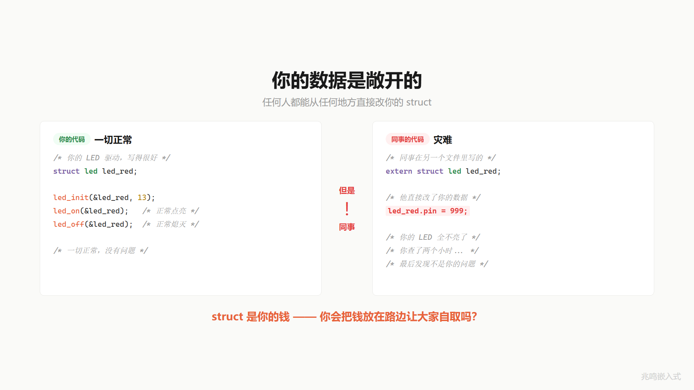
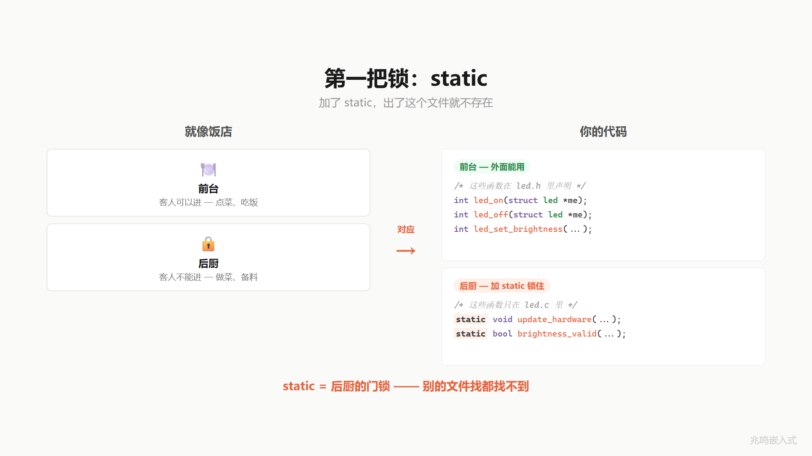
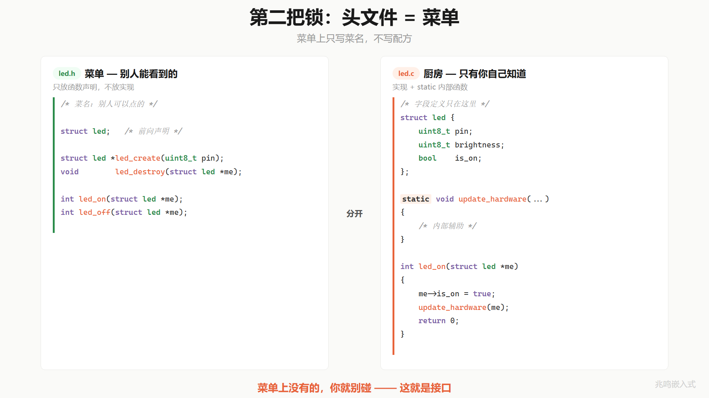
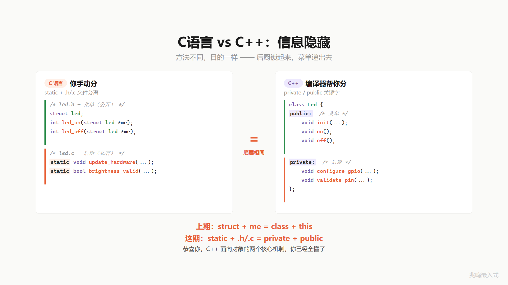

# 第 2 章 · 同事改了一行 LED 全乱了 · static 与信息隐藏

配套代码：[`oop-in-c/code/02-static-hiding/`](https://github.com/ZhaoChengBo/zhaoming-embedded/tree/master/oop-in-c/code/02-static-hiding/)

## 2.1 一个真实场景

第 1 章你给三颗 LED 发了挂号单，代码只写一份，问题解决了。

提交、合并、上线。

一周后同事来找你：你 LED 模块好像有 bug，红灯不亮了。

你去看代码，main.c 里没动过。再翻 git log，发现同事在另一个文件里加了一行：

```c
extern struct led red_led;

/* 我做了点优化，让 pin 直接 = 999 */
red_led.pin = 999;
```

他不是恶意的。他可能在做硬件适配实验，可能手抖打错变量名，可能临时调试忘了撤回。但效果是确定的：你的红灯被驱动到一个不存在的引脚，从此不亮。

你打开微信想质问他，想了想，默默把聊天框关了。你心想：我的代码明明没问题啊。

对，你的代码确实没问题。问题是：你的 struct 字段在 `led.h` 里完全敞开，任何 `#include` 它的 `.c` 文件都能 `red_led.pin = 999` 把它改坏。还有一类问题：你内部的辅助函数（更新硬件状态、检查参数合不合法）也对外完全可见，同事在另一个文件里调用它，绕过你的 `led_on / led_off`，硬件状态会和 struct 里的状态对不上。



银行不会把客户的钱放在路边让大家自取。柜台是有的，密码是有的，流程是有的。你的 struct 是钱，函数是柜台，现在缺一把锁。

## 2.2 第一把锁 · static

C 语言给你一把锁，叫 `static`。

去过饭店。前台是给客人用的（点菜、付钱、吃饭），后厨是给厨师用的（备料、炒菜）。客人进后厨只会添乱。所以后厨的门是锁的。

代码也一样。有些函数是给外面用的（开灯、关灯、调亮度），这些是前台。有些函数是你内部用的（更新硬件状态、检查参数合不合法），这些是后厨。

怎么把后厨锁起来？在函数前面加一个词 `static`。

加了 `static`，这个函数就只在它所在的 `.c` 文件里能用。别的 `.c` 文件想调它，链接器报 `undefined reference`。门锁上了，找都找不到。

变量也一样。文件作用域的变量加 `static`，就只在本文件可见。



举个例子。`led.c` 里有两个内部工具函数，一个统一更新硬件状态，一个检查亮度合不合法：

```c
static void update_hardware(struct led *me)
{
	platform_gpio_write(me->pin, me->is_on);
}

static bool brightness_valid(uint8_t brightness)
{
	return brightness <= 100;
}
```

前面加 `static`，这两个函数对 `main.c` 不存在。`main.c` 里写 `update_hardware(red);` 链接器直接报错。后厨锁上了。

`static` 是 C 语言的硬通货。这本书后面每一章每一个驱动都在用它锁内部工具函数。读懂别人的 C 模块，先看哪些函数加了 `static`、哪些没加：没加 `static` 的就是这个模块对外承诺的接口，加了的全是内部实现细节。这条规矩内核、nginx、Redis、FreeRTOS 都在用，是行业事实标准。

## 2.3 第二把锁 · 头文件契约 + /* private */ 纪律

锁住后厨只解决一半问题。`static` 锁住的是函数，但你的 struct 字段 `pin / brightness / is_on` 还敞着。同事 `red_led.pin = 999` 这一行，编译器拦不住。

C 里你做两件事。

**第一件**：把头文件当成模块的契约清单。`.h` 里写**外部能调的函数**，再把字段加上 `/* private */` 注释，明确告诉读者哪些不该直接写：

```c
/* led.h - 这是你对外承诺的全部接口 */

#include "platform.h"

struct led {
	uint8_t pin;            /* private: 通过 led_init 设置 */
	uint8_t brightness;     /* private: 通过 led_set_brightness 设置 */
	bool    is_on;          /* private: 通过 led_on / led_off 设置 */
};

int led_init(struct led *me, uint8_t pin);
int led_deinit(struct led *me);

int led_on(struct led *me);
int led_off(struct led *me);
int led_toggle(struct led *me);
int led_set_brightness(struct led *me, uint8_t brightness);

int led_get_state(const struct led *me,
                  bool *is_on, uint8_t *brightness);
```

注意一件事：字段还**留在 `.h` 里**，没有被搬走。这是 C 语言的工程现实：很多场景需要外部知道 `struct led` 的大小（栈上直接 `struct led red_led;` 分配，或者子模块嵌套它做继承，下章开始你会反复看到），字段藏到 `.c` 里整个机制就用不了。

但每个字段后面挂了一行注释 `/* private: ... */`。它在告诉读 `led.h` 的人：**字段是给 `led.c` 自己用的，外部别直接写。要改，走对应的 API**。

新增的 `led_get_state` 是这套契约的另一面：外部要**读**字段，也走 API，不直接读 `me->is_on`。这件事教学价值大于运行时价值：它让"通过 API 访问"成为口头禅，下章你新建电机模块也会自然写 `motor_get_state`、ch06 写继承时父类查询函数也走这个套路。

**第二件**：内部工具函数加 `static` 关进 `.c`，外部连名字都看不到。这是 2.2 节那把锁。

```c
/* led.c */

#include "led.h"

static void update_hardware(struct led *me)
{
	platform_gpio_write(me->pin, me->is_on);
}

static bool brightness_valid(uint8_t brightness)
{
	return brightness <= 100;
}

int led_init(struct led *me, uint8_t pin) { /* ... */ }

int led_on(struct led *me)
{
	if (!me) return -1;
	me->is_on = true;
	update_hardware(me);
	return 0;
}

/* ... */
```

外部要操作 LED，只能走 `led.h` 暴露的函数：`led_init / led_on / led_off / led_toggle / led_set_brightness / led_get_state / led_deinit`。这些是契约清单里写明的；其他的（`update_hardware` / `brightness_valid` / 字段直接写），契约里没提，工程纪律上禁止。



那同事 `red_led.pin = 999` 这一行，怎么办？

C 语言里，**这一行在编译器层面拦不住**。编译器认 `.h` 里的字段定义，看到 `red_led.pin = 999` 不会报错。

拦它的是工程纪律：

- **命名清晰**：你的 API 全部 `led_xxx`。读 `red_led.pin = 999` 这一行的人，第一反应是「为什么不调 `led_xxx`」。这种写法在 code review 里立刻被打回
- **`/* private */` 注释**：每个字段挂着这一行。读 `led.h` 的人知道这是私有字段，绕过 API 直接写就是违纪
- **code review**：进 master 的 commit 都要 review。一行 `red_led.pin = 999` 就是 reviewer 的红线
- **`static` 工具函数**：上面说过的链接期机制锁。`update_hardware` 这一类函数外部连名字都看不到，绕过 `led_on` 直接动硬件的路被彻底封死

四道关一起上，业内 99% 的 C 项目这么做：nginx、Redis、LVGL、FreeRTOS、Linux 内核大部分驱动模块，struct 字段全在 `.h` 公开，靠这套纪律隔离。

> 完全机制锁的方案在 C 里也存在，叫**不透明指针**：`.h` 里只写 `struct led;` 前向声明，字段藏到 `.c` 里，编译器直接拒绝外部读字段。代价是字段不可见后无法栈分配也无法被嵌套继承。这条路适合**跨二进制库的 ABI 边界**（ABI = Application Binary Interface，应用程序二进制接口；通俗讲就是"已经编译好的库"和"应用代码"对接时双方约定的字段布局），例子有 `FILE *` / `pthread_t` / `sqlite3 *` / `CURL *` 这一类。在自家应用代码里几乎不用。详见 2.6.3 节。

## 2.4 这个东西叫什么

你刚才跟我做的事，把不该让外面碰的工具函数和字段藏起来，外部只通过命名清晰的接口和模块打交道，软件工程里有个名字。

它叫信息隐藏（information hiding）。

David Parnas 1972 年那篇 "On the Criteria To Be Used in Decomposing Systems into Modules" 第一次系统讲清楚这件事。中文叫信息隐藏，也常归到 encapsulation 这个大概念底下。

C 里实现信息隐藏的工具有三件：

1. `.h` 头文件作为契约：声明能用的函数 + 字段标 `/* private */`
2. 内部工具函数加 `static`：链接期机制锁，绝对拦
3. 命名纪律 + code review：字段直接写靠纪律拦，不靠编译器

你不是从我这里背了一个定义，是从一个具体痛点（同事改一行你的 LED 全乱了）出发，自己推出了这套解。这种被自己说服的理解，是背不出来的。

费曼讲过一句话：好的设计不靠人小心，靠机制上不让错误发生。`static` 是机制上的锁。`/* private */` 字段注释 + 命名纪律是工程文化。两件事一起做，C 项目就有了和 C++ 私有成员等价的效果。

## 2.5 C 对 C++

如果你写过 C++，你会写：

```cpp
class Led {
public:
	int  on();
	int  off();
	int  set_brightness(uint8_t b);
private:
	uint8_t pin_;
	uint8_t brightness_;
	bool    is_on_;
	void    update_hardware();
};
```

而 C 里写的是：

```c
/* led.h */
struct led {
	uint8_t pin;            /* private */
	uint8_t brightness;     /* private */
	bool    is_on;          /* private */
};

int led_on(struct led *me);
int led_off(struct led *me);
int led_set_brightness(struct led *me, uint8_t b);

/* led.c */
static void update_hardware(struct led *me);
```

做的是一模一样的事。

C++ 的 `private:` 等同于 C 的"字段标 `/* private */` + 命名纪律 + code review"再加"工具函数加 `static`"。`public:` 等同于"声明放在 `.h`"。

但有一个层面 C 和 C++ 不同：**强度不同**。

- C++ 的 `private` 是**硬 private**：编译器看到外部代码碰 `pin_` 直接报错，机制层 0 漏网概率
- C 的字段 `/* private */` 是**软 private**：编译器看到 `red_led.pin = 999` 不会报错，靠命名纪律 + code review 拦
- C 的 `static` 函数是**硬 private**：链接期机制锁，外部连符号都找不到

这本书后面所有章节都用这套"软 private 字段 + 硬 private 工具函数"的写法。现实工程里这是 C 圈子的主流，nginx / Redis / LVGL / FreeRTOS / Linux 内核驱动全是这条路。靠纪律压住的代价换来一项收益：字段公开后才能做后面 18 章会展开的所有事（栈分配、子类嵌套继承、`container_of` 反向找回外层）。

C 想要硬 private 的字段，唯一的办法是不透明指针。代价是失去栈分配和继承嵌套。这条路适合跨 ABI 边界（`FILE *` / `pthread_t`），不适合自家应用代码。2.6.3 节展开。

底层机器码差不多。`update_hardware` 加不加 `static` 编译出的指令一样；`me->is_on` 在 `.h` 公开和藏 `.c` 里编译出的偏移访问也一样。运行时一行 cost 都没多。



第 1 章的恒等是 `struct + me = class + this`。

这一章的恒等是 `static + .h/.c 分离 + /* private */ 纪律 = private + public`。

两条加起来，C++ 面向对象的两个核心机制（封装和成员函数），你已经全懂了。而且不是背的，是自己用 C 推出来的。

## 2.6 视频里没讲透的几个细节

### 2.6.1 三种隐藏强度对照

C 里你有三种把字段藏起来的强度。

**第一种 · 完全不藏**（ch01 的写法）：字段在 `.h`，外部 `me->pin = 999` 编译过、链接过、运行也"过"，bug 在生产环境出现。

**第二种 · 软 private**（ch02 主体演示，本书全程使用）：字段在 `.h`，加 `/* private */` 注释 + 命名纪律 + code review，工具函数加 `static`。`me->pin = 999` 这一行编译能过，但 PR 进不了 master，纪律拦下，漏网概率取决于团队 review 强度。

**第三种 · 硬 private（不透明指针）**：字段藏 `.c`，`.h` 只前向声明 `struct led;`。外部 `me->pin = 999` 编译就过不去（`invalid use of undefined type`），机制层面 0 漏网。代价是字段不可见后失去 (a) 外部栈分配（编译器算不出 `sizeof`）(b) 子类嵌套继承（子类源文件需要看到完整字段才能 embed）。

GitHub 上主流 C 项目的选择：

| 项目 | 选哪种 | 原因 |
|---|---|---|
| Linux 内核大部分驱动 | 第二种 | 设备子系统继承嵌套，必须看到字段 |
| nginx / Redis / LVGL | 第二种 | 自家工程，命名纪律压得住 |
| FreeRTOS | 第二种 | RTOS 内部结构体大量嵌套 |
| libc `FILE *` / POSIX `pthread_t` | 第三种 | 跨二进制库 ABI 边界 |
| `sqlite3 *` / `CURL *` | 第三种 | 跨二进制库 ABI 边界 |

工业代码里第三种的真实用武之地是**跨二进制库**：库做成 `.so` / `.dll` / `.a`，应用代码以 binary 形式连进来，库的 struct 字段在不同版本可能改动，把字段藏起来是 ABI 兼容性的硬需求。自家应用代码（一份工程一起编译）几乎不用。

### 2.6.2 链接器层面，static 和不加 static 的差别

`static` 改变的不是编译期可见性，是链接期符号表。

不加 `static` 的函数（外部链接 external linkage）：编译器把函数名写进 `.o` 文件的全局符号表，链接器在合并多个 `.o` 时能看到。不同 `.o` 里的同名函数，链接器报 `multiple definition`。

加 `static` 的函数（内部链接 internal linkage）：编译器要么完全不写符号表（被内联或调用图剪枝），要么写成本地符号（链接器跨 `.o` 看不到）。

```
$ nm led.o
0000000000000000 T led_init
0000000000000098 T led_deinit
0000000000000114 T led_on
0000000000000180 T led_off
00000000000001a0 t update_hardware
00000000000001f0 t brightness_valid
```

大写 `T` 是 external，小写 `t` 是 file-local。这就是为什么外部 `update_hardware(red);` 链接报 `undefined reference`：链接器扫所有 `.o` 的全局符号表都找不到 `update_hardware`。

`static` 给的是链接期硬锁，比注释 + 纪律强一个量级。所以这本书后面所有内部工具函数都加 `static`：硬锁能上的位置必须上。

### 2.6.3 不透明指针 · 跨 ABI 边界的写法

如果你写过 `fopen / fclose`，已经用过不透明指针。`FILE` 的字段在不同 libc 实现里不一样（glibc 一组，musl 另一组，Windows MSVC 又是一组），但你的应用代码全部走 `FILE *` 这个不透明指针 + `fopen / fread / fclose` 这套 API，跨 libc 实现都能编都能跑。

实现是这样的：

```c
/* stdio.h - libc 对外的契约 */
typedef struct _IO_FILE FILE;     /* 不透明前向声明 */

FILE  *fopen(const char *path, const char *mode);
size_t fread(void *p, size_t sz, size_t n, FILE *f);
int    fclose(FILE *f);

/* libc 内部某个 .c 文件 */
struct _IO_FILE {
	int    fd;
	char  *buf;
	size_t buf_size;
	/* ... 几十个字段, glibc 和 musl 完全不一样 ... */
};
```

应用代码 `#include <stdio.h>` 拿到 `FILE *`，但永远碰不到字段。libc 升级把 `_IO_FILE` 字段加一个减一个，应用代码不用改也不用重新编译。这就是跨 ABI 边界。

C 圈子的不透明指针经典例子：

| API | 不透明类型 | 用途 |
|---|---|---|
| libc | `FILE *` | 文件流 |
| POSIX | `pthread_t` / `pthread_mutex_t` | 线程和互斥锁 |
| sqlite3 | `sqlite3 *` / `sqlite3_stmt *` | 数据库连接和预编译语句 |
| libcurl | `CURL *` | HTTP 请求句柄 |
| Win32 | `HANDLE` | 系统资源句柄 |
| RT-Thread | `rt_device_t` | 设备驱动句柄（应用层视角） |

特征都一样：库做成可独立部署的二进制，应用代码以 link 形式连进来，库内部字段改了应用层不感知。这是不透明指针的真实工业用武之地。

字段藏 `.c` 还有一个连带代价：调用方不能 `sizeof`，所有对象生命周期得由库自己管，所以这种 API 通常成对出现 `xxx_create + xxx_destroy`（`fopen + fclose` / `pthread_create + pthread_join` / `sqlite3_open + sqlite3_close`）。`xxx_create` 内部 `malloc`，调用方拿到指针，结束时 `xxx_destroy` 负责 `free`。这不是因为不透明指针非要堆分配，是因为 ABI 边界让调用方算不出 size 只能让库代分配。自家应用代码字段公开的写法，对象就直接 `struct led red;` 在栈上分配，不需要 create/destroy 这一对。

**本书后面 18 章 OOP 主线全部不用不透明指针**。原因：(a) 这本书写的是嵌入式自家应用代码，不是跨二进制库；(b) ch06 起所有继承都需要子类看到父类字段做 embed，字段藏起来 `struct led_gpio { struct led_base base; ... }` 这一行直接编译报错。

如果哪天你做的是给别人用的库（嵌入式 `.a` SDK / Linux `.so`），那时候用第三种。框架不一样，工具不一样。

### 2.6.4 不透明指针的运行时代价

零。

不管是第二种还是第三种，`red->is_on` 在 `led.c` 内部编译出的指令一样：

```
LDRB  r1, [r0, #2]      ; 偏移 2 是 is_on 字段
```

`led_on(red)` 在 `main.c` 里编译出 `BL led_on`（branch with link，跳转并保存返回地址）。函数调用本身有几个周期开销，但 ch01 也是函数调用，没有额外。

第三种"看不见字段"是编译期机制，链接出二进制后字段还在那里、布局不变、偏移不变。Bjarne Stroustrup 那句"不用的特性零成本"在 C 上同样成立。

### 2.6.5 Linux 内核 struct file · 为什么选软 private

把视角拉到工业级。Linux 内核的 `struct file`（每打开一个文件就有一份）是软 private 的工业级范例。

`include/linux/fs.h` 里 **`struct file` 的字段是公开的**：驱动代码 `#include <linux/fs.h>` 看得到 `f_pos / f_flags / f_inode` 等字段。这是软 private：内核内部所有子系统共享同一份头文件，字段公开是为了允许内核子系统嵌套和读取。

但内核**强烈劝阻驱动直接读字段**。内核驱动的工程惯例是 `f->f_op->read(f, ...)` 走 ops 表，字段层不该碰。Greg Kroah-Hartman 在 LKML 邮件和驱动文档里反复强调过：驱动直接读 `struct file` 字段是设计味道（design smell），review 时会被打回。这是命名纪律 + code review 的工程层。

为什么不直接搞成硬 private（不透明指针）？因为 `struct file` 嵌套在 `struct task_struct` 里，VFS 层自己也要按字段操作它，藏起来整个内核就跑不动。这是软 / 硬 private 的真实权衡：内核选软 private 是被嵌套继承需求拽过去的。

这本书第 18 章 § 18.1 会展开 `struct file` 和 `struct file_operations` 的工业级用法。这一章你只需要看到：你刚才在 `struct led` 上做的事，字段公开 + 命名纪律 + 内部工具加 `static`，Linux 内核 4000 万行代码也在做，规模不一样而已。

### 2.6.6 命名前缀 + /* private */ 注释 = 工业纪律

`led_` 这个前缀不只是为了下章解决名字冲突。**对外 API 全部 `led_xxx`** 这件事还顺带传达了一个工程纪律：

```c
struct led red_led;

led_set_brightness(&red_led, 75);    /* OK 走 API */
red_led.pin = 999;                    /* 不 OK 绕过 API 直接写字段 */
```

第二行的违规感来自命名一致性：项目里所有关于 LED 的合法操作都叫 `led_xxx`。看到 `red_led.pin = 999` 这种"长得不像 API"的写法，reviewer 立刻警觉。

字段挂 `/* private */` 注释是更明确的标记。一些项目用更规范化的标签：

```c
struct led {
	uint8_t pin;            /* @private 通过 led_init 设置 */
	uint8_t brightness;     /* @private 通过 led_set_brightness 设置 */
	bool    is_on;          /* @private 通过 led_on / led_off 设置 */
};
```

Linux 内核的 kerneldoc 注释规范（内核源码里统一的注释格式）里用 `@private:` 标签写这件事。哪种风格不重要，重要的是字段第一行注释里就告诉读者「别直接写」。

工业代码 review checklist 通常包含一条：**任何 `xxx.field = ...` 形式的 PR，先确认字段不是 `/* private */`。是的话打回，走 setter API**。这条规矩进 review 后，软 private 漏网概率压得很低。

## 2.7 你现在的 LED 在 STM32 上长什么样

PC 模拟版是 `printf` 假装操作 GPIO。STM32 真实硬件上长这样（节选自 [`oop-in-c/code/02-static-hiding/stm32-snippet/led_stm32.c`](https://github.com/ZhaoChengBo/zhaoming-embedded/tree/master/oop-in-c/code/02-static-hiding/stm32-snippet/led_stm32.c)）：

```c
#include "platform.h"
#include "stm32f4xx_hal.h"

void platform_gpio_init(uint8_t pin, uint8_t mode)
{
	GPIO_InitTypeDef cfg = {0};

	__HAL_RCC_GPIOA_CLK_ENABLE();

	cfg.Pin   = (uint16_t)(1U << pin);
	cfg.Mode  = (mode == GPIO_MODE_OUTPUT) ?
	            GPIO_MODE_OUTPUT_PP : GPIO_MODE_INPUT;
	cfg.Pull  = GPIO_NOPULL;
	cfg.Speed = GPIO_SPEED_FREQ_LOW;
	HAL_GPIO_Init(GPIOA, &cfg);
}

void platform_gpio_write(uint8_t pin, bool value)
{
	HAL_GPIO_WritePin(GPIOA, (uint16_t)(1U << pin),
	                  value ? GPIO_PIN_SET : GPIO_PIN_RESET);
}
```

`led.h` / `led.c` / `main.c` 一字不改。字段在 `led.h` 里依然公开（标了 `/* private */`），`update_hardware` / `brightness_valid` 在 `led.c` 里依然加了 `static`，命名纪律依然要求外部走 `led_xxx` 接口。变化的只是这层 platform 胶水。

软 private 在 ARM Cortex-M 上和 x86 上行为完全一致。它是工程纪律 + 编译期 `static` 锁，跨平台规则一致。

这一节用的是函数式包装的 platform 抽象，是教学简化版。真正工业级用虚函数表（ops 表），允许 runtime 切换平台。第 16 章会把 platform 层从函数式升级成 ops 表式（gpio_chip 子系统），和 2.9 节工业代码对齐。

## 2.8 你现在的 LED 在 Linux 用户态长什么样

嵌入式 Linux 端长这样（节选自 [`oop-in-c/code/02-static-hiding/linux-snippet/led_linux.c`](https://github.com/ZhaoChengBo/zhaoming-embedded/tree/master/oop-in-c/code/02-static-hiding/linux-snippet/led_linux.c)）：

```c
void platform_gpio_init(uint8_t pin, uint8_t mode)
{
	int fd = open("/sys/class/gpio/export", O_WRONLY);
	if (fd >= 0) {
		dprintf(fd, "%u", (unsigned)pin);
		close(fd);
	}

	char path[64];
	snprintf(path, sizeof(path),
	         "/sys/class/gpio/gpio%u/direction", (unsigned)pin);
	fd = open(path, O_WRONLY);
	if (fd >= 0) {
		const char *dir = (mode == GPIO_MODE_OUTPUT) ? "out" : "in";
		write(fd, dir, strlen(dir));
		close(fd);
	}
}

void platform_gpio_write(uint8_t pin, bool value)
{
	char path[64];
	snprintf(path, sizeof(path),
	         "/sys/class/gpio/gpio%u/value", (unsigned)pin);
	int fd = open(path, O_WRONLY);
	if (fd >= 0) {
		write(fd, value ? "1" : "0", 1);
		close(fd);
	}
}
```

Linux 把每个 GPIO 暴露成文件 `/sys/class/gpio/gpio13/value`。写 `'1'` 拉高，写 `'0'` 拉低。这种"把硬件当文件"的设计叫 sysfs。

`led.h` / `led.c` / `main.c` 还是一字不改。

这一节同样是函数式包装的教学简化形态，工业级用 ops 表。第 16 章会把 platform 层从函数式升级成 ops 表式（gpio_chip 子系统）。

## 2.9 工业代码里的 led 长什么样

我做的工业控制板项目里，LED 这一块的 `led_base.h` 是这样：

```c
/* led_base.h - 应用层只看这一份 */
#include "platform.h"

struct led_base {
	const char *name;       /* private: 给日志打印用，例如 "red" */
	bool        is_on;      /* private: 当前开关状态 */
	/* 真实工程还有几个字段, 这里省略 */
};

int  led_base_init(struct led_base *me, const char *name);
void led_on(struct led_base *me);
void led_off(struct led_base *me);
const char *led_base_get_name(const struct led_base *me);
bool led_base_is_on(const struct led_base *me);
```

```c
/* led_base.c - 实现 + 内部工具 */

#include "led_base.h"

static void update_hardware(struct led_base *me);   /* file-private */

int led_base_init(struct led_base *me, const char *name)
{
	if (!me || !name) return -1;
	me->name = name;
	me->is_on = false;
	return 0;
}

void led_on(struct led_base *me)
{
	if (!me) return;
	me->is_on = true;
	update_hardware(me);
}

/* ... */
```

应用层调用：

```c
extern struct led_base *green_led;
extern struct led_base *red_led;

led_on(green_led);
led_off(red_led);
const char *who = led_base_get_name(green_led);
```

和你这一章学的写法骨架一致：字段公开在 `.h` 但标了 `/* private */`，内部工具加 `static` 关进 `.c`，外部走 `led_*` 命名一致的 API。应用层既不直接读字段，也不知道也不需要知道 `update_hardware` 这种内部细节。

> 真实工业代码的 `led_base` 还多一个 `ops` 字段（用来在 GPIO LED / PWM LED / I2C LED 之间运行时切换实现）。这一招叫**虚函数表**或者**ops 表**，是第 9 章到第 11 章的主题。这一章先把"信息隐藏 = 字段标 private + 工具加 static + 命名纪律"这一招学透就够，不用懂 ops 表。

到这里你应该能形成一个直觉：拿到一份陌生的工业代码，先看 `.h` 里暴露了什么。如果字段没标 private 也没 setter API，是 ch01 阶段的代码，正在等一次 ch02 重构。如果字段公开但带 `/* private */` 注释 + 一组 `xxx_*` 命名一致的 API，是 ch02 标准的代码（具体到工业项目里，再往下挖通常就是 ops 表 + 子类继承，那是 ch06 到 ch11 的内容）。

## 2.10 跑一遍

```bash
cd oop-in-c/code/02-static-hiding/pc
make
./demo
```

输出节选：

```
========================================
  ch02: lock the kitchen, mark fields private
========================================

--- Init two LEDs (struct on stack) ---
[GPIO] Pin13 init as OUTPUT
[GPIO] Pin13 -> LOW (OFF)
  [LED] Pin13 initialized
[GPIO] Pin14 init as OUTPUT
[GPIO] Pin14 -> LOW (OFF)
  [LED] Pin14 initialized

--- Turn both on ---
[GPIO] Pin13 -> HIGH (ON)
  [LED] Pin13 ON
[GPIO] Pin14 -> HIGH (ON)
  [LED] Pin14 ON

--- Read state through led_get_state ---
  red:   is_on=true brightness=0%
  green: is_on=true brightness=0%

--- Out-of-range brightness rejected by API ---
  [LED] Error: brightness 200 out of range (0~100)
  led_set_brightness(red, 200) returned -2
```

试一下：把 main.c 里 `/* update_hardware(&red); */` 这一行的注释去掉，再 `make`：

```
main.c: In function 'main':
main.c:XX:XX: warning: implicit declaration of function 'update_hardware'
/usr/bin/ld: /tmp/main-xxxxx.o: in function `main':
main.c:XX: undefined reference to `update_hardware'
collect2: error: ld returned 1 exit status
```

链接器扫所有 `.o` 的全局符号表都找不到 `update_hardware`：它在 `led.c` 里加了 `static`，是文件私有符号（file-private symbol），外部连名字都看不到。这是机制层的硬锁。

字段方面，`red.pin = 999` 这一行编译能过：这是命名纪律 + code review 拦的位置，不是编译器拦的位置。理解这两层强度的差别，就理解了 C 圈子的"软 private 字段 + 硬 private 工具函数"工程现实。

## 2.11 视频回放

想听口播版的可以看 B 站这一期视频：

> [《你同事改了一行代码·LED 全乱了｜C 语言信息隐藏：static 和头文件到底怎么用》](https://www.bilibili.com/video/BV1MzDZBzEDf/)

视频里讲了银行类比、后厨类比、菜单类比的现场感，节奏更紧凑。书里补了视频没讲透的 6 个细节（2.6 节）和工业代码的对照（2.9 节）。

## 下一章

锁了后厨，标了字段 private，对外暴露了一份接口契约。但你的契约清单上现在有 `led_init / led_on / led_off / led_deinit / led_set_brightness / led_get_state` 七八个函数。

你同事接手代码，打开 `led.h`，第一个问题是：我先调哪个？

更现实的问题：项目要加一个电机模块，你新建 `motor.c`，写了 `init / on / off`。LED 模块也有 `init / on / off`。链接报错 `multiple definition of 'init'`。

下一章解决。

下一篇：[第 3 章 · 你用 C 手搓了一个 class](03-手搓class.md)
