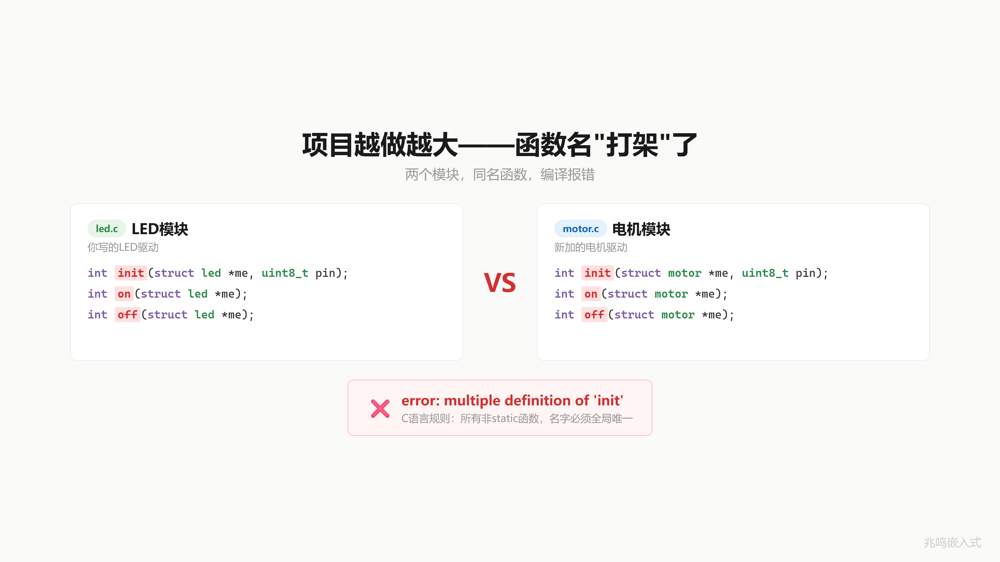
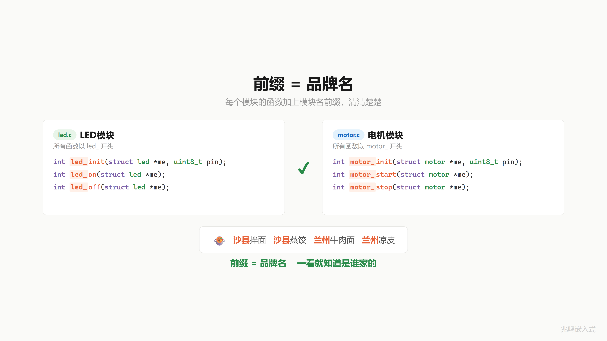
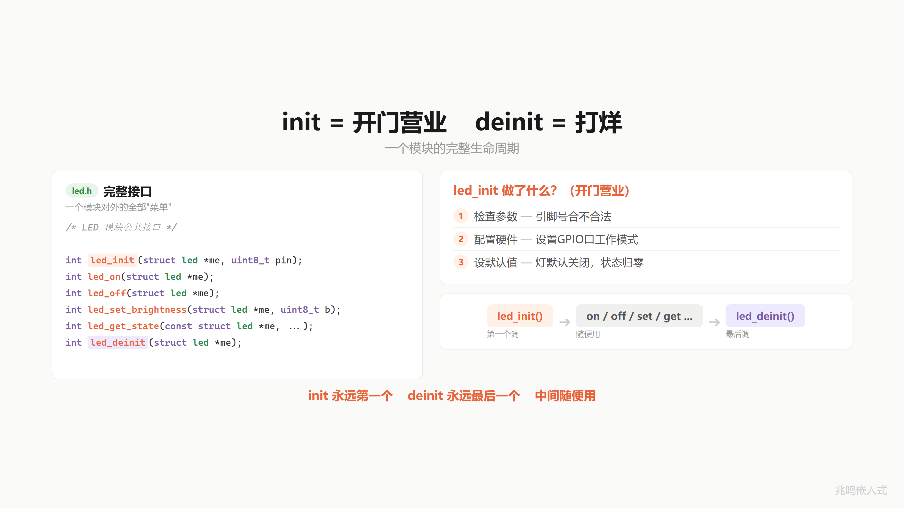
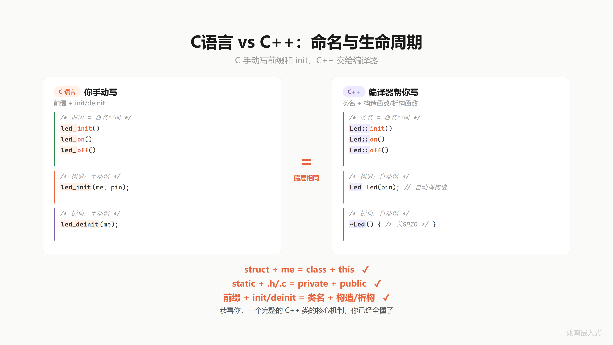

# 第 3 章 · 你用 C 手搓了一个 class · 句柄与操作函数

配套代码：[`oop-in-c/code/03-handwritten-class/`](https://github.com/ZhaoChengBo/zhaoming-embedded/tree/master/oop-in-c/code/03-handwritten-class/)

## 3.1 一个真实场景

第 2 章你给 LED 模块的字段标了 `/* private */`、把内部工具函数加 `static` 锁进了 `.c`。同事改不动你的数据，你松了一口气。

下班前 PM 走过来：明天加一个电机控制模块。

简单。新建 `motor.c`，按惯例写三个函数：

```c
int init(struct motor *me, uint8_t pin)   { ... }
int on(struct motor *me)                  { ... }
int off(struct motor *me)                 { ... }
```

编译。报错：

```
ld: motor.o: in function `init':
    multiple definition of `init'; led.o:led.c:42: first defined here
```

你的 LED 模块也有 `init / on / off`。两个 `init`、两个 `on`，链接器问你这俩到底谁是谁。

你的 `init` 是配 GPIO 的，他的 `init` 是配 PWM 的。但 C 的链接器不管你做什么，只看名字。名字一样，打架。

C 有一个底层规则：所有不加 `static` 的函数，名字必须全局唯一。这叫外部链接（external linkage），是 ANSI C 标准定的。一个函数加了 `static` 它就是文件私有（第 2 章 2.6.2 节讲过）。不加 `static`，它进全局符号表，全工程范围内不能重名。

项目只有一个模块的时候没问题。两个模块、三个、十个，名字迟早撞。



## 3.2 沙县小吃和兰州拉面

你去吃过沙县小吃。

菜单上写：沙县拌面、沙县蒸饺、沙县炖罐。

隔壁兰州拉面：兰州牛肉面、兰州凉皮。

每道菜前面都带品牌名，分得清谁是谁。

函数也一样。LED 的函数全部 `led_` 开头：

```c
int led_init(struct led *me, uint8_t pin);
int led_on(struct led *me);
int led_off(struct led *me);
```

电机的函数全部 `motor_` 开头：

```c
int motor_init(struct motor *me, uint8_t pin);
int motor_start(struct motor *me);
int motor_stop(struct motor *me);
```

清清楚楚，互不干扰。看到 `led_on`，就知道是 LED 模块的。前缀是品牌名。



第 1 章和第 2 章其实已经在用 `led_` 前缀，只是没明说"这是命名规范"。这一章把它确立为工程纪律。

## 3.3 三个月后你还知道哪个先调吗

前缀加好，编译过，项目正常运行。快进三个月。

你打开自己写的 `led.h`，上面六个函数：

```
led_init
led_deinit
led_on
led_off
led_set_brightness
led_get_state
```

先调哪个？

你想了想，直接调 `led_on` 试试。

灯不亮。没报错，就是不亮。

翻了十分钟代码才想起来：要先调 `led_init`。因为 `init` 里面做了引脚配置。不 `init`，struct 里的 pin 是栈上的随机值（可能是 42，可能是 65535），反正不是你要的。

三个月前写的代码，现在跟看别人写的一样。不对，看别人写的至少还能骂两句，自己写的只能骂自己。

## 3.4 名字自带说明书

怎么让三个月后的自己也能一眼看懂？

答案藏在函数名里。

`led_init` 这个名字告诉你：这是第一个该调的。它做三件事：

```c
int led_init(struct led *me, uint8_t pin)
{
	if (!me)
		return -1;
	if (!pin_valid(pin))
		return -2;

	/* 1. 硬件配置 */
	platform_gpio_init(pin, GPIO_MODE_OUTPUT);

	/* 2. 默认状态 */
	me->pin = pin;
	me->brightness = 0;
	me->is_on = false;
	me->initialized = true;

	/* 3. 同步硬件 */
	update_hardware(me);
	return 0;
}
```

参数校验、硬件初始化、默认状态。这三步合起来就是 C++ 里的构造函数（constructor）。

`led_deinit` 这个名字告诉你：这是最后调的。关硬件、释放资源。这就是 C++ 的析构函数（destructor）。

`init` 永远第一个，`deinit` 永远最后，中间的 `on / off / set_brightness` 随便用。

`led_init` 和 `led_deinit` 这两个名字本身就是说明书。好的门把手不用贴"推"或"拉"，形状本身告诉你怎么用。代码命名是同一个道理。



到这里：一个 `.h` 放接口声明、一个 `.c` 放实现、所有函数带前缀、`init` 开头 `deinit` 收尾。这就是一个完整的模块。

## 3.5 这个东西叫什么

你刚才做的这件事，给函数加前缀让名字不冲突，用 `init` 管诞生，用 `deinit` 管消亡，一个 `.h` 配一个 `.c`，这就是一个完整的 C 语言"类"。

`struct` 是数据，函数是行为，前缀是类名，`init` 是构造，`deinit` 是析构。

你不是从我这里背了一个定义，是从一个具体痛点（两个模块函数名打架）出发，自己推出了"前缀做类名 + init/deinit 做生命周期"这套规范。

这套规范在 Linux 内核、glibc、FreeRTOS、Zephyr 里全都用。读 `kref_init / kref_get / kref_put` 你立刻知道这是引用计数模块的生命周期函数。读 `xQueueCreate / xQueueSend / xQueueReceive` 你立刻知道这是 FreeRTOS 的队列模块。前缀 + `init / deinit / 操作` 是 C 圈子事实上的"class" 写法。

## 3.6 C 对 C++

如果学过 C++，你会写：

```cpp
class Led {
public:
	Led(uint8_t pin);          /* 构造函数 */
	~Led();                    /* 析构函数 */
	int on();
	int off();
private:
	uint8_t pin_;
	bool    is_on_;
};

Led red(13);    /* 进入作用域时自动调构造 */
red.on();
/* 离开作用域时自动调析构 */
```

而 C 里写的：

```c
struct led {
	uint8_t pin;
	bool    is_on;
};

int led_init(struct led *me, uint8_t pin);
int led_deinit(struct led *me);
int led_on(struct led *me);
int led_off(struct led *me);

struct led red;
led_init(&red, 13);
led_on(&red);
led_deinit(&red);
```

做的是一模一样的事。

C++ 把你手动写的前缀变成了编译器管理的类名（namespace 命名空间 + 名字混淆 name mangling，本节末 3.6 / 3.7.4 节会展开）。把你手动写的 `init / deinit` 变成了对象创建 / 销毁时自动调用的构造和析构。



到这里三个恒等都凑齐了：

| 章节 | C 语言 | C++ |
|---|---|---|
| 第 1 章 | `struct + me` | `class + this` |
| 第 2 章 | `static + /* private */ 纪律` | `private + public` |
| 第 3 章 | `前缀 + init/deinit` | `类名 + 构造/析构` |

C 没有 `class`？你天天都在写。

## 3.7 视频里没讲透的几个细节

### 3.7.1 initialized 标志位的反事实推演

`struct led` 和 `struct motor` 都有一个 `bool initialized;` 字段。这不是装饰，是防"没 init 就用"的安全网。

```c
struct motor uninit = {0};      /* 全部清零，包括 initialized */
motor_start(&uninit);
```

`{0}` 把整个 struct 清零，所以 `initialized` 是 `false`。`motor_start` 第一件事检查这个标志：

```c
int motor_start(struct motor *me)
{
	if (!me)
		return -1;
	if (!me->initialized)
		return -3;
	...
}
```

立刻返回 `-3`，不去操作未配置的硬件。

如果没这个标志，未初始化的 motor 拿着垃圾 pin 去操作 GPIO，行为完全不可预测。在工业控制板上这是能引发安全停止的 bug。

工业代码里所有公开 API 的对象都有类似的"哨兵字段"（sentinel：用一个字段记录对象状态，让所有公开函数先查这个字段判断对象是否可用）：FreeRTOS 的 `TCB.uxBasePriority` 检查、Linux 内核的 `device.driver_data` 检查、Linux 的 `kref` 计数检查，全是同一套防御。

### 3.7.2 为什么 C 不能像 C++ 那样自动调用构造函数

C 的设计哲学是"你写什么就执行什么，没有隐式动作"。

`struct led red;` 这一行只分配栈内存，编译器不偷偷调任何函数。

C++ 的 `Led red(13);` 编译器自动插入一句构造函数调用，实际是编译器在帮你写代码。

这件事在嵌入式领域有争议。有人觉得方便（少打字、漏 init 的 bug 少），有人觉得"看不见的代码"是 bug 温床（栈对象多到对象池满了你都不知道）。Linus Torvalds 在邮件里反复抨击 C++ 的隐式行为，Linux 内核坚持纯 C 部分原因在这。

工业代码里两种风格都有人用。本书后面章节统一手动 `init / deinit`，看得见。

### 3.7.3 前缀和链接器符号表的视角

编译器其实不知道"前缀"这个概念，只看完整函数名。`led_init` 和 `motor_init` 在符号表里就是两个完全独立的符号：

```
$ nm led.o
0000000000000000 T led_init
0000000000000098 T led_deinit
0000000000000114 T led_on
...

$ nm motor.o
0000000000000000 T motor_init
0000000000000098 T motor_deinit
0000000000000114 T motor_start
...
```

链接器看到 `led_init` 和 `motor_init` 是两个不同字符串，相安无事。

但人需要前缀分组。`led_*` 一类、`motor_*` 一类，认知负载小。这是把链接器规则（全局唯一）和人的认知（按模块分组）调和的工程妥协。

C++ 的 namespace 在编译时把 `Led::init` 改写成 `_ZN3Led4initEPh` 这样的混淆名（叫 name mangling），本质和你手动写 `led_init` 一回事，只是编译器替你操作了字符串。

### 3.7.4 命名规范决策

你可能见过这些变体，本书选择是这样：

| 变体 | 例子 | 评价 |
|---|---|---|
| `led_init` / `led_deinit` | 本书 | 简洁，对称 |
| `led_init` / `led_destroy` | 部分库 | destroy 暗示堆分配 |
| `led_open` / `led_close` | POSIX 风 | 留给文件接口 |
| `LedInit` / `LedDeinit` | 微软 / Cube 风 | 不是 Linux 内核风 |
| `Led::Init` / `Led::Deinit` | C++ | 编译器代劳 |

工业代码里 `module_action` 这种 lowercase + underscore + `_` 分隔的写法是 Linux 内核风格的标准，本书坚持这一种。

### 3.7.5 链接器冲突的真实长相

`led.c` 里写一个 `init`，`motor.c` 里也写一个 `init`，编译两个 `.o` 文件的时候各自都过。`gcc led.c motor.c -o demo` 在链接阶段才炸：

```
$ gcc -c led.c        # 单文件编译过
$ gcc -c motor.c      # 单文件编译过

$ gcc led.o motor.o -o demo
ld: motor.o: in function `init':
    motor.c:(.text+0x0): multiple definition of `init';
    led.o:led.c:(.text+0x0): first defined here
collect2: error: ld returned 1 exit status
```

错误是 `ld`（链接器）抛出的，不是 `gcc`。原因在 `nm`：

```
$ nm led.o
0000000000000000 T init           <-- 全局符号 init
00000000000000a0 T led_on
0000000000000120 T led_off

$ nm motor.o
0000000000000000 T init           <-- 也是全局符号 init
00000000000000a0 T motor_start
```

两个 `.o` 都把 `init` 写进自己的全局符号表（大写 `T`）。链接器扫所有 `.o` 合并符号表，发现两个 `init` 不知道挑谁，直接报 `multiple definition`。

加前缀的方案改成这样：

```
$ nm led.o
0000000000000000 T led_init       <-- 不冲突
00000000000000a0 T led_on

$ nm motor.o
0000000000000000 T motor_init     <-- 不冲突
00000000000000a0 T motor_start
```

每个全局符号都唯一了，链接器开心。

另一种规避冲突的方式是给 init 加 `static`，让它退化成 file-local 符号（`nm` 里小写 `t`）。但这样 init 就不能跨文件调用了，`main.c` 里 `led_init(...)` 直接编译报 `undefined reference`。`static` 解决冲突的代价是失去外部接口。

工业上选前缀不选 `static` 的原因清楚了：要让外部模块能 `led_init(...)`，又不能撞名，加前缀是唯一的路。

### 3.7.6 前缀方案 vs 嵌套方法表方案

C 语言的"避免冲突"还有第二条路。有些项目走的不是前缀，而是嵌套方法表。形态像这样：

```c
struct led_class {
	int (*init)(struct led *me, uint8_t pin);
	int (*deinit)(struct led *me);
	int (*on)(struct led *me);
	int (*off)(struct led *me);
};

extern const struct led_class led;     /* 单例方法表 */

/* 调用 */
led.init(&red, 13);
led.on(&red);
```

所有"led 模块的方法"挂在一个 `struct led` 单例下，调用是 `led.init(...)`、`led.on(...)`。链接器看到的全局符号只有一个 `led`，撞不到 motor。

这种写法的优点是把"模块名 + 方法名"在语法上分开了，看上去更像 OOP 的 `instance.method()`。GTK 的 GObject、Lua 的 C API 都用过类似手法。

缺点也实在。每次调用多一次内存间接（要从 `led` 单例里读函数指针），现代 CPU 上影响不大但也不是零。函数指针不能内联，编译器也不容易做静态分析。最关键的是这种写法在 C 圈的辨识度低：99% 的工业 C 代码（Linux 内核、Zephyr、FreeRTOS、glibc）走前缀方案。新人接手嵌套方法表的代码，很容易看不出"这是个普通的工程模块"。

本书坚持前缀方案，原因有三：

- 和 Linux 内核 / Zephyr / FreeRTOS / RT-Thread 一致
- 调用是直接函数调用（`BL led_init`，一条指令），不走函数指针
- 工业代码静态分析工具（PCLint / Coverity）对直接调用支持更好

到了 ch09-ch11 会引入 ops 表 + vptr，那是嵌套方法表的"工业级正确用法"：用来支持运行时多态，不是用来规避命名冲突。两件事不要混。

### 3.7.7 为什么 motor 多了 direction 和 state 字段

`struct motor` 字段是 `pin / pwm_duty / direction / state / initialized`，比 `struct led` 多了 `direction` 和 `state`。

电机和 LED 的状态量本来就不一样：

- LED 只有"开 / 关"两态，加一个亮度（对应硬件 PWM 占空比）。
- 电机有"停 / 正转 / 反转"三态，加一个速度（PWM 占空比），方向是独立维度。

所以 `direction` 是布尔（正反），`state` 是 enum（停 / 正 / 反）。两者一起描述电机的运行状态。

字段不是越多越好。每加一个字段就是一份要维护的状态。`is_on` 这种"瞬时状态"和 `initialized` 这种"生命周期状态"放一个 struct 里都没问题，因为它们是同一个 motor 的属性。但如果你想塞"上次启动时间"、"累计运行小时"、"电流采样平均值"这些，那是另一个层次的数据（运维 / 监控），属于另一个模块的职责。

第 4 章数据归位会讲清楚这件事。

## 3.8 你现在的代码在 STM32 上长什么样

PC 模拟版是 `printf` 假装操作 GPIO。STM32 真实硬件上长这样（节选自 [`oop-in-c/code/03-handwritten-class/platform-mcu/stm32/led_motor_stm32.c`](https://github.com/ZhaoChengBo/zhaoming-embedded/tree/master/oop-in-c/code/03-handwritten-class/platform-mcu/stm32/led_motor_stm32.c)，`pin` 仍是 `PIN_NUM('A', 13)` 编码，详见第 1 章 § 1.x PIN_NUM 编码）：

```c
#include "platform.h"
#include "stm32f4xx_hal.h"

void platform_gpio_init(uint8_t pin, uint8_t mode)
{
	GPIO_InitTypeDef cfg = {0};

	_enable_port_clock(pin);

	cfg.Pin   = PIN_MASK(pin);
	cfg.Mode  = (mode == GPIO_MODE_OUTPUT) ?
	            GPIO_MODE_OUTPUT_PP : GPIO_MODE_INPUT;
	cfg.Pull  = GPIO_NOPULL;
	cfg.Speed = GPIO_SPEED_FREQ_LOW;
	HAL_GPIO_Init(PIN_PORT(pin), &cfg);
}

void platform_gpio_write(uint8_t pin, bool value)
{
	HAL_GPIO_WritePin(PIN_PORT(pin), PIN_MASK(pin),
	                  value ? GPIO_PIN_SET : GPIO_PIN_RESET);
}
```

`led.h` / `led.c` / `motor.h` / `motor.c` / `main.c` 全部一字不改。两个模块照样跑，前缀照样区分得开。变化的只是这层 platform 胶水。

真实工程里电机的 PWM 速度控制会写到 TIM 通道的 CCRx 寄存器，这里教学简化为 GPIO 高低电平。第 5 章会展开 HAL 怎么做这种映射。

这一节用的是函数式包装的 platform 抽象，是教学简化版。真正工业级用虚函数表（ops 表），允许 runtime 切换平台。第 16 章会把 platform 层从函数式升级成 ops 表式（gpio_chip 子系统）。

## 3.9 你现在的代码在 Linux 用户态长什么样

Linux 上同款抽象，完整工程见附录 C。

## 3.10 工业代码里的模块长什么样

我做的工业控制板项目里，每个驱动模块都按这套命名规范组织。看几个真实模块的 `.h` 列名：

```
drivers/
├── led/
│   ├── led_base.h          类型 led_base_t
│   └── led_gpio.h          类型 led_gpio_t · 函数 led_gpio_init
├── eeprom/
│   ├── eeprom_base.h       类型 eeprom_base_t · 函数 eeprom_read / eeprom_write
│   └── ds2433.h            类型 ds2433_t · 函数 ds2433_init
├── temp_sensor/
│   ├── temp_sensor_base.h  类型 temp_sensor_base_t
│   └── max31827.h          类型 max31827_t · 函数 max31827_init
├── fan/
│   ├── fan_base.h
│   └── fan_pwm.h
└── beeper/
    ├── beeper_base.h
    └── beeper_pwm.h
```

每个模块都遵循同一个套路：

- 文件名前缀 = 模块名（`led_` / `eeprom_` / `temp_sensor_` / `fan_` / `beeper_`）
- 函数名前缀 = 模块名 + 动作（`led_on` / `eeprom_read` / `max31827_init`）
- 生命周期 = `xxx_init / xxx_deinit`
- 类型名 = `xxx_t`（这是工业项目历史决定，本书统一用 `struct xxx`）

`xxx_base` 是抽象父类（属于第 6 章继承的内容），`xxx_gpio` / `ds2433` / `max31827` 是具体实现。这层结构对应"虚函数表 + 具体设备的 ops 表"，是第 9 章到第 11 章的内容。

到这里你能看出：你这一章学的命名规范，是工业代码的"地基"。50 个驱动文件全按这个规范命名，新人接手不用读所有文档，看文件名 + 函数名就知道哪个是哪个。

## 3.11 跑一遍

```bash
cd oop-in-c/code/03-handwritten-class/pc
make
./demo
```

输出节选：

```
========================================
  Same pattern, two classes side by side.
========================================

--- led_init / motor_init: open for business ---
[GPIO] Pin13 init as OUTPUT
[GPIO] Pin13 -> LOW (OFF)
  [LED] Pin13 initialized
[GPIO] Pin14 init as OUTPUT
[GPIO] Pin14 -> LOW (OFF)
  [LED] Pin14 initialized
[GPIO] Pin5 init as OUTPUT
[GPIO] Pin5 -> LOW (OFF)
  [MOTOR] Pin5 initialized

--- LED operations ---
[GPIO] Pin13 -> HIGH (ON)
  [LED] Pin13 ON
[GPIO] Pin13 -> HIGH (ON)
  [LED] Pin13 brightness set to 80%

--- Motor operations ---
[GPIO] Pin5 -> LOW (OFF)
  [MOTOR] Pin5 duty set to 60%
  [MOTOR] Pin5 direction = forward
[GPIO] Pin5 -> HIGH (ON)
  [MOTOR] Pin5 start (forward, duty=60%)

--- Skip init: catch the mistake at API level ---
  [MOTOR] Error: not initialized
  motor_start(uninit) returned -3 (-3 = not initialized)

--- Out-of-range arguments rejected ---
  [LED] Error: pin 200 out of range (0~31)
  led_init(_, 200) returned -2 (-2 = pin out of range)
```

`led_*` 和 `motor_*` 在同一个 main.c 里跑，没有任何冲突。`init` 失败有 `-1 / -2` 区分（NULL 指针 / 参数超范围），`initialized` 标志位拦住了"没 init 就用"的错误（返回 `-3`）。

这就是一个工程纪律完整的 C 模块该有的样子。

## 3.12 视频回放

想听口播版的可以看 B 站这一期视频：

> [《你用 C 手搓了一个 class｜C 语言面向对象·封装篇》](https://www.bilibili.com/video/BV1dsQuBmEEx/)

视频里讲了沙县小吃 / 兰州拉面的类比、门把手的 affordance 类比，节奏更紧凑。书里补了视频没讲透的 6 个细节（3.7 节）和工业代码的对照（3.10 节）。

## 下一章

到这里 LED 和 motor 都是"工程纪律完整的模块"了。但回头看 `led.c` 文件开头，你可能还有几个全局变量：累计 init 次数、调试开关、最大亮度常量。

这些全局变量都该死了。下一章把它们一个一个判刑。

下一篇：[第 4 章 · 你的全局变量该死了](04-数据归位.md)
