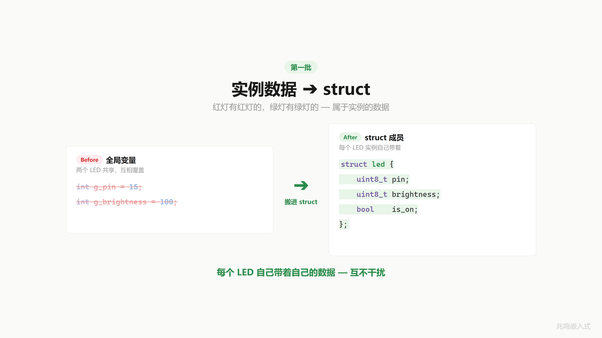
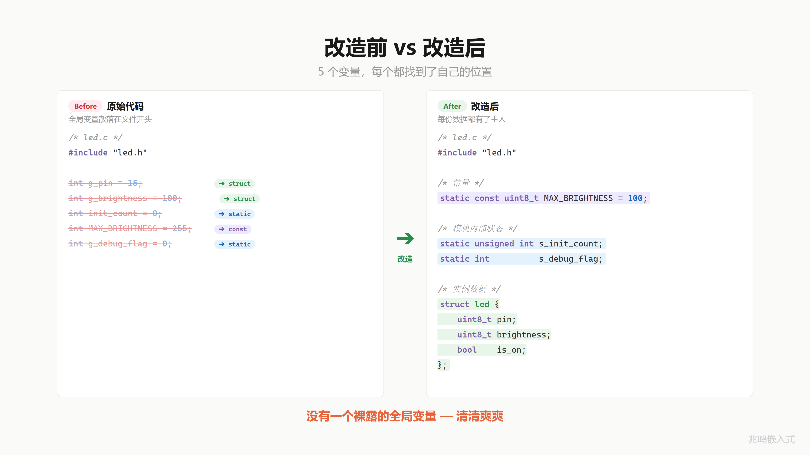
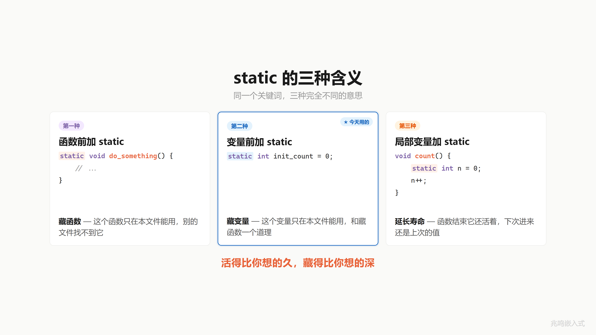
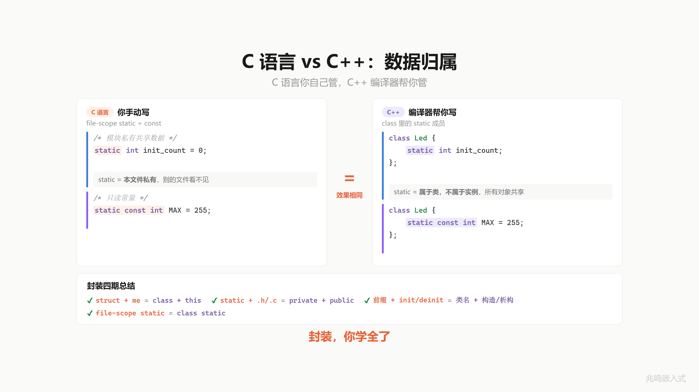

# 第 4 章 · 你的全局变量该死了 · 数据三级分类

配套代码：[`oop-in-c/code/04-data-classification/`](https://github.com/ZhaoChengBo/zhaoming-embedded/tree/master/oop-in-c/code/04-data-classification/)

## 4.1 一个真实场景

你的 `.c` 文件开头有几个全局变量？

数一数。

今天它们一个都活不了。

第 1 章到第 3 章做了不少事。挂号单（struct）、me 指针、字段标 `/* private */` + 工具函数加 `static`、命名前缀、init/deinit 生命周期。但翻开你的 `led.c` 看头几行，可能还在躺着这种东西：

```c
/* led_bad.c · 反面教材 */
#include "led.h"

int g_pin = 0;
int g_brightness = 0;
int init_count = 0;
int MAX_BRIGHTNESS = 255;
int g_debug_flag = 0;
```

五个全局变量，从项目第一天就躺在这里。你可能觉得没问题。来看一个 bug。


你创建了两个 LED：红灯用引脚 5，绿灯用引脚 3。代码这样写：

```c
bad_led_init(5);    /* 初始化红灯 */
bad_led_init(3);    /* 初始化绿灯 */

bad_led_on();       /* 想点亮红灯 */
```

跑一遍。

```
[BAD_LED] Pin5 initialized (g_pin=5, init #1)
[BAD_LED] Pin3 initialized (g_pin=3, init #2)   <-- g_pin 从 5 变成 3
[BAD_LED] Pin3 ON                                <-- 点亮的是绿灯
```

红灯不亮，绿灯亮了。

第二次 `bad_led_init(3)` 把 `g_pin` 从 5 覆盖成 3。之后 `bad_led_on()` 用的是 `g_pin`，操作的实际是绿灯的引脚。

我接手过一个工业项目，两路传感器也是这个毛病：两个通道共享一个 `g_chan_id`，前面的人图方便。新人调试一周才找到原因。


全局变量像公司大厅的白板。谁路过都能改两笔。你写了个重要数据，转头一看，被别人擦了。

## 4.2 第一批 · 实例数据搬进 struct

今天分三批处理掉。

第一批：`g_pin` 和 `g_brightness`。

引脚号和亮度，红灯有红灯的，绿灯有绿灯的。它们属于每个 LED 实例自己的数据。

判决：搬进 `struct led`。

```c
struct led {
	uint8_t pin;
	uint8_t brightness;
	bool    is_on;
	bool    in_use;
};
```

`pin` 和 `brightness` 进 struct，每个 LED 对象自己带着一份。红灯改红灯的 `me->pin`，绿灯改绿灯的 `me->pin`，谁也覆盖不了谁。

刚才那个 bug，不存在了。



## 4.3 第二批 · 模块共享数据加 static

第二批：`init_count` 和 `g_debug_flag`。

`init_count` 是模块级累计调 init 的次数，红绿两灯共用一个计数器。`g_debug_flag` 是模块内部的调试开关，控制 `[LED-DEBUG]` 这种打印。

它们都不属于某一个 LED 实例（不是实例数据），但也不该让别的文件看到（外部 `extern int init_count;` 一句话就能改坏）。

判决：前面加 `static`。

```c
static unsigned int s_init_count;   /* 模块累计 init 次数 */
static int          s_debug_flag;   /* 模块调试开关 */
```

`static` 这个修饰词让编译器把这两个变量的符号写成 file-local（第 2 章 2.6.2 节讲过链接器视角）。别的文件 `extern` 都找不到。

外部想知道 `s_init_count`？走函数：

```c
unsigned int led_get_init_count(void)
{
	return s_init_count;
}
```

数据的主人说了算。


`static` 这个词在 C 里有三种意思，前面用了两种（藏函数、藏文件作用域变量）。第三种是函数内部的 static 局部变量，4.7.4 节会讲。

## 4.4 第三批 · 只读常量加 const

最后一个：`MAX_BRIGHTNESS`。

最大亮度 100。从项目开始到现在，有人改过它吗？没有。它就是一个常量。

但 `int MAX_BRIGHTNESS = 100;` 写法上是可改变的变量。运行时谁手滑写一句 `MAX_BRIGHTNESS = 0`，亮度上限突然变 0，整个模块都不工作了。

判决：`static const`。

```c
static const uint8_t MAX_BRIGHTNESS = 100;
static const uint8_t MAX_PIN        = 31;
```

`static` 让它出不了文件，`const` 让谁都改不了。`MAX_BRIGHTNESS = 0;` 编译器直接报错 `assignment of read-only variable 'MAX_BRIGHTNESS'`。编译期防御，运行时零开销。


你可能习惯用 `#define MAX_BRIGHTNESS 100`。也行。但 `static const` 有几个好处：

- 有类型（`uint8_t` 而不是 `int`），编译器查类型不一致
- 有作用域（`static` 限制在本文件），不污染全局名字空间
- 调试时能看到变量名（`#define` 是预处理替换，gdb 看不到）

工业代码两种都在用。本书坚持 `static const`。

## 4.5 改造全貌 · 数据三级归位

把三批合起来，`led.c` 文件开头长这样：

```c
/* 第三类：只读常量 */
static const uint8_t MAX_BRIGHTNESS = 100;
static const uint8_t MAX_PIN        = 31;

/* 第二类：模块共享数据 */
static struct led led_pool[LED_POOL_SIZE];
static unsigned int s_init_count;
static int          s_debug_flag;

/* file-private 工具函数 */
static void update_hardware(struct led *me);
static bool brightness_valid(uint8_t brightness);
static bool pin_valid(uint8_t pin);
static void debug_print(const char *msg);
```

没有一个裸露的 `int g_xxx`。每一个变量都加了 `static`、`static const` 或者藏在 struct 字段里。这就是数据归位的核心：每一份数据都有它该呆的地方。

注意一个新东西：`static struct led led_pool[LED_POOL_SIZE];`。

这一章本章配套代码用的是**静态对象池**：固定大小的 `led_pool[8]` 数组，`led_acquire` 从池里取空槽，`led_release` 把槽位还回去。

```c
struct led *led_acquire(uint8_t pin)
{
	for (size_t i = 0; i < LED_POOL_SIZE; i++) {
		struct led *me = &led_pool[i];
		if (me->in_use)
			continue;

		me->pin = pin;
		me->in_use = true;
		...
		return me;
	}
	return NULL;     /* 池满 */
}
```

为什么本章演示用对象池而不是 ch02 的 `malloc`？因为**对象池是一种把"模块共享数据"和"实例数据"绑在一起的合理写法**：池本身是模块共享的（一份），槽位里的 LED 实例数据各自独立（多份）。这一章想把"实例 / 模块 / 常量"三类归位讲清楚，对象池正好把三者都凑齐。

**对象池不是工业代码唯一答案**。LED 这种数量固定的全局对象，更常见的写法是直接 `static struct led red_led;` 给每颗 LED 一个静态实例（ch04 配套代码的另一份样例）。生命周期不固定的对象（动态接收的数据包、临时事件、按需创建的会话），用 `malloc`（FreeRTOS heap_4 / heap_5、RT-Thread `rt_malloc`、状态机框架自带的事件池这一类 RTOS 提供的动态内存）。三种工具按场景选，4.7 节会展开。



## 4.6 这个东西叫什么

刚才你做的事，把全局变量按"实例 / 模块 / 常量"三类归位，这个动作软件工程里叫数据所有权（data ownership）或者数据归位。

每一份数据都得有主人。实例数据的主人是 struct 字段（跟着 me 走），模块共享数据的主人是 `static` 变量（关在文件里），常量的主人是 `static const`（编译期固定）。

数据没有主人，bug 就是主人。

费曼讲过一句话：好的设计不靠人小心，靠机制上不让错误发生。把数据按所有权归位，是机制层面的防御。第 2 章把字段标 `/* private */` + 内部工具加 `static` 防外部乱写、第 4 章把全局变量按所有权归位防内部乱写，两条加起来是数据层面的"封装"完整版。


## 4.7 视频里没讲透的几个细节

### 4.7.1 实例数据 vs 模块共享数据，怎么分

判断标准只有一个：这份数据是 N 个实例各持有一份，还是 N 个实例共享一份？

| 数据 | 各持一份还是共享 | 归位 |
|---|---|---|
| `pin` | 每个 LED 各一份 | struct 字段 |
| `brightness` | 每个 LED 各一份 | struct 字段 |
| `is_on` | 每个 LED 各一份 | struct 字段 |
| 累计 init 次数 | 整个 LED 模块共享一份 | static |
| 调试开关 | 整个 LED 模块共享一份 | static |
| 亮度上限 | 整个 LED 模块共享一份的常量 | static const |

判错了会怎样？

把"实例数据"误认为"模块共享数据"，就是 `g_pin` 那个 bug。两个 LED 共享一个 pin。

把"模块共享数据"误认为"实例数据"，那是把 `s_init_count` 放进 `struct led`。每个 LED 自带一份计数器，但你想要的是"全模块累计 init 次数"，得遍历所有 LED 加起来才能拿到。绕了路。

### 4.7.2 三种持有方式 · 按场景选

LED 实例数据放哪里？工业代码里有三种常见写法。

**写法 A · 直接静态实例**

```c
static struct led red_led;
static struct led green_led;

led_init(&red_led,   13);
led_init(&green_led, 14);
```

数量固定的全局对象（板上 LED、串口、传感器、按键）几乎都这样写。零分配开销、零失败路径、地址编译期定死、调试器一查就找到。这是工业代码里**最常见**的形态。

**写法 B · 静态对象池**

```c
static struct led led_pool[LED_POOL_SIZE];

struct led *me = led_acquire(13);   /* 从池里拿一个空槽 */
...
led_release(me);                    /* 用完还回去 */
```

数量上限固定但具体哪些槽用、什么时候用不固定时用对象池。Linux 内核的 `kmem_cache` / slab 分配器是同一个思路的工业级形态。本章配套代码用这种写法是为了把"模块共享数据 + 实例数据"凑齐演示。

**写法 C · 动态分配**

```c
struct led *me = malloc(sizeof(*me));
if (!me)
	return -ENOMEM;
led_init(me, 13);
...
free(me);
```

MCU 上用 RTOS 提供的 heap：`pvPortMalloc`（FreeRTOS heap_4 / heap_5）、`rt_malloc`（RT-Thread）、`k_malloc`（Zephyr）。这些 heap 实现都有相邻块合并机制，碎片可控。生命周期不固定的对象（动态接收的网络包、临时事件、按需创建的会话）走这一种。我自己的 STM32H7 工业控制板项目里 `configTOTAL_HEAP_SIZE = 65536`、状态机框架的事件池预占几十 KB，全是动态内存机制。**这是现代嵌入式工业级常态**。

什么时候选哪种？

| 对象类型 | 推荐写法 |
|---|---|
| 数量固定的全局对象（LED / 串口 / 传感器） | A 直接静态实例 |
| 数量上限固定 + 频繁创建销毁（任务句柄池、连接池） | B 静态对象池 |
| 生命周期不固定的对象（动态包、按需事件、临时缓冲） | C 动态分配 + 生命周期纪律 |
| 单次分配永不释放（启动时 4 KB 帧缓冲） | A 静态 或 C 单次 malloc，都行 |

唯一**真不能用动态内存**的场景是 8051 / M0 + 16 KB RAM 这种小芯片，或者 DO-178C Level A / IEC 62304 Class C 早期严格规约（最新规约都允许有约束的动态内存）。绝大多数现代嵌入式项目（Cortex-M4 以上 + RTOS）都是三种工具按场景混用。

### 4.7.3 池满了怎么办

`led_acquire` 返回 NULL。调用方有义务处理：

```c
struct led *red = led_acquire(13);
if (!red) {
	/* 池满了，记日志 / 通知监控 / 降级处理 */
	log_error("led pool exhausted");
	return -ENOMEM;
}
```

工业代码里这种 NULL 检查是强制的，几乎没有"分配失败就忽略"的情况。Linux 内核 `kmalloc` 一样：每次分配后立刻判空，是内核驱动 review 的硬指标。

### 4.7.4 static 第三义 · 函数内部的 static 局部变量

`static` 这个词在 C 里有三种含义：

| 修饰位置 | 效果 | 例子 |
|---|---|---|
| 函数前 | 文件私有函数（file-private） | `static void update_hardware(...)` |
| 文件作用域变量前 | 文件私有变量（file-private） | `static int s_debug_flag` |
| 函数内局部变量前 | 跨调用保持值 | `static int call_count` |

前两种这一章和第 2 章用过。第三种是另一个话题：

```c
void log_event(void)
{
	static int call_count = 0;
	call_count++;
	printf("called %d times\n", call_count);
}
```

`static int call_count` 不在栈上，每次进函数它的值还是上次离开时的样子。它就是一个"绑定到这个函数的私有全局变量"。

工业代码里这种用法不多，因为它隐式地把"函数有状态"这件事藏起来了。明确的做法是把 `call_count` 移到 module-level static 变量，加一个 `getter` 函数。

记一句话：三种 `static`，活得比你想的久，藏得比你想的深。



### 4.7.5 .bss 段是什么

`static struct led led_pool[8]` 这个数组在哪里？

不在堆，不在栈。

它在 `.bss` 段。`.bss` 是可执行文件的一个段，专门给"未初始化的全局/静态变量"。

可执行文件结构（ELF / Mach-O / PE 都类似）：

```
.text   代码段（指令）
.rodata 只读数据段（const 数据 / 字符串字面量）
.data   已初始化的全局/静态变量（int x = 5;）
.bss    未初始化的全局/静态变量（int x; 或 static int x;）
heap    malloc 分配区（运行时增长）
stack   函数调用栈（运行时增长）
```

`.bss` 在程序启动时由 loader 全部清零（O(1)，不用一字节一字节写，loader 用 zero-fill 页技巧）。所以 `static struct led led_pool[8]` 一开机就是 `{0}` 状态，每个 `in_use` 都是 `false`，可以直接用。

`static const uint8_t MAX_BRIGHTNESS = 100` 这种带初始值的常量在 `.rodata` 段。运行时这一段是只读的，CPU 写它会触发 segmentation fault / hard fault。`const` 不只是编译期检查，运行时也有硬件保护。

ch04 这一章四类数据归位，每一类对应一个段：

| 数据类型 | 例子 | 落地段 |
|---|---|---|
| `auto`（栈上局部变量） | `int i = 0;`（函数内） | stack |
| 已初始化全局 / static | `static int s_count = 5;` | `.data` |
| 未初始化全局 / static | `static struct led led_pool[8];` | `.bss` |
| `static const` 常量 | `static const uint8_t MAX = 100;` | `.rodata` |
| `malloc` / `calloc` | `malloc(sizeof(struct led));` | heap |

后面的 4.7.7 节会贴一份 STM32H7 的真实内存地图，看每一个段在 SRAM 里物理地址是多少。

### 4.7.6 动态内存的工业级用法

很多老资料把"嵌入式 MCU 不用 malloc"当成铁律。这是 1990 年代裸机 8051 / 小 RAM MCU 时代留下的 dogma，**不是现代嵌入式现实**。

现实是这样的：

- **FreeRTOS heap_4 / heap_5**：相邻 free 块自动合并，碎片可控，工业产品标配
- **RT-Thread `rt_malloc` / 内存池 `mp`**：长跑稳定，国内大量产品在用
- **状态机框架的事件池**：预分配 + 动态借还，事件驱动框架的核心机制
- **lwIP 协议栈**：所有 pbuf 网络包都是动态分配
- **FATFS、libgpiod、绝大多数中间件**：默认都用动态内存

最新的安全标准也不再禁动态内存：

- **MISRA C:2012 amendment 1** 把动态内存从"禁用"放宽到"有约束允许"
- **DO-178C** 在有形式化生命周期分析时允许动态内存
- **IEC 62304** Class B/C 安全关键软件可以用动态内存，前提是有合规的资源管理

工业纪律的关键不是"不用 malloc"，是**生命周期管理**。判定标准：

1. **每个 alloc 有配对的 free 路径**。函数中间任何 `return` 都不能漏过 free
2. **异常退出走 `goto cleanup`**。Linux 内核风格，几十年实践能压住所有 leak
3. **共享所有权用引用计数**。Linux `kref_init / kref_get / kref_put` 是标准模板
4. **选 RTOS 提供的 heap 而不是 newlib `dlmalloc`**。前者有合并机制 + 审计接口，后者反复分配释放后容易碎片放大
5. **关键路径的 WCET 要测**。`pvPortMalloc` 在 heap_4 上是 O(N)（N 是 free list 长度），实时任务里用对象池或者预分配避开

什么时候**仍然**优先用静态分配（直接静态实例 / 静态对象池）？

- **8051 / M0 + 16 KB RAM 这种小芯片**：堆碎片 + 没有 RTOS heap，只能静态
- **DO-178C Level A 飞行控制 / IEC 62304 Class C 终极严格场景**：最稳是规避动态内存
- **中断热路径每秒几百万次 alloc 的极端情况**：避开 heap 锁竞争

绝大多数现代嵌入式项目（Cortex-M4 以上 + RTOS）都是三种工具按场景混用：全局少量对象 → 直接静态实例；上限固定 + 频繁取还 → 静态对象池；生命周期不固定 → RTOS heap + `goto cleanup`。

**动态内存不是危险品，缺乏生命周期纪律才是**。AI 工具（Coverity / Codacy / Claude Code 这一类）现在能自动审计 alloc / free 的配对路径和异常退出分支，工程上比手工 review 可靠得多。

### 4.7.7 STM32H7 内存地图举例

抽象的 `.text / .rodata / .data / .bss / heap / stack` 在真实 MCU 上是哪几片物理 SRAM？

以 STM32H7 系列（Cortex-M7，是工业控制板常用的代核）为例。这颗芯片的内存布局：

```
0x0800 0000 - 0x081F FFFF   2 MB  Flash         (.text, .rodata, .data 初值)
0x2000 0000 - 0x2001 FFFF   128KB DTCM          (Cortex-M7 紧耦合数据·CubeMX 默认 stack 在这)
0x2400 0000 - 0x2407 FFFF   512KB AXI SRAM      (主 RAM, .bss / .data / heap)
0x3000 0000 - 0x3004 FFFF   288KB SRAM1-3       (DMA / 外设缓冲常用)
0x3800 0000 - 0x3800 FFFF    64KB SRAM4         (低功耗域)
0x4000 0000 - 0x4FFF FFFF         APB / AHB 外设寄存器（GPIO / UART / SPI ...）
0x5800 2000 - 0x5800 25FF         GPIOA-K 寄存器组（包括 ch01 1.7.6 提的 BSRR）
0xE000 0000 - 0xE00F FFFF         Cortex-M7 内核私有外设（SysTick / NVIC / SCB）
```

链接脚本（`.ld` 文件）告诉 ld：

- `.text` 起点 `0x0800 0000`（Flash），程序从这里开始执行
- `.bss / .data / heap` 在 `0x2400 0000`（AXI SRAM），主 RAM 区
- `stack` 在 `0x2000 0000`（DTCM）顶部往下增长。DTCM 是 Cortex-M7 紧耦合数据 RAM，跟 CPU 直连，访问最快，CubeMX 生成的 .ld 默认把 stack 放这里
- 上电后 startup 代码把 `.data` 段从 Flash copy 到 SRAM（初值），把 `.bss` 段清零

`static struct led led_pool[8]` 在编译期已经知道 size。链接器在 `.bss` 里给它分配一段地址，比如 `0x2400 0080 - 0x2400 00C0`（假设每个 led 8 字节）。运行时这块地址就是池子的物理位置，整个固件生命周期不变。

PC 模拟版跑同一份代码，地址换成 Linux 进程的虚拟地址（如 `0x55B5 1234 0080`），但段的概念一样：`.text / .rodata / .data / .bss` 都在那里，只是物理位置由操作系统的进程虚拟内存管理决定。

**这个地图教给你的事**：MCU 上你写下的每一个变量，都有确切的物理位置。`static` / `static const` / 函数内栈变量决定了它落在 SRAM 的哪一段。当你能在脑里画出这张地图，下次有人说"这个项目跑久了 RAM 涨了"，你就知道往 `.bss` 大数组、heap leak、stack 深度三个方向查。

### 4.7.8 全局指针句柄是合理用法吗

是。

要分清楚两种"全局"：

**裸数据型全局变量**：例如 `int g_temp_value;`、`char g_buffer[64];`、`int g_status;`。这种要避免。任何模块都能直接读写，谁改了谁没改追不到，并发场景下竞态拉满。这是 ch01-ch03 一直在反对的"敞开的挂号单"。

**接口型全局指针句柄**：例如 `extern struct led_base *green_led;`、`extern struct uart *console;`、`extern struct rtc_dev *system_rtc;`。这种是合理的。指针指向的对象 static 分配在驱动的 `.c` 文件里（同 ch01 1.10.1 节的指针句柄持有），应用层通过 `led_on(green_led)` 这种封装函数操作它，按工业纪律不直接读写字段。这是把一个**单例对象用指针句柄暴露给应用层**，不是裸数据共享。

工业代码里 `extern xxx_base_t *xxx_dev;` 这种声明是大量存在的，每个外设设备实例（LED、按键、UART、RTC、温度传感器）通常都对应一两个全局句柄。这就是"设备树思路"在 C 里的落地：全局可见的设备名 + 应用层不直接访问字段的设备实例。第 19 章工业实战会展开。

另一种合理的全局是 initcall 段（第 17 章详讲）：一组函数指针放在 `.bss` 的特殊段里，启动时按顺序调用。这不是数据共享，是机制实现。

需要警惕的两个使用方式：

1. **全局指针句柄之间的互相依赖**：A 模块的初始化引用了 B 模块的句柄，但 B 还没 init。这是 ch17 initcall 7 级排序要解决的问题。
2. **应用层通过句柄访问对象字段**：写 `green_led->pin = 5` 和写 `g_temp = 100` 一样，code review 看到就要打回。应用层只走 `led_on / led_off` 这种封装接口，不直接读写驱动 struct 的字段。

## 4.8 你现在的代码在 STM32 上长什么样

PC 模拟版是 `printf` 假装操作 GPIO。STM32 真实硬件上长这样（节选自 [`oop-in-c/code/04-data-classification/platform-mcu/stm32/led_stm32.c`](https://github.com/ZhaoChengBo/zhaoming-embedded/tree/master/oop-in-c/code/04-data-classification/platform-mcu/stm32/led_stm32.c)，`pin` 仍是 `PIN_NUM('A', 13)` 编码，详见第 1 章 § 1.x PIN_NUM 编码）：

```c
#include "platform.h"
#include "stm32f4xx_hal.h"

void platform_gpio_init(uint8_t pin, uint8_t mode)
{
	GPIO_InitTypeDef cfg = {0};

	_enable_port_clock(pin);

	cfg.Pin   = PIN_MASK(pin);
	cfg.Mode  = (mode == GPIO_MODE_OUTPUT) ?
	            GPIO_MODE_OUTPUT_PP : GPIO_MODE_INPUT;
	cfg.Pull  = GPIO_NOPULL;
	cfg.Speed = GPIO_SPEED_FREQ_LOW;
	HAL_GPIO_Init(PIN_PORT(pin), &cfg);
}

void platform_gpio_write(uint8_t pin, bool value)
{
	HAL_GPIO_WritePin(PIN_PORT(pin), PIN_MASK(pin),
	                  value ? GPIO_PIN_SET : GPIO_PIN_RESET);
}
```

`led.h` / `led.c` / `main.c` 一字不改。`static struct led led_pool[8]` 落到 STM32 的 `.bss` 段，启动时清零，运行期池子大小固定。这里用对象池是 4.5 节解释过的演示选择，LED 这种数量固定的全局对象用直接静态实例（4.7.2 节写法 A）也很常见，工业级代码两种都用。

这一节用的是函数式包装的 platform 抽象，是教学简化版。真正工业级用虚函数表（ops 表），允许 runtime 切换平台。第 16 章会把 platform 层从函数式升级成 ops 表式（gpio_chip 子系统）。

## 4.9 工业代码里的数据归位长什么样

我做的工业控制板项目里，数据归位是一个跨模块的纪律。每个驱动 `.c` 文件开头都遵循同一套结构：

```c
/* drivers/eeprom/ds2433.c · 简化结构 */

/* 1. 只读常量 */
static const uint32_t DS2433_MAX_ADDR = 4096;

/* 2. 模块共享数据 (按需选静态实例 / 对象池 / 动态分配, 这一份用静态实例) */
static unsigned int s_init_count;
static int          s_debug_flag;

/* 3. file-private 工具函数 */
static int ds2433_send_cmd(struct ds2433 *me, uint8_t cmd);
static int ds2433_wait_ready(struct ds2433 *me);
```

50 个驱动文件全是这个结构。新人接手任何一个文件，前几行就看到"这个模块的数据归位是什么样"。

DS2433 这种跟单总线挂的 EEPROM 通常每板只有 1-2 颗，**直接静态实例就够**：

```c
/* drivers/eeprom/ds2433_cfg.c · 板级实例 */
static struct ds2433 ds2433_main;
struct ds2433 *ds2433_top = &ds2433_main;     /* 应用层句柄 */
```

数量上限固定 + 频繁创建销毁的对象（任务句柄、连接池槽）才走静态对象池。生命周期不固定的对象（动态接收的总线消息、按需创建的会话、状态机事件）走 RTOS 提供的动态内存（FreeRTOS `pvPortMalloc`、RT-Thread `rt_malloc`、状态机框架的事件分配接口）。三种持有方式按对象生命周期选，不是"先静态再说"。

跨文件的全局变量极少。所有跨文件共享的"对象"（`green_led`、`temp_sensor_top`、`fan_main`）都是通过 `extern struct xxx_base *xxx;` 这种接口指针暴露，背后的 struct 字段还是关在 `.c` 里。

这种纪律不是为了"代码好看"。是为了：

- 跨年的代码维护期，谁都能 5 分钟读懂某个变量的归属
- 静态分析工具（PCLint / Coverity / Claude Code 这一类 AI 审计）能确定每个变量的访问边界
- 单元测试时每个模块的状态边界明确，能 mock 干净
- 跨模块 bug 锁定时，全局污染面小

这就是工业级 C 代码的骨架。第 5 章会打开 STM32 HAL 库源码，看看 ST 工程师怎么遵守同一套规则。

## 4.10 跑一遍

```bash
cd oop-in-c/code/04-data-classification/pc
make
./demo
```

输出节选：

```
========================================
  Part 1: BAD code with global g_pin
========================================

--- bad_led_init for red (pin=5) ---
  [BAD_LED] Pin5 initialized (g_pin=5, init #1)
  g_pin = 5 (correct)

--- bad_led_init for green (pin=3) ---
  [BAD_LED] Pin3 initialized (g_pin=3, init #2)
  g_pin = 3 (overwritten by second init)

--- Try to turn ON "red" ---
  [BAD_LED] Pin3 ON
  But the actual pin is 3 (green's pin), not 5.
  [BUG] g_pin is shared, two LEDs can't coexist.

========================================
  Part 2: GOOD code with struct + static pool
========================================

--- led_acquire for red (pin=5) ---
  [LED] Pin5 acquired (slot 0, total inits 1)

--- led_acquire for green (pin=3) ---
  [LED] Pin3 acquired (slot 1, total inits 2)

--- Both LEDs are independent ---
  red:   is_on=true brightness=80%
  green: is_on=true brightness=40%

--- Module-level data via function ---
  led_get_init_count() = 2 (no extern, no global var)

--- Pool exhaustion (acquire 8 then 9th fails) ---
  [LED] Pin10 acquired (slot 2, total inits 3)
  ...
  [LED] Pin15 acquired (slot 7, total inits 8)
  [LED] Error: pool exhausted (size=8)
  9th acquire returned 00000000 (NULL = pool exhausted, expected)
```

Part 1 重现了全局变量的 bug：第二次 init 覆盖第一次，"红灯"操作的实际是绿灯的引脚。

Part 2 演示数据归位完成形态：每个 LED 有自己的 `pin / brightness`，通过 `led_get_init_count()` 函数访问模块级数据，对象池满了 acquire 返回 NULL。

## 4.11 视频回放

想听口播版的可以看 B 站这一期视频：

> [《C 语言：你的全局变量·该死了｜C 语言封装篇终章·数据归位》](https://www.bilibili.com/video/BV1pAD9BmEu8/)

视频里讲了白板类比（全局变量被路过的人擦掉）、部门文件夹类比（static 文件私有），节奏更紧凑。书里补了视频没讲透的 6 个细节（4.7 节）和工业代码的对照（4.9 节）。

封装篇到这里：第 1 章 struct + me、第 2 章 static + `/* private */` 纪律、第 3 章前缀 + init/deinit、第 4 章数据三级归位（实例 / 模块 / 常量）。所有零件凑齐了。



## 下一章

但我说了不算。下一章打开 STM32 HAL 库的源码，看看 ST 工程师在做同样的事。`HAL_GPIO_Init`、`HAL_GPIO_WritePin`、`GPIOA / GPIOB / GPIOC`，几千个 HAL 函数就一个套路。

下一篇：[第 5 章 · HAL 库源码漫游](05-HAL映射.md)
