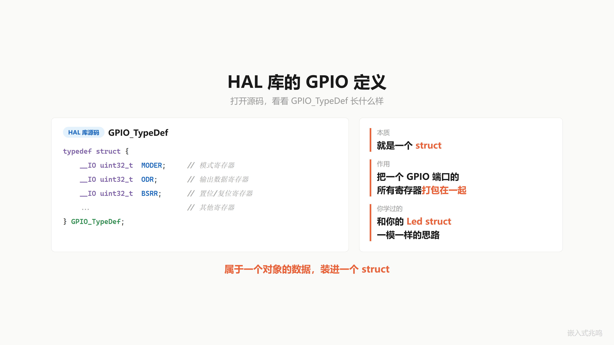
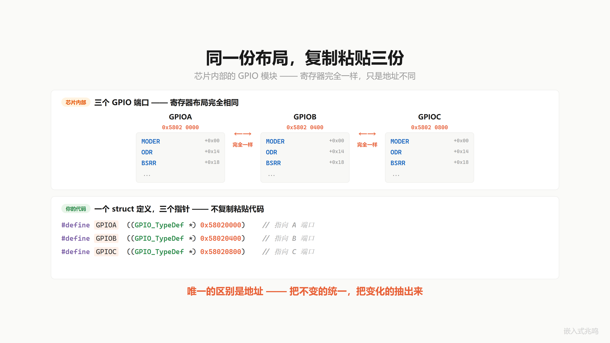
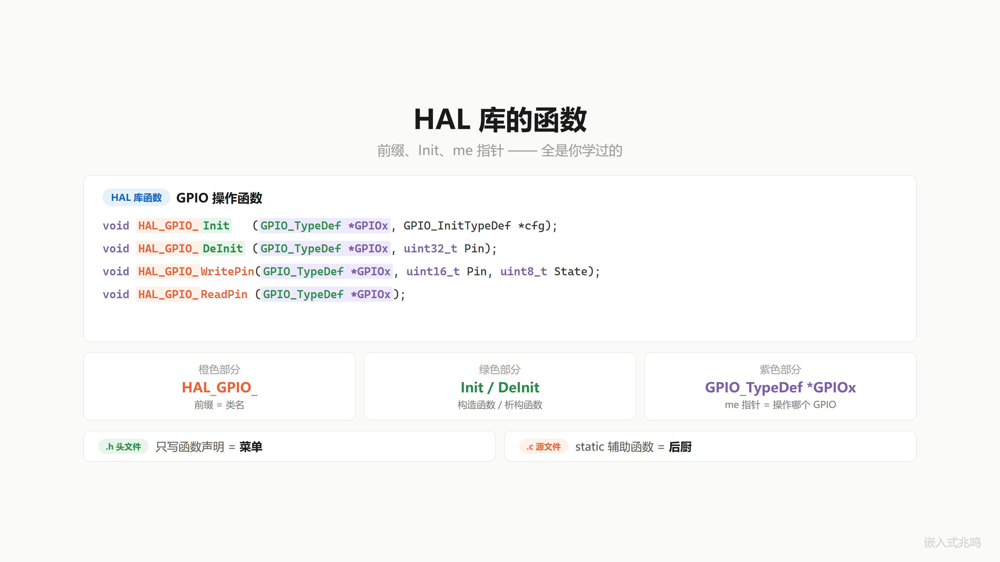
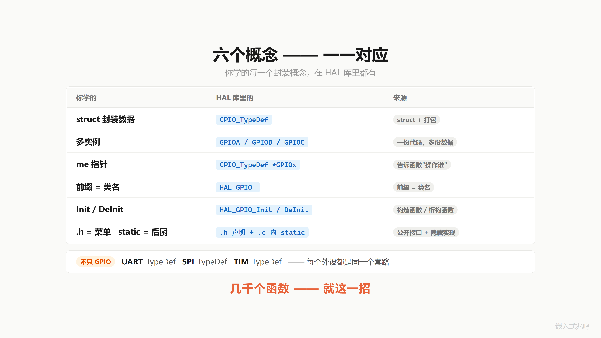
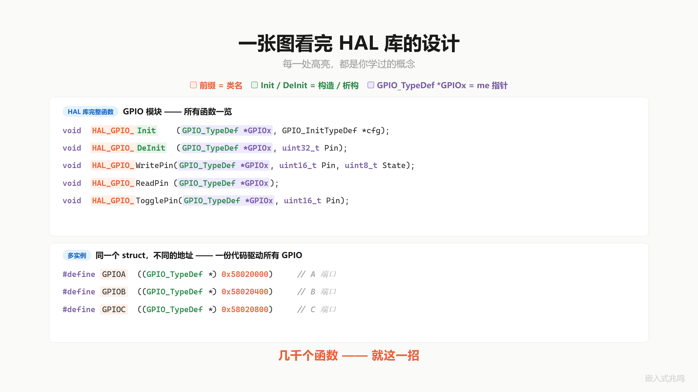

# 第 5 章 · HAL 库源码漫游 · 从抽象接口到平台实现

配套代码：[`oop-in-c/code/05-hal-mapping/`](https://github.com/ZhaoChengBo/zhaoming-embedded/tree/master/oop-in-c/code/05-hal-mapping/)

## 5.1 你天天用 HAL_GPIO_Init

你知道它为什么叫这个名字吗？

封装四章学完了：第 1 章 struct + me、第 2 章 static + `/* private */` 纪律、第 3 章前缀 + init/deinit、第 4 章数据三级归位（实例 / 模块 / 常量）。

但学的东西"是不是真的工业标准"，光我说不算。打开 STM32 HAL 库源码，亲眼验证。

这一章不教新概念。它是验证课。要做的事：把 HAL 库的设计逐项映射回前 4 章学过的东西。学完你会发现，你这一个月学的，就是几千个工业函数背后的同一套机制。

## 5.2 GPIO_TypeDef 就是 struct

打开 STM32 HAL 库源码（教学包里有等价的简化版 [`gpio_typedef.h`](https://github.com/ZhaoChengBo/zhaoming-embedded/tree/master/oop-in-c/code/05-hal-mapping/pc/gpio_typedef.h)，真实文件叫 `stm32h7xx.h`）找到 GPIO 的类型定义：

```c
typedef struct {
	uint32_t MODER;     /* 模式寄存器 */
	uint32_t OTYPER;    /* 输出类型寄存器 */
	uint32_t OSPEEDR;   /* 输出速度寄存器 */
	uint32_t PUPDR;     /* 上下拉寄存器 */
	uint32_t IDR;       /* 输入数据寄存器（只读） */
	uint32_t ODR;       /* 输出数据寄存器 */
	uint32_t BSRR;      /* 置位 / 复位寄存器 */
	uint32_t LCKR;      /* 锁定寄存器 */
} GPIO_TypeDef;
```

`MODER` 配模式，`OTYPER` 配推挽 / 开漏，`OSPEEDR` 配速度，`BSRR` 拉电平。八个寄存器属于"一个 GPIO 端口"这一个对象。

把它们打包成一个 struct。

第 1 章你给一颗 LED 打包 `pin / brightness / is_on`，是这个套路。ST 工程师给一个 GPIO 端口打包 `MODER / OTYPER / ...`，是同一个套路。同一个对象的所有数据，装进一个 struct。

GPIO_TypeDef 就是 STM32 工程师的 `struct led`。



## 5.3 GPIOA / GPIOB / GPIOC 就是多实例

芯片设计师设计了一个 GPIO 模块，寄存器、时序、功能全定义好了。

然后呢？复制粘贴。

A 端口一份，B 端口一份，C 端口一份。每一份的寄存器布局完全一样，只有起始地址不同。

那 HAL 库怎么做的？没有复制粘贴代码。只用一个 `GPIO_TypeDef` 描述所有 GPIO，然后定义三个指向不同地址的指针：

```c
/* 真实 STM32H7 头文件里这一段 */
#define GPIOA   ((GPIO_TypeDef *)0x58020000UL)
#define GPIOB   ((GPIO_TypeDef *)0x58020400UL)
#define GPIOC   ((GPIO_TypeDef *)0x58020800UL)
```

`0x58020000` 是 GPIOA 寄存器组在 SoC 内存映射里的物理基地址。芯片硬件设计的时候这个地址就定好了，CPU 用普通 `STR` / `LDR` 指令访问这块内存，访问到的是真实的 GPIO 寄存器（这种"硬件寄存器映射到 CPU 地址空间"的机制叫 MMIO）。

GPIOB 比 GPIOA 偏移 0x400 字节（1 KB），GPIOC 又偏移 0x400。三个端口寄存器布局完全一致，只是物理基地址不同。

唯一变化的是地址。

第 1 章你给三颗 LED 开三张挂号单（`red_led / green_led / blue_led`），是这个套路。ST 给三个 GPIO 端口开三个指针（`GPIOA / GPIOB / GPIOC`），是同一个套路。同一份 struct 定义，多个独立实例。



## 5.4 GPIO_TypeDef \*GPIOx 就是 me 指针

再看 HAL 函数：

```c
void HAL_GPIO_Init(GPIO_TypeDef *GPIOx, GPIO_InitTypeDef *init);
void HAL_GPIO_DeInit(GPIO_TypeDef *GPIOx, uint32_t pin);
void HAL_GPIO_WritePin(GPIO_TypeDef *GPIOx, uint16_t pin, GPIO_PinState state);
GPIO_PinState HAL_GPIO_ReadPin(GPIO_TypeDef *GPIOx, uint16_t pin);
void HAL_GPIO_TogglePin(GPIO_TypeDef *GPIOx, uint16_t pin);
```

注意每个函数的第一个参数 `GPIO_TypeDef *GPIOx`。

这就是 me 指针。

`GPIOx` 这个名字 ST 起得很妙：x 是占位符，意思是"哪一个 GPIO 都行"。你传 `GPIOA`，就操作 A 端口；传 `GPIOB`，就操作 B 端口。

```c
HAL_GPIO_WritePin(GPIOA, GPIO_PIN_5, GPIO_PIN_SET);    /* 操作 GPIOA Pin5 */
HAL_GPIO_WritePin(GPIOC, GPIO_PIN_13, GPIO_PIN_RESET); /* 操作 GPIOC Pin13 */
```

同一个函数 `HAL_GPIO_WritePin`，传不同的 me 指针 (`GPIOA` / `GPIOC`)，操作不同的实例。

第 1 章 `led_on(&red_led)` / `led_on(&green_led)`，是这个套路。



## 5.5 HAL_GPIO_ 前缀 + Init / DeInit

再看函数名前缀：`HAL_GPIO_`。

LED 模块叫 `led_`，HAL 库 GPIO 模块叫 `HAL_GPIO_`。前缀就是类名。

`HAL_GPIO_Init` 是构造函数，`HAL_GPIO_DeInit` 是析构函数。第 3 章学的命名规范，HAL 库工程师严格遵守。

不只 GPIO。打开 HAL 库的其他模块：

```
HAL_UART_Init     / HAL_UART_DeInit
HAL_SPI_Init      / HAL_SPI_DeInit
HAL_I2C_Init      / HAL_I2C_DeInit
HAL_TIM_Base_Init / HAL_TIM_Base_DeInit
HAL_ADC_Init      / HAL_ADC_DeInit
```

每个外设都是同一个套路。`HAL_<MOD>_Init` 配置外设，`HAL_<MOD>_DeInit` 复位回默认状态，中间的操作函数都带 `HAL_<MOD>_` 前缀。

**几千个 HAL 函数，就这一招。**

## 5.6 .h 是菜单 + .c 内 static 是后厨

打开 `stm32h7xx_hal_gpio.h`，里面只有函数声明 + 类型定义：

```c
/* stm32h7xx_hal_gpio.h（节选） */
void HAL_GPIO_Init(GPIO_TypeDef *GPIOx, GPIO_InitTypeDef *GPIO_Init);
void HAL_GPIO_DeInit(GPIO_TypeDef *GPIOx, uint32_t GPIO_Pin);
HAL_StatusTypeDef HAL_GPIO_LockPin(GPIO_TypeDef *GPIOx, uint16_t GPIO_Pin);
GPIO_PinState HAL_GPIO_ReadPin(GPIO_TypeDef *GPIOx, uint16_t GPIO_Pin);
void HAL_GPIO_WritePin(GPIO_TypeDef *GPIOx, uint16_t GPIO_Pin, GPIO_PinState PinState);
void HAL_GPIO_TogglePin(GPIO_TypeDef *GPIOx, uint16_t GPIO_Pin);
void HAL_GPIO_EXTI_IRQHandler(uint16_t GPIO_Pin);
```

这是菜单，开发者能调的全在这里。

打开 `stm32h7xx_hal_gpio.c`，除了上面的函数实现，还有内部参数验证 / 位操作辅助等内容。这些细节 ST 没暴露给用户用，是后厨的事。

第 2 章学的 `.h` 是菜单、`.c` 是后厨、内部辅助加 `static`，HAL 库工程师严格遵守。



## 5.7 完整映射表

把前 4 章的概念汇总到一张表：

| 你学的（ch01-ch04） | HAL 库里的 |
|---|---|
| `struct led`（数据打包，ch01） | `GPIO_TypeDef` |
| `red_led / green_led`（多实例，ch01） | `GPIOA / GPIOB / GPIOC` |
| `struct led *me`（me 指针，ch01） | `GPIO_TypeDef *GPIOx` |
| `led_` 前缀（命名规范，ch03） | `HAL_GPIO_` 前缀 |
| `led_init / led_deinit`（生命周期，ch03） | `HAL_GPIO_Init / HAL_GPIO_DeInit` |
| `.h` 菜单 + `.c` 后厨（ch02） | `stm32h7xx_hal_gpio.h` + `.c` |
| `static` 工具函数（ch02） | `static` 工具函数（一字不差） |
| `static const` 常量（ch04） | `#define GPIO_MODE_OUTPUT 0x01U` 类宏定义 |
| 数据归位 + .bss 段（ch04） | GPIO 寄存器在硬件 MMIO 区，每端口一片，启动期固定布局 |

六组对应。每一项都不是巧合。

不只 GPIO。UART_TypeDef、SPI_TypeDef、TIM_TypeDef，HAL 库的每个外设都按这套规则组织。



## 5.8 HAL_GPIO_WritePin 内部到底在做什么

带你看一行最关键的代码：`HAL_GPIO_WritePin` 写到底，CPU 实际执行了什么。

简化版的真实实现（来自 `stm32h7xx_hal_gpio.c`）：

```c
void HAL_GPIO_WritePin(GPIO_TypeDef *GPIOx, uint16_t GPIO_Pin,
                       GPIO_PinState PinState)
{
	if (PinState != GPIO_PIN_RESET)
		GPIOx->BSRR = (uint32_t)GPIO_Pin;          /* 拉高 */
	else
		GPIOx->BSRR = (uint32_t)GPIO_Pin << 16;    /* 拉低 */
}
```

`BSRR` 是 Bit Set / Reset Register，一个 32 位寄存器：

- 低 16 位：写 1 把对应引脚拉高，写 0 无影响
- 高 16 位：写 1 把对应引脚拉低，写 0 无影响

举个具体例子。`HAL_GPIO_WritePin(GPIOA, GPIO_PIN_5, GPIO_PIN_SET)` 想把 PA5 拉高。

`GPIO_PIN_5` 是宏 `((uint16_t)0x0020)`（即 `1 << 5`，位 5 是 1）。

代码执行 `GPIOx->BSRR = 0x0020`。这一句翻译成汇编是一条 `STR` 指令，把 `0x0020` 写入地址 `GPIOA + offsetof(GPIO_TypeDef, BSRR)`，也就是 `0x58020000 + 0x18 = 0x58020018`。

```
LDR  r0, =0x58020018       ; GPIOA->BSRR 的物理地址
LDR  r1, =0x0020           ; 要写的值（位 5 是 1）
STR  r1, [r0]              ; 一次 32 位 store，PA5 拉高
```

一个周期搞定。从 C 函数调用进来到 PA5 真的有 3.3V 电压，整条路径不到 100 纳秒。

为什么 BSRR 设计成"写 1 才生效，写 0 无影响"？为了让多任务 / 多中断同时操作不同引脚时不打架。中断半路改 PA5，主循环改 PA7，两个写到 BSRR 都是单条原子指令，互不影响。

如果 ST 没做这个 BSRR 设计，你要拉 PA5 就得先读 ODR 再 OR `1 << 5` 再写回 ODR，三条指令。中断在中间插一脚改其他引脚，状态就乱了。

这种"硬件帮你做并发安全"的设计哲学，在工业代码里到处都是。第 11 章讲多态、第 17 章讲 initcall 都会再回到这条线。

## 5.8.5 BSRR / ODR / LCKR · 三个寄存器一组对照

GPIO_TypeDef 里和"输出值"相关的寄存器其实有三个：BSRR、ODR、LCKR。三者各有职责，看完这一组对照你能更深地理解为什么 ST 工程师把"写一个引脚电平"做成 BSRR 而不是直接 ODR。

**ODR (Output Data Register)**：32 位，每位对应一个引脚的"目标输出电平"。读 ODR 拿到当前所有 16 个引脚的状态，写 ODR 同时改 16 个引脚。

```c
GPIOA->ODR |= (1 << 5);     /* 把 PA5 拉高 */
```

这一行是 read-modify-write 三条指令：先读 ODR、再 OR、再写回 ODR。中断在中间插一脚改 ODR，状态就乱了。

**BSRR (Bit Set / Reset Register)**：32 位写入专用寄存器，不能读（读出来全 0）。低 16 位写 1 把对应引脚置位，高 16 位写 1 把对应引脚复位，写 0 无影响。

```c
GPIOA->BSRR = (1 << 5);     /* 把 PA5 拉高 */
```

一条 32 位 store 指令搞定。其他引脚位写 0 不受影响，所以这条写不会和别的中断改别的引脚冲突。**原子的 single-pin set 操作**。

**LCKR (Lock Register)**：32 位，把指定引脚的配置（mode / type / speed / pull）锁死，写一次后这些字段直到芯片复位前都不能改。用在"系统启动后绝不允许重配的关键引脚"，比如 reset signal、外部时钟输入。

把 ch01-ch04 学的 `platform_gpio_write` 和 BSRR 对一遍：

```c
/* ch01-ch04 里你写的 */
void platform_gpio_write(uint8_t pin, bool value)
{
	if (value)
		BSRR_SET(pin);     /* 教学伪代码 */
	else
		BSRR_RESET(pin);
}

/* HAL_GPIO_WritePin 真实实现 */
void HAL_GPIO_WritePin(GPIO_TypeDef *GPIOx, uint16_t GPIO_Pin,
                       GPIO_PinState PinState)
{
	if (PinState != GPIO_PIN_RESET)
		GPIOx->BSRR = (uint32_t)GPIO_Pin;
	else
		GPIOx->BSRR = (uint32_t)GPIO_Pin << 16;
}
```

两边骨架一致：判断 high / low、写 BSRR 不同的位区。差别只在 HAL 多了 `GPIO_TypeDef *GPIOx` 这个 me 指针（支持多端口），ch01-ch04 简化为只有一个全局端口。

**几千个 HAL 函数就一个套路**这句话不是我说的，是 ST 工程师写 HAL 时的设计哲学。每个外设都是 `XXX_TypeDef + XXX_Init / DeInit + 操作函数` 这一套，每个操作函数底下都是寄存器 store。HAL 库教学价值最大的部分在这一层：让你看到"工业级框架的骨架就是 ch01-ch04 的几个动作"。

## 5.9 你现在的代码在 STM32 上跑

PC 模拟版在 [`oop-in-c/code/05-hal-mapping/pc/`](https://github.com/ZhaoChengBo/zhaoming-embedded/tree/master/oop-in-c/code/05-hal-mapping/pc/)。Makefile + main.c + hal_gpio.c + gpio_typedef.h 一个文件不少，gcc 编完就跑。

真实 STM32 上的等效片段（节选自 [`oop-in-c/code/05-hal-mapping/stm32-snippet/hal_gpio_real.c`](https://github.com/ZhaoChengBo/zhaoming-embedded/tree/master/oop-in-c/code/05-hal-mapping/stm32-snippet/hal_gpio_real.c)）：

```c
GPIO_InitTypeDef cfg = {0};

__HAL_RCC_GPIOA_CLK_ENABLE();

cfg.Pin   = GPIO_PIN_5;
cfg.Mode  = GPIO_MODE_OUTPUT_PP;
cfg.Pull  = GPIO_NOPULL;
cfg.Speed = GPIO_SPEED_FREQ_HIGH;
HAL_GPIO_Init(GPIOA, &cfg);

HAL_GPIO_WritePin(GPIOA, GPIO_PIN_5, GPIO_PIN_SET);
HAL_Delay(500);
HAL_GPIO_WritePin(GPIOA, GPIO_PIN_5, GPIO_PIN_RESET);
```

PC 模拟版和 STM32 真实版的接口几乎一字不差。前 4 章学的所有概念，在真实硬件上原样落地。

## 5.10 你现在的代码在 Linux 用户态长什么样

Linux 用户态没有 STM32 那种 BSRR 寄存器直写。从用户态到硬件的路径是这样：

```c
write("/sys/class/gpio/gpio13/value", "1")
   -> kernel 调 gpio_chip 的 .set 方法
   -> 具体 GPIO controller driver
   -> 最终还是 BSRR 或类似的硬件寄存器
```

[`oop-in-c/code/05-hal-mapping/linux-snippet/sysfs_gpio_real.c`](https://github.com/ZhaoChengBo/zhaoming-embedded/tree/master/oop-in-c/code/05-hal-mapping/linux-snippet/sysfs_gpio_real.c) 演示了用户态最朴素的 sysfs 用法：

```c
gpio_export(13);
gpio_set_dir(13, "out");
gpio_write(13, 1);
sleep(1);
gpio_write(13, 0);
```

sysfs 的"把硬件当文件"机制怎么和内核的 `file_operations` + `gpio_chip` 衔接起来：`gpio_chip` 是第 16 章的内容，`file_operations` 是第 18 章 § 18.1 的内容。这一章先看到"用户态调用还是同一个套路"。

新内核推荐 libgpiod 替代 sysfs，附录 C 会展开。

## 5.11 工业代码里的对应

我做的工业控制板项目里所有的驱动都按 HAL 这套路子组织。每个底层 driver 都有自己的 `<MOD>_TypeDef`、自己的 init/deinit、自己的命名前缀。

随便举一个例子。DS2433（1-Wire EEPROM）的头文件骨架：

```c
/* drivers/eeprom/ds2433.h - DS2433 1-Wire EEPROM */
typedef struct {
	/* 内部字段 (这一章先关注外层结构, 字段含义随用随说) */
	uint8_t       w1_pin;     /* 单总线引脚 */
	uint16_t      capacity;   /* 容量 */
} ds2433_t;

/* 构造 / 析构 - 跟 ch03 学的 init/deinit 模式一字不差 */
int ds2433_init(ds2433_t *me, uint8_t w1_pin);
int ds2433_deinit(ds2433_t *me);

/* 读 / 写 - 第一参数是 me 指针, 跟 ch01 学的一样 */
int ds2433_read(ds2433_t *me, uint32_t addr, void *buf, size_t n);
int ds2433_write(ds2433_t *me, uint32_t addr, const void *buf, size_t n);
```

字段命名、`<MOD>_TypeDef` 风格、init/deinit 配对、`me` 指针作为第一参数，跟 HAL 库的 GPIO 一字不差，跟前 4 章你学的一字不差。

> **这一节有意省略的部分**：真实工业代码里 EEPROM 还会拆成"父类 + 子类"两份头文件，父类 `eeprom_base.h` 放对外统一接口（`eeprom_read` / `eeprom_write`），多种 EEPROM 实现（DS2433 / AT24Cxx / Flash 模拟）通过一张函数指针表分发到具体硬件。这一招叫**多态**，是 ch06（继承）→ ch07-09（函数指针 + ops 表）→ ch10-11（vptr + dispatch）整个 OOP 系列展开的主题。这一章你看到"工业代码也是 struct + me + init/deinit + 命名前缀"这一层就够了，别的层级在后面学到了再回来看。

字段 / 命名 / 生命周期一应俱全，和 HAL 库的 GPIO 是同一个骨架。

如果你有项目维护经验，应该能看出来：50 个驱动按这套路子写完，新人接手看一个文件就懂结构。这就是命名规范的复利效应。

## 5.12 跑一遍

```bash
cd oop-in-c/code/05-hal-mapping/pc
make
./demo
```

输出节选：

```
==============================================
  HAL maps to ch01-ch04 concepts.
==============================================

--- HAL_GPIO_Init for GPIOA Pin5 (output, push-pull) ---
  [HAL_GPIO_Init] GPIOA Pin5: Mode=Output Speed=High No Pull

--- HAL_GPIO_Init for GPIOC Pin13 (board LED) ---
  [HAL_GPIO_Init] GPIOC Pin13: Mode=Output Speed=Low No Pull

--- Same function, different me pointer ---
  [HAL_GPIO_WritePin] GPIOA Pin5 -> HIGH
  [HAL_GPIO_WritePin] GPIOC Pin13 -> LOW

==============================================
  Mapping table
    you learned         <-> HAL real name
    struct led          <-> GPIO_TypeDef
    red_led, green_led  <-> GPIOA, GPIOB, GPIOC
    struct led *me      <-> GPIO_TypeDef *GPIOx
    led_ prefix         <-> HAL_GPIO_ prefix
    led_init / deinit   <-> HAL_GPIO_Init / DeInit
    static helpers      <-> static inside hal_gpio.c
==============================================
```

教学版用真实 HAL 命名跑了一个最小例子。所有概念对应关系一目了然。

## 5.13 视频回放

想听口播版的可以看 B 站这一期视频：

> [《HAL 库几千个函数·就一个套路｜C 语言封装·源码验证》](https://www.bilibili.com/video/BV1feQbBVECg/)

视频里讲了"芯片设计师复制粘贴 GPIO 模块"、"同一份代码多份数据"等可视化类比，节奏更紧凑。书里把每一项映射展开得更细，并给了从 C 函数调用到物理电压输出的全路径剖析（5.8 节）。

封装篇到这里彻底闭环。第 1 章到第 4 章学的是机制，第 5 章看到这套机制就是工业 HAL 库的骨架。

## 下一章

但你的 LED 模块再干净，也只是一个驱动。真实项目里你会写 GPIO 灯、PWM 灯、I2C 灯、串口控制的灯，五种灯。

你认认真真写完五个驱动模块，会发现一半代码是重复的。`init / deinit / on / off` 套路一样，只是底层硬件不同。

怎么消灭重复？继承篇开始。

下一篇：[第 6 章 · 你的代码一半是重复的](../02-继承/06-代码一半重复.md)
