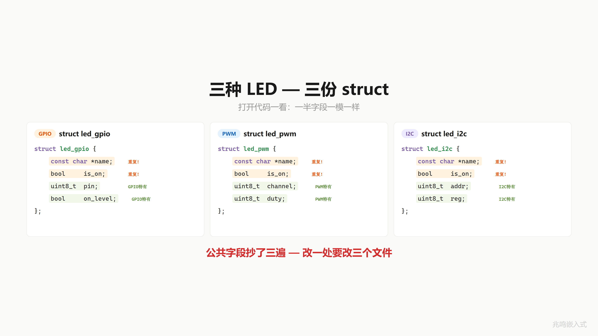
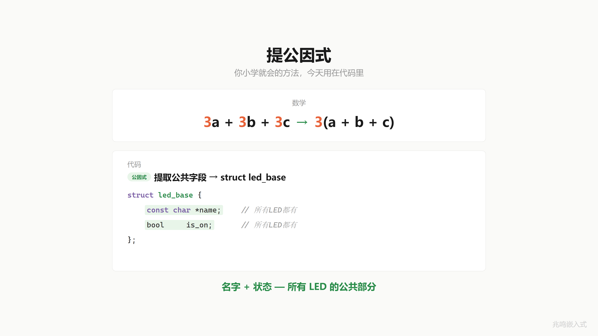
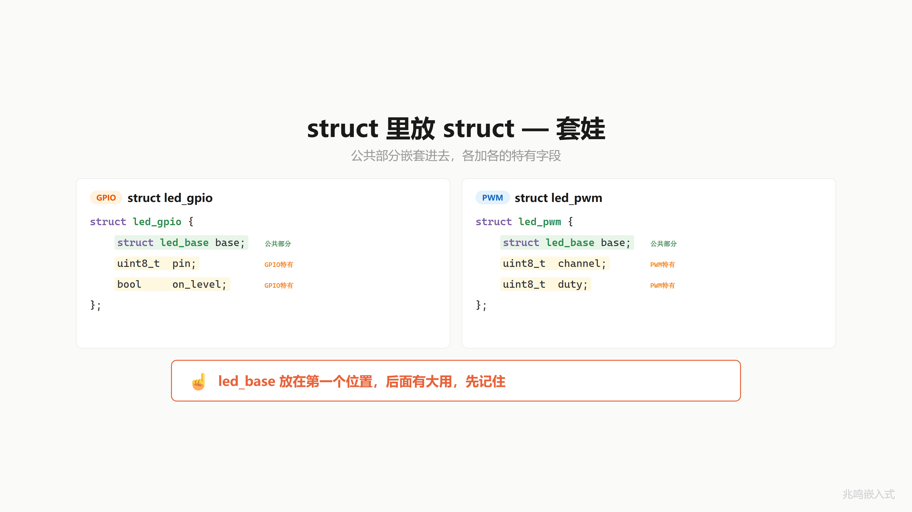
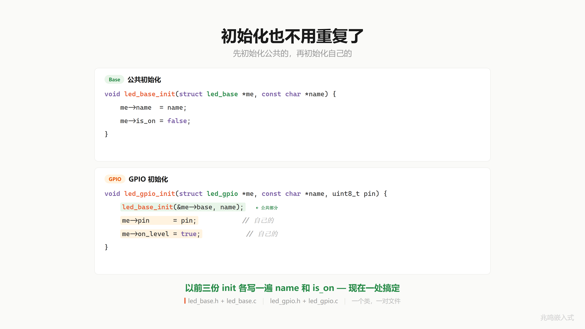
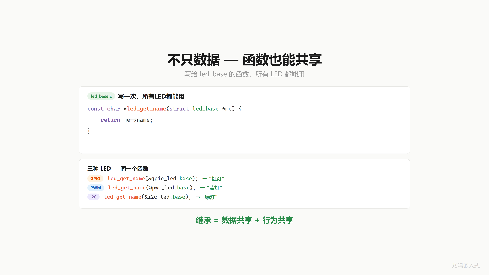
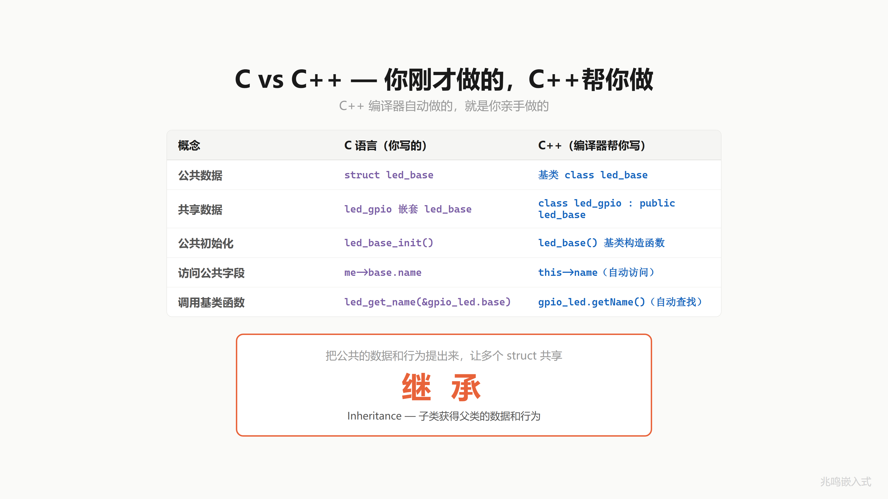
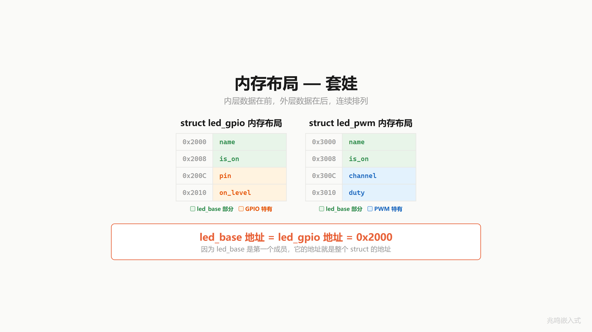
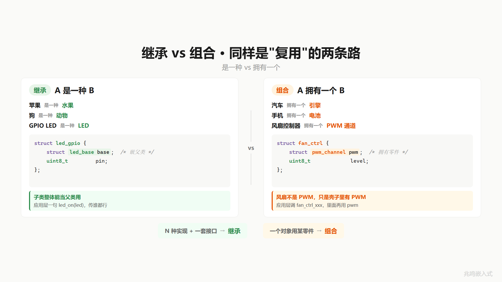
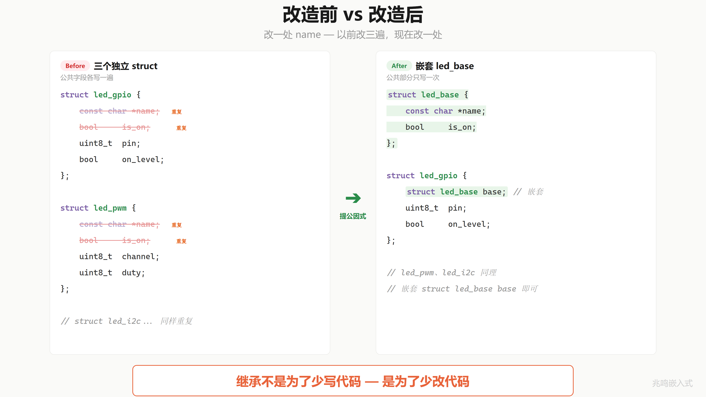

# 第 6 章 · 你的代码一半是重复的 · 共性提取的痛点

配套代码：[`oop-in-c/code/06-inherit-pain/`](https://github.com/ZhaoChengBo/zhaoming-embedded/tree/master/oop-in-c/code/06-inherit-pain/)

## 6.1 一个真实场景

第 5 章你已经把 LED 写干净了：`struct led { pin, brightness, is_on }`，三套平台 PC / STM32 / Linux 用户态都能跑。

但板子上的 LED 不止一种点法。报警灯接 GPIO，呼吸灯接 PWM，扩展板上还有一颗 I2C 控制的 LED。三种 LED，每一颗都需要：

- `name`：日志打印用（比如 `[LED red] turning on`）
- `is_on`：当前开关状态

这两个字段所有 LED 共有。但每种 LED 各自的硬件参数不同：GPIO LED 有 `pin`、PWM LED 有 `channel + duty`、I2C LED 有 `bus + addr`。

朴素的写法是每种 LED 写一份 struct：

```c
struct led_gpio {
	const char *name;       /* 共有 */
	bool        is_on;      /* 共有 */
	uint8_t     pin;        /* GPIO 特有 */
};

struct led_pwm {
	const char *name;       /* 共有 */
	bool        is_on;      /* 共有 */
	uint8_t     channel;    /* PWM 特有 */
	uint8_t     duty;       /* PWM 特有 */
};

struct led_i2c {
	const char *name;       /* 共有 */
	bool        is_on;      /* 共有 */
	uint8_t     bus;        /* I2C 特有 */
	uint8_t     addr;       /* I2C 特有 */
};
```

`name` / `is_on` 这两行，三个 struct 抄三遍。

提交、编译、跑通。下班。

## 6.2 三个月后再看

PM 又来：再加 SPI 控制的 LED 矩阵。

你打开 led_spi.c。第一行：`const char *name;`。第二行：`bool is_on;`。

再过几周加 USB LED、加蓝牙 LED。每个 LED 的 struct 头两行都是 `name + is_on`。

每个 init 函数的第一段都是 `me->name = name; me->is_on = false;`。

写到第八种 LED 你停了一下：八种实现，八处 `name + is_on`。如果有一天想再加一个统一字段（比如 `last_op_time` 用来 dmesg 风格打印），八处都要改。



## 6.3 提公因式

这个痛点你小学就会解。

数学课上老师讲过：`3a + 3b + 3c = 3(a + b + c)`。前面那个 `3` 重复了三次，提到括号外面，写一遍。

代码里一模一样。八种 LED 都有 `name + is_on`，那就把这两个共有字段提到一个新的 struct 里：

```c
struct led_base {
	const char *name;       /* 给日志打印用，例如 "red" */
	bool        is_on;      /* 当前开关状态 */
};
```

`name` 和 `is_on` 是所有 LED 都共有的"状态层"信息。`pin / channel / addr` 这些是各种 LED 的"硬件参数"，不在 base 里。

然后每种 LED 的 struct 第一个字段就是这个 `led_base`，自己的硬件字段下沉到子类：

```c
struct led_gpio {              /* GPIO 子类·pin 在这里 */
	struct led_base base;
	uint8_t         pin;
};

struct led_pwm {               /* PWM 子类·pwm 通道在这里 */
	struct led_base base;
	uint8_t         channel;
	uint8_t         duty;
};

struct led_i2c {               /* I2C 子类·总线参数在这里 */
	struct led_base base;
	uint8_t         bus;
	uint8_t         addr;
};
```

`struct` 里放另一个 `struct`，C 标准支持。这种语法叫 struct 嵌套，但你不用记这个名字。它就是把"另一张挂号单"原封不动塞进当前挂号单里，第一个位置专门留给它。

`struct led_gpio` 的实例在内存里这样躺：先是 base 部分（`name` 一个指针、`is_on` 一字节），紧接着是 `pin`。`struct led_pwm` 同理：先 base，再 `channel + duty`。



注意一件事：**base 必须放在第一个位置**。先别问为什么，记住这个约定。第 12 章会告诉你这一条让向上转型成为可能。

工程上为什么这样分？因为 `name + is_on` 是**所有 LED 都共有的"状态层"信息**，**`pin` 是 GPIO 特有的"硬件参数"**，分开管。父类承担"所有 LED 都需要的事"，子类承担"自己这种 LED 特有的事"。混在一起，每种子类都得继承一堆自己用不到的字段（GPIO 没有 channel、PWM 没有 pin），这就是放错地方的字段。

## 6.4 子类构造函数链

字段提了出来，初始化也得提。

`led_base.c` 里写一个 `led_base_init`：

```c
int led_base_init(struct led_base *me, const char *name)
{
	if (!me || !name)
		return -1;
	me->name = name;
	me->is_on = false;
	return 0;
}
```

凡是 base 自己能搞定的初始化（填 `name`、把 `is_on` 清成 false），它一手处理掉。注意：**base 不碰 `pin`**，因为 pin 在子类里。

子类的 init 第一行调它，再处理子类自己的字段：

```c
int led_gpio_init(struct led_gpio *me, const char *name, uint8_t pin)
{
	int rc = led_base_init(&me->base, name);
	if (rc != 0)
		return rc;

	me->pin = pin;                                  /* 自己的硬件参数 */
	platform_gpio_init(pin, GPIO_MODE_OUTPUT);
	platform_gpio_write(pin, false);
	return 0;
}

int led_pwm_init(struct led_pwm *me, const char *name,
                 uint8_t channel, uint8_t duty)
{
	int rc = led_base_init(&me->base, name);
	if (rc != 0)
		return rc;

	me->channel = channel;
	me->duty = duty;
	return 0;
}
```

每个子类的 init 第一行都是 `led_base_init(&me->base, name)`。先把父类部分搞定，再处理子类自己的硬件字段。这就是 C++ 里那条隐式的"调用父类构造函数"规则，C 里你手写。

`&me->base` 在这里是个关键操作。`me` 是 `struct led_gpio *`，`me->base` 是结构体字段（类型 `struct led_base`），`&me->base` 是这个字段的地址。把这个地址传给 `led_base_init`，它接到一个 `struct led_base *`，干自己的活（填 name、清 is_on），不知道也不需要知道外层是 `struct led_gpio` 还是 `struct led_pwm`。

这种"我只看你给我的接口部分"的写法，是后面 4 章一切玩法的根。



### 6.4.1 这一招不只是 C 的歪招

把"父类对象嵌进派生类的第一个字段"这件事，三个全球最大的 OOP-in-C 项目都用：

- Linux 内核：`struct gpio_chip` 嵌进 `struct platform_device` 嵌进 `struct device`，逐层下沉
- Zephyr RTOS：`struct k_thread` 嵌进 `struct _thread_base`，调度器只看 base
- GObject：`GObject` 是所有 GTK 对象的根，每个子类把 `GObject parent_instance` 放在第一个字段

GObject 的官方教程里这一招叫 **single inheritance via struct embedding**（通过 struct 嵌入实现单继承）。Linux 内核里没有专门给它起名，但 Greg Kroah-Hartman 在内核驱动开发文档里反复强调"first field embedding"。这是几十亿行 C 代码验证过的工业级写法，不是教学发明。

C++ 编译器看到 `class led_gpio : public led_base { ... }` 时，背后做的事和你这里手写的完全一样：先放父类布局，再放子类自己的字段。你写的不是 C 的歪招，是把编译器的隐藏动作摆到了明面上。

## 6.5 行为也能共享

不只是数据共享。属于"所有 led_base 都需要的行为"，也写在 `led_base.c`，给所有子类共用：

```c
const char *led_base_get_name(const struct led_base *me)
{
	if (!me)
		return "(null)";
	return me->name;
}

bool led_base_is_on(const struct led_base *me)
{
	if (!me)
		return false;
	return me->is_on;
}
```

调用的时候，子类用 `&me->base` 把父类部分递过去：

```c
struct led_gpio red_led;
struct led_pwm  blue_led;
led_gpio_init(&red_led, "red",  13);
led_pwm_init (&blue_led, "blue",  1, 0);

printf("red name = %s\n", led_base_get_name(&red_led.base));
printf("blue name = %s\n", led_base_get_name(&blue_led.base));
```

`led_base_get_name` 写一份，GPIO LED 和 PWM LED 都能用。哪天又加 I2C LED、加 SPI LED，只要 struct 第一个字段是 `struct led_base`，这个函数都能用。

继承的两层意义到这里都齐了：**数据共享**（name / is_on 字段一处定义）+ **行为共享**（read 类的函数一份代码）。





## 6.6 这个东西叫什么

把多个 struct 的公共字段提到一个 base struct，让每个 struct 把它嵌套进来作为第一个字段，再让父类的函数通过 `&me->base` 服务所有子类。

这件事软件工程里有个名字。

它叫继承（Inheritance）。

C++ 里这一套不是这么写的：

```cpp
class led_base {
public:
	const char *name_;
	bool        is_on_;
	const char *get_name() const { return name_; }
};

class led_gpio : public led_base {
public:
	uint8_t pin_;
};

class led_pwm : public led_base {
public:
	uint8_t channel_;
	uint8_t duty_;
};
```

`class led_gpio : public led_base` 这一行在底层做的事情，就是把 `led_base` 当作 `led_gpio` 实例的第一个布局成员。`led_gpio` 实例的内存图和你在 C 里手写的 `struct led_gpio { struct led_base base; uint8_t pin; }` 一字不差。

C++ 还偷偷帮你做了第二件事：调用 `led_gpio g;` 自动调一遍 `led_base` 的构造函数，再调 `led_gpio` 的构造函数。这就是你在 `led_gpio_init` 里手动调 `led_base_init` 的事情。编译器帮你做了。



费曼讲过：被自己说服才叫理解。八种 LED 里 `name + is_on` 抄了八遍这个痛点你刚才认了。提公因式这个解法是你小学会的工具。把字段塞进一个 base struct + 子类嵌套 + 子类 init 第一行调父类 init，是你刚才一步一步推出来的。这就叫继承，不是从课本背的。

## 6.7 视频里没讲透的几个细节

### 6.7.1 为什么 base 必须放第一个

技术上你把 `struct led_base base` 放在 `struct led_gpio` 的第二个、第三个字段也能编译过。但有一个性质会被破坏：**base 字段的地址 = 整个 struct 的地址**。

C11 标准 6.7.2.1 节第 15 段保证：结构体第一个成员的偏移量是 0。所以 `&gpio->base == (struct led_base *)gpio`，没有任何额外加法。

如果 base 不在第一个位置，`&gpio->base` 等于 `(uint8_t *)gpio + offsetof(struct led_gpio, base)`，编译器要做一次地址加法。这件事的代价不在性能上（一次加法可以忽略），代价在向上转型上：

第 12 章你会看到，把 `struct led_gpio *` 直接当作 `struct led_base *` 传给父类函数，前提就是两者地址相同。如果 base 不在第一个位置，`(struct led_base *)&red_led` 这个强制类型转换就会读到错位的字段，整个驱动数据全乱。

Linux 内核、Zephyr RTOS、GObject 这三个全球最大的 OOP-in-C 项目，都把"父类放第一个"列为硬规则。Linux 内核源码里几乎每一个嵌套结构体都遵守。

### 6.7.2 这一章 base 服务三种 LED 子类

第 1 章到第 5 章里你的 `struct led` 单一类型，第 6 章这里抽出来的 `struct led_base` 服务三种 LED 子类（GPIO / PWM / I2C）。**这个 base 是 LED 这一类设备的共用底座**，不是给 Motor / EEPROM 用的。

工业代码里每一类设备都有自己的 base：`led_base` 给 LED 子类共用，`motor_base` 给 Motor 子类共用，`eeprom_base` 给 EEPROM 子类共用。同一类设备的不同硬件实现共享一个 base，跨类不强行共享。这样每个 base 字段都是这一类设备真正共有的，不会有"Motor 没有 is_on"这种放错地方的字段。

如果未来真的发现"所有外设设备都需要 name + last_op_time"，工程上的做法是再抽一层 `device_base`，让 `led_base / motor_base / eeprom_base` 都嵌它。Linux 内核 `struct device` 就是这一层。本书 ch06 到 ch11 只展开 LED 这一类，多类设备的"二级抽象"在 ch19 Zephyr 实战和 ch20 Linux 实战里你会看到真实开源项目里的形态。

### 6.7.3 sub-class init 调 base init 失败要不要回滚

你写了：

```c
int led_gpio_init(struct led_gpio *me, const char *name, uint8_t pin)
{
	int rc = led_base_init(&me->base, name);
	if (rc != 0)
		return rc;
	me->pin = pin;
	platform_gpio_init(pin, GPIO_MODE_OUTPUT);
	return 0;
}
```

`led_base_init` 失败就直接 `return rc`。但 `led_base_init` 如果内部申请了什么资源（一般它不会，name + is_on 是无副作用赋值；但子类的 `platform_gpio_init` 配过了 GPIO 后又失败的话，硬件状态已经动了）。

工业代码里的处理是：base init 失败，base init 自己负责回滚自己已经做的事（事务化）。子类 init 拿到失败码就直接 return，base 的资源 base 自己关心。

如果你写的 `led_base_init` 内部不是事务化的，那子类 init 失败时还要写一段 cleanup goto。这本书后面遇到这种情况会注明。这一章的 base init 都很简单（无副作用赋值，失败就 NULL 检查后立刻 return），不展开讲。

### 6.7.4 嵌套 struct 的内存布局

`struct led_gpio` 的内存图（32 位 ARM）：

```
offset  field
   0    base.name      (4 byte 指针)
   4    base.is_on     (1 byte)
   /* 3 bytes padding here */
   8    pin            (1 byte)
   /* 3 bytes padding here */
                       sizeof = 12
```

`name` 是 `const char *`，4 字节对齐；`is_on` 是 `bool`（1 字节），后面填 3 字节让 `pin` 自然对齐到下一个机器字。总大小 12 字节。

但如果哪天给 `led_base` 加一个 `uint64_t last_op_time`：

```c
struct led_base {
	const char *name;          /* offset 0, 4 byte */
	bool        is_on;         /* offset 4, 1 byte */
	/* 3 bytes padding */
	uint64_t    last_op_time;  /* offset 8, 8 byte */
};                             /* sizeof = 16 */

struct led_gpio {
	struct led_base base;      /* offset 0, 16 byte */
	uint8_t pin;               /* offset 16, 1 byte */
	/* 7 bytes padding (对齐到 8) */
};                             /* sizeof = 24 */
```

外层 struct 也要按里层 struct 的对齐规则对齐。整个 `struct led_gpio` 的对齐变成 8 字节（取决于 base 里最大对齐的字段）。

在 RAM 紧张的 MCU 上，给父类加一个 `uint64_t` 字段会让所有子类的 sizeof 跳一截。这是真实工程里争"该不该把这个字段下沉到 base"时的常见考量。



### 6.7.5 为什么不直接 (struct led_base *)&red_led

C 里另一种写法是：

```c
led_base_get_name((struct led_base *)&red_led);
```

这能编过，因为 `&red_led` 是 `struct led_gpio *`，强转成 `struct led_base *`。又因为 base 在第一个位置，`(struct led_base *)&red_led` 和 `&red_led.base` 指向同一个地址。

这两种写法做的事情一样。区别在可读性和类型安全：

- `&red_led.base` 显式说"我要的是 base 部分"，类型是编译器算出来的，不会写错
- `(struct led_base *)&red_led` 是强制类型转换，告诉编译器"闭嘴信我"，万一哪天 base 不在第一个位置（被人改了 struct），编译器不会报错，运行时崩

Linux 内核 / GObject / Zephyr 三个项目里，第一种写法（`&red_led.base`）是默认风格，强转只在 `container_of` 这种"反方向找回外层"的场景里用。第 13 章会看到。

### 6.7.6 继承 vs 组合 · 同样是"复用"的两条路

继承不是唯一的复用方式。还有一种叫**组合**。区别在生活里就分得清。

**继承 = "是一种"关系**

- 苹果 是一种 水果
- 狗 是一种 动物
- GPIO LED 是一种 LED

"是一种"意味着 A 不光长得像 B、行为也像 B、身份就是 B 的一员。你跟人说"我家有只苹果"，对方第一反应是"啥？"，苹果不是宠物。但你说"我家有只狗"，对方立刻懂，狗就是一种动物，不需要解释。

C 里"是一种"的写法你这一章已经学了：把父类整块嵌进子类的第一个字段：

```c
struct led_gpio {
	struct led_base base;     /* GPIO LED 是一种 LED */
	uint8_t         pin;
};
```

第一个字段是 `struct led_base`，所以 `led_gpio` "就是" 一种 `led_base`。`&gpio.base` 这个地址既能当 GPIO LED 用，也能当 LED 用，这就是下章会讲的"向上转型"，本质就是"既然你是一种 LED，那我把你当 LED 用没毛病"。

**组合 = "拥有一个"关系**

- 汽车 拥有一个 引擎
- 手机 拥有一个 电池
- 风扇控制器 拥有一个 PWM 通道（PWM 是嵌入式里调亮度、调转速用的脉冲信号源）

"拥有一个"意味着 A 内部有一个 B 在工作，但 A 本身不是 B。你跟人说"我家车坏了"，对方不会以为是引擎坏了，车比引擎大，引擎只是车的一个零件。

C 里"拥有一个"的写法：

```c
struct fan_ctrl {
	struct pwm_channel pwm;    /* 风扇拥有一个 PWM 通道 */
	uint8_t            level;
};

void fan_ctrl_set_speed(struct fan_ctrl *me, uint8_t pct)
{
	pwm_channel_set_duty(&me->pwm, pct);   /* 通过自己拥有的 PWM 工作 */
	me->level = pct;
}
```

代码上跟继承长得很像，都是把另一个 struct 当字段嵌进来。但语义和用法完全不同：

```c
/* 继承：GPIO LED "是一种" LED，可以整体当 LED 用 */
struct led_base *p = &gpio.base;       /* OK，&gpio.base 既是 GPIO LED 也是 LED */

/* 组合：风扇 "拥有一个" PWM，不是 PWM */
struct pwm_channel *p = &fan.pwm;      /* 只是访问内部的零件，风扇本身不是 PWM */
```

继承允许"把子类当父类整体替换使用"：所有 LED 共用一个 `led_on` 函数，传谁都行。组合做不到这一步，你不能把风扇控制器传给一个只接受 PWM 通道的函数，风扇不是 PWM。

**何时选哪一种**

- N 种实现 + 同一接口（多种 LED 都要 `led_on / led_off`）→ **继承**。Linux 内核所有字符设备 / 块设备 / 网络设备都是这个套路（一套 read/write/open 接口，N 家芯片实现）
- 一个对象需要某个工具（风扇需要 PWM 来调速）→ **组合**。这种关系下"风扇是一种 PWM"讲不通，"风扇拥有一个 PWM"才对



那本《设计模式》（GoF）有句被反复引用的话："优先用组合而不是继承"。这句话是 90 年代为应用层 Java / C++ 业务系统说的：那种场景里多层继承容易让父类一改全崩。但内核驱动这种"统一接口 + 大量芯片实现"的场景，继承（把父类嵌进子类第一个字段）才是世界标准，解决的就是"N 家芯片 + 1 套接口"的问题，没有第二个答案。

不要套教条。看场景。

### 6.7.7 应用层视角：调用方知不知道继承

调用层写：

```c
struct led_gpio red_led;
led_gpio_init(&red_led, "red", 13);
led_on(&red_led);
```

应用层根本不关心 `struct led_gpio` 内部还嵌了一个 `struct led_base`。它只调 `led_*` 这一组对外 API（这一章的 `led_on / led_off` 还接 `struct led_gpio *`，第 11 章演化为 `struct led_base *` 之后应用层就只看到父类指针了）。

继承在这里不是"应用层多了一种东西要学"，是"驱动层内部少抄了一些代码"。应用层从 ch01 一字不改的核心模式（`xxx_init + xxx_on`）一直延续，变的只是 init 多了一个 `name` 参数。

这件事是这本书的底色：每一章引入一个新机制，应用层永远稳定。变的是驱动层内部如何把"重复"和"扩展"分离。这是工业代码做大也做不烂的核心。

## 6.8 你现在的代码在 STM32 上长什么样

STM32 端的胶水还是 ch01 那套（节选自 [`oop-in-c/code/06-inherit-pain/platform-mcu/stm32/led_stm32.c`](https://github.com/ZhaoChengBo/zhaoming-embedded/tree/master/oop-in-c/code/06-inherit-pain/platform-mcu/stm32/led_stm32.c)，`pin` 仍是 `PIN_NUM('A', 13)` 编码，详见第 1 章 § 1.x PIN_NUM 编码）：

```c
#include "led_gpio.h"
#include "stm32f4xx_hal.h"

void platform_gpio_init(uint8_t pin, uint8_t mode)
{
	GPIO_InitTypeDef cfg = {0};

	_enable_port_clock(pin);

	cfg.Pin   = PIN_MASK(pin);
	cfg.Mode  = (mode == GPIO_MODE_OUTPUT) ?
	            GPIO_MODE_OUTPUT_PP : GPIO_MODE_INPUT;
	cfg.Pull  = GPIO_NOPULL;
	cfg.Speed = GPIO_SPEED_FREQ_LOW;
	HAL_GPIO_Init(PIN_PORT(pin), &cfg);
}

void platform_gpio_write(uint8_t pin, bool value)
{
	HAL_GPIO_WritePin(PIN_PORT(pin), PIN_MASK(pin),
	                  value ? GPIO_PIN_SET : GPIO_PIN_RESET);
}
```

注意：`led_base.h`、`led_base.c`、`led_gpio.h`、`led_gpio.c`、`led_pwm.h`、`led_pwm.c`、`main.c` 一字不改。

继承的所有变化都在驱动层内部。平台胶水的写法不变，因为父类抽象的是"驱动数据怎么组织"，不是"硬件怎么访问"。

本节用的还是函数式包装的 platform 抽象层，是教学简化版。真正工业级用虚函数表（ops 表）。第 16 章会把 platform 层从函数式升级成 ops 表式（gpio_chip 子系统）。

## 6.9 你现在的代码在 Linux 用户态长什么样

Linux 上同款抽象，完整工程见附录 C。

## 6.10 工业代码里的父类长什么样

工业控制板项目里，base 抽象是这样的（不是完整代码，是片段）：

```c
/* drivers/led/led.h */
struct led_base;        /* forward decl */

struct led_base {
	const char *name;       /* 给日志打印用 */
	bool        is_on;      /* 当前开关状态 */
	uint32_t    flags;      /* 真实项目里还有更多状态字段 */
};

struct led_gpio {
	struct led_base base;
	uint8_t pin;
	bool    on_level;
};
```

应用层声明：

```c
extern struct led_base *green_led;
extern struct led_base *red_led;
```

注意几个差异：

1. base 里只放所有 LED 都共有的"状态层"信息（name / is_on / flags），不放 pin
2. pin 在子类 `struct led_gpio` 里，PWM 子类有 `channel`，I2C 子类有 `bus + addr`
3. 应用层拿到的句柄是 `struct led_base *`（父类指针），不是某个具体子类的指针

第 3 点是这本书后面要讲的"向上转型"（第 12 章）。父类指针把所有具体类型藏起来，应用层只看到一个统一的 `struct led_base *`。

但骨架就是你这一章学的：**子类把父类放在第一个字段，硬件特定字段下沉到子类**。剩下的复杂度都是这条骨架上的演化。

## 6.11 跑一遍

```bash
cd oop-in-c/code/06-inherit-pain/pc
make
./demo
```

输出节选：

```
========================================
  Inherit pain: name + is_on in led_base.
  pin / channel live in their sub-classes.
========================================

--- Init led_gpio "red" on Pin 13 ---
  [base] "red" common init done (is_on=false)
[GPIO] Pin13 init as OUTPUT
[GPIO] Pin13 -> LOW (OFF)
  [GPIO] sub-class init done (pin=13)

--- Init led_pwm "blue" on channel 1 ---
  [base] "blue" common init done (is_on=false)
  [PWM] sub-class init done (channel=1)

--- Common base API works for both ---
  red name  = red,  is_on=false
  blue name = blue, is_on=false
```

`led_base_init` 这一行代码，给 GPIO LED 和 PWM LED 都跑了。`led_base_get_name` 这个函数写了一次，伺候两个子类。

完整源码见 [`oop-in-c/code/06-inherit-pain/`](https://github.com/ZhaoChengBo/zhaoming-embedded/tree/master/oop-in-c/code/06-inherit-pain/)。

## 6.12 视频回放

想听口播版的可以看 B 站这一期视频：

> [《你的代码·有一半是复制粘贴的｜C 语言继承·struct 嵌套》](https://www.bilibili.com/video/BV1hvQnB6EBa/)

视频和书互相补强。视频里展开的就是 GPIO LED / PWM LED / I2C LED 三种子类共享 base，骨架与本章完全一致。



## 下一章

继承解决了"数据/行为的公共部分写一次"。但有一种情况它解决不了：三种 LED 的 `led_on` 干的活完全不一样。GPIO 灯拉引脚，PWM 灯改占空比，I2C 灯发命令。

它们的 on 不是公共行为。但你想写一个 `test_led` 函数，依次开、等、灭，这个 `test_led` 不应该关心你是哪种 LED。

下一章先解决一个小问题：**怎么把"调谁"这件事不写死在代码里**。

下一篇：[第 7 章 · 写死的函数怎么换](../03-多态/07-写死的函数怎么换.md)
