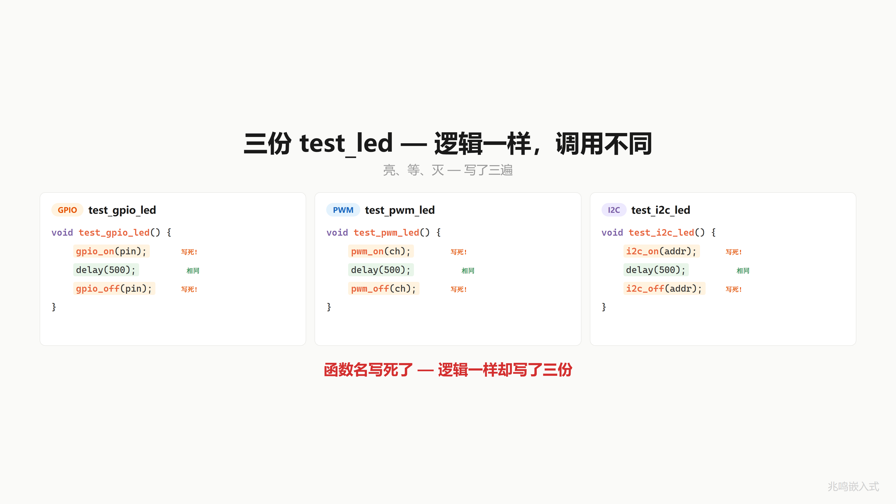
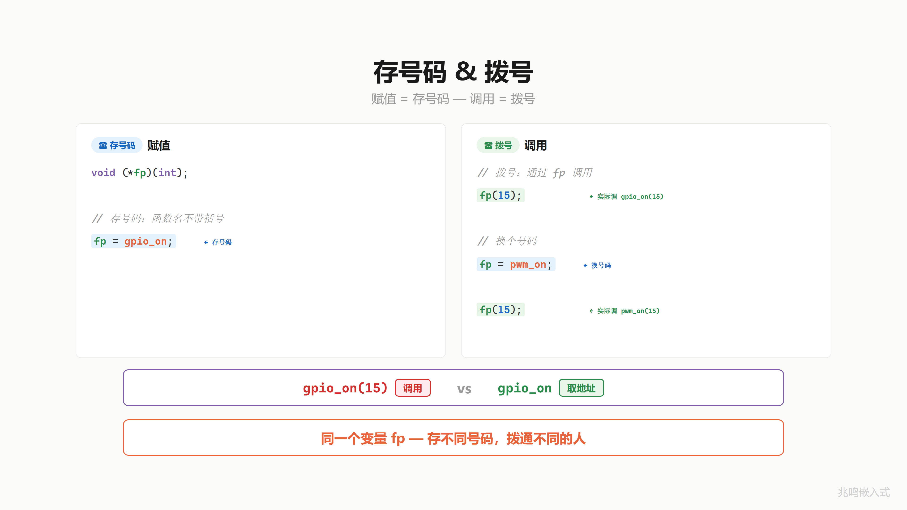
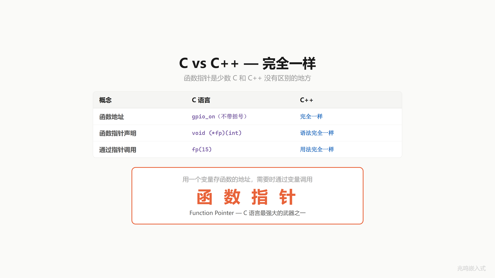
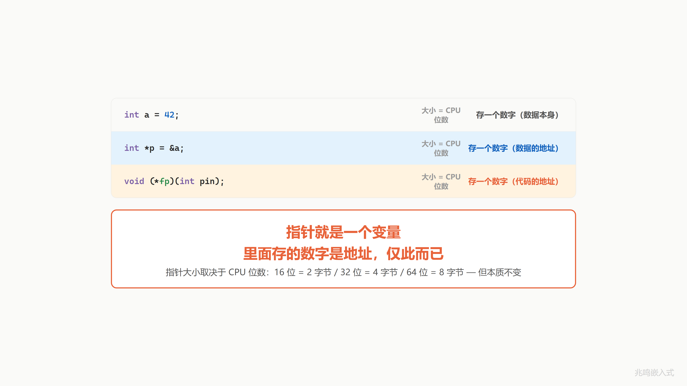

# 第 7 章 · 写死的函数怎么换 · 函数指针入门

配套代码：[`oop-in-c/code/07-function-pointer/`](https://github.com/ZhaoChengBo/zhaoming-embedded/tree/master/oop-in-c/code/07-function-pointer/)

## 7.1 一个真实场景

你想写一个工具函数 `test_led`，三步：开 → 等 → 关。给它一颗 LED 实例传进去，就能跑完这三步。

但你发现，按当前的代码结构，这个函数你写了三遍：

```c
void test_gpio_led(int pin) {
    gpio_on(pin);     /* 写死 */
    delay(500);
    gpio_off(pin);    /* 写死 */
}

void test_pwm_led(int channel) {
    pwm_on(channel);  /* 写死 */
    delay(500);
    pwm_off(channel); /* 写死 */
}

void test_i2c_led(uint8_t addr) {
    i2c_on(addr);     /* 写死 */
    delay(500);
    i2c_off(addr);    /* 写死 */
}
```

逻辑完全一样：亮、等、灭。但调的函数不同。`gpio_on` 和 `pwm_on` 名字不一样、功能一模一样，都叫"开灯"。

能不能让 `test_led` 不关心具体调谁，只说"开灯"，谁来都行？

问题在哪？`test_led` 里写死了函数名。`gpio_on` 写在那里，就只能调 `gpio_on`，换不了。

怎么才能"不写死"？



## 7.2 函数也有地址

冷静下来问一个问题：`test_led` 里那一行 `gpio_on(pin)` 到底是什么？

它最终落到 CPU 上，是一段机器码。每段代码编译完成后，都有一个内存地址。`gpio_on` 函数有它自己的地址，`pwm_on` 也有自己的地址，`i2c_on` 也有自己的地址。

变量有地址你已经习惯了。`int a = 42;` 这个变量住在 RAM 某个位置，比如 `0x2000`，`&a` 取它的地址。

函数呢？函数编译完是一段机器码，存在程序的代码段（`.text` 段）里。一段机器码的起点也是个地址。`gpio_on` 这个函数可能从 `0x0800` 开始，`pwm_on` 从 `0x0900` 开始。在 STM32 上你能在 `.map` 文件里看到这些地址。

地址是个数字。数字能存在变量里。

类比一下你手机里的通讯录：你存了一个联系人"张三"，张三有个电话号码。号码本身是一串数字，你能把它存起来。

函数名就像通讯录里的号码。`gpio_on` 就是它的号码。号码能不能存进变量？当然能。下一节看怎么存。


## 7.3 替换法语法

怎么存？C 语言提供了一种变量，专门用来存函数地址的。语法两步替换就出来了。

第一步，写一个普通的函数声明：

```c
void gpio_on(int pin);
```

读法：`gpio_on` 是一个函数，接受一个 `int` 参数，没有返回值。

第二步，把函数名 `gpio_on` 这个位置，换成一个变量名 `fp`，外面套一层括号 `(*fp)`：

```c
void (*fp)(int pin);
```

完成。`fp` 是一个变量，它能存"接受 `int`、返回 `void`"的函数地址。

读法：从内向外。看到 `*fp`，`fp` 是个指针；`(*fp)(int pin)`，它是指向"接受 int 参数的"的指针；`void (*fp)(int pin)`，它是指向"返回 void、接受 int 参数的函数"的指针。

参数名 `pin` 可以省略，`void (*fp)(int)` 也合法，意思一样。工业代码里 typedef 一长串函数指针类型时常省，下一章会演示。

这语法确实不漂亮。1972 年 Dennis Ritchie 定的，那时候连彩色显示器都没有。后来 C99 / C11 都没改它，因为改了会破坏巨量历史代码。丑归丑，不影响它强大。


## 7.4 存号码 + 拨号

`fp` 变量有了，怎么用？

**存号码**。把 `gpio_on` 的地址存进 `fp`：

```c
void (*fp)(int);

fp = gpio_on;     /* 注意: 函数名不带括号 */
```

函数名 `gpio_on` 在表达式里出现时，会自动退化成"这个函数的地址"（C99 标准 § 6.3.2.1 第 4 段）。所以 `fp = gpio_on` 等价于 `fp = &gpio_on`，把那段机器码的起点地址（一个数字）写进 `fp` 这个变量。

通讯录里存的是号码本身，不是直接拨出去。

**拨号**。通过 `fp` 调用：

```c
fp(15);    /* 实际调 gpio_on(15) */
```

`fp` 加括号是调用：从 `fp` 这个变量取出地址，跳过去执行那段机器码。等价于 `(*fp)(15)`，C 标准允许省略 `*`，所以工业代码里几乎都写 `fp(15)` 这种简洁版。

**换号码**。同一个 `fp`，存进另一个号码：

```c
fp = pwm_on;
fp(15);    /* 这次实际调 pwm_on(15) */
```

`fp = pwm_on; fp(15);` 拨通的就是 PWM 那一支。同一个变量 `fp`，存不同号码，拨通不同的人。

记住一对动作：`gpio_on`（不带括号）= 取号码，`gpio_on(15)`（带括号）= 拨号。两步动作，两个含义。



## 7.5 这个东西叫什么

你刚才做的事：用一个变量存某个函数的地址，需要的时候通过这个变量调用函数。

软件工程里有个名字。它叫**函数指针**（function pointer）。

C++ 里这件事一字不改：

```cpp
void (*fp)(int) = gpio_on;
fp(15);
```

声明语法、赋值语法、调用语法都和 C 完全一样。这是少数 C 和 C++ 没有区别的地方。C++ 后来加了 lambda、`std::function`、`virtual` 函数作为更高级的封装，骨头还是函数指针，没换。

回到指针本身。前面几章里的指针你见过 `int *p` 这种数据指针。函数指针和它有什么关系？把三种东西排在一起看：

```c
int a = 42;             /* 存一个数字 (数据本身) */
int *p = &a;            /* 存一个数字 (数据的地址) */
void (*fp)(int) = gpio_on;   /* 存一个数字 (代码的地址) */
```

三者大小都一样：等于 CPU 位数。32 位 CPU 上都是 4 字节，64 位 CPU 上都是 8 字节。CPU 看到它们时只看到一个数字，不区分这个数字是"数据本身"、"数据地址"、还是"代码地址"。差别在于这个数字的意义：

- `int a` 里的数字就是数据本身（42）
- `int *p` 里的数字是某个 `int` 在内存里的地址
- `void (*fp)(int)` 里的数字是某段机器码在内存里的起点地址

指针就是一个变量。里面存的数字是地址，仅此而已。





## 7.6 视频里没讲透的几个细节

### 7.6.1 函数指针变量到底占几个字节

`sizeof(void (*)(int))` 在 32 位 ARM Cortex-M 上是 4 字节，在 64 位 PC / ARM 上是 8 字节。和数据指针一样大。

但有一个坑：C 标准没有保证函数指针和数据指针大小相同。C99 § 6.3.2.3 把 `function pointer ↔ object pointer` 强转列为未定义行为。在常见架构（ARM / x86 / RISC-V）上两者大小一致，跨架构移植代码也都这样假设。但有些 Harvard 架构（早期 8051、AVR）上代码段和数据段地址空间分开，函数指针可能比数据指针大或小。

工业代码里如果遇到 8051 这种古董，要查 datasheet 决定怎么处理。在主流嵌入式平台（STM32、ESP32、Linux SBC）上不用纠结。

### 7.6.2 调用一次函数指针的代价（直接 vs 间接）

直接调用一个普通函数（编译期就知道跳哪）：

```
BL  gpio_on       ; 直接跳转到链接期已知地址 (3 cycle)
```

间接调用（运行时才知道跳哪，函数地址存在变量里）：

```
LDR  r3, [fp_addr]   ; 从 fp 这个变量里读出地址 (3 cycle, 命中 D-cache)
BLX  r3              ; 间接跳转 + 写 Link Register (3 cycle)
```

差别两件事：

1. **多一条 LDR**：要先把函数地址从内存 load 到寄存器
2. **跳转代价不同**：直接 BL 编译期 ROM 化，CPU 可以推测执行（branch prediction）；间接 BLX 必须等 r3 的值出来才知道跳哪，对 CPU pipeline 不友好

ARM Cortex-M4（无分支预测器）上两者差距小，约 1-2 个周期。但 Cortex-A 系列（Linux 跑的那种）有完整 branch prediction，间接调用如果 BTB（Branch Target Buffer）没命中，损失可能达到 10+ 周期。

实测：ARM Cortex-M4 @ 168MHz 一次间接调用约 28 ns，168 MHz 下大约 5 个时钟周期。日常驱动调用频率（开关灯每秒几十次到几百次）这点开销完全可以忽略。但要避开几个雷区：

- **中断处理函数（ISR）的关键路径**：每个 ns 都要算
- **PWM 高频更新**：微秒级时序，间接调用的 jitter 会影响波形质量
- **超低功耗 MCU 的 hot loop**：M0 没有分支预测，每次间接调用是固定开销，循环 1000 次就是 1000 倍

C++ virtual 函数调用就是这个开销。Stroustrup 那句"零成本抽象"在虚函数这里要打个小折扣（间接跳转 + 编译器没法 inline 虚调用），但这是工程上完全可接受的代价。Linux 内核里 fast-path（中断 + softirq）大量避开虚调用走直接函数，但 slow-path（设备驱动注册、open/read/write 慢路径）几乎全是 ops 表 dispatch。这个分界线是 Linus 反复强调的。

### 7.6.3 函数指针 vs 普通函数：反汇编对比

两段 C 代码：

```c
/* 直接调用 */
void call_direct(int pin)
{
    gpio_on(pin);
}

/* 间接调用 */
void call_indirect(void (*fp)(int), int pin)
{
    fp(pin);
}
```

godbolt 上用 `arm-none-eabi-gcc -O2` 编译，分别得到（简化）：

```
call_direct:
    B   gpio_on            ; 一条 tail-call branch
call_indirect:
    BX  r0                 ; r0 已经是 fp, 直接 tail-call jump
```

`call_direct` 在链接期就知道跳哪，编译器直接生成一条无条件跳转；`call_indirect` 直接用入参 r0（按 ARM EABI，第一个参数走 r0）作为跳转目标。这就是"运行时绑定"在汇编层面的具体形态。

### 7.6.4 函数指针存在哪：text 段 vs 数据段

C 程序编译后大致分这几段（ELF 可执行格式）：

| 段 | 内容 | 权限 |
|---|---|---|
| `.text` | 函数机器码 | r-x（可读可执行不可写） |
| `.rodata` | 常量数据，比如 const 全局对象 | r--（只读） |
| `.data` | 已初始化的可变全局变量 | rw-（可读写） |
| `.bss` | 未初始化的全局变量 | rw-（运行时清零） |

`gpio_on` 这个函数的机器码躺在 `.text` 段，地址在链接期就定了（在 STM32 上一般是 `0x08001234` 这种 Flash 地址）。

`fp` 这个变量住在 `.data` / `.bss` / 栈或堆里（取决于它是怎么定义的）。

把函数地址赋给变量：

```c
fp = gpio_on;
```

这一行等价于把 `.text` 里某段代码的起点地址（一个常量）写进 `fp` 这个变量。运行时调用 `fp(15)` 就是读 `fp`、跳到 text 段、执行那段机器码。

ARM Cortex-M 上还有一个细节：函数地址的最低位是 **Thumb 位**。Thumb 指令集的函数地址都加 1（最低位置 1），处理器根据这一位决定切到 ARM 还是 Thumb 模式执行。所以 `printf("%p", gpio_on)` 你看到的可能是 `0x08001235` 而不是 `0x08001234`，最低那个 `5` 不是地址错位，是 Thumb 标志。`BLX` 指令会自动剥离这一位再跳。这是 ABI 规定，不是你的 bug。

### 7.6.5 ABI：函数指针调用如何传参

ARM EABI（Embedded Application Binary Interface）规定参数怎么传：

| 参数槽 | 寄存器 | 备注 |
|---|---|---|
| 第 1 个 | r0 | 第一个参数走这里 |
| 第 2 个 | r1 |  |
| 第 3 个 | r2 |  |
| 第 4 个 | r3 |  |
| 第 5+ | 栈 | 按字对齐 |
| 返回值 | r0 | int / 指针 |

间接调用 `fp(15)` 编译出来：

```
MOV  r0, #15        ; 第一个参数 = 15, 进 r0
LDR  r3, [fp_addr]  ; 从 fp 这个变量读地址进 r3
BLX  r3             ; 间接调用. 跳过去时 r0 是 15
```

间接调用本身相比直接调用就多了一次 `LDR`，参数传递走的还是同一套 EABI。这是 EABI 让间接调用代价小的关键设计。

### 7.6.6 函数指针的"丑语法"为什么是这样

`void (*fp)(int pin)` 这个声明的读法是从内向外：

1. 看到 `*fp`：`fp` 是个指针
2. `(*fp)(int pin)`：`fp` 是指向"接受 int 参数的"的指针
3. `void (*fp)(int pin)`：`fp` 是指向"返回 void、接受 int 参数的函数"的指针

这套读法 1972 年 Dennis Ritchie 定的，那时候连结构化编程都还没占主流。后来加了 typedef 给它续命：

```c
typedef void (*gpio_action_fn)(int pin);
gpio_action_fn fp;        /* 简洁多了 */
```

第 9 章会大量使用 typedef 给函数指针起短名字。本章先不用，让你看清替换法的本来面目。

C99 没能改这个语法，因为改了会破坏巨量历史代码。C++11 加了 lambda + `auto` 让你能绕开它。Rust 用 `fn(...)` 类型，干净多了。

C 的丑语法保留下来不是因为它好，是因为它来不及改。

## 7.7 你现在的代码在 STM32 上长什么样

本章只演示函数指针变量这个工具本身，还没把它和具体 LED 驱动结构挂起来，所以 STM32 端没有引入新的胶水。`gpio_on` 这种函数在 STM32 上的实现还是 ch01 那一套（pin 仍是 `PIN_NUM('A', 13)` 编码，详见第 1 章 § 1.x PIN_NUM 编码）：

```c
void gpio_on(uint8_t pin)
{
    HAL_GPIO_WritePin(PIN_PORT(pin), PIN_MASK(pin), GPIO_PIN_SET);
}
```

应用层多了一行声明：`void (*fp)(uint8_t)`。把 `gpio_on` 存进 `fp`，再通过 `fp` 调用，跑出来的指令序列和直接调 `gpio_on` 几乎一样，多一次 LDR + 一次间接 BLX。在 STM32 这种 MCU 上完全无感。

下一章把 `fp` 当作参数传给 `test_led`，开始有真实的工程含义。

## 7.8 跑一遍

```bash
cd oop-in-c/code/07-function-pointer/pc
make
./demo
```

输出节选：

```
========================================
  Function pointer = a variable holding code address.
  Same fp, different number, different call.
========================================

--- fp = gpio_on; fp(15); ---
  [GPIO] pin 15 ON

--- fp = pwm_on; fp(15); ---
  [PWM] channel 15 ON (duty 100)

--- fp = i2c_on; fp(0x50); ---
  [I2C] addr 0x50 ON (cmd 0x01)

--- swap to off-functions ---
  [GPIO] pin 15 OFF
  [PWM] channel 15 OFF
  [I2C] addr 0x50 OFF
========================================
  Same variable fp.
  Three numbers, three behaviors.
========================================
```

同一个变量 `fp`，存进不同的函数地址，拨出去通的就是不同的函数。`fp` 这个变量本身一字没改，里面存的数字变了一下，整个调用就走到了别处。

完整源码见 [`oop-in-c/code/07-function-pointer/`](https://github.com/ZhaoChengBo/zhaoming-embedded/tree/master/oop-in-c/code/07-function-pointer/)。

## 7.9 视频回放

想听口播版的可以看 B 站这一期视频：

> [《C 语言：写死的函数怎么换｜函数指针·通讯录类比》](https://www.bilibili.com/video/BV1AZdBBWEuj/)

视频里用通讯录类比讲函数指针：函数名是号码，不带括号是取号码，加括号是拨号。

## 下一章

`fp` 变量你会用了。但有一个限制：**每次都得你自己拨**。先把号码存进 `fp`，再拿 `fp` 拨出去。

如果有一个工具函数 `test_led`，里面要做"开 → 等 → 关"三步，它怎么知道用哪个 `on`？

直觉是：让调用方告诉它。函数指针不光能存进变量，还能当参数传给别人。

下一篇：[第 8 章 · 把号码给别人拨](08-把号码给别人拨.md)
