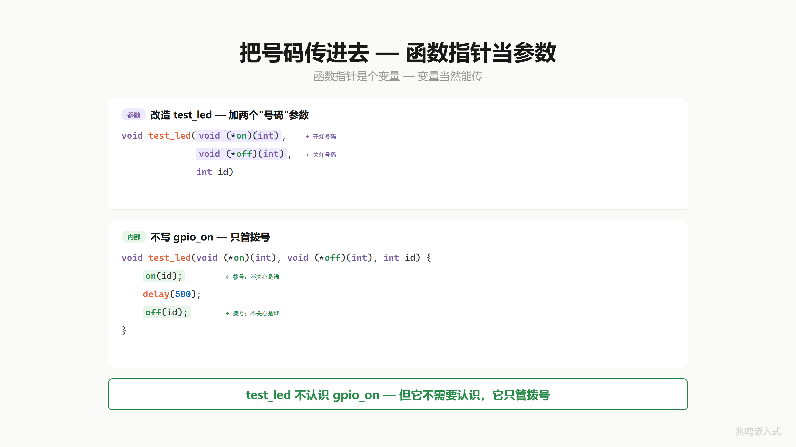
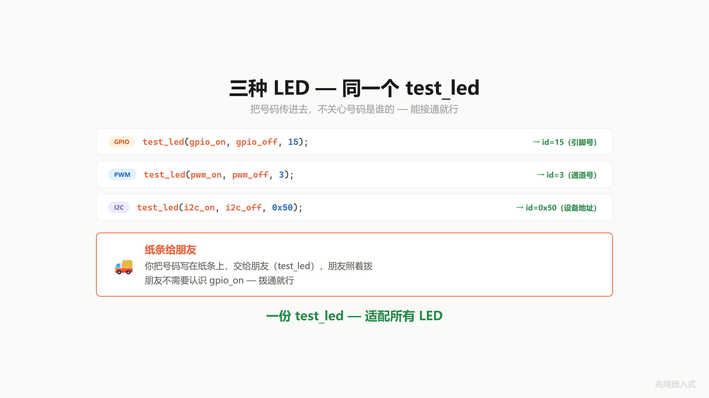
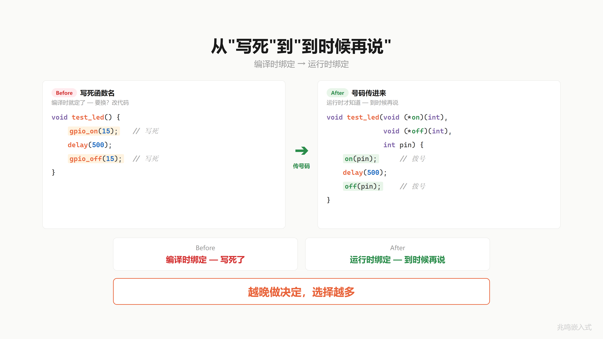
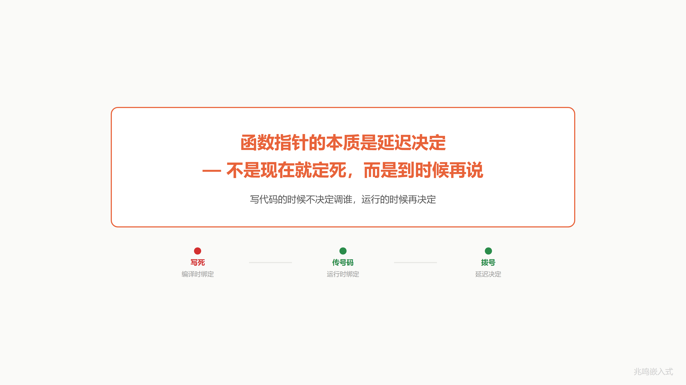

# 第 8 章 · 把号码给别人拨

配套代码：[`oop-in-c/code/08-callback/`](https://github.com/ZhaoChengBo/zhaoming-embedded/tree/master/oop-in-c/code/08-callback/)

## 8.1 一个真实场景

第 7 章你学会了用一个变量存函数地址，再通过这个变量调用：

```c
void (*fp)(int);
fp = gpio_on;
fp(15);
```

函数指针变量本身能用了。但每次都得**你自己**先拨：先把号码存进 `fp`，再拿 `fp` 拨出去。

你写一个 `test_led` 工具函数，要做的事是：开 → 等 → 关，三步。这个函数应该不挑 LED：传谁进来，它都能跑完三步。

但 `test_led` 不知道该调哪个 `on`、哪个 `off`。GPIO LED 要调 `gpio_on`，PWM LED 要调 `pwm_on`，I2C LED 要调 `i2c_on`。`test_led` 自己不知道。

直觉一：让 `test_led` 内部判断 LED 类型，写一堆 `if (type == GPIO) ... else if (type == PWM) ...`。回到 ch07 写死的老路。

直觉二：让**调用方**告诉 `test_led` 该拨哪个号码。`test_led` 接两个额外参数：用哪个 `on`、用哪个 `off`，剩下的它按"开 → 等 → 关"的固定流程走。

这就是函数指针当参数。

## 8.2 函数指针当参数

`test_led` 的签名长这样：

```c
int test_led(struct led_base *me,
             int (*on)(struct led_base *me),
             int (*off)(struct led_base *me));
```

第二个参数 `int (*on)(struct led_base *me)` 不是字段、不是 typedef，就是一个普通参数，类型是函数指针。

函数体里：

```c
int test_led(struct led_base *me,
             int (*on)(struct led_base *me),
             int (*off)(struct led_base *me))
{
	if (!me || !on || !off)
		return -1;

	on(me);    /* 调谁? 调用方传进来的 on */
	/* delay or hold */
	off(me);
	return 0;
}
```

`test_led` 自己不知道调谁，调用方告诉它。

调用方：

```c
test_led(&red_led.base, gpio_on_pull_high, gpio_off);
test_led(&blue_led.base, pwm_on_full_duty, pwm_off);
```

红灯走 `gpio_on_pull_high`，蓝灯走 `pwm_on_full_duty`。同一个 `test_led` 函数，传不同函数指针进去，行为完全不同。



`test_led` 自己一行不改，行为完全由调用方传进来的两个号码决定。换一种 LED 实现，换两个号码就行。

## 8.3 一个具体场景：给 LED 注册回调

把"函数指针当参数"用到极致的一个场景是回调注册。

你的应用层想知道：每次 LED 开关时，自动做一些事。比如：

- 主控板把 LED 状态发到 CAN 总线
- 调试时把 LED 状态打到 UART 日志
- 测试夹具记录 LED 的开关次数到统计表

这些事 `led.c` 不应该知道。`led.c` 只管开关 LED。但应用层想被通知。

注册一个回调：

```c
typedef void (*led_state_cb)(struct led_base *me, bool new_state);

int led_register_state_cb(struct led_base *me, led_state_cb cb);
```

应用层把自己的函数地址递给 `led_register_state_cb`。`led_base.c` 把它存起来。下一次 `led_on()` / `led_off()` 内部状态改完，调一下这个回调通知应用层。

```c
static void log_state_change(struct led_base *me, bool new_state)
{
	printf("LED %s became %s\n", me->name,
	       new_state ? "ON" : "OFF");
}

led_register_state_cb(&red_led.base, log_state_change);

/* 后面任何一次 led_on/off, log_state_change 都会被自动调到 */
```

`led.c` 不知道有人在监听。它只调它存好的函数指针。监听方是谁、它要做什么，led.c 一无所知。这就是回调机制：**底层模块通过预留的函数指针，把控制权临时交还给上层模块**。

软件工程里这叫**好莱坞原则**："Don't call us, we'll call you."（别打电话给我们，我们会打给你。）



## 8.4 typedef 给函数指针起短名字

`int (*on)(struct led *me)` 这个类型每次写一遍太累。第 9 章会大量用 typedef 给函数指针起名字，本章先小试：

```c
typedef void (*led_state_cb)(struct led *me, bool new_state);
```

这一行的意思：定义一个类型别名 `led_state_cb`，它代表"接受 `struct led *me + bool new_state`、返回 void 的函数指针"。

之后 `led_state_cb foo;` 等价于 `void (*foo)(struct led *me, bool new_state);`。但读起来短。

`led_register_state_cb` 的签名变成：

```c
int led_register_state_cb(struct led *me, led_state_cb cb);
```

整洁多了。下一章会成系统地用这个手段。

## 8.5 这个东西叫什么

把函数指针当参数传给另一个函数，让被调函数在内部"反过来调你给它的函数"，软件工程里有个名字。

它叫**回调**（callback），也叫**策略模式**（Strategy pattern）的最朴素形态。

C++ 里这件事写法和 C 完全一样：

```cpp
int test_led(led_base *me,
             int (*on)(led_base *), int (*off)(led_base *));
```

C++ 还提供 `std::function`、lambda 表达式作为更高级的封装：

```cpp
test_led(&red_led,
         [](led_base *me) { return me->on(); },
         [](led_base *me) { return me->off(); });
```

骨头是一样的：传一段代码给别人执行。lambda 是糖衣，没换药。



## 8.6 视频里没讲透的几个细节

### 8.6.1 编译时绑定 vs 运行时绑定

老写法（ch01 的 `led_on` 直接调 `platform_gpio_write`）：编译器看到调用，写死跳到 `platform_gpio_write` 的地址。函数地址在 `.text` 段链接时就定了。这叫**编译时绑定**（early binding / static binding）。

新写法（函数指针参数）：编译器只生成"间接调用：从寄存器里取地址，跳"。具体跳哪取决于运行时传进来的参数。这叫**运行时绑定**（late binding / dynamic binding）。

OOP 三大特性里多态的本质就是运行时绑定。第 11 章你会看到，把"通过函数指针调用"系统化（每个对象绑一组函数指针，统一从对象里取），就是 vptr + vtable + dispatch 的完整多态机制。

### 8.6.2 回调地狱与避免方法

回调用得太爽会出现回调地狱：

```c
led_register_state_cb(&red_led, on_red_change);
on_red_change() {
	send_to_can(...);
	on_can_send_done() {
		log_to_flash(...);
		on_flash_write_done() {
			notify_main_loop(...);
			...
		}
	}
}
```

每一层都有回调，控制流跨多个文件来回跳，调试时栈帧追不到源头。

工业代码里的处理：

1. **一个事件一个回调**，不嵌套（每个回调自己短，做一件事）
2. **回调里只发消息到队列，不直接干活**，主循环统一处理（解耦时序）
3. **状态机化**：回调触发状态迁移，状态机统一调度

第 19 章工业代码案例会展开。

### 8.6.2.1 回调可能在什么上下文里跑（IRQ vs 任务）

写回调时第一个要问的问题：**这个回调谁来调，在什么上下文里跑**。

工业代码里回调的触发上下文典型有三种：

| 触发源 | 上下文 | 限制 |
|---|---|---|
| 任务/主循环里同步触发 | 任务上下文 | 几乎没限制，能阻塞、能 printf、能调标准库 |
| 定时器中断 | IRQ 上下文 | 不能阻塞、不能调任何会休眠的 API、栈很小 |
| DMA 完成中断 | IRQ 上下文 | 同上 + 还要警惕 cache 一致性 |

LED 状态变化回调，如果 `led_on()` 是被任务调的，回调跟在任务里跑，没事。

但如果 `led_on()` 是被 GPIO 中断调的（比如按钮按下触发 led_on），那回调就跑在 IRQ 上下文。这时候在回调里写 `printf` 很可能死锁（printf 内部用 mutex 保护 stdout，IRQ 抢 mutex 失败就一直转）。在 RTOS 上写 `osDelay()` 直接 panic。

工业代码硬规则：

1. **回调注册的文档里必须说明触发上下文**。注册接口的注释写"this callback may run in IRQ context, do not block"
2. **IRQ 触发的回调里只做最小的事**：写一个标志位、给一个信号量、push 到 lock-free 队列。重活留给任务做
3. **跨上下文同步用 atomic / 关中断**：回调在 IRQ 里更新一个状态字段，任务读它要么用 atomic，要么用关中断

Linux 内核里这个分界线特别严格：注册的 callback 函数命名末尾经常带 `_irq`、`_softirq`、`_threaded` 标签，提示触发上下文。第 19 章工业案例里你会看到主控板的 LED 状态回调一律是"IRQ 设标志位 + 主循环统一处理"两段式。

### 8.6.2.2 注册期 vs 触发期的竞态

回调字段 `me->on_state_change` 存在 RAM 里的某个字段。两件事并发发生时会出问题：

```c
/* 任务 A 在某一时刻撤销回调 */
red_led->on_state_change = NULL;

/* 同一时刻 ISR 触发，准备调回调 */
if (red_led->on_state_change)
	red_led->on_state_change(red_led, new_state);
```

任务 A 在 `if` 之后、调用之前那个 ns 把字段设成 NULL，ISR 已经过了 `if` 不知道，跳到了 NULL，HardFault。

这是经典的 TOCTOU（time-of-check-to-time-of-use）竞态。工业代码三种处理，按推荐顺序：

1. **永不撤销**（工业代码 90% 是这种）：启动期 INIT_DEVICE_EXPORT / INIT_ENV_EXPORT 一次性把回调字段填好，运行期再不改。读永远安全，写不存在。Linux 内核 `file_operations` 注册后基本不动，绝大多数 RTOS 驱动也是同款思路
2. **回调字段做成 atomic 读写**：必须支持运行期改回调时用。C11 `_Atomic` 或 GCC `__atomic_*` 内建函数。读写都是单条指令，IRQ 不会切到半路
3. **整个注册接口走任务上下文 + 关中断**：连 atomic 都拿不到时的暴力 fallback。简单粗暴但有 IRQ 抖动，热路径慎用

ch08 的 demo 用第 3 种是为了演示"注册"这件事本身（PC 上没有真 ISR 上下文，谈不上竞态）。真实嵌入式工业代码绝大多数是第 1 种：启动期一次配置，运行期不动。第 19 章工业案例里就是这个形态。

### 8.6.3 回调函数的上下文（user_data）

有时候回调需要"我之前注册的时候带的某个上下文"。比如：

```c
void on_change(struct led_base *me, bool new_state)
{
	/* 我想知道注册时的 priority 是什么 */
}
```

但回调签名里只有 `me` 和 `new_state`。怎么把 priority 传进来？

工业写法：注册接口加一个 `void *user_data`：

```c
typedef void (*led_state_cb)(struct led_base *me, bool new_state, void *user_data);

int led_register_state_cb(struct led_base *me, led_state_cb cb, void *user_data);
```

注册时把 priority 包成一个结构体，`user_data` 存它的地址。回调里把 `user_data` 强转回原结构体，读 priority。

完整使用示意：

```c
/* 应用层定义自己的上下文 */
struct can_log_ctx {
	uint32_t can_id;
	uint8_t  priority;
};

static void can_log(struct led_base *me, bool new_state, void *user_data)
{
	struct can_log_ctx *ctx = (struct can_log_ctx *)user_data;
	can_send(ctx->can_id, ctx->priority, me->name, new_state);
}

/* 注册时挂上自己的上下文 */
static struct can_log_ctx red_ctx = { .can_id = 0x100, .priority = 5 };
led_register_state_cb(&red_led.base, can_log, &red_ctx);
```

`led_base.c` 完全不知道 `can_log_ctx` 的存在，它只是把 `user_data` 这个 `void *` 原封不动传回回调。应用层强转回自己的类型读字段。

Linux 内核里这个模式叫 **opaque context pointer**，`struct file` 里的 `void *private_data`、`pthread_create` 里的 `void *arg`、libuv 的 `uv_handle_t->data` 全是同一招。callback API 必须配 `user_data` 才算工业级，这是几十年血泪经验。

工程上还有一个约定：注册期文档里必须说明 user_data 的生命周期。常见两种契约：

1. **注册方负责保活**：调用方保证 user_data 指向的对象在 unregister 之前一直有效。本章演示用这种，最常见
2. **注册接口拷贝**：注册函数内部 `malloc + memcpy` 一份，自己持有所有权。多见于异步任务系统，但有 alloc 开销

本章为简洁不引入 user_data，第 9 章 ops 表也暂不用，第 19 章工业代码会用到。

### 8.6.4 函数指针参数的对齐和栈传递

ARM EABI 调用约定：函数指针作为参数和数据指针一样大（4 字节 32 位 / 8 字节 64 位），通过 r0-r3 寄存器传递。如果参数太多溢出到栈上，按 4 字节对齐压栈。

`test_led(&red_led.base, gpio_on_pull_high, gpio_off)` 这一调：

- r0 = &red_led.base
- r1 = gpio_on_pull_high 的地址
- r2 = gpio_off 的地址
- 函数体里 r1 / r2 直接 BLX 即可

完全没有任何额外开销。函数指针传参 ≈ 数据指针传参。

### 8.6.5 const 函数指针 vs 函数指针 const

```c
int test_led(struct led *me,
             int (* const on)(struct led *me),    /* on 是 const 指针 */
             int (*off)(struct led *me));
```

`const` 加在 `(*` 后面，说明 `on` 这个变量本身不能再被赋值（参数槽不能换）。这种场景在工业代码里很少用（参数本来就是临时变量），但在结构体字段里常用：

```c
struct led_base {
	const struct led_ops *ops;   /* ops 这个指针指向的内容是 const, 不允许修改 */
};
```

第 10 章 ops 字段会用到 `const`。意思是"指向常量 ops 表的指针"，**不是**"常量指针"。这两个 const 的位置是 C 语法里最容易绕的地方，把"const 修饰它右边的 token"这条规则记牢就不会错。

### 8.6.6 函数指针参数的 NULL 检查

`test_led` 第一行：

```c
if (!me || !on || !off)
	return -1;
```

`me` NULL check 是基础。`on / off` 这两个函数指针 NULL check 必不可少：调用方传 NULL 进来，`on(me)` 就是跳到地址 0 执行，HardFault。

工业代码的硬规则：**所有函数指针调用前都做 NULL check**。无论函数指针来自字段、参数还是回调注册表。

### 8.6.7 callback 注册的反向操作

`led_register_state_cb(&red_led, log_state_change);` 注册了一个回调。

什么时候撤销？应用层退出前应该撤销，否则回调指向的函数地址可能在它的模块卸载后已经无效，下一次 LED 状态变化就会跳到野地址。

工业代码里两种处理：

1. 注册接口接受 NULL 表示撤销：`led_register_state_cb(&red_led, NULL);`
2. 显式撤销接口：`led_unregister_state_cb(&red_led);`

本章用第 1 种，演示在 `main.c` 里把 cb 设成 NULL 之后再 led_on，回调不再触发。

## 8.7 你现在的代码在 STM32 上长什么样

STM32 端胶水还是 ch01 那套（节选自 [`oop-in-c/code/08-callback/stm32-snippet/led_stm32.c`](https://github.com/ZhaoChengBo/zhaoming-embedded/tree/master/oop-in-c/code/08-callback/stm32-snippet/led_stm32.c)）：

```c
void platform_gpio_write(uint8_t pin, bool value)
{
	HAL_GPIO_WritePin(GPIOA, (uint16_t)(1U << pin),
	                  value ? GPIO_PIN_SET : GPIO_PIN_RESET);
}
```

`led.h / led.c / main.c` 一字不改。

一个真实场景：主控板每次开关 LED 都要把状态发到 CAN 总线给上位机看。注册一个回调：

```c
static void can_log(struct led_base *me, bool new_state)
{
	can_send_named(me->name, new_state ? 1 : 0);
}

led_register_state_cb(&red_led.base, can_log);
```

之后 `led_on / led_off` 自动把状态发到 CAN。`led_base.c` 不知道 CAN 存在，CAN 模块也不知道 LED 存在。中间靠这个 callback 字段连接。

本节用的还是函数式包装的 platform 抽象层，是教学简化版。第 11 章后会改成 ops 表式。

## 8.8 你现在的代码在 Linux 用户态长什么样

Linux 端 sysfs 实现（节选自 [`oop-in-c/code/08-callback/linux-snippet/led_linux.c`](https://github.com/ZhaoChengBo/zhaoming-embedded/tree/master/oop-in-c/code/08-callback/linux-snippet/led_linux.c)）：

```c
void platform_gpio_write(uint8_t pin, bool value)
{
	char path[64];
	int fd;

	snprintf(path, sizeof(path),
	         "/sys/class/gpio/gpio%u/value", (unsigned)pin);
	fd = open(path, O_WRONLY);
	if (fd >= 0) {
		write(fd, value ? "1" : "0", 1);
		close(fd);
	}
}
```

`led.h / led.c / main.c` 一字不改。同 8.7 节，platform 层是教学简化版，第 11 章后会演化成 ops 表式。

## 8.9 工业代码里的回调系统

工业控制板项目里，所有 driver 都有一组事件回调。这一节只贴跟"回调字段"相关的部分，工业版 `led_base` 的完整字段集（含 `ops` 指针、`flags` 等）见 ch01 1.10 节、ch10 10.11 节、ch11 11.9 节：

```c
struct led_base {
	/* 跟回调相关的字段 (本节焦点) */
	const char *name;
	bool        is_on;
	void (*on_state_change)(struct led_base *me, bool new_state);
	void (*on_fault)(struct led_base *me, int err_code);
	/* ... 其他工业字段见 ch01 1.10 / ch10 10.11 / ch11 11.9 */
};
```

主控板的初始化期把这些字段填上：

```c
red_led->on_state_change = main_log_led_state;
red_led->on_fault = main_handle_led_fault;
```

之后 `led_base.c` 内部所有状态改变 / 错误都通过这两个字段反向通知主控板。`led_base.c` 是设备驱动，主控板是应用层。两边谁都不直接 include 对方的头文件，靠这两个回调字段解耦。

这种"驱动里挂回调字段"的写法，第 9 章会进一步演化：把所有可变行为打包进一张 ops 表，整个表挂到 base 字段里。

## 8.10 跑一遍

```bash
cd oop-in-c/code/08-callback/pc
make
./demo
```

输出节选：

```
--- test_led(&red_led.base, pull_high, gpio_off) ---
  [test] open ...
  [GPIO] Pin13 ON (pull_high)
  [test] hold ...
  [test] close ...
  [GPIO] Pin13 OFF

--- Register state callback for red_led ---
  [base] "red" state callback registered

--- Toggle red_led, callback should fire ---
  [GPIO] Pin13 ON (pull_high)
    !! callback: "red" became ON
  [GPIO] Pin13 OFF
    !! callback: "red" became OFF
```

第一段：`test_led` 不挑 LED，传不同函数指针进去就跑出不同行为。第二段：注册回调后，led_on/off 会自动调一下回调通知应用层。

完整源码见 [`oop-in-c/code/08-callback/`](https://github.com/ZhaoChengBo/zhaoming-embedded/tree/master/oop-in-c/code/08-callback/)。

## 8.11 视频回放

想听口播版的可以看 B 站这一期视频：

> [《C 语言·函数指针传参｜把号码给别人拨·延迟决定》](https://www.bilibili.com/video/BV1ysdWBUEQA/)



视频里这一期叫"把号码给别人拨"。给的号码（函数指针）让别人（test_led 或 LED 自己）按时机帮你拨号。号码不是你自己拨的，是别人代你拨的。

## 下一章

`test_led(struct led *me, on, off)` 三个参数还行。但如果还要加 `set_brightness, get_state, get_name`、`toggle, blink, pulse`，参数列表就会长到换行。

更大的问题：`on` 和 `off` 类型一模一样（都是 `int (*)(struct led *)`），调用方传反一个，编译器看不出来。开关搞反了，灯该亮的时候灭、该灭的时候亮，调一下午才发现是参数顺序反了。

把它们打包进一个 struct，加个名字索引：`ops->on / ops->off`。下一章。

下一篇：[第 9 章 · 参数长到换行](09-ops操作表.md)
