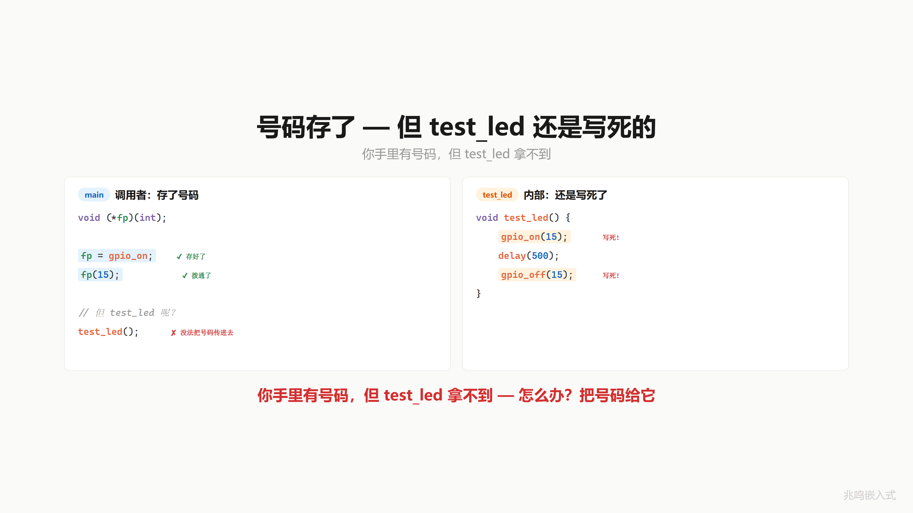
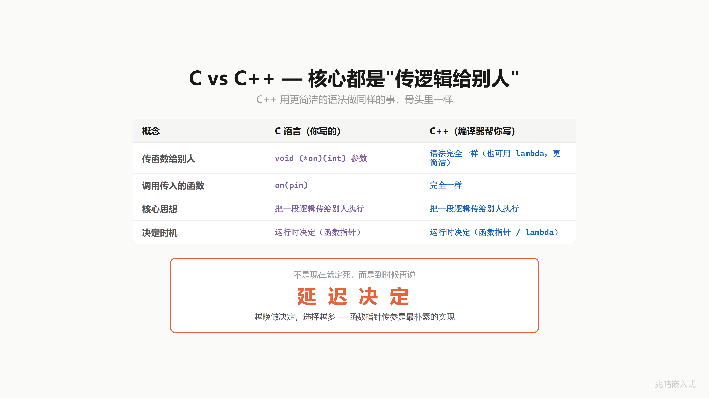

# 第 8 章 · 把号码给别人拨

配套代码：[`oop-in-c/code/08-callback/`](https://github.com/ZhaoChengBo/zhaoming-embedded/tree/master/oop-in-c/code/08-callback/)

## 8.1 一个真实场景

第 7 章你学会了用一个变量存函数地址，再通过这个变量调用：

```c
void (*fp)(int);
fp = gpio_on;
fp(15);
```

号码存好了，拨通了。但你写一个工具函数 `test_led`，里面要做"开 → 等 → 关"三步。这个函数应该不挑 LED：传谁进来都能跑完三步。

按当前的代码结构，`test_led` 内部还是写死的：

```c
void test_led() {
    gpio_on(15);     /* 写死 */
    delay(500);
    gpio_off(15);    /* 写死 */
}
```

你在外面有号码（`fp = gpio_on`），但 `test_led` 拿不到。`fp` 是 main 里的局部变量，`test_led` 看不见。每次都得你自己拨：先把号码存进 `fp`，再拿 `fp` 拨出去。

`test_led` 自己想拨号，怎么办？

把号码给它。



## 8.2 把号码传进去：函数指针当参数

函数指针是个变量。变量能不能当参数传给函数？当然能。`int` 能传，指针能传，函数指针当然也能传。

改造 `test_led` 的签名，加两个参数，分别是"开灯号码"和"关灯号码"：

```c
void test_led(void (*on)(int),    /* 开灯号码 */
              void (*off)(int),   /* 关灯号码 */
              int id)
{
    on(id);          /* 拨号: 不关心是谁 */
    delay(500);
    off(id);         /* 拨号: 不关心是谁 */
}
```

`test_led` 内部不写 `gpio_on`，不写 `pwm_on`，只管调 `on(id)` 和 `off(id)`。

它不认识 `gpio_on`，也不认识 `pwm_on`。但它不需要认识。号码是谁的？调用方告诉它。`test_led` 拿到一对函数指针 + 一个 `id`，照着拨就行。

第三个参数 `id` 是通用名。GPIO LED 用它当引脚号，PWM LED 用它当通道号，I2C LED 用它当设备地址。`test_led` 不关心这个数字代表什么，原封不动传给 `on(id)` 和 `off(id)`，号码自己解释。


## 8.3 三种 LED 都用同一个 test_led

有了 `test_led(on, off, id)`，你可以用同一个函数测三种 LED：

```c
test_led(gpio_on, gpio_off, 15);     /* GPIO LED, id=15 引脚号 */
test_led(pwm_on, pwm_off, 3);        /* PWM LED, id=3 通道号 */
test_led(i2c_on, i2c_off, 0x50);     /* I2C LED, id=0x50 设备地址 */
```

三种 LED，同一个 `test_led`，跑出三种不同的开关行为。`test_led` 自己一行不改，行为完全由调用方传进来的两个号码决定。换一种 LED 实现，换两个号码就行。

类比一下：你把号码写在纸条上，交给朋友（`test_led`），朋友照着纸条拨号就行。朋友不需要认识 `gpio_on` 是谁，拨通就行。号码对不对那是你的事。


## 8.4 编译时绑定 vs 运行时绑定

来看这个改造前后的本质变化。

**Before**：

```c
void test_led() {
    gpio_on(15);     /* 写死 */
    ...
    gpio_off(15);    /* 写死 */
}
```

`test_led` 函数体里写死了 `gpio_on`。编译器看到这一行，就知道要跳转到 `gpio_on` 那段机器码（通过链接器解析符号到地址）。**编译时**就定了"调谁"。要换？改源码，重新编译。

**After**：

```c
void test_led(void (*on)(int), void (*off)(int), int id) {
    on(id);          /* 调谁? 看入参 */
    ...
    off(id);
}
```

`test_led` 函数体里只调 `on(id)`。`on` 这个函数指针的值，编译器不知道。要等到 `test_led` 真的被调用、调用方把某个具体函数地址传进来，才知道要跳到哪段机器码。**运行时**才决定"调谁"。

软件工程里这两件事各有名字：

- **编译时绑定**（early binding / static binding）：函数地址在链接期就固定
- **运行时绑定**（late binding / dynamic binding）：函数地址在运行时才确定

写代码时不决定调谁，运行的时候再决定。这就是**延迟决定**。越晚做决定，选择越多。


## 8.5 这个东西叫什么

C++ 里这件事一字不改：

```cpp
void test_led(void (*on)(int), void (*off)(int), int id);
```

声明语法、传参语法、调用语法都和 C 完全一样。这是少数 C 和 C++ 没有区别的地方。C++ 后来加了 lambda 和 `std::function`，写法更简洁，骨子里还是同一件事：把一段逻辑传给别人执行。

回到刚才的延迟决定。这个机制视频里给了一句总结：**函数指针的本质是延迟决定，不是现在就定死，而是到时候再说**。写代码的时候不决定调谁，运行的时候再决定。

软件工程里，把函数指针当参数传给另一个函数、让被调函数在内部反过来调你给它的函数，这件事还有个名字。它叫**回调**（callback）。本章后面 8.7 节会展开一个具体的回调场景。




## 8.6 视频里没讲透的几个细节

### 8.6.1 函数指针参数的对齐和栈传递

ARM EABI 调用约定：函数指针作为参数和数据指针一样大（32 位 ARM 是 4 字节，64 位是 8 字节），通过 r0-r3 寄存器传递。如果参数太多溢出到栈上，按机器字对齐压栈。

`test_led(gpio_on, gpio_off, 15)` 这一调（按 EABI 入参顺序）：

- r0 = `gpio_on` 的地址
- r1 = `gpio_off` 的地址
- r2 = 15
- 函数体里 `on(id)` 编译成 `mov r0, r2` + `BLX r0`（实际上编译器会保留 r0 不动，从备份位置取）

完全没有任何额外开销。函数指针传参 ≈ 数据指针传参，参数槽都是一个机器字。

### 8.6.2 const 函数指针 vs 函数指针 const

```c
void test_led(void (* const on)(int),    /* on 这个指针变量是 const */
              void (*off)(int));
```

`const` 加在 `(*` 后面，说明 `on` 这个变量本身不能再被赋值。也就是函数体里不允许写 `on = pwm_on;` 之类。这种写法在工业代码里少见，因为参数本来就是临时变量，函数返回就回收。

更常用的 `const` 出现在结构体字段上，比如 `const struct led_ops *ops`，意思是"指向常量 ops 表的指针"，不允许通过这个指针改 ops 表的内容。这两个 `const` 的位置是 C 语法里最容易绕的地方，记住一条规则：`const` 修饰它右边的 token。

### 8.6.3 函数指针参数的 NULL 检查

```c
void test_led(void (*on)(int), void (*off)(int), int id)
{
    if (!on || !off)
        return;
    on(id);
    delay(500);
    off(id);
}
```

`on / off` 这两个函数指针 NULL check 必不可少。调用方传 NULL 进来，`on(id)` 就是跳到地址 0 执行：在 ARM Cortex-M 上跳到向量表起点的非代码区，结果是 HardFault；在 Linux 用户态收到 SIGSEGV，进程 core dump。

工业代码硬规则：**所有函数指针调用前都做 NULL check**。无论函数指针来自字段、参数还是注册表。

### 8.6.4 应用层视角 vs base 类视角

正文 8.2 / 8.3 节用的 `test_led(on, off, id)` 是**应用层简化视角**，第一个参数就是个 `int id`（GPIO 引脚号 / PWM 通道号 / I2C 地址）。这是视频里的教学版，让你看清"函数指针当参数"这个动作本身。

本章配套代码包用的是**工业版**：

```c
int test_led(struct led_base *me,
             int (*on)(struct led_base *me),
             int (*off)(struct led_base *me));
```

第一个参数是 `struct led_base *me`，函数指针的签名也接 `me`。这样 `on / off` 实现内部能访问 base 的字段（`name / is_on`）打日志、维护状态。

两种写法本质一样：都是"函数指针当参数"。只是工业版让被调函数能看到对象身份，比裸的 `int id` 表达力强一截。第 6 章引入了继承结构后，工业代码默认就用 base 指针视角。

跑代码包看到的是工业版，正文教学走的是简化版。中间这层"应用层 → base 视角"的升级，本章配套代码可以一边对照一边读。

## 8.7 一个具体场景：给 LED 注册回调

把"函数指针当参数"再往前走一步，可以做出一种工业代码里非常常见的机制：**回调注册**。

主线场景反过来：不是应用层写一个 `test_led` 主动调函数指针，而是底层 driver 留一个"通知接口"，应用层把自己的函数地址登记进去，driver 在状态变化时**自动**调一下这个登记的函数。

具体例子：你的应用层关心 LED 状态变化。每次 `led_on / led_off` 后想自动做一些事：

- 主控板把 LED 状态发到 CAN 总线给上位机
- 调试时把 LED 状态打到 UART 日志
- 测试夹具记录开关次数

`led.c` 不应该知道这些事。`led.c` 只管开关 LED。但应用层想被通知。

driver 提供一个注册接口：

```c
typedef void (*led_state_cb)(struct led_base *me, bool new_state);

int led_register_state_cb(struct led_base *me, led_state_cb cb);
```

`typedef` 给函数指针类型起短名字 `led_state_cb`，让接口签名读着舒服。typedef 的细节下一章会展开。

应用层注册自己的函数：

```c
static void log_state_change(struct led_base *me, bool new_state)
{
    printf("LED %s became %s\n", me->name,
           new_state ? "ON" : "OFF");
}

led_register_state_cb(&red_led.base, log_state_change);

/* 后面任何一次 led_on / led_off, log_state_change 都会被自动调到 */
```

`led.c` 内部 `led_on / led_off` 状态翻转完之后调一下这个登记的函数指针：

```c
int led_on(struct led_base *me)
{
    me->is_on = true;
    /* ... 实际硬件操作 ... */

    if (me->on_state_change)             /* 登记过就调 */
        me->on_state_change(me, true);
    return 0;
}
```

`led.c` 不知道有人在监听。它只调它存好的函数指针。监听方是谁、它要做什么，`led.c` 一无所知。

撤销也简单：注册接口接受 NULL 表示撤销。

```c
led_register_state_cb(&red_led.base, NULL);
/* 之后 led_on / led_off 内部 if (cb) 那一行不进, 回调不再触发 */
```

应用层模块卸载前应当撤销自己注册过的回调，避免 driver 后续触发时跳到野地址。

回调本质上还是"函数指针当参数"：参数不再是 `test_led` 的入参，而是 `led_register_state_cb` 这个注册函数的入参。一次注册，driver 把这个函数指针存进 base 字段，运行期反复调。

## 8.8 你现在的代码在 STM32 上长什么样

STM32 端胶水还是 ch01 那套（节选自 [`oop-in-c/code/08-callback/stm32-snippet/led_stm32.c`](https://github.com/ZhaoChengBo/zhaoming-embedded/tree/master/oop-in-c/code/08-callback/stm32-snippet/led_stm32.c)）：

```c
void platform_gpio_write(uint8_t pin, bool value)
{
    HAL_GPIO_WritePin(GPIOA, (uint16_t)(1U << pin),
                      value ? GPIO_PIN_SET : GPIO_PIN_RESET);
}
```

`led.h / led.c / main.c` 一字不改。

一个真实场景：主控板每次开关 LED 都要把状态发到 CAN 总线给上位机看。注册一个回调：

```c
static void can_log(struct led_base *me, bool new_state)
{
    can_send_named(me->name, new_state ? 1 : 0);
}

led_register_state_cb(&red_led.base, can_log);
```

之后 `led_on / led_off` 自动把状态发到 CAN。`led.c` 不知道 CAN 存在，CAN 模块也不知道 LED 存在。中间靠这个 callback 字段连接。

本节用的还是函数式包装的 platform 抽象层，是教学简化版。第 11 章后会改成 ops 表式。

## 8.9 你现在的代码在 Linux 用户态长什么样

Linux 端 sysfs 实现（节选自 [`oop-in-c/code/08-callback/linux-snippet/led_linux.c`](https://github.com/ZhaoChengBo/zhaoming-embedded/tree/master/oop-in-c/code/08-callback/linux-snippet/led_linux.c)）：

```c
void platform_gpio_write(uint8_t pin, bool value)
{
    char path[64];
    int fd;

    snprintf(path, sizeof(path),
             "/sys/class/gpio/gpio%u/value", (unsigned)pin);
    fd = open(path, O_WRONLY);
    if (fd >= 0) {
        write(fd, value ? "1" : "0", 1);
        close(fd);
    }
}
```

`led.h / led.c / main.c` 一字不改。同 8.8 节，platform 层是教学简化版，第 11 章后会演化成 ops 表式。

## 8.10 工业代码里的回调系统

工业控制板项目里，所有 driver 都有一组事件回调字段。这一节只贴跟"回调字段"相关的部分，工业版 `led_base` 的完整字段集（含 `ops` 指针、`flags` 等）见 ch01 1.10 节、ch10 10.11 节、ch11 11.9 节：

```c
struct led_base {
    /* 跟回调相关的字段 (本节焦点) */
    const char *name;
    bool        is_on;
    void (*on_state_change)(struct led_base *me, bool new_state);
    void (*on_fault)(struct led_base *me, int err_code);
    /* ... 其他工业字段见 ch01 1.10 / ch10 10.11 / ch11 11.9 */
};
```

主控板的初始化期把这些字段填上：

```c
red_led->on_state_change = main_log_led_state;
red_led->on_fault = main_handle_led_fault;
```

之后 `led.c` 内部所有状态改变 / 错误都通过这两个字段反向通知主控板。`led.c` 是设备驱动，主控板是应用层。两边谁都不直接 include 对方的头文件，靠这两个回调字段解耦。

这种"驱动里挂回调字段"的写法，第 9 章会进一步演化：把所有可变行为打包进一张 ops 表，整个表挂到 base 字段里。

## 8.11 跑一遍

```bash
cd oop-in-c/code/08-callback/pc
make
./demo
```

输出节选：

```
--- test_led(&red_led.base, pull_high, gpio_off) ---
  [test] open ...
  [GPIO] Pin13 ON (pull_high)
  [test] hold ...
  [test] close ...
  [GPIO] Pin13 OFF

--- Register state callback for red_led ---
  [base] "red" state callback registered

--- Toggle red_led, callback should fire ---
  [GPIO] Pin13 ON (pull_high)
    !! callback: "red" became ON
  [GPIO] Pin13 OFF
    !! callback: "red" became OFF
```

第一段：`test_led` 不挑 LED，传不同函数指针进去就跑出不同行为。第二段：注册回调后，`led_on / led_off` 会自动调一下回调通知应用层。

完整源码见 [`oop-in-c/code/08-callback/`](https://github.com/ZhaoChengBo/zhaoming-embedded/tree/master/oop-in-c/code/08-callback/)。

## 8.12 视频回放

想听口播版的可以看 B 站这一期视频：

> [《C 语言·函数指针传参｜把号码给别人拨·延迟决定》](https://www.bilibili.com/video/BV1ysdWBUEQA/)

视频里这一期叫"把号码给别人拨"。给的号码（函数指针）让别人（test_led 或 LED 自己）按时机帮你拨号。号码不是你自己拨的，是别人代你拨的。

视频金句：**函数指针的本质是延迟决定，不是现在就定死，而是到时候再说**。越晚做决定，选择越多。

## 下一章

`test_led(on, off, id)` 三个参数还行。但如果还要加 `set_brightness, get_state, get_name`、`toggle, blink, pulse`，参数列表就会长到换行。

更大的问题：`on` 和 `off` 类型一模一样（都是 `void (*)(int)`），调用方传反一个，编译器看不出来。开关搞反了，灯该亮的时候灭、该灭的时候亮，调一下午才发现是参数顺序反了。

把它们打包进一个 struct，加个名字索引：`ops->on / ops->off`。下一章。

下一篇：[第 9 章 · 参数长到换行](09-ops操作表.md)
