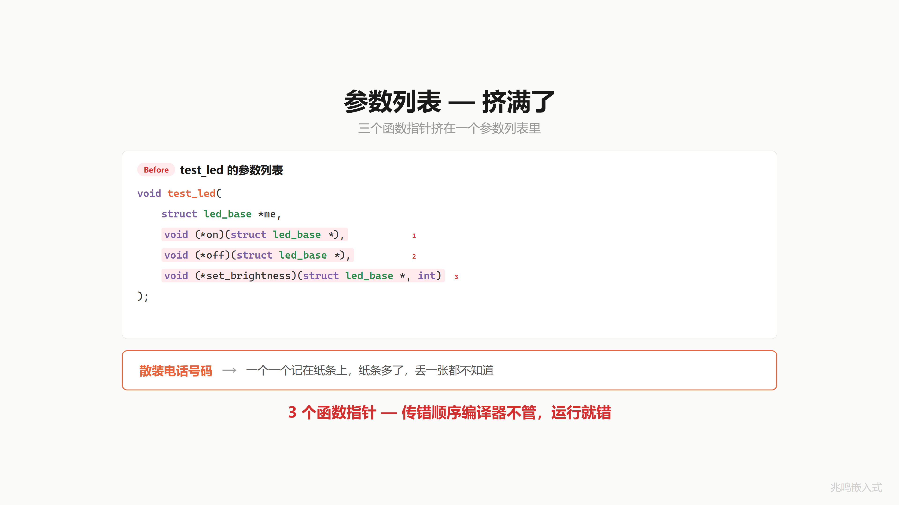
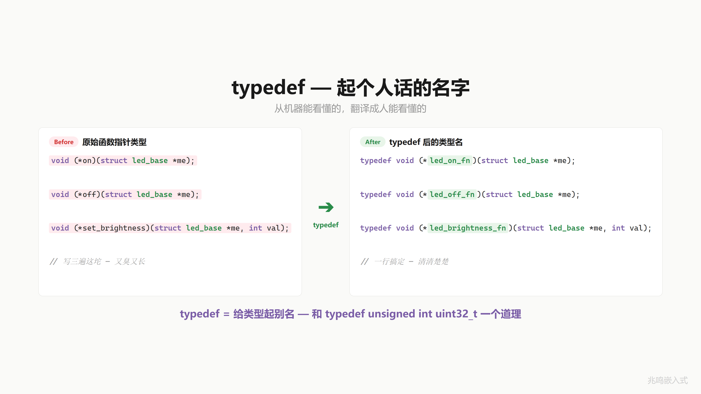
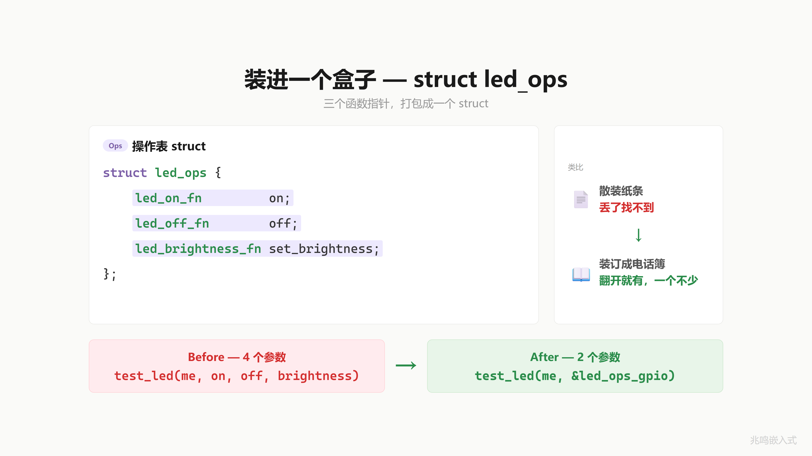

# 第 9 章 · 参数长到换行 · ops 操作表

配套代码：[`oop-in-c/code/09-ops-table/`](https://github.com/ZhaoChengBo/zhaoming-embedded/tree/master/oop-in-c/code/09-ops-table/)

## 9.1 一个真实场景

第 8 章我们用 `void (*on)(int)` 演示了函数指针当参数。第三个参数 `int id` 是通用名，够看清"延迟决定"这件事本身。

但现实里 LED 不只是个 int。第 6 章你已经把 LED 写成 base + 子类的结构（`struct led_base + struct led_gpio` / `struct led_pwm` 等）。一个真正的 `test_led` 应该接 `struct led_base *`，这样函数指针签名也跟着变成 `int (*)(struct led_base *)`。能拿到对象身份，能打日志，能维护状态，每个动作还能返回错码。

升级一下 `test_led`：

```c
int test_led(struct led_base *me,
             int (*on)(struct led_base *),
             int (*off)(struct led_base *),
             int (*toggle)(struct led_base *));
```

一个 `me` 指针，三个函数指针，四个参数挤在一起。问题来了。

第一个问题，长。声明换两次行才写得下，调用一次写五行：

```c
test_led(&red_led.base,
         gpio_on,
         gpio_off,
         gpio_toggle);
```

第二个问题，更要命。`on / off / toggle` 这三个函数指针的类型完全一样，都是 `int (*)(struct led_base *)`。如果调用方手抖把 `on` 和 `off` 顺序传反：

```c
test_led(&red_led.base,
         gpio_off,         /* 这里本来该传 on */
         gpio_on,          /* 这里本来该传 off */
         gpio_toggle);
```

编译器看不出来。类型对就放行。运行起来，开灯调到了 off 函数，关灯调到了 on 函数。该亮的时候灭，该灭的时候亮。这种 bug 能查一下午。

散装的电话号码摊了一桌子。纸条多了，丢一张都不知道。



## 9.2 typedef 起短名

第一步先解决"类型声明又臭又长"这件事。

```c
int (*on)(struct led_base *me);
int (*off)(struct led_base *me);
int (*toggle)(struct led_base *me);
```

每个函数指针的类型字面量都要写一坨 `int (*)(struct led_base *)`。写一次能看懂，写第三次看着累。一周后自己看，想半天。

注意函数指针返回 `int` 不是 `void`：每个 op 都能报错（NULL check 失败、硬件不响应、参数越界），调用方拿一个 0/-1 就能判断成败。工业代码里函数指针几乎都是返回 `int`。

C 语言里有个工具叫 `typedef`，给类型起一个别名：

```c
typedef int (*led_action_fn)(struct led_base *me);
```

ops 表里 `on / off / toggle` 三个字段类型完全一样，都是"接 `struct led_base *`、返回 `int`"。一个 typedef 名字就够，叫 `led_action_fn`，意思是 LED 上的一个动作。三个字段共用同一个类型名，ops 表写出来字段对得齐。

这之后 `led_action_fn fp;` 等价于 `int (*fp)(struct led_base *me);`，但读起来短一截。和你早就在用的 `typedef unsigned int uint32_t` 是同一个语法、同一个用途：给一个长得难读的类型起一个短名字。

`typedef` 在 ch01 1.7.3 节讲 `typedef struct` 时提过，Linus 反对的是那种"藏类型信息"的滥用（写 `typedef struct foo {} foo_t;` 让你看 `foo_t` 不知道是 struct）。函数指针 typedef 是少数 Linus 也支持的 typedef 例外：原始类型字面量太长，起短名是纯收益。Linux 内核的 `struct file_operations` 字段类型就是这么 typedef 一遍的。

注意 `typedef` 本身不分配存储、不生成代码、不引入新类型，只是给已有类型起别名。编译完字节码里看不出有过 typedef。

写代码也需要翻译，从机器能看懂的，翻译成人能看懂的。



## 9.3 装进一个盒子：struct led_ops

名字起好了，下一步把这一组函数指针装进一个盒子。

观察一件事：`on / off / toggle` 是一组绑死的东西。它们一起描述了"一种 LED 的所有行为"。GPIO 风格 LED 这一组，PWM 风格 LED 那一组。一组绑死的东西打包，C 里的工具就是 struct：

```c
struct led_ops {
    led_action_fn on;
    led_action_fn off;
    led_action_fn toggle;
};
```

一个 struct，三个函数指针字段，每个字段一个名字。这就是**操作表**（ops table）。

`test_led` 现在接 ops 指针：

```c
int test_led(struct led_base *me, const struct led_ops *ops);
```

`test_led` 自身也返回 `int`：调用 ops 表里任何一个动作失败就把错码往上抛，应用层一看返回值就知道这一轮跑没跑成。

调用方填好一张表，传进去：

```c
const struct led_ops led_ops_gpio = {
    .on     = gpio_on,
    .off    = gpio_off,
    .toggle = gpio_toggle,
};

test_led(&red_led.base, &led_ops_gpio);
```

参数列表从 4 个塞回 2 个。`test_led` 内部按名字访问：`ops->on` 永远是 on，`ops->off` 永远是 off。不可能传反。编译器在初始化 `led_ops_gpio` 时帮你对每个 `.字段名` 检查类型对不对（不对就编译报错）。

以前是三个散装电话号码，现在装订成一本电话簿。散装号码丢了找不到。电话簿，翻开就有，一个不少。

注意 ops 表里只装"做法不同"的行为。`on / off / toggle` 这种每种 LED 实现都不一样的（GPIO 拉电平、PWM 配占空比、I2C 写命令），才需要做成函数指针让运行时绑定。`get_name`、`get_state` 这种只是读父类字段的函数不用进 ops 表，沿用 ch06 引入的 `led_base_get_name(&xxx.base)` 直接读 base 数据就行。**做法不同的进 ops 表，读数据的不进**。



## 9.4 这个东西叫什么

把一组相关的函数指针打包进一个 struct，让别人通过表名按名访问。这件事在软件工程里有个名字。

它叫**操作表**（ops table）。Linux 内核源码里把这种 struct 都叫 `xxx_ops`：`file_operations`、`net_device_ops`、`gpio_chip` 里的回调集，都是 ops 表。

C++ 里换成你写：

```cpp
class led_base {
public:
    virtual int on() = 0;
    virtual int off() = 0;
    virtual int toggle() = 0;
};

class led_gpio : public led_base { ... };
class led_pwm  : public led_base { ... };
```

带 `virtual` 函数的 class，C++ 编译器在背后做三件事：

1. **生成一张函数指针表**。每个 class 一张。`led_gpio` 的表里 `.on` 指向 `led_gpio::on`，`led_pwm` 的表里 `.on` 指向 `led_pwm::on`。
2. **在每个对象里偷偷加一个指针**，指向自己 class 的那张表。
3. **调用时通过这个指针查表**，找到对的函数跳过去。

你这一章亲手做了第一步：手写了 `struct led_ops` 这张表，并填了 `led_ops_gpio` / `led_ops_pwm` 两张实例。后两步留给后面章节。

C++ 管这张表叫 **vtable**，虚函数表。

视频的金句版总结：**结构化不是束缚，是让混乱变得可管理**。散装号码会丢，电话簿不会。


## 9.5 视频里没讲透的几个细节

### 9.5.1 designated initializer 是 C99 的礼物

```c
const struct led_ops led_ops_gpio = {
    .on     = gpio_on,
    .off    = gpio_off,
    .toggle = gpio_toggle,
};
```

这种 `.字段名 = 值` 的写法叫 designated initializer，C99 引入。好处三条：

1. **不依赖字段顺序**。哪天 struct 里调换字段顺序，已有 ops 表代码不用改。
2. **可读性好**。不用数到第几个字段。
3. **未列出的字段自动初始化为 0 或 NULL**（C99 标准 6.7.8 节第 21 段）。这条对 ops 表特别有用：某种 LED 不支持的行为可以不填，调用方做 NULL check 即可。

C89 没有这个语法，只能按字段顺序填：

```c
const struct led_ops led_ops_gpio = {
    gpio_on,                  /* on */
    gpio_off,                 /* off */
    gpio_toggle,              /* toggle */
};
```

字段顺序一变就全乱。Linux 内核早期代码很多这种"按位置 init"，后期重构都改成了 designated initializer。本书一律用 designated 写法。

### 9.5.2 ops 表里某些字段不填怎么办

哪天往 `struct led_ops` 里加一个新字段，比如 `set_brightness`，让支持调光的 LED 用。GPIO LED 硬件上没有调光能力，PWM LED 才有。GPIO 那张 ops 表填到 `set_brightness` 时干脆不写：

```c
const struct led_ops led_ops_gpio = {
    .on     = gpio_on,
    .off    = gpio_off,
    .toggle = gpio_toggle,
    /* set_brightness 不填, designated initializer 自动置 NULL */
};
```

调用方就得在用之前做 NULL check：

```c
if (ops->set_brightness)
    ops->set_brightness(me, 50);
else
    printf("This LED doesn't support brightness control\n");
```

NULL check 这件事，工业代码里函数指针调用前几乎都做。本章配套代码 `test_led` 入口处对 `on / off / toggle` 三个字段都跑了 NULL check（`led.c:143`），就是这个习惯。指针来源（字段、参数、全局都算）不重要，重要的是用之前查一次。

### 9.5.3 ops 表为什么是 const

ops 表通常加 `const` 修饰：

```c
const struct led_ops led_ops_gpio = { ... };
```

`const` 这一层有三件事在背后发生：

1. **链接时进 `.rodata` 段**。MCU 上烧到 Flash 上，零 RAM 占用。
2. **运行时只读**。试图改 `led_ops_gpio.on = some_other_fn` 直接 SIGSEGV（Linux）或 HardFault（MCU）。这一层防御工业代码视为硬要求，防止运行时把字段改成野指针。
3. **共享**。100 颗同类型 LED 共享同一张 12 字节的 ops 表，不每颗一份。

`extern` 暴露给用户，调用方拿 `&led_ops_gpio` 就是 ops 表的地址：

```c
/* led.h */
extern const struct led_ops led_ops_gpio;
extern const struct led_ops led_ops_pwm;
```

### 9.5.4 typedef 的命名风格

工程上函数指针 typedef 的命名见过几种：

| 风格 | 例子 | 出处 |
|---|---|---|
| 小写 `_fn` 后缀 | `led_action_fn` | Linux 内核（`request_threaded_irq` 的 `irq_handler_t`） |
| 小写 `_t` 后缀 | `led_action_t` | POSIX 习惯（`pthread_handler_t`） |
| 驼峰 `Func` 后缀 | `LedActionFunc` | Win32 / Qt |

本书统一用 `_fn` 后缀，和 Linux 内核驱动模型一致。一个项目里挑一种用到底就行，最忌讳同一份代码三种风格混用。

### 9.5.5 struct 名字小写 vs 大写 typedef

ops 表的 struct 名字也有两派：

```c
struct led_ops {            /* Linux 内核风格, 小写带前缀 */
    led_action_fn on;
    /* ... */
};

typedef struct {            /* 早期 C 风格, 大写驼峰 */
    led_action_fn on;
    /* ... */
} LedOps_t;
```

本书用 `struct led_ops` 的写法，和 ch01 已经定下的"struct 名字小写、不藏类型信息"风格一致。Linus 在内核编码风格文档里反对的就是 `LedOps_t` 这种 typedef。读到 `LedOps_t` 不知道它是 struct 还是基本类型，要去翻定义。`struct led_ops` 写出来就明白。

### 9.5.6 视频版与配套代码版的三处差异

差异原则详见 preface「配套代码 vs 视频版」。下面是本章具体差异。

视频 EP14 演示用的 ops 表设计是这样：

- typedef 三个不同名字：`led_on_fn / led_off_fn / led_brightness_fn`，都返回 `void`
- struct 字段：`on / off / set_brightness`（最后一个接 `int val` 调亮度）

本章配套代码 [`oop-in-c/code/09-ops-table/`](https://github.com/ZhaoChengBo/zhaoming-embedded/tree/master/oop-in-c/code/09-ops-table/) 用的是另一种风格：

```c
typedef int (*led_action_fn)(struct led_base *me);

struct led_ops {
    led_action_fn on;
    led_action_fn off;
    led_action_fn toggle;
};
```

三处差异：typedef 名 / 返回类型 / 字段名。两边讲的是同一件事，函数指针装进同一张表，按名字访问。差异在于：

1. **统一 typedef vs 多个 typedef**。配套代码用单一 `led_action_fn`，让 ops 表的字段类型完全一致，跨章节代码包从 ch09 到 ch15 共享同一个签名，读者跟着改增量看得清楚。视频用三个不同 typedef 是教学上更直观（每种操作有自己的类型名），适合短视频展示。
2. **返回 int vs 返回 void**。配套代码返回 `int`，每个 op 都能报错（NULL check 失败、硬件不响应、参数越界），更接近工业代码。视频用 `void` 是教学简化。
3. **toggle vs set_brightness**。`toggle` 在 PC 上跑得出"开关来回切换"的可视效果，`set_brightness` 在 PC 上没法可视化亮度变化。代码包用 `toggle` 让 demo 能看出区别。

跑代码以代码包为准，看视频以视频画面为准，两边讲的是同一个机制。

## 9.6 你现在的代码在 STM32 上长什么样

STM32 端胶水还是 ch01 那套。`led_base.h / led_base.c / led.h / led.c / main.c` 一字不改。

ops 表 `led_ops_gpio / led_ops_pwm` 编译后进 `.rodata` 段，烧到 Flash 上。运行时常驻，所有 GPIO 类 LED 共享同一份 12 字节的 ops 表：

```
/* 真实芯片 .map 文件里能看到 */
.rodata
  ...
  led_ops_gpio        0x08001234  12
  led_ops_pwm         0x08001240  12
```

100 颗 LED 仅有 24 字节 ops 表代价。每颗 LED 自己的 struct 实例（在 `.bss` 或栈上）和这张 ops 表无关。

本节用的还是函数式包装的 platform 抽象层（`platform_gpio_write(pin, value)` 这种独立函数），是教学简化版。真正工业级的 platform 抽象用 ops 表的形式。后面章节会把 platform 层从函数式重构成 ops 表式，和工业代码对齐。

## 9.7 你现在的代码在 Linux 用户态长什么样

Linux 端的 ops 表完全一样的写法。`gcc / clang` 把 `const struct` 放到 `.rodata`，进程加载时在虚拟内存里只读映射，全进程共享。

`led_base.h / led_base.c / led.h / led.c / main.c` 一字不改。同 9.6 节 STM32 端，platform 层是教学简化版，第 16 章会把 platform 层从函数式升级成 ops 表式（gpio_chip 子系统）。

## 9.8 工业代码里的 ops 表

工业控制板项目里，每个驱动都有一张 ops 表。LED 驱动这样：

```c
/* drivers/led/led.h */
struct led_base;

struct led_ops {
    int (*on)(struct led_base *me);
    int (*off)(struct led_base *me);
    int (*toggle)(struct led_base *me);
};

/* drivers/led/led_gpio.c */
const struct led_ops led_ops_gpio = {
    .on     = led_gpio_on,
    .off    = led_gpio_off,
    .toggle = led_gpio_toggle,
};
```

注意 ops 表里函数指针的参数是 `struct led_base *`，不是某个具体子类。所有子类的 ops 表必须类型一致。

EEPROM、风扇、蜂鸣器、按键这些 driver 的 ops 表结构各不相同，但写法都是这一套：定义 ops struct，每种实现 fill 一张 const ops 表，外部传一张表进去就跑对应的实现。

这就是 Linux 内核 `struct file_operations` 的 OOP 骨架。你这一章亲手推了一遍。

## 9.9 跑一遍

```bash
cd oop-in-c/code/09-ops-table/pc
make
./demo
```

输出节选：

```
========================================
  ops table: pack action pointers as struct.
  test_led takes one ops pointer.
========================================

--- test_led(&red_led.base, &led_ops_gpio) ---
  [test] open ...
[GPIO] Pin13 -> HIGH (ON)
  [GPIO] "red" ON
  [test] toggle ...
[GPIO] Pin13 -> LOW (OFF)
  [GPIO] "red" OFF
  [test] close ...
[GPIO] Pin13 -> LOW (OFF)
  [GPIO] "red" OFF

--- test_led(&blue_led.base, &led_ops_pwm) ---
  [test] open ...
  [PWM] "blue" ON  (channel 1, duty=70)
  [test] toggle ...
  [PWM] "blue" OFF (channel 1)
  [test] close ...
  [PWM] "blue" OFF (channel 1)
```

`test_led` 函数体没改。换一张 ops 表，跑出完全不同的行为。

完整源码见 [`oop-in-c/code/09-ops-table/`](https://github.com/ZhaoChengBo/zhaoming-embedded/tree/master/oop-in-c/code/09-ops-table/)。

## 9.10 视频回放

想听口播版的可以看 B 站这一期视频：

> [《C 语言·ops 操作表｜参数长到换行·虚函数表》](https://www.bilibili.com/video/BV1iLdrBUEvf/)


视频里这一期叫"散装电话号码 → 电话簿"。散装函数指针绑成一组共享名字的"号码本"，按名取号永远不会取错。

视频金句：**结构化不是束缚，是让混乱变得可管理**。散装号码会丢，电话簿不会。

## 下一章

ops 表手里捏着，但应用层还得**主动**把它传进去。每次都要：

```c
test_led(&red_led.base, &led_ops_gpio);
test_led(&blue_led.base, &led_ops_pwm);
```

应用层得记住每颗 LED 该用哪张表。一旦传错，又是 bug。

这本电话簿独立存在，跟 LED 对象没绑在一起。能不能让每颗 LED 自己带着自己的电话簿？应用层只传 LED 自己，电话簿 LED 自己知道。

下一篇：[第 10 章 · ops 放进对象](10-ops放进对象.md)
