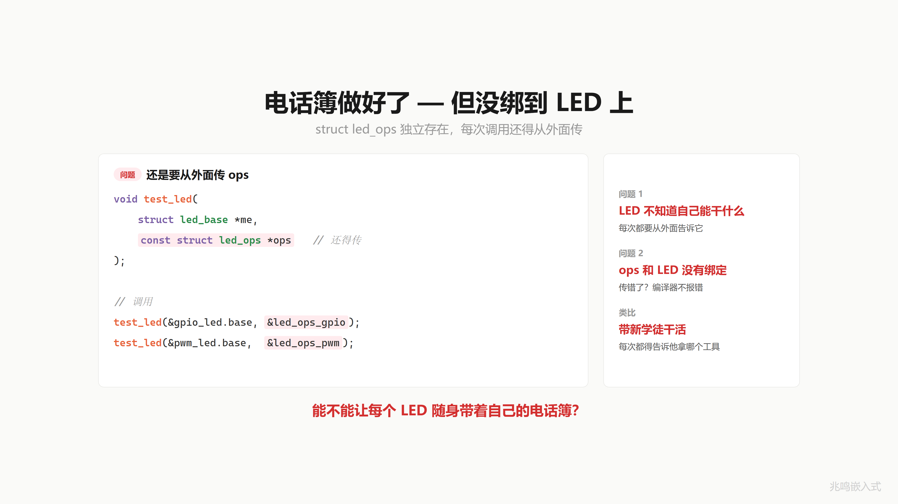
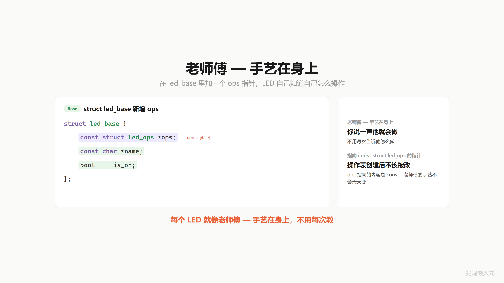
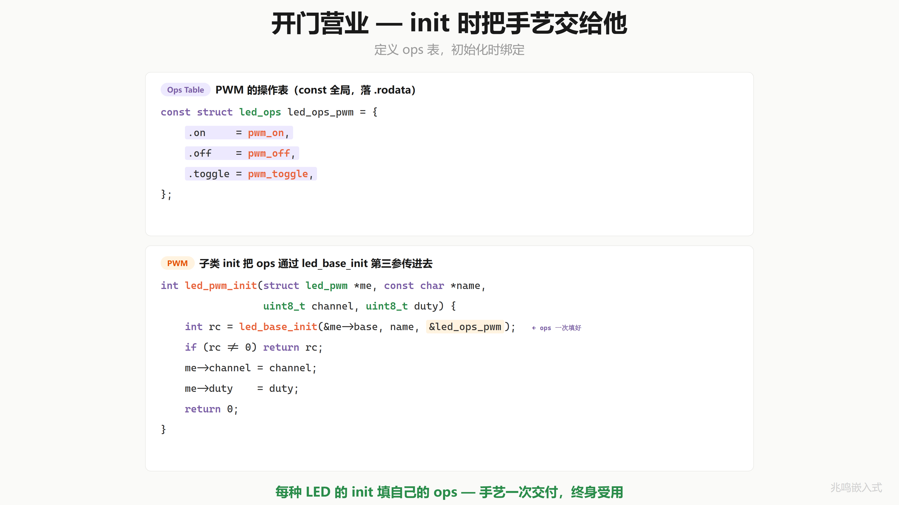
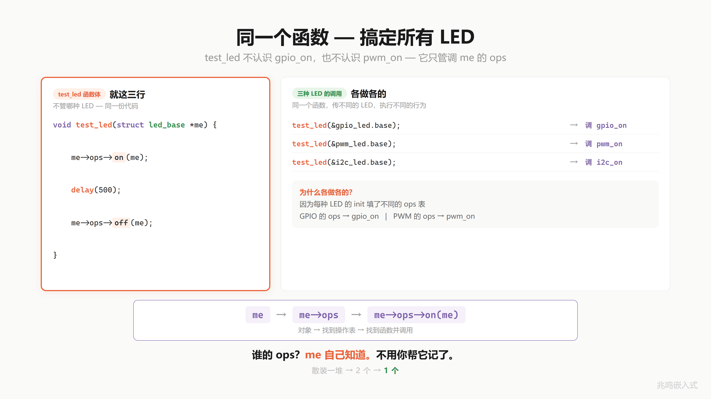

# 第 10 章 · ops 放进对象 · vptr 落地

配套代码：[`oop-in-c/code/10-vptr/`](https://github.com/ZhaoChengBo/zhaoming-embedded/tree/master/oop-in-c/code/10-vptr/)

第 9 章你把 3 个函数指针装进了 `struct led_ops` 一张电话簿。问题是这本电话簿独立存在。每次调 `test_led` 还得从外面把电话簿传进去。LED 自己不知道自己用哪本电话簿。

这一章让每个 LED 把自己的电话簿揣身上。

## 10.1 一个真实场景

ch09 末尾的 `test_led` 长这样：

```c
void test_led(struct led_base *me, const struct led_ops *ops);
```

调用方每次都得自己传 ops：

```c
test_led(&red_led.base,   &led_ops_gpio);
test_led(&blue_led.base,  &led_ops_pwm);
test_led(&green_led.base, &led_ops_i2c);
```

应用层得记住"红灯用 gpio 表、蓝灯用 pwm 表、绿灯用 i2c 表"。一旦记错或者传错，又是一颗 bug：

```c
test_led(&red_led.base, &led_ops_pwm);   /* 红灯走了 PWM 表, 全乱 */
```

更别说哪天加第四种 LED，每个调用点都得改一遍。

LED 自己不知道自己能干什么。每次都要从外面告诉它。这不叫写代码，这叫当保姆。

就像你带新学徒。让他干活，你还得每次告诉他"拿这个扳手""用那把钳子"。他脑子里没有。

能不能换个老师傅？你说一声"修这个"，他自己就知道怎么下手。



## 10.2 让 LED 自己带着 ops 表

解法很直接。在 `struct led_base` 里加一个成员，指向操作表：

```c
struct led_base {
	const struct led_ops *ops;     /* 自己带着, 第一个字段 */
	const char           *name;
	bool                  is_on;
};
```

注意是 `const struct led_ops *`（指向常量 `led_ops` 的指针）。表本身在 init 之后不该被改。老师傅的手艺不是今天一套明天一套，定下来就定下来了。

每个 LED 现在就像老师傅一样，手艺在身上。你说一声"开灯"，它自己就知道怎么点亮，不用你每次告诉它。

`ops` 字段放在 `struct led_base` 而不是放进每种子类（`struct led_gpio` / `struct led_pwm`）。这是关键。放在子类里，每种子类都得自己加一遍 ops 字段。放在 `struct led_base` 里，所有继承了 base 的子类自动都有这个字段。

`ops` 在 `led_base` 里放第一个位置。`name` 和 `is_on` 退到后面。Linux 内核 / Zephyr / GObject 都把"指向函数表的指针"放在 base 第一个。这是世界标准。本章先记住这个约定，第 11 章会用到这个布局。



## 10.3 init 时把 ops 填进去

ops 字段什么时候填？开门营业的时候，也就是 init。

先准备一张 const ops 表：

```c
const struct led_ops led_ops_gpio = {
	.on     = gpio_on,
	.off    = gpio_off,
	.toggle = gpio_toggle,
};
```

然后子类的 init 把这张表的地址传给父类 init：

```c
int led_base_init(struct led_base *me, const char *name,
                  const struct led_ops *ops)
{
	if (!me || !name || !ops)
		return -1;

	me->ops  = ops;
	me->name = name;
	me->is_on = false;
	return 0;
}

int led_gpio_init(struct led_gpio *me, const char *name, uint8_t pin)
{
	int rc = led_base_init(&me->base, name, &led_ops_gpio);
	if (rc != 0)
		return rc;
	me->pin = pin;
	platform_gpio_init(pin, GPIO_MODE_OUTPUT);
	platform_gpio_write(pin, false);
	return 0;
}

int led_pwm_init(struct led_pwm *me, const char *name,
                 uint8_t channel, uint8_t duty)
{
	int rc = led_base_init(&me->base, name, &led_ops_pwm);
	if (rc != 0)
		return rc;
	me->channel = channel;
	me->duty = duty;
	return 0;
}
```

每种子类的 init 把"我用哪张 ops 表"作为常量传给父类 init。父类 init 把它存到 `me->ops` 字段。一次填好，对象一辈子不用再改 ops。

GPIO 灯的 init 填 GPIO 的 ops 表，PWM 灯的 init 填 PWM 的 ops 表。各填各的，互不干扰。

init 就是开门营业。手艺一次交付，终身受用。



## 10.4 应用层的新样子

ops 已经在每颗 LED 身上了。应用层调用不再需要从外面传 ops 表，直接从 LED 自己身上拿：

```c
me->ops->on(me);
me->ops->off(me);
```

通过 `me` 找到 `me->ops`，再从 ops 里找到对应的函数指针调出去。换不同的 LED，`me` 不同，`me->ops` 自动指向对的那张表，落到对的实现。

应用层的调用点变成：

```c
struct led_base *red   = &gpio_led.base;
struct led_base *blue  = &pwm_led.base;
struct led_base *green = &i2c_led.base;

red->ops->on(red);     /* 走 gpio_on */
blue->ops->on(blue);   /* 走 pwm_on  */
green->ops->on(green); /* 走 i2c_on  */
```

每次都得自己写 `me->ops->on(me)` 这一长串。下一章会把它包成一个统一接口 `led_on(me)`，应用层不再写两次跳转，只调一个名字。

一路走来，调用方传给灯的参数从散装一堆，到 ch09 打包成两个，现在一个就够：只要 `me`，ops 表自己跟着。



## 10.5 这个东西叫什么

每个对象自带一个指针，指向一张属于自己类型的函数表。调用时通过这个指针找到表，再从表里找到具体函数。

C++ 里这个指针叫 **vptr**（virtual table pointer，虚表指针）。带 `virtual` 函数的类，每一个对象都被编译器偷偷加了这么一个指针。没有 virtual 函数的普通类，编译器不加，不浪费内存。

你刚才在 C 里手动做的事，就是 C++ 编译器看到 `class { virtual ... }` 时偷偷做的事。三件事：

| 步骤 | C++ 编译器 | 你在 C 里做的 |
|---|---|---|
| 1. 生成函数指针表 | 为每个 virtual 类生成一张 vtable，存所有虚函数地址 | 第 9 章·`struct led_ops` + `led_ops_gpio` 这张表 |
| 2. 在对象里加指针 | 每个 virtual 类对象藏一个指向 vtable 的指针 | 第 10 章·`struct led_base` 加 `ops` 字段（就是 vptr） |
| 3. 调用时通过指针查表 | 把 `obj.f()` 编译成"查指针、查表、调函数" | 下一章 |

第一件事做了。今天做了第二件事。第三件留给下一章。

C++ 还做了一件 C 没做的事：**自动判断**对象有没有 virtual 函数。没有的话不加这个指针，省一份对象内存。C 里你写不写 ops 字段是手动决定的。


## 10.6 视频里没讲透的几个细节

### 10.6.1 const 在 led_ops 前还是 `*` 后·语义反过来

新人看到下面这两行常分不清：

```c
const struct led_ops *ops;       /* 工业代码这么写 */
struct led_ops * const ops;      /* 含义反过来 */
```

差一个 `const` 的位置，能干的事和不能干的事调换。下面给两个记忆心法和一张速查表，看完不再被 const 卡住。

**心法 1·const 紧贴谁，就锁谁。** `const` 这个关键字看它紧贴的是哪个词：紧贴类型 `struct led_ops`，锁的是"指向的内容"（不能改 `me->ops->on = ...`）；紧贴 `*`，锁的是"指针自己"（不能改 `me->ops = ...`）。

```c
const struct led_ops *ops;       /* const 紧贴 led_ops, 锁内容 */
struct led_ops * const ops;      /* const 紧贴 *, 锁指针 */
```

看一眼 `const` 写在哪个词旁边，就知道锁的是哪一边。

**心法 2·在 `*` 处画一刀。** 把声明从 `*` 处切开，两边各自看：

```
const struct led_ops  |  *  ops;        左边带 const, 锁内容
struct led_ops        |  * const ops;   右边带 const, 锁指针
```

`*` 左边写的是"指向的东西长什么样"，右边写的是"指针本身什么属性"。哪边出现 `const`，哪边就被锁住。初学时建议每个 const 声明都画一刀，几次之后形成肌肉记忆。

**一个容易混淆的等价写法。** 下面这两行**完全等价**：

```c
const struct led_ops *ops;       /* 标准写法 */
struct led_ops const *ops;       /* 等价写法 */
```

按"const 紧贴谁锁谁"看：两行里 `const` 都紧贴 `struct led_ops`，都是锁内容。位置在前在后不影响语义。读源码遇到第二种不要慌，和第一种是一回事。

C 标准的严格规则是"const 修饰它紧邻的左边，左边没东西时修饰右边"。这条规则严谨但反直觉，回到"紧贴谁锁谁"心法就够用，覆盖所有情况。

**4 种组合速查：**

| 写法 | 内容 `me->ops->on` | 指针 `me->ops` | 等价写法 |
|---|---|---|---|
| `const T *ops` | 锁·不能改 | 可改 | `T const *ops` |
| `T * const ops` | 可改 | 锁·不能改 | （唯一写法） |
| `const T * const ops` | 锁 | 锁 | `T const * const ops` |
| `T *ops` | 可改 | 可改 | （唯一写法） |

工业代码绝大多数选第一种 `const T *`。下面说为什么。

**为什么用 `const T *`，而不是双锁。** 先排除两种：

- `T *ops`（无 const），两边都开放，没人这么写，因为 ops 表内容被任意改是一颗大 bug
- `T * const ops`（只锁指针），在 ops 这种场景几乎用不到，因为它允许改 `me->ops->on = ...`，这才是真正危险的事

剩下两种是真正候选：

- `const T *ops`，锁内容，不锁指针
- `const T * const ops`，双锁

为什么不直接双锁？最硬的原因：双锁后 `me->ops` 字段任何后续赋值都不行，连 `init` 函数都没法给它填值：

```c
struct led_base {
    const struct led_ops * const ops;     /* 假设双锁 */
};

int led_base_init(struct led_base *me, const struct led_ops *ops) {
    me->ops = ops;     /* 编译错: assignment of read-only member */
}
```

所以工业代码必须用 `const T *`，让 `me->ops` 在 init 时能被赋值。这同时也打开了"运行时换整张表"的可能，常见场景两个：

第一·LED 模式切换。调试期跑 GPIO 模式，产品阶段切到 PWM 模式。运行时 `me->ops = &led_ops_pwm;` 重新指，整张表换掉。

第二·驱动适配多版本硬件。同一份驱动代码，根据硬件版本号决定 `me->ops = &ops_v1` 还是 `me->ops = &ops_v2`，跑在不同代板子上，应用层不感知。

总之：**只锁内容，不锁指针**。每个 ops 表的实现固定（不准有人手贱改 `gpio_on` 的指向），但留 `me->ops` 这个口子，init 和运行时切换都合法。

```c
const struct led_ops *ops;       /* 工业代码标准写法 */
```

记住这一行，读 Linux 内核的 `file_operations`、`inode_operations`、`kobj_type` 这些表时不会再被 const 卡住，它们都是 `const T *` 风格，原因和这里一样：init 时要能赋值，运行时保留切换的可能。

### 10.6.2 sizeof(led_base) 多了几个字节

ch09 之前的 `led_base`：

```c
struct led_base {
	const char *name;       /* 4 byte (32-bit), 8 byte (64-bit) */
	bool        is_on;      /* 1 byte */
	/* 3 bytes padding */
};
/* 32-bit: sizeof = 8 */
```

ch10 加了 ops 字段：

```c
struct led_base {
	const struct led_ops *ops;     /* 4 byte (32-bit), 8 byte (64-bit) */
	const char           *name;
	bool                  is_on;
	/* 3 bytes padding */
};
/* 32-bit: sizeof = 12 */
```

100 颗 LED 多 400 字节 RAM。换来"应用层不用传 ops 表"+"加新 LED 不改老代码"。这个交换在工业代码里几乎都做。RAM 紧到非省不可的项目（比如 M0 16KB RAM 跑几百个对象）会另想办法。

### 10.6.3 实现层从 base 指针拿回子类字段

实现层的函数（`gpio_on` / `pwm_on` / ...）签名是接 `struct led_base *me`，但函数体里要访问子类字段：

```c
static int gpio_on(struct led_base *me)
{
	struct led_gpio *self = (struct led_gpio *)me;     /* 强转回子类 */
	platform_gpio_write(self->pin, true);
	return 0;
}
```

`gpio_on` 拿到的是 `struct led_base *`，但它要用 `pin` 字段（`pin` 在 `struct led_gpio` 里，不在 base 里）。怎么拿？

强转。`(struct led_gpio *)me`。因为 `struct led_base base` 是 `struct led_gpio` 的第一个字段，`&red_led` 和 `&red_led.base` 在内存里是同一个地址。同一字节，两个指针类型，强转后访问 `self->pin` 合法。

这一招的前提是"base 在子类第一个字段"。Linux 内核为了打破这个限制（让 base 可以在中间），引入了一个宏来反向算地址。本章先用最朴素的强转，后面会展开更通用的做法。

### 10.6.4 视频版与配套代码版字段差异说明

差异原则详见前言「配套代码 vs 视频版」。下面是本章具体差异。

视频 EP15 里 ops 表字段是 `on / off / set_brightness`（视频画面里能看到 PWM 调亮度的演示）。本章配套代码 `oop-in-c/code/10-vptr/` 用的是 `on / off / toggle`，和第 9 章配套代码字段保持一致。

两边讲的是同一件事：三个函数指针装进 ops 表，按名字访问，运行时各自指向不同实现。换字段不影响 ops 表的设计本身。读视频以视频画面为准，跑代码以代码包为准，两种字段都能演示"对象自带操作表"这件事。

`set_brightness` 在 PC 上跑不出可视化亮度变化，所以代码包里改成了 `toggle`。开关来回切换，终端能看到。

## 10.7 你现在的代码在 STM32 上长什么样

STM32 端胶水还是 ch01 那套（节选自 [`oop-in-c/code/10-vptr/platform-mcu/stm32/led_gpio.c`](https://github.com/ZhaoChengBo/zhaoming-embedded/tree/master/oop-in-c/code/10-vptr/platform-mcu/stm32/led_gpio.c)，每个子类一个文件：`led_gpio.c` 装 GPIO 实现 + `platform_gpio_*` 胶水；`led_pwm.c` 装 PWM 实现 + TIM 操作；pin 仍是 `PIN_NUM('A', 13)` 编码，详见第 1 章 § 1.x PIN_NUM 编码）：

```c
void platform_gpio_write(uint8_t pin, bool value)
{
	HAL_GPIO_WritePin(PIN_PORT(pin), PIN_MASK(pin),
	                  value ? GPIO_PIN_SET : GPIO_PIN_RESET);
}
```

`led_base.h / led_base.c / led_gpio.h / led_gpio.c / led_pwm.h / led_pwm.c / main.c` 一字不改。

但 `sizeof(struct led_base)` 从 8 字节涨到 12 字节（在 32 位 ARM 上 `ops` 4 + `name` 4 + `is_on` 1 + padding 3）。100 颗 LED 多用 400 字节 RAM。换来的是应用层完全不知道"调谁"这件事，加新 LED 不改驱动核心。在 STM32H7（1MB RAM）上完全划得来；在 ATmega328（2KB RAM）上要算账。

本节用的是函数式包装的 platform 抽象层，是教学简化版（`platform_gpio_init / platform_gpio_write` 几个独立函数）。真正工业级的 platform 抽象用 ops 表的形式，把所有 platform 操作打包进一个 struct，应用层通过指针访问。第 16 章会把 platform 层按这个套路重构一遍，和工业代码对齐。

## 10.8 你现在的代码在 Linux 用户态长什么样

Linux 上 GPIO 子类内部直接调 libgpiod，应用层和 base 层一字不改（完整工程见附录 C）。Linux 用户态没有 platform 抽象层，内核 driver model 已经把 platform 抽象做完了，应用层再套一层是反工程（§ 15.15）。

进程的 `.rodata` 段里多出 `led_ops_gpio / led_ops_pwm` 两张 const 表（每张 12 字节）。每个 LED 实例的 `.bss` 中多 4-8 字节的 `ops` 指针（32 位 4 字节，64 位 8 字节）。这一笔账和 PC / STM32 一样，跨平台一致。

## 10.9 工业代码里的 base + ops 字段

工业控制板项目里的 `led_base` 长这样：

```c
struct led_base {
	const struct led_ops *ops;     /* 操作函数表, 第一个字段 */
	const char *name;              /* 给日志打印用 */
	bool        is_on;             /* 当前开关状态 */
	uint32_t    flags;             /* 真实项目里还有更多状态字段 */
};
```

应用层声明拿到的是 base 指针：

```c
extern struct led_base *green_led;
extern struct led_base *red_led;
```

子类的 init 把对应的 const ops 表填进去：

```c
/* drivers/led/led_gpio.c */
const struct led_ops led_ops_gpio = {
	.on     = gpio_on,
	.off    = gpio_off,
	.toggle = gpio_toggle,
};

int led_gpio_init(struct led_gpio *me, ...)
{
	led_base_init(&me->base, name, &led_ops_gpio);
	/* ... */
}
```

应用层调用还是走 `me->ops->on(me)` 这个调用链。注意几件事：

1. **应用层拿到的是父类指针** `struct led_base *`。子类的私有字段（`pin`、`channel`）藏在 `led_base` 后面，应用层看不见
2. **ops 是 const**。运行时一般不会改实现，省一份指令缓存
3. **ops 在 base 第一个字段**。Linux 内核 `struct file` 把 `f_op` 也放在前面，`file_operations` 表也是 const 表

这就是 Linux 内核 `struct file` 的设计骨架。每个打开的文件（`struct file *file`）通过 `file->f_op` 找到一张 ops 表（`file_operations`），里面装着 `read / write / ioctl` 等函数指针。各种文件系统（ext4 / NFS / procfs）各自填一张 ops 表，VFS 层通过 `file->f_op->...` 找到对应实现。机制和你这一章手写的一字不差，只是规模不同。

## 10.10 跑一遍

```bash
cd oop-in-c/code/10-vptr/pc
make
./demo
```

关键现象：

- init 阶段：每颗 LED 的 ops 字段被填上不同的地址。红灯的 ops 指向 `led_ops_gpio`，蓝灯的 ops 指向 `led_ops_pwm`
- 调用阶段：同一个调用链 `me->ops->on(me)`，红灯走到 `gpio_on`（拉引脚），蓝灯走到 `pwm_on`（按 duty 配 PWM）。各做各的，互不干扰

完整源码和实际输出见 [`oop-in-c/code/10-vptr/`](https://github.com/ZhaoChengBo/zhaoming-embedded/tree/master/oop-in-c/code/10-vptr/)。

## 10.11 视频回放

想听口播版的可以看 B 站这一期视频：

> [《C 语言·ops 放进对象｜对象自带说明书·vptr 雏形》](https://www.bilibili.com/video/BV1K3dSBsEJu/)


视频里这一期叫"对象自带说明书"。每颗 LED 自己带着自己的电话簿（ops 表），应用层不用替它记。手艺一次交付，终身受用。

## 下一章

ops 字段已经在每颗 LED 身上了。但应用层每次调用还得自己写 `me->ops->on(me)` 这一长串。能不能直接调一个 `led_on(me)`，让它自己找到对的函数？

下一篇：[第 11 章 · 同名函数不同行为](11-多态完整图景.md)
