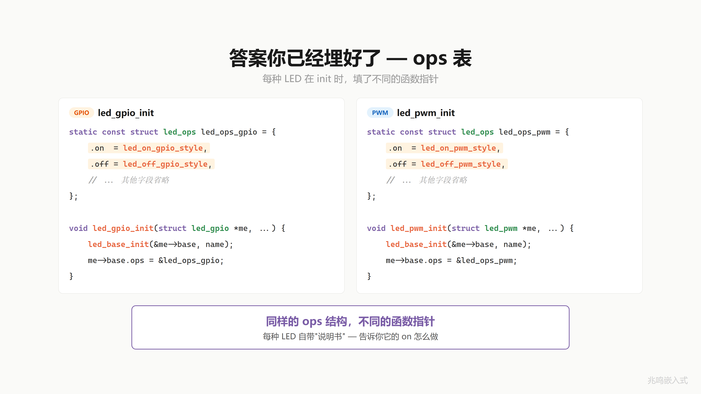

# 第 11 章 · 同名函数不同行为 · 多态完整图景

配套代码：[`oop-in-c/code/11-polymorphism/`](https://github.com/ZhaoChengBo/zhaoming-embedded/tree/master/oop-in-c/code/11-polymorphism/)

## 11.1 一个真实场景

第 10 章每颗 LED 自带 ops 表。应用层每次调用还得自己写 `me->ops->on(me)` 这一长串：

```c
red_led.base.ops->on(&red_led.base);
blue_led.base.ops->on(&blue_led.base);
green_led.base.ops->on(&green_led.base);
```

能不能把这层调用包成一个统一接口，叫它 `led_on(me)`，让它自己找到对的函数？

而且应用层经常要把所有 LED 装在一个数组里循环跑：

```c
struct led_base *all_leds[3] = {
	&red_led.base,
	&blue_led.base,
	&green_led.base,
};

for (int i = 0; i < 3; ++i)
	led_on(all_leds[i]);
```

这一行 `led_on(all_leds[i])` 跑的时候。

红灯走 `gpio_on`：拉引脚。
蓝灯走 `pwm_on`：按 duty 配 PWM。
绿灯走 `i2c_on`：通过 I2C 总线写控制寄存器。

同一行代码 `led_on(...)`，跑出三种完全不同的硬件动作。它怎么知道该调哪个？

总不能写 if 判断吧。"如果是 GPIO 就调这个，如果是 PWM 就调那个"。那加第三种 LED 又要改 if。你写的 if-else 比 LED 还多，确定是在写驱动还是做选择题。


## 11.2 答案在 ops 表里

别急。答案你已经埋好了。

第 10 章每种 LED 在 init 的时候，填了一张 ops 表：

```c
static const struct led_ops led_ops_gpio = {
	.on     = gpio_on,
	.off    = gpio_off,
	.toggle = gpio_toggle,
};

int led_gpio_init(struct led_gpio *me, const char *name, uint8_t pin)
{
	led_base_init(&me->base, name, &led_ops_gpio);
	/* ... */
}
```

```c
static const struct led_ops led_ops_pwm = {
	.on     = pwm_on,
	.off    = pwm_off,
	.toggle = pwm_toggle,
};

int led_pwm_init(struct led_pwm *me, const char *name,
                 uint8_t channel, uint8_t duty)
{
	led_base_init(&me->base, name, &led_ops_pwm);
	/* ... */
}
```

GPIO 的 init，ops 里的 on 指向 `gpio_on`，off 指向 `gpio_off`。
PWM 的 init，ops 里的 on 指向 `pwm_on`，off 指向 `pwm_off`。

两种 LED，同样的 ops 结构，不同的函数指针。每种 LED 自带一张说明书，告诉你它的 on 怎么做。



## 11.3 dispatch 调用链

应用层调 `led_on(&gpio_led.base)`，进到 `led_on` 函数里面，函数体的核心就一行：

```c
me->ops->on(me);
```

这一行就是两次跳转。

第一跳：跟着 `me` 找到 `me->ops`。base 第一个字段是 ops，offset 0。
第二跳：跟着 `ops` 找到 `ops->on`。ops 表第一个字段是 on，offset 0。

然后跳过去执行，传入 `me`。

来看 GPIO：`me->ops` 指向 `led_ops_gpio`，表里的 `on` 指向 `gpio_on`。两跳之后，`gpio_on(me)` 被调了。`gpio_on` 收到的是 base 指针，里面要拿 pin 字段，怎么拿？后面讲。

再看 PWM：同样两跳。`me->ops` 指向 `led_ops_pwm`，表里的 `on` 指向 `pwm_on`。两跳之后，`pwm_on(me)` 被调了。

同一行代码 `me->ops->on(me)`，因为 `me` 不同，两跳之后落在不同的函数。

调用者不关心你是哪种 LED，能亮就行。


## 11.4 led_on 写在哪

来给它一个正式的名字。

写一个函数 `led_on`。写在哪？写在 `led_base.c`，父类的文件里。参数就一个：`struct led_base *`。函数体的核心就一行：通过 `me` 找到 ops，调 `on`。

```c
/* led_base.c */

int led_on(struct led_base *me)
{
	return me->ops->on(me);
}

int led_off(struct led_base *me)
{
	return me->ops->off(me);
}
```

> 这是化简版。配套代码 `led_base.c` 实际加了 NULL + ops + ops->on 三层守护·防御性写法 ch14 § 14.2 详谈。

为什么写在父类里？因为开灯是所有 LED 都具备的能力，不管你是 GPIO 灯、PWM 灯还是 I2C 灯，都得能开。所有 LED 共有的能力，就在父类统一实现。`led_off` 也一样。父类定义接口，子类各自实现。

来看效果：

```c
led_on(&gpio_led.base);    /* 走 gpio_on，拉引脚 */
led_on(&pwm_led.base);     /* 走 pwm_on，改占空比 */
led_on(&i2c_led.base);     /* 走 i2c_on，发命令 */
```

同一个函数名 `led_on`，传不同的 LED，不同的行为。这就是这一章标题说的事。

应用层呢？不用再调 `gpio_on / pwm_on / i2c_on`，只调 `led_on` 一个函数。底下是 GPIO 还是 PWM，`led_on` 自己分发。

C++ 里这一步 dispatch 是编译器自动生成的。你写 `obj.on()`，编译器看到对象有 vptr，自动展成 `obj.vptr->on(&obj)`。你不用写。C 里你手写 `led_on`：一行胶水函数，写一次，所有子类共用。


## 11.5 同一个接口·不同的行为

加第 100 种 LED 怎么办？写一张新 ops 表，写一个新 init。`led_on` 一行不改。`struct led_base` 一行不改。`struct led_ops` 一行不改。所有应用层代码（包括循环 dispatch 那段）一行不改。

软件工程里把这件事叫开闭原则：对扩展开放，对修改关闭。加新功能不要改老代码。这是面向对象设计很重要的一条工程纪律。

生物学上一个有意思的现象：会飞的动物里，鸟、蝙蝠、飞鱼是三个完全不同的演化分支。鸟拍翅膀，蝙蝠振膜翼，飞鱼滑翔。三者都解决了"飞"这个问题，但实现完全不同。

天空不关心你怎么飞，只看你能不能离地。`led_on` 不关心你是 GPIO 还是 PWM，只看你能不能亮。

调用方对实现的不关心，是这一整套机制的根。


## 11.6 这个东西叫什么

到这里，OOP 三大特性你全部解锁。

封装是藏细节。把数据和操作关在一起，外面看不见里面怎么做的。
继承是共享不变。把公共部分提出来，写一次，所有人共享。
多态是各自精彩。同一个接口，不同的实现，各做各的。

**封装是藏细节，继承是共享不变，多态是各自精彩。**

再说一遍本质：多态的本质是信任。调用者信任被调用者会做对的事。`led_on(me)` 调用时不知道也不需要知道是哪种 LED，它信任 `me->ops->on` 指向的函数会把这颗灯点亮。


回头看从第 9 章一路过来的三件事：

1. 第 9 章·**生成函数指针表**。`struct led_ops` 是这张表，`led_ops_gpio / led_ops_pwm` 是两份具体实例。
2. 第 10 章·**在对象里加指针**。`struct led_base` 第一个字段加 `ops`，每个对象自带一张表。
3. 这一章·**调用时查表找函数**。`me->ops->on(me)` 两次跳转走到对的实现。

C++ 编译器自动做的，你一步步亲手做了一遍。

C++ 管这整套机制叫**虚函数**（virtual function）。原理一模一样：

```cpp
class led_base {
public:
	virtual int on() { ... }
	virtual int off() { ... }
};

class led_gpio : public led_base {
public:
	int on() override { ... }
	int off() override { ... }
};

led_base *all_leds[3] = { /* ... */ };
for (auto led : all_leds)
	led->on();    /* 自动 dispatch */
```

C++ 编译器看到 `virtual` 后自动做：

1. 给 `class led_gpio` 生成一张 vtable（你的 `led_ops_gpio`）
2. 给每个对象的最前面塞一个 vptr（你的 `me->ops`）
3. 把 `led->on()` 编译成 `led->vptr->on(led)`（你的 `me->ops->on(me)`）

C++ 编译器自动做的事，你 C 里手动做完。两份代码的机器码几乎一字不差。OOP 不是 C++ 的特权。区别只是 C++ 编译器把 vtable / vptr / dispatch 这三件事自动做了，C 里你手写。


## 11.7 视频里没讲透的几个细节

### 11.7.1 led_on 为什么不内联到 me->ops->on(me)

应用层完全可以直接写：

```c
me->ops->on(me);    /* 不通过 led_on 这层胶水, 直接 dispatch */
```

为什么还要套一层 `led_on(me)`？两个理由：

1. **统一空指针检查**：`me`、`me->ops`、`me->ops->on` 任意一个为 NULL 都会崩。胶水函数集中检查
2. **API 稳定**：哪天 dispatch 机制改了（比如加日志、加 hook、上 trace），改一个 `led_on` 函数，所有调用方不用动

工业代码的硬规则：不直接走 ops 表，所有 dispatch 走基类层包装的统一函数。`led_on / led_off / led_toggle` 是对外 API，`me->ops->on` 是内部实现细节。

打开 [`oop-in-c/code/11-polymorphism/pc/led_base.c`](https://github.com/ZhaoChengBo/zhaoming-embedded/tree/master/oop-in-c/code/11-polymorphism/pc/led_base.c) 看 `led_on` 实际函数体：

```c
int led_on(struct led_base *me)
{
	if (!me || !me->ops || !me->ops->on)
		return -1;
	return me->ops->on(me);
}
```

NULL 防御一句话挡住三个潜在 NULL 来源（`me` / `me->ops` / `me->ops->on`），任何一个 NULL 就退出，不进 dispatch。胶水函数的好处就在这：所有调用方只看到 `led_on` 这一个 API，NULL check 集中在这一处。

这一章 `led_on` 是简化版，只做 NULL 防御 + dispatch 两件事。后面章节会给函数表加一份更严的契约，那是另一个工程话题，本章主题是"同名函数不同行为"，先不展开。

### 11.7.2 dispatch 在内存里走的两步

`me->ops->on(me)` 这一行展开就是两次访存加一次跳转。先从 `me` 这块内存里取出 `ops` 字段（base 第一个字段，偏移 0），拿到 ops 表的地址；再从 ops 表里取出 `on` 字段（ops 第一个字段，偏移 0），拿到目标函数地址；最后跳过去执行，参数 `me` 已经在那。

红灯：`me->ops` 指向 `led_ops_gpio`，`me->ops->on` 是 `gpio_on`。落到 `gpio_on(me)`。
蓝灯：`me->ops` 指向 `led_ops_pwm`，`me->ops->on` 是 `pwm_on`。落到 `pwm_on(me)`。
绿灯：`me->ops` 指向 `led_ops_i2c`，`me->ops->on` 是 `i2c_on`。落到 `i2c_on(me)`。

同一行代码 `me->ops->on(me)`，因为 `me` 不同，两跳之后落在不同的函数。这就是 dispatch 在内存里实际发生的事。

### 11.7.3 加新 LED 不改老代码

"加新 LED" 有两种情况，先分清楚再讲省什么。

**情况一·同种 LED 多挂几颗（加实例）。** 比如板子本来 5 个 GPIO 指示灯，现在要再挂 10 个：

```c
struct led_gpio led_pwr;   led_gpio_init(&led_pwr, "PWR", 5);
struct led_gpio led_run;   led_gpio_init(&led_run, "RUN", 6);
/* ... 重复 10 次 ... */
```

`led_gpio_init` 一行不改，`led_ops_gpio` 一行不改。这是**封装**的好处：把"GPIO 灯怎么开"封在 `led_gpio_init` 里，外面想挂几个挂几个。

**情况二·加一种新硬件实现（加种类）。** 比如新一代板子换了 LED 方案，从 GPIO 改成 SPI 总线上的 LED 驱动 IC。这是当前代码完全没见过的硬件机制，但加它的步骤是机械化的：

1. 写 `struct led_spi`，装 SPI 总线号、片选引脚等私有字段
2. 写 `spi_on / spi_off / spi_toggle` 三个函数
3. 写 `const struct led_ops led_ops_spi = { .on = spi_on, ... }`
4. 写 `led_spi_init`，里面调 `led_base_init(&me->base, name, &led_ops_spi)`

完了。

`led_on / led_off / led_toggle` 这 3 个对外 API 一行不改。`struct led_base` 一行不改。`struct led_ops` 一行不改。GPIO 和 PWM 那两份老代码一行不改。所有调用 `led_on(...)` 的应用代码一行不改。

这是**多态 + dispatch** 的好处，OOP 圈叫"开放-封闭原则"（OCP）：对扩展开放（加新种类随便加），对修改关闭（老代码不动）。

**两层好处叠加。** 第一层（封装）让"挂 50 个同种 LED"是一行 init 的事；第二层（多态 + dispatch）让"加一种新硬件机制"只动新文件，老文件全不动。两层加起来，工业代码才能做到"骨架不变，不断长出新模块"。

工业现场 LED 种类真实不会超过 5-6 种（GPIO 指示灯 + PWM 状态灯 + I2C 数码管 + SPI 矩阵 + WS2812 灯条已经覆盖大多数产品），但每种下面挂几十个实例很常见。这套机制让两个轴都自由：种类轴靠 dispatch，实例轴靠封装。

### 11.7.4 配套代码 ops 字段说明

差异原则详见前言「配套代码 vs 视频版」。下面是本章具体差异。

视频 EP16 演示主线用 `on / off` 两个字段，已经够说清 dispatch 这件事。本章配套代码 `oop-in-c/code/11-polymorphism/` 沿用第 9 章 / 第 10 章的 `on / off / toggle` 三字段。三章代码包跨章演化字段一致，读者跟着改增量看得清楚。

三个字段还是两个字段，dispatch 机制完全一样：通过 `me->ops` 找到表，按名字调到对的实现。

## 11.8 你现在的代码在 STM32 上长什么样

STM32 端 `led_base.h / led_base.c / led_gpio.h / led_gpio.c / led_pwm.h / led_pwm.c / led_i2c.h / led_i2c.c / main.c` 一字不改。`platform_gpio_xxx` 这一组封装函数还是 ch01 那套（用 `PIN_NUM('A', 13)` 编码 port + 引脚号，`_gpio_table` 查表拿到 `GPIOA / GPIOB / ...`）：

```c
void platform_gpio_write(uint8_t pin, bool value)
{
	HAL_GPIO_WritePin(PIN_PORT(pin), PIN_MASK(pin),
	                  value ? GPIO_PIN_SET : GPIO_PIN_RESET);
}
```

启动 + 调用：

```c
int main(void)
{
	HAL_Init();
	SystemClock_Config();
	MX_GPIO_Init();

	struct led_gpio red_led;
	led_gpio_init(&red_led, "red", PIN_NUM('A', 13));
	led_on(&red_led.base);
	/* ... */
}
```

这一节 platform 层用的是函数式包装的教学简化版（几个独立函数 `platform_gpio_init / platform_gpio_write / ...`），和 ch01 起一字不变。真正工业级的 platform 抽象用 ops 表的形式做成可切换。这件事第 16 章会专门展开。

完整片段见 [`oop-in-c/code/11-polymorphism/platform-mcu/stm32/`](https://github.com/ZhaoChengBo/zhaoming-embedded/tree/master/oop-in-c/code/11-polymorphism/platform-mcu/stm32/)（每个子类一个文件：`led_gpio.c` / `led_pwm.c` / `led_i2c.c`，分别走 HAL_GPIO_* / HAL_TIM_PWM_* / HAL_I2C_Master_Transmit）。完整跑通的 STM32 工程见附录 B。

## 11.9 Linux 用户态完整工程

Linux 上 GPIO / PWM / I2C 三种子类各自直接调内核暴露的 libgpiod / sysfs PWM / i2c-dev，应用层 `led_base / main.c` 一字不改，"换硬件不改应用"在 Linux 上兑现成"换子类内部实现"。完整跑通的工程见附录 C。

## 11.10 工业代码里的多态

工业控制板项目里的 LED 驱动到这一章已经和书里你写的几乎一模一样：

```c
/* drivers/led/led.h */
struct led_base;

struct led_ops {
	int (*on)(struct led_base *me);
	int (*off)(struct led_base *me);
	int (*toggle)(struct led_base *me);
};

struct led_base {
	const struct led_ops *ops;
	const char *name;
	bool        is_on;
	uint32_t    flags;
};
```

应用层调一次 `led_off(handle)`，背后是 `me->ops->off(me)` 这一行 dispatch，不管底下挂的是 GPIO 灯、PWM 灯还是 I2C 矩阵，调用方完全不知道走到哪个具体实现，落到对的就行。下一章把"应用层手里这些 `struct led_base *` 句柄从哪来"展开。

这就是 Linux 内核 / Zephyr / GObject / 你这一章手写的代码同一种 dispatch 机制。OOP 不是 C++ 的特权，是工业代码里很普遍的做法。

## 11.11 跑一遍

```bash
cd oop-in-c/code/11-polymorphism/pc
make
./demo
```

输出节选：

```
========================================
  led_on / led_off / led_toggle
  Same call, three behaviors per LED kind.
========================================

  [base] "red" common init done, ops=XXXXXXXX
[GPIO] PA.13 init as OUTPUT
[GPIO] PA.13 -> LOW (OFF)
  [GPIO] sub-class init done (pin=13)
  [base] "blue" common init done, ops=YYYYYYYY
  [PWM] sub-class init done (channel=1, duty=70)
  [base] "green" common init done, ops=ZZZZZZZZ
  [I2C] sub-class init done (addr=0x20, reg=0x01)

--- Loop over led_base * array, call led_on ---
 idx=0:
[GPIO] PA.13 -> HIGH (ON)
  [GPIO] "red" ON
 idx=1:
  [PWM] "blue" ON  (channel 1, duty=70)
 idx=2:
  [I2C] "green" ON  (addr=0x20 reg=0x01 val=0x01)
```

注意 ops 地址：三颗灯各自指向不同的 ops 表（`led_ops_gpio` / `led_ops_pwm` / `led_ops_i2c`），具体地址因 build 环境会变。同一个循环，三种硬件机制（拉引脚、配 duty、写 I2C 寄存器）各自 dispatch 到对的实现，应用层一字不知谁是谁。

完整源码见 [`oop-in-c/code/11-polymorphism/`](https://github.com/ZhaoChengBo/zhaoming-embedded/tree/master/oop-in-c/code/11-polymorphism/)。

## 11.12 视频回放

想听口播版的可以看 B 站这一期视频：

> [《C 语言·多态｜同名函数不同行为·ops dispatch》](https://www.bilibili.com/video/BV1FzonBiE9M/)

视频里把 OOP 三大特性总结成一行：封装是藏细节、继承是共享不变、多态是各自精彩。

多态的本质是信任。`led_on(me)` 调用时不知道也不需要知道是哪种 LED，它信任 `me->ops->on` 指向的函数会把这颗灯点亮。

## 下一章

`led_on(&red_led.base)` 这一行你已经写了好几章。`led_on` 的参数类型是 `struct led_base *`，但 `gpio_led` 明明是 `struct led_gpio`，凭什么合法？

你一直在用但没仔细想过的事，把 `struct led_gpio *` 当成 `struct led_base *` 用。这件事在 C++ 里有个正式名字。下一章把它讲透，并演示它在应用层带来的真正威力。

下一篇：[第 12 章 · 一个指针指所有 LED · 向上转型](../04-工程威力/12-向上转型.md)
