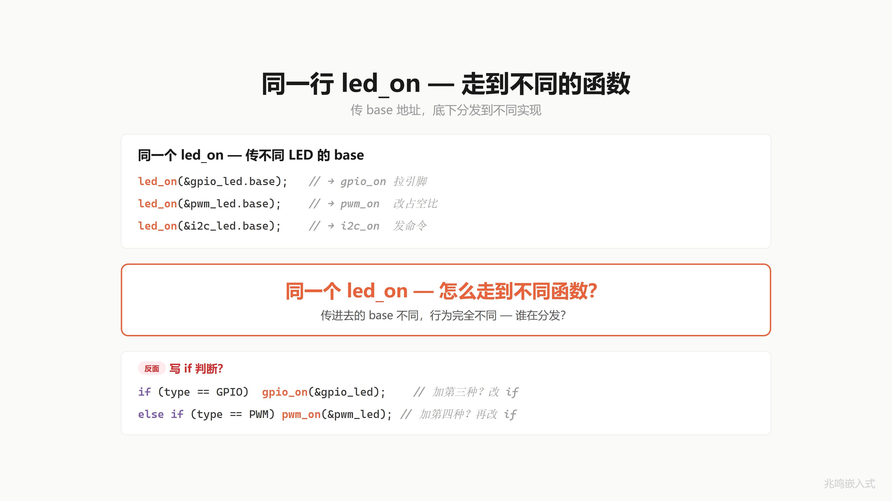
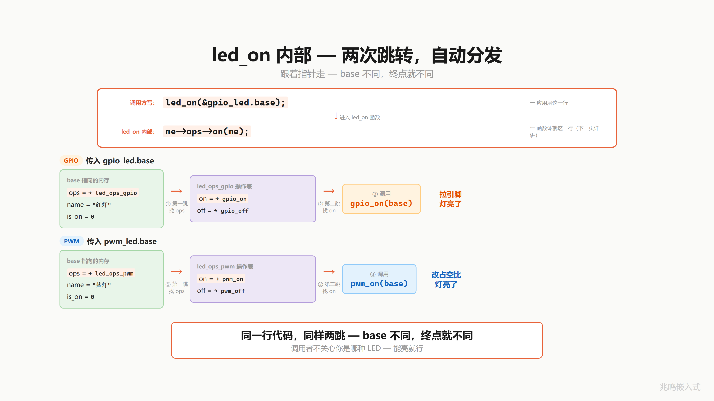
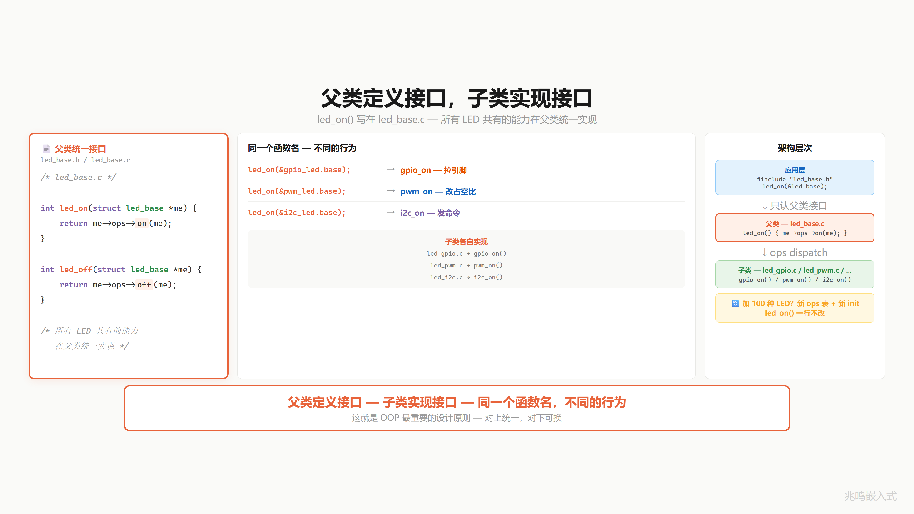

# 第 11 章 · 同名函数不同行为

配套代码：[`oop-in-c/code/11-polymorphism/`](https://github.com/ZhaoChengBo/zhaoming-embedded/tree/master/oop-in-c/code/11-polymorphism/)

## 11.1 一个真实场景

第 10 章你把 ops 字段塞进了 `struct led_base` 第一个位置。每颗 LED 自带自己的 ops 表。应用层调 `led_on(&red_led.base)`，内部 `me->ops->on(me)` 走对的实现。

但应用层还有一个不爽的地方：每次都得写 `&red_led.base`、`&blue_led.base`。这意味着应用层还是知道每颗 LED 的具体子类（`struct led_gpio` / `struct led_pwm`）。

如果你想做一件更工程化的事：把所有 LED 装在一个数组里循环跑：

```c
struct led_base *all_leds[3] = {
	&red_led.base,
	&blue_led.base,
	&green_led.base,
};

for (int i = 0; i < 3; ++i)
	led_on(all_leds[i]);
```

这一行 `led_on(all_leds[i])` 跑的时候，应用层根本不知道 `all_leds[i]` 背后是 `struct led_gpio` 还是 `struct led_pwm` 还是 `struct led_i2c`。但是每颗灯都会按自己的 ops 表跑对的实现。

红灯走 `gpio_on`：拉引脚。
蓝灯走 `pwm_on`：按 duty 配 PWM。
绿灯走 `gpio_on`：拉引脚。

同一行代码 `led_on(...)`，跑出三种不同行为。这就是**多态**。



## 11.2 dispatch 调用链

`led_on(struct led_base *me)` 函数体只有一行：

```c
int led_on(struct led_base *me)
{
	if (!me)
		return -1;
	assert(me->ops && me->ops->on &&
	       "led_on: subclass must implement on()");
	return me->ops->on(me);
}
```

`on / off / toggle` 是 LED 的核心能力，子类必须实现。调试构建里 assert 抓到忘实现的子类，立即 abort + 给行号；Release 构建定义 NDEBUG 后 assert 整行消失，零运行时开销。第 14 章会专门展开必填和选填的边界。

`me->ops->on(me)` 这一行 ARM Cortex-M4 编译出来：

```
LDR  r3, [r0, #0]    ; r3 = me->ops              (3 cycle)
LDR  r3, [r3, #0]    ; r3 = me->ops->on          (3 cycle)
BX   r3              ; 跳到 on, 不返回 (tail call)
                     ; r0 已经是 me, 不需要 mov
```

**两次跳转**。

第一跳：从 `me` 这个地址 load 出 `me->ops`（base 第一个字段是 ops，offset 0）。
第二跳：从 `ops` 这个地址 load 出 `ops->on`（ops 表第一个字段是 on，offset 0）。
然后跳过去执行。

红灯：`me->ops` = `&led_ops_gpio`，`me->ops->on` = `gpio_on`。跳到 `gpio_on`。
蓝灯：`me->ops` = `&led_ops_pwm`，`me->ops->on` = `pwm_on`。跳到 `pwm_on`。

同一行代码 `me->ops->on(me)`，因为 `me` 不同，两跳之后落在不同的函数。这就是 dispatch。

C++ 虚函数调用编译器生成的 ARM 汇编几乎一字不差。Stroustrup 把这两个 LDR 称为"virtual function 的两次访存"，这是 OOP 的固定开销。在主流嵌入式平台上一次 vcall 约 56ns @ 168MHz，可以忽略。



## 11.3 led_on 这个函数写在哪

`led_on` 不是 `gpio_on`、不是 `pwm_on`。它是一个统一的对外接口，函数体只做"通过 ops 表 dispatch 到具体实现"这一件事。

写在哪？写在 `led_base.c`（或者本书简化把它写在 `led.c`）。这是**基类层**的函数。所有 base 子类共享。

为什么不写在子类？因为这件事对所有子类一样：通过 ops 找 on 函数、调它。子类自己不知道也不需要知道这件事。

C++ 里这步 dispatch 是编译器自动生成的。`obj.on()` 编译器看到对象有 vptr，自动展成 `obj.vptr->on(&obj)`。你不用写。

C 里你手写 `led_on`：一行的胶水函数，通过 ops 表 dispatch。这一行胶水写一次，所有子类共用。



## 11.4 这个东西叫什么

同一个函数名（`led_on`），传不同的对象进去（红灯、蓝灯、绿灯），跑出不同的行为。

软件工程里有个名字。它叫**多态**（polymorphism）。希腊语词根：poly-（多）+ morph（形态）。同一个调用，多种形态。

OOP 三大特性到这一章你全部解锁：

- **封装**（ch01-ch05）：把数据和操作打包，外面看不见内部
- **继承**（ch06）：把公共部分提到 base 里，子类共享
- **多态**（ch07-ch11）：同一个接口，不同的实现，运行时 dispatch

封装是藏细节，继承是共享不变，多态是各自精彩。

C++ 里这一整套写法：

```cpp
class led_base {
public:
	virtual int on() = 0;       /* 纯虚函数, 子类必须实现 */
	virtual int off() = 0;
};

class led_gpio : public led_base {
public:
	int on() override { ... }
	int off() override { ... }
};

class led_pwm : public led_base {
public:
	int on() override { ... }
	int off() override { ... }
};

led_base *all_leds[3] = { new led_gpio, new led_pwm, new led_gpio };
for (auto led : all_leds)
	led->on();    /* 自动 dispatch */
```

C++ 编译器看到 virtual 后自动做：

1. 给 `class led_gpio` 生成一张 vtable（你的 `led_ops_gpio`）
2. 给每个 `led_gpio` 对象的最前面塞一个 vptr（你的 `me->ops`）
3. 把 `led->on()` 编译成 `led->vptr->on(led)`（你的 `me->ops->on(me)`）

C++ 编译器自动做的事，你 C 里手动做完。两份代码的机器码几乎一字不差。这就是为什么 Bjarne Stroustrup 反复说"C++ 的 OOP 是 zero overhead beyond what you'd write by hand in C"。

你这本书走到这里，应该被自己说服了：OOP 不是 C++ 的特权。C 里你已经在写。区别只是 C++ 编译器把 vtable / vptr / dispatch 这三件事自动做了，C 里你手写。


## 11.5 platform 层从函数式重构成 ops 表式

回头看 ch01-ch10。所有 platform 操作是 4 个独立函数：

```c
/* common/platform.h - 函数式 (ch01 - ch10) */
void platform_gpio_init(uint8_t pin, uint8_t mode);
void platform_gpio_write(uint8_t pin, bool value);
void platform_gpio_deinit(uint8_t pin);
bool platform_gpio_read(uint8_t pin);
```

每章的 STM32 / Linux snippet 都告诉你这是教学简化版。真正工业级 platform 抽象用 ops 表。本章演化出 vptr 之后，就把这个承诺兑现。

兑现的方式有讲究：**对外**这 4 个函数签名一字不动，**对内**从直接实现演化成 ops dispatch。驱动层、应用层永远只看到这 4 个签名，看不到下面的 ops 表。

观察这一招在概念上和 ch10 的 `struct led_base` 一字不差：

| ch10 设备层 | ch11 平台层 |
|---|---|
| `struct led_base { const struct led_ops *ops; ... }` | `struct platform_ops { ... }` 多份具体实例（PC / STM32 / Linux） |
| 子类 init 时把 `&led_ops_xxx` 填进 base | 启动期 `platform_select(&platform_xxx)` 切换 platform 层内部当前指针 |
| 基类层 `led_on` 内部 `me->ops->on(me)` | 封装函数 `platform_gpio_write` 内部 `g_platform_ops->gpio_write(...)` |
| 加新 LED 类型不改 led_on / led_off | 加新平台不改 platform_gpio_write / 任何 driver 代码 |

这就是面向对象的"递归"应用：同一个 ops 表机制，先用在设备层（每颗 LED 自带 ops），再用在平台层（platform 层内部维护一个 ops 指针）。两层独立演化，机制完全一致。

新接口（节选自 [`oop-in-c/code/11-polymorphism/pc/platform_ops.h`](https://github.com/ZhaoChengBo/zhaoming-embedded/tree/master/oop-in-c/code/11-polymorphism/pc/platform_ops.h)）：

```c
/* 11-polymorphism/pc/platform_ops.h - platform 层内部细节 */
struct platform_ops {
	const char *name;
	void (*gpio_init)(uint8_t pin, uint8_t mode);
	void (*gpio_deinit)(uint8_t pin);
	void (*gpio_write)(uint8_t pin, bool value);
	bool (*gpio_read)(uint8_t pin);
};

/* 多份具体实例（在各自实现文件里定义） */
extern const struct platform_ops platform_pc;

/* 切换 platform 层内部当前 ops 指针 */
void platform_select(const struct platform_ops *p);
```

`platform_ops.h` 不放在 `common/` 目录，是 platform 层内部头文件。驱动层、应用层只 include `common/platform.h`（封装函数声明），永远看不到这张 ops 表。

PC 模拟版的 ops 表（节选自 [`oop-in-c/code/11-polymorphism/pc/platform_ops_pc.c`](https://github.com/ZhaoChengBo/zhaoming-embedded/tree/master/oop-in-c/code/11-polymorphism/pc/platform_ops_pc.c)）：

```c
static void pc_gpio_init(uint8_t pin, uint8_t mode)  { ... }
static void pc_gpio_write(uint8_t pin, bool value)   { ... }
static bool pc_gpio_read(uint8_t pin)                { ... }
static void pc_gpio_deinit(uint8_t pin)              { ... }

const struct platform_ops platform_pc = {
	.name        = "PC",
	.gpio_init   = pc_gpio_init,
	.gpio_deinit = pc_gpio_deinit,
	.gpio_write  = pc_gpio_write,
	.gpio_read   = pc_gpio_read,
};
```

封装函数 + 内部 dispatch（节选自 [`oop-in-c/code/11-polymorphism/pc/platform_dispatch.c`](https://github.com/ZhaoChengBo/zhaoming-embedded/tree/master/oop-in-c/code/11-polymorphism/pc/platform_dispatch.c)）：

```c
/* platform 层内部当前指针, 文件作用域, 外部不可见 */
static const struct platform_ops *g_platform_ops = &platform_pc;

void platform_select(const struct platform_ops *p)
{
	if (p)
		g_platform_ops = p;
}

/* 封装函数: 签名跟 ch01 起一字不变, 内部走 ops dispatch */
void platform_gpio_write(uint8_t pin, bool value)
{
	if (g_platform_ops && g_platform_ops->gpio_write)
		g_platform_ops->gpio_write(pin, value);
}
```

驱动层调用方式从 ch01 起一字不变：

```c
platform_gpio_write(pin, true);    /* ch01 函数式 */
platform_gpio_write(pin, true);    /* ch11 内部走 ops dispatch */
```

变化的只是 platform 层内部：上面这一行函数调用，从直接执行 GPIO 操作，变成"先 LDR 一次拿到 `g_platform_ops`，再 LDR 一次拿到 `ops->gpio_write`，最后跳过去执行"。驱动层一字不知。

ch01 1.10 节工业代码里的 `led_base + led_ops` 形态，和这里的 `platform_ops` 是同一种东西。整本书的 platform 层从这一章起，与工业代码完全对齐。

### 11.5.1 为什么 platform 层要 ops 化

函数式 platform 抽象（ch01-ch10）有几个问题：

1. **编译期决定平台**：`platform_gpio_write` 在哪个 `.c` 实现，编译期就定了。同一份 firmware 跑不了两个不同硬件 revision
2. **不能 mock**：单元测试时想替换 platform 层为 mock 实现，函数式没法换（除非链接期 stub）
3. **不能 runtime 切**：一个进程里同时模拟多种 platform（教学场景）做不到

封装函数 + 内部 ops 表式解决全部三个：

1. `platform_select(&platform_xxx)` 启动期挑表
2. mock 时填一张测试用的 ops 表，`platform_select(&platform_mock)`
3. 一个进程里持有多张 ops 表，按场景切换

### 11.5.2 这件事的代价

封装函数 `platform_gpio_write` 的实现，从直接 `BL` 一条到底，变成函数体内多两次 LDR。在 ARM Cortex-M4 @ 168MHz、`-O2` 下大概多 28ns。

驱动层调用方式没变，每次 `platform_gpio_write(pin, true);` 还是一条 `BL platform_gpio_write`。多出来的两次 LDR 在 platform 层内部消化。

主流嵌入式驱动调用频率（每秒几十到几千次 GPIO 操作）远低于这个开销，完全可以忽略。极端高频场景（PWM 微秒级更新）应该走专用接口，不上 ops 表。

### 11.5.3 ch12-ch18 沿用

第 12 章起，所有代码都用这种"对外封装、对内 ops"的 platform 抽象。驱动层调用形态从 ch01 起一字不变，platform 层内部走 ops dispatch。

第 15 章是 platform 层 ops 化的高潮章，会演示同一份 firmware 同时持有 PC / STM32 / Linux 三套 platform_ops 实例，runtime 通过 `platform_select(&platform_xxx)` 在三种 platform 之间切换，应用层、驱动层一字不改。

## 11.6 视频里没讲透的几个细节

### 11.6.1 led_on 为什么不内联到 me->ops->on(me)

应用层完全可以写：

```c
me->ops->on(me);    /* 不通过 led_on 这层胶水, 直接 dispatch */
```

为什么还要套一层 `led_on(me)`？两个理由：

1. **统一 NULL check**：`me->ops`、`me->ops->on` 任意一个 NULL 都崩。胶水函数集中检查
2. **API 稳定**：哪天 dispatch 机制改了（比如加日志、加 hook、上 trace），改一个 `led_on` 函数，所有调用方不用动

工业代码的硬规则：**不直接走 ops 表，所有 dispatch 走基类层包装的统一函数**。`led_on / led_off / led_set_brightness` 是对外 API，`me->ops->on` 是内部实现细节。

### 11.6.2 ops 字段的必填和选填

ops 表里有些字段是必填（每个子类都得实现），有些字段是选填（这种 LED 不支持就不填）。

本章 `on / off / toggle` 三件套都是 LED 的核心能力——一颗灯不能开、不能关、不能翻转，就不算灯。所以本章代码统一用 assert 抓忘实现的子类，调试构建立即 abort 给行号，Release 构建定义 NDEBUG 后 assert 整行消失，零运行时开销。

到第 12 章会引入 `set_brightness`，那个就属于选填——GPIO 灯硬件上没有调光能力，子类就别实现，父类的统一接口走默认行为兜底。这是另一种处理。

第 14 章会专门展开必填 vs 选填的判断标准、三种处理策略（assert 报错、空 stub、默认行为）的取舍、对应到 C++ 里的纯虚函数和虚函数。本章先把"核心能力子类必须实现，调试期 assert 抓忘填"这条记下来。

### 11.6.3 多态的开闭原则

加第 100 种 LED 怎么改代码？

1. 写一个 `struct led_ops led_ops_xxx`，填 3 个函数
2. 写一个 `led_xxx_init` 函数，里面调 `led_base_init(&me->base, name, &led_ops_xxx)`
3. 完了

`led_on / led_off / led_toggle` 这 3 个对外 API 一行不改。`struct led_base` 一行不改。`struct led_ops` 一行不改。所有应用层代码（包括循环 dispatch 那段）一行不改。

软件工程把这件事叫**开闭原则**（Open/Closed Principle）：**对扩展开放，对修改关闭**。加新功能不要改老代码。这是面向对象设计五大原则（SOLID）的 O。

多态是开闭原则在 C 语言里的具体实现机制。函数指针表 + base + dispatch 这一套就是工程上做"对扩展开放"的标准答案。

### 11.6.4 多态调用的开销和限制

多态调用比直接调用贵两个 LDR。绝大多数场景里这点开销远低于 GPIO / I2C 操作本身的延迟，可以忽略。

具体的几组对照（ARM Cortex-M4 @ 168 MHz，`-O2`）：

| 操作 | 大致开销 | vs 直接调用 | 占比 |
|---|---|---|---|
| 直接函数调用 `BL led_on_gpio_style` | 约 18 ns（3 cycle） | baseline | 0% |
| 间接调用一次 `BLX r3`（ch07 函数指针字段） | 约 30 ns（5 cycle） | +12 ns | 67% 慢 |
| 多态调用 `me->ops->on(me)`（两次 LDR + BX） | 约 56 ns（9 cycle） | +38 ns | 3 倍慢 |
| 一次 GPIO 写 BSRR 寄存器 | 约 12 ns（2 cycle，硬件总线时序） | / | / |
| 一次 I2C 字节传输（100 kHz） | 约 90 µs | / | / |
| 一次 SPI 字节传输（10 MHz） | 约 800 ns | / | / |

注意横向比较：多态调用 56 ns 比 GPIO 写本身（12 ns）慢，但和 I2C / SPI 操作（µs 级）比可以忽略不计。**多态的开销在于"调用 dispatch"，不在于"目标硬件操作"，所以多态适合给 I2C / SPI / 网络这种 µs-ms 级别的硬件做包装，给 GPIO 直接 toggle 这种 ns 级操作做包装就有点贵**。

但有几个场景要避开 ops 表：

1. **中断处理函数（ISR）**：执行时间敏感，每个 ns 都要算。中断里直接调最底层 platform 函数，不走 ops 表
2. **PWM 高频更新**：微秒级时序，ops 表的两次 LDR 可能影响 jitter。直接调
3. **超低功耗 MCU**：M0 + 16KB RAM 跑几百对象，ops 表的 RAM 开销（每对象多一个 vptr）可能省下来比较关键
4. **极致性能的 hot loop**：内层每秒跑几百万次的循环，多态会让循环体多 7 个周期 × 百万 = 几百毫秒每秒。这种地方应该把 dispatch 提到循环外，循环里直接调

这是工程权衡，不是 OOP 错。Linus 在内核里大量用 ops 表，但中断 fast path 一定不走（中断里 `irq_enter() / irq_exit()` 是直接函数调用，整个 `gpio_chip` 的 ops 表只在慢路径用）。

### 11.6.5 多态和继承的关系

多态依赖继承，但不是所有继承都是多态。

继承（ch06）只是数据 / 行为共享。`struct led_base { name, is_on }` 没有 ops 字段，子类就只能继承数据，不能多态。

多态需要 vptr（ops 字段）+ vtable（ops 表）+ dispatch（基类层包装函数）三件套。本章把三件齐了。

### 11.6.6 鸟、蝙蝠、飞鱼的故事

生物学上一个有意思的现象：会飞的动物里，鸟、蝙蝠、飞鱼是三个完全不同的演化分支。鸟拍翅膀，蝙蝠振膜翼，飞鱼滑翔。三者都解决了"飞"这个问题，但实现完全不同。

这就是多态最朴素的视觉化：飞行是一个接口（能在空中移动），三种实现各有各的 ops 表。

天空不关心你怎么飞，只看你能不能离地。`led_on` 不关心你是 GPIO 还是 PWM，只看你能不能亮。

调用方对实现的不关心，是 OOP 的根。


## 11.7 你现在的代码在 STM32 上长什么样

STM32 端的 platform_ops 实例（节选自 [`oop-in-c/code/11-polymorphism/stm32-snippet/platform_ops_stm32.c`](https://github.com/ZhaoChengBo/zhaoming-embedded/tree/master/oop-in-c/code/11-polymorphism/stm32-snippet/platform_ops_stm32.c)）：

```c
static void stm32_gpio_init(uint8_t pin, uint8_t mode)  { ...HAL_GPIO_Init... }
static void stm32_gpio_write(uint8_t pin, bool value)   { ...HAL_GPIO_WritePin... }
static bool stm32_gpio_read(uint8_t pin)                { ...HAL_GPIO_ReadPin... }
static void stm32_gpio_deinit(uint8_t pin)              { ...HAL_GPIO_DeInit... }

const struct platform_ops platform_stm32 = {
	.name        = "STM32",
	.gpio_init   = stm32_gpio_init,
	.gpio_deinit = stm32_gpio_deinit,
	.gpio_write  = stm32_gpio_write,
	.gpio_read   = stm32_gpio_read,
};
```

启动时：

```c
int main(void)
{
	HAL_Init();
	SystemClock_Config();
	MX_GPIO_Init();

	platform_select(&platform_stm32);    /* 切到 STM32 ops 表 */

	struct led_gpio red_led;
	led_gpio_init(&red_led, "red", 13);
	led_on(&red_led.base);
	...
}
```

`led.h / led.c / led_base.h / led_base.c` 一字不改。`platform_gpio_xxx` 这一组封装函数的签名跟 ch01 起一字不变。整本书的代码到这一章已经是工业代码的形态。第 12 章起，platform 层都用这种"对外封装、对内 ops"的形态。

## 11.8 你现在的代码在 Linux 用户态长什么样

Linux 端的 platform_ops 实例（节选自 [`oop-in-c/code/11-polymorphism/linux-snippet/platform_ops_linux.c`](https://github.com/ZhaoChengBo/zhaoming-embedded/tree/master/oop-in-c/code/11-polymorphism/linux-snippet/platform_ops_linux.c)）：

```c
static void linux_gpio_init(uint8_t pin, uint8_t mode)  { ...sysfs export + direction... }
static void linux_gpio_write(uint8_t pin, bool value)   { ...write /sys/class/gpio/gpioN/value... }
static bool linux_gpio_read(uint8_t pin)                { ...read /sys/class/gpio/gpioN/value... }
static void linux_gpio_deinit(uint8_t pin)              { ...sysfs unexport... }

const struct platform_ops platform_linux = {
	.name        = "LINUX",
	.gpio_init   = linux_gpio_init,
	.gpio_deinit = linux_gpio_deinit,
	.gpio_write  = linux_gpio_write,
	.gpio_read   = linux_gpio_read,
};
```

启动时 `platform_select(&platform_linux);`，之后所有 LED / Motor / EEPROM 通过 platform 层封装函数 dispatch 到 sysfs 实现。驱动层调用形态跟 ch01 一字不变。

## 11.9 工业代码里的多态

工业控制板项目里的 LED 驱动到这一章已经和书里你写的几乎一模一样：

```c
/* drivers/led/led.h */
struct led_base;

struct led_ops {
	int (*on)(struct led_base *me);
	int (*off)(struct led_base *me);
	int (*toggle)(struct led_base *me);
};

struct led_base {
	const struct led_ops *ops;
	const char *name;
	bool        is_on;
	uint32_t    flags;
};

/* environment_export.h */
extern struct led_base *green_led;
extern struct led_base *red_led;
extern struct led_base *led_array[];
```

应用层代码：

```c
for (int i = 0; led_array[i] != NULL; ++i)
	led_off(led_array[i]);
```

不管 led_array 里挂了多少种 LED（GPIO 灯、PWM 灯、I2C 灯、SPI 矩阵），这个循环一次性把它们全关掉。`led_array[i]` 是 `struct led_base *`，应用层完全不关心你是什么子类。

这就是 Linux 内核 / Zephyr / GObject / 你这一章手写的代码同一种 dispatch 机制。**面向对象不是 C++ 的特权，是工业代码的世界标准做法**。

## 11.10 跑一遍

```bash
cd oop-in-c/code/11-polymorphism/pc
make
./demo
```

输出节选：

```
========================================
  Polymorphism complete picture.
  Same code, different behavior per LED.
========================================

[platform] selected: PC

  [base] "red" common init done, ops=XXXXXXXX
[GPIO] Pin13 init as OUTPUT
[GPIO] Pin13 -> LOW (OFF)
  [GPIO] sub-class init done (pin=13)
  [base] "blue" common init done, ops=YYYYYYYY
  [PWM] sub-class init done (channel=1, duty=70)
  [base] "green" common init done, ops=XXXXXXXX
[GPIO] Pin17 init as OUTPUT
[GPIO] Pin17 -> LOW (OFF)
  [GPIO] sub-class init done (pin=17)

--- Loop over led_base * array, call led_on ---
 idx=0:
[GPIO] Pin13 -> HIGH (ON)
  [GPIO] "red" ON
 idx=1:
  [PWM] "blue" ON  (channel 1, duty=70)
 idx=2:
[GPIO] Pin17 -> HIGH (ON)
  [GPIO] "green" ON
```

注意 ops 地址：红灯和绿灯都打到 `XXXXXXXX`（共享 `led_ops_gpio` 这一张表），蓝灯打到 `YYYYYYYY`（`led_ops_pwm`）。具体地址因 build 环境会变，关键是看红灯绿灯共享同一地址，蓝灯不同。同一个循环，三颗 LED 各自 dispatch 到对的实现。

完整源码见 [`oop-in-c/code/11-polymorphism/`](https://github.com/ZhaoChengBo/zhaoming-embedded/tree/master/oop-in-c/code/11-polymorphism/)。

## 11.11 视频回放

想听口播版的可以看 B 站这一期视频：

> [《C 语言·多态｜同名函数不同行为·ops dispatch》](https://www.bilibili.com/video/BV1FzonBiE9M/)


视频里把 OOP 三大特性总结成一行：封装是藏细节、继承是共享不变、多态是各自精彩。

多态的本质是信任：调用方信任被调用方会做对的事。`led_on(me)` 调用时不知道也不需要知道是哪种 LED，它信任 `me->ops->on` 指向的函数会把这颗灯点亮。

## 11.12 教学版 base 到此定型

走到这一章，教学版 `struct led_base` 的字段集尘埃落定：

```c
struct led_base {
	const struct led_ops *ops;     /* vptr - 第一个字段 */
	const char           *name;
	bool                  is_on;
};
```

ch12 起字段不变。变化的是子类（GPIO / PWM / I2C 三种），每种子类都把 `struct led_base` 嵌在第一个字段，再外加自己的硬件字段（`pin` / `channel` / `bus + addr`）。

11.9 节工业代码版多了一个 `flags` 字段（事件状态位、错误掩码）。那是工业项目的扩展，教学版保持精简。本书 ch12 到 ch18 一直用上面这三字段的版本，附录 B / C 的完整工程才把 `flags` 加回来。

为什么定型在这里？因为多态需要的三件套（vptr + vtable + dispatch）都齐了。再往后加的（`flags` 状态位、`refcount` 引用计数）是工程问题，不是 OOP 概念问题。**OOP 三大特性到这一章你全部解锁，base 字段集到这一章稳定下来**。

## 下一章

`led_on(&red_led.base)` 这一行有个隐藏现象：把 `struct led *` 当成 `struct led_base *` 用，是合法的。

合法的原因是 base 在 led 第一个位置，地址相同。但这件事在 C++ 里有个正式名字叫**向上转型**。下一章把它讲透。

下一章你会看到，把 ch10/ch11 这里的"一种 led 子类两种 init 风格"模型继续演化，把每种实现独立成自己的子类（`struct led_gpio` / `struct led_pwm` / `struct led_i2c`），三种子类全都把 `struct led_base` 嵌在第一个字段。应用层只看到 `struct led_base *` 句柄，配合板级初始化文件 `board_init.c` 把所有"用哪种 LED"的决定锁进一个文件。这是工业项目里 LED 驱动的最终形态。

更重要的是，反方向也可能：拿到一个 `struct led_base *` 怎么找回它的子类？基类层的函数能不能反向访问子类字段？

这是 Linus Torvalds 1990 年代写 Linux 内核时引入的 `container_of` 宏的用武之地。第 13 章。

下一篇：[第 12 章 · 一个指针指所有 LED · 向上转型](../04-工程威力/12-向上转型.md)
