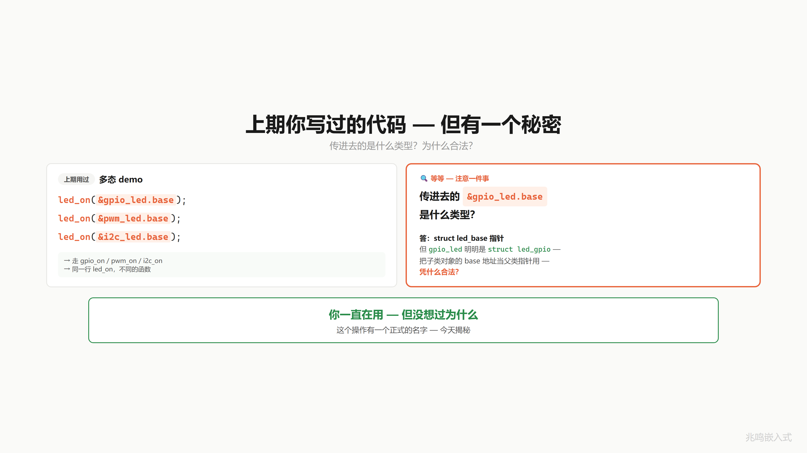
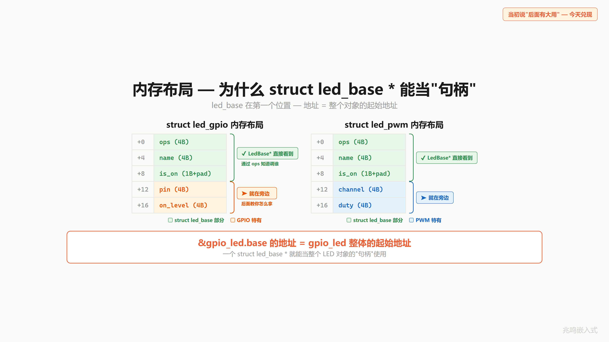
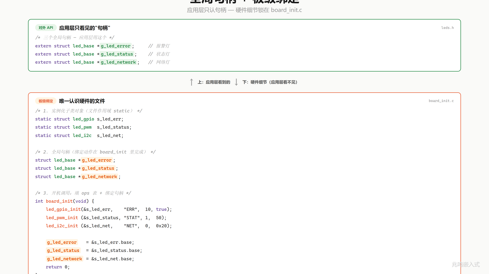
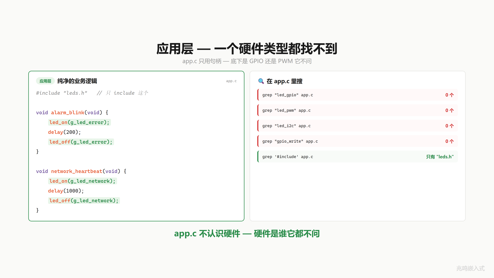
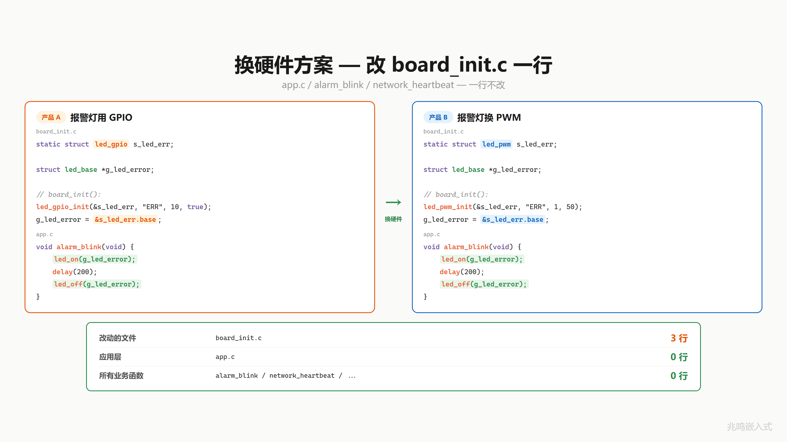
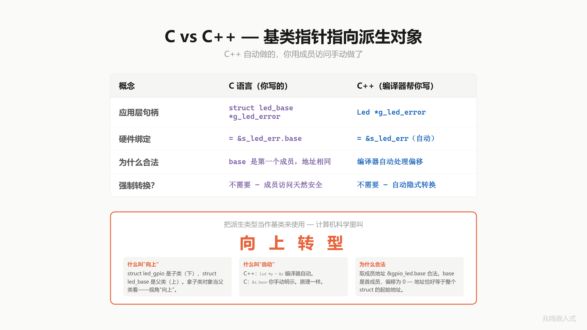

# 第 12 章 · 一个指针指所有 LED · 向上转型

配套代码：[`oop-in-c/code/12-upcasting/`](https://github.com/ZhaoChengBo/zhaoming-embedded/tree/master/oop-in-c/code/12-upcasting/)

## 12.1 上一章的代码里藏着一个秘密

本章配套代码相对第 11 章给 `led_gpio` 加了一个 `on_level` 字段（第四个参数 `true` 表示高电平点亮，低电平点亮就传 `false`），子类构造签名跟着多了一个参数。这个改动 § 12.8.7 会展开，先记住第四个参数是干什么的。

第 11 章末尾你写过这样的调用（已经是 ch12 形态）：

```c
struct led_gpio gpio_led;
led_gpio_init(&gpio_led, "ERR", 10, true);

led_on(&gpio_led.base);   /* 调过去 */
led_off(&gpio_led.base);
```

注意这一行 `&gpio_led.base`。

`led_on` 的参数类型是 `struct led_base *`。`gpio_led` 的类型是 `struct led_gpio`。你把一个 `led_gpio` 对象的 `base` 字段地址，当成 `led_base *` 传了进去。

C 编译器一句话不说就让你过了。这个你一直在用但没仔细想过的事，今天揭穿。



## 12.2 内存布局里的不变量

第 11 章演化出了这个布局（slide 上写作 `LedGpio` / `LedBase`，本书用 Linux 内核风格的 `struct led_gpio` / `struct led_base`，含义一致）：

```c
struct led_gpio {
	struct led_base base;       /* 父类，必须在第一个位置 */
	uint8_t         pin;
	bool            on_level;
};
```

把它在内存里画出来：

```
+---------+---------+---------+      <- &gpio_led
| ops*    | name*   | is_on   | base 部分
+---------+---------+---------+
| pin     | on_lvl  | (pad)   | gpio 自己的部分
+---------+---------+---------+
```

`base` 是子类的第一个字段，位于偏移 0。

C 标准（C99 6.7.2.1 节）保证了一件事：**结构体第一个成员的地址，等于结构体本身的地址**。也就是说：

```c
&gpio_led          == &gpio_led.base   (作为指针值)
sizeof(struct led_gpio) > sizeof(struct led_base)  (但加大不影响起始地址)
```

`&gpio_led.base` 拿到的那个数值，就是 `gpio_led` 整个对象的起始地址。



这一条不变量，是这一章所有威力的根基。

## 12.3 父类指针是通用句柄

有了这个不变量，就有了一个事实：

> 一个 `struct led_base *` 指针，拿到 `&gpio_led.base` 之后，它实际上握着整个 `gpio_led` 对象。

它不是只能看见 base 部分。它握着整个对象。需要的时候（gpio_on 内部要用 pin 字段），可以从 base 反推回去。这一步在第 13 章会展开，本章先承认它能做到。

把这个事实推到极致：

> `struct led_base *` 是任何 LED 对象的通用句柄。

`led_gpio`、`led_pwm`、`led_i2c` 三种子类，背后挂的子类对象不同，对外暴露的都是同一个 `struct led_base *` 类型。应用层只看到这个类型，不知道也不需要知道背后是哪一个子类。

## 12.4 全局句柄 + 板级初始化

把这个事实变成项目结构。

新建一个头文件 `leds.h`，里面只声明全局句柄：

```c
/* leds.h */
#include "led.h"

extern struct led_base *g_led_error;
extern struct led_base *g_led_status;
extern struct led_base *g_led_network;

void board_init(void);
```

应用层只 include 这一个文件。看到的是三个 `struct led_base *`，看不到任何子类类型。

具体硬件呢？锁在另一个文件 `board_init.c`：

```c
/* board_init.c */
#include "leds.h"

static struct led_gpio s_led_err;     /* 文件作用域，外部不可见 */
static struct led_pwm  s_led_status;
static struct led_i2c  s_led_net;

struct led_base *g_led_error;          /* 句柄定义 */
struct led_base *g_led_status;
struct led_base *g_led_network;

int board_init(void)
{
	int rc;

	rc = led_gpio_init(&s_led_err,    "ERR",  10, true);
	if (rc != 0) return rc;
	rc = led_pwm_init (&s_led_status, "STAT",  1, 50);
	if (rc != 0) return rc;
	rc = led_i2c_init (&s_led_net,    "NET",   0, 0x20);
	if (rc != 0) return rc;

	g_led_error   = &s_led_err.base;
	g_led_status  = &s_led_status.base;
	g_led_network = &s_led_net.base;
	return 0;
}
```

三步：实例化子类对象、跑子类构造函数、把 `&xxx.base` 赋给全局句柄。子类 init 返回 `int` 错误码，`board_init` 把任何一颗 LED 的初始化失败原样上抛给 `main`，板级出问题立刻暴露。

最后这三行是这一章的核心。它把 `s_led_err` 这个 `struct led_gpio` 对象，"当作" `struct led_base *` 句柄在用。**子类对象当父类指针看，就是向上转型。**



`board_init` 在 `main` 里开机调一次。这一招在嵌入式叫板级初始化（Board Support Package 的核心）。每个项目一份 `board_init.c`，配置不同板子上 LED 接的是 GPIO 还是 PWM 还是 I2C 扩展芯片。

## 12.5 应用层零硬件字样

来看应用层 `main.c`：

```c
#include "leds.h"

static void alarm_blink(void)
{
	led_on(g_led_error);
	led_off(g_led_error);
}

static void network_heartbeat(void)
{
	led_on(g_led_network);
	led_off(g_led_network);
}
```

打开终端：

```
grep -n "led_gpio\|led_pwm\|led_i2c" main.c       # 0 行
grep -n "gpio_write\|gpio_init"      main.c       # 0 行
grep -n "pwm_\|i2c_\|0x20"           main.c       # 0 行
```

应用层一个硬件字样都没有。它不认识 GPIO、不认识 PWM、不认识 I2C。它只用句柄。



应用层不认识硬件，硬件是谁它都不问。

## 12.6 换硬件改一行

老板说：报警灯要能调光，从 GPIO 换成 PWM。

打开 `board_init.c`，改一行。

```c
/* 改前 */
static struct led_gpio s_led_err;
led_gpio_init(&s_led_err, "ERR", 10, true);
g_led_error = &s_led_err.base;

/* 改后 */
static struct led_pwm s_led_err;
led_pwm_init(&s_led_err, "ERR", 2, 80);
g_led_error = &s_led_err.base;
```

实际上是三行（实例化、init、绑定），都在同一个文件里，一处改完。

`main.c` 呢？打开 grep。`alarm_blink`、`network_heartbeat`、所有业务函数：0 行改动。



改 1 行，换一整套硬件。这就是向上转型的工程化威力。应用层和硬件之间隔着一个 `struct led_base *` 句柄，硬件那头怎么换，句柄这头一律不知道。

## 12.7 这个东西叫什么

你刚才做的事，软件工程里有个名字。

把派生类（`struct led_gpio`）的对象，当作基类（`struct led_base`）来引用、调用、传递，这叫 **向上转型**（upcasting）。

在 C++ 里这一步是隐式的：

```cpp
class LedBase { /* ... */ };
class LedGpio : public LedBase { /* ... */ };

LedGpio gpio_led;
LedBase &handle = gpio_led;       /* 编译器自动认 */
LedBase *p      = &gpio_led;      /* 编译器自动认 */
```

C++ 编译器看见 `LedGpio` 继承自 `LedBase`，不需要任何转换语法，就让基类引用 / 指针绑到派生对象上。

C 里你手动写 `&gpio_led.base`，做的是同一件事：拿到子类内嵌的父类那一段的地址。底层机器码完全一致，都是"把 `gpio_led` 这个对象的起始地址，按 `LedBase *` 类型解读"。



## 12.8 视频里没讲透的几个细节

### 12.8.1 为什么 base 必须在第一个位置

C99 标准 6.7.2.1 节第 13 段保证："结构体的第一个成员的地址等于结构体本身的地址"。后面成员的地址不保证（编译器可以为对齐插 padding）。

所以 `&gpio_led == &gpio_led.base` 这一条只在 base 是第一个成员时成立。如果有一天某个倒霉的同事把 base 移到第二个，下面这种写法就错：

```c
g_led_error = (struct led_base *)&s_led_err;   /* 危险，base 必须在第一个位置 */
```

它把 `s_led_err` 的起始地址直接当 `led_base *` 用。base 一旦不在第一个，地址就偏了，运行时崩。

本书一律不用这种强转。书里用 `&s_led_err.base`，把"取出哪个成员"显式写出来。base 不管在第几个位置，都对。**让编译器自己算偏移**，你别去碰。

### 12.8.2 名字 base 是约定，不是关键字

C 没有继承关键字，`base` 这个字段名是社区约定。Linux 内核里你会看到很多变体：`dev`（`struct device dev`）、`parent`、`super`。叫什么不重要，**第一个字段必须是父类对象**这一点是硬约束。

```c
struct usb_device {
	int devnum;
	/* ... */
	struct device dev;     /* 父类，但不在第一个位置 */
};
```

也合法。但访问父类时只能写 `&usb->dev`，不能强转。Linux 内核里这种安排到处都是，下一章会专门讲怎么应付这种情况。

### 12.8.3 句柄类型要不要 const

`struct led_base *g_led_error;` 这一行有两个潜在写法：

```c
/* 方案 A */
struct led_base *g_led_error;

/* 方案 B */
struct led_base * const g_led_error;   /* 不让别人重新指向 */
```

工程上一般写方案 A。真实项目里 `board_init` 之后偶尔需要重定向（比如热插拔、运行时切换备份硬件），加 const 反而碍事。如果你的项目永远不重定向，加 `const` 没毛病。

### 12.8.4 编译器拒绝的是什么

试一下这一行：

```c
g_led_error = &s_led_err;     /* 类型不匹配 */
```

`&s_led_err` 的类型是 `struct led_gpio *`，`g_led_error` 的类型是 `struct led_base *`。这两个类型在 C 里完全独立，编译器报 `incompatible pointer types`。

C++ 里编译器认识继承关系，会自动把 `LedGpio *` 收窄成 `LedBase *`。C 里编译器不认识，你必须主动告诉它"我要的是 base 那一段"，写成 `&s_led_err.base`。

这一行 `.base` 的本质，就是把 C++ 编译器藏起来的偏移计算（对 base 来说是 0），手动写出来。看上去多此一举，实际上是 C 比 C++ 透明的地方：偏移多少、转换发生在哪一步，全在你眼皮底下。

### 12.8.5 这一招在汇编层面零开销

`g_led_error = &s_led_err.base;` 这一行，`&s_led_err.base` 在编译期被处理成"加上 base 的偏移"。base 在第 0 个位置，偏移就是 0，编译器一条加法指令都不会生成，机器码就是把 `s_led_err` 的地址直接搬过去。

如果有一天 base 不在第一个位置，编译器自动把偏移改成对应数值（比如 4），代码逻辑还对。这就是为什么用 `&xxx.base` 而不用强转：让编译器替你算偏移，永远是对的。

### 12.8.6 这一招在 Linux 内核里的样子

打开 Linux 内核 `drivers/leds/led-class.c`，你会看到：

```c
struct led_classdev {
	const char *name;
	/* ... */
	struct device *dev;
	/* ... */
};
```

`led_classdev` 是 LED 子系统的基类。具体的 LED 驱动（比如 `leds-gpio.c` 里的 GPIO LED）会嵌入这个 `led_classdev`：

```c
struct gpio_led_data {
	struct led_classdev cdev;          /* 基类 */
	struct gpio_desc *gpiod;
	/* ... */
};
```

向上转型时写 `&gpio_data->cdev`。整个 Linux LED 子系统就是这一招的工业级展开。

### 12.8.7 配套代码相对第 11 章的演化点

差异原则详见 preface「配套代码 vs 视频版」。下面是本章具体差异。

打开第 12 章配套代码 `oop-in-c/code/12-upcasting/`，跟第 11 章 `oop-in-c/code/11-polymorphism/` 对一下，会发现两处变化。这些变化在主线叙事里没特别说，这里集中说一下。本章 § 12.1 引的 `led_gpio_init(&gpio_led, "ERR", 10, true)` 和 § 12.2 画的 `struct led_gpio { base; pin; on_level; }`，都已经是下面这个 ch12 的形态。

`struct led_gpio` 加了 `on_level` 字段：

```c
/* ch11: */
struct led_gpio {
	struct led_base base;
	uint8_t         pin;
};

/* ch12: */
struct led_gpio {
	struct led_base base;
	uint8_t         pin;
	bool            on_level;     /* 高电平亮 = true，低电平亮 = false */
};
```

不是所有 LED 都是高电平亮。GPIO 反向接法（共阳极接法）需要拉低电平才点亮。`on_level` 把这个硬件极性差异封装在子类里，应用层 `led_on(handle)` 不用知道具体是高还是低。`led_gpio_init` 也跟着多了一个 `bool on_level` 参数，签名从三参变成四参，返回类型仍是 `int`，跟第 10、11 章一脉相承，所有错误码都向上抛给 `board_init`。

`struct led_ops` 字段集收缩：

```c
/* ch11: */
typedef int (*led_action_fn)(struct led_base *me);

struct led_ops {
	led_action_fn on;
	led_action_fn off;
	led_action_fn toggle;
};

/* ch12: */
struct led_ops {
	int (*on)(struct led_base *me);
	int (*off)(struct led_base *me);
};
```

第 12 章主题是向上转型，应用层只调 `led_on / led_off`，`toggle` 在这一章用不上，先收缩成两字段，让代码更聚焦。`led_action_fn` typedef 也跟着撤掉，改成内联函数指针类型。typedef 一旦字段集不再统一就没意义。第 13 章及以后会按需要再重新加字段。

`led_base.h` / `led_base.c` 跟第 10、11 章一字不改地传下来：父类 `struct led_base` 字段集（`ops` + `name` + `is_on`）和通用 `led_base_init` 都还在，三种子类（GPIO / PWM / I2C）的 init 第一行都调 `led_base_init` 把对应的 ops 表填进去。这样哪天 base 加了一个公共字段（例如 `owner` / `lock`），只改 `led_base_init` 一个点，三种子类的 init 不用动。

## 12.9 你现在的代码在 STM32 上长什么样

应用层 `main.c`、父类 `led.c`、板级 `board_init.c` 一字不改。`platform_pc.c` 替换成 `led_stm32.c`，里面是 `platform_gpio_xxx` 的真实 HAL 实现：

```c
#include "led.h"
#include "stm32f4xx_hal.h"

void platform_gpio_init(uint8_t pin, uint8_t mode)
{
	GPIO_InitTypeDef cfg = {0};
	__HAL_RCC_GPIOA_CLK_ENABLE();
	cfg.Pin   = (uint16_t)(1U << pin);
	cfg.Mode  = (mode == GPIO_MODE_OUTPUT) ?
	            GPIO_MODE_OUTPUT_PP : GPIO_MODE_INPUT;
	cfg.Pull  = GPIO_NOPULL;
	cfg.Speed = GPIO_SPEED_FREQ_LOW;
	HAL_GPIO_Init(GPIOA, &cfg);
}

void platform_gpio_write(uint8_t pin, bool value)
{
	HAL_GPIO_WritePin(GPIOA, (uint16_t)(1U << pin),
	                  value ? GPIO_PIN_SET : GPIO_PIN_RESET);
}

/* ... deinit / read 同样直接调 HAL ... */
```

完整片段见 [`oop-in-c/code/12-upcasting/stm32-snippet/`](https://github.com/ZhaoChengBo/zhaoming-embedded/tree/master/oop-in-c/code/12-upcasting/stm32-snippet/)。

PWM 子类在真实硬件上会用 `HAL_TIM_PWM_Start` + `__HAL_TIM_SET_COMPARE`。I2C 子类会用 `HAL_I2C_Master_Transmit`。这两路不在本章 snippet 里，附录 B 有完整工程。

本节展示的是 ch11 起整本书统一的函数式包装：`platform_gpio_init / platform_gpio_write / platform_gpio_deinit / platform_gpio_read` 四个函数声明在 `common/platform.h`，PC 上跑 printf 模拟，STM32 上跑真实 HAL。上层一字不改。

## 12.10 你现在的代码在 Linux 用户态长什么样

同样把 PC 版的 `platform_pc.c` 换成 `led_linux.c`，sysfs 版本写文件：

```c
#include "led.h"
#include <fcntl.h>
#include <unistd.h>
#include <stdio.h>
#include <string.h>

void platform_gpio_write(uint8_t pin, bool value)
{
	char path[64];
	snprintf(path, sizeof(path),
	         "/sys/class/gpio/gpio%u/value", (unsigned)pin);
	int fd = open(path, O_WRONLY);
	if (fd >= 0) {
		write(fd, value ? "1" : "0", 1);
		close(fd);
	}
}

/* ... init / deinit / read 同样走 sysfs ... */
```

完整片段见 [`oop-in-c/code/12-upcasting/linux-snippet/`](https://github.com/ZhaoChengBo/zhaoming-embedded/tree/master/oop-in-c/code/12-upcasting/linux-snippet/)。

## 12.11 工业代码里的向上转型长什么样

工业控制板项目里，板级初始化是这样：

```c
/* drivers/led/led.h（节选） */
struct led_base;

extern struct led_base *green_led;
extern struct led_base *red_led;
extern struct led_base *blue_led;

/* board/board_init.c（节选） */
static struct led_gpio s_green;
static struct led_gpio s_red;
static struct led_pwm  s_blue;

struct led_base *green_led;
struct led_base *red_led;
struct led_base *blue_led;

void board_init(void)
{
	led_gpio_init(&s_green, "GREEN", PIN_GPIO_GREEN, true);
	led_gpio_init(&s_red,   "RED",   PIN_GPIO_RED,   true);
	led_pwm_init (&s_blue,  "BLUE",  PWM_CHAN_BLUE,  0);

	green_led = &s_green.base;
	red_led   = &s_red.base;
	blue_led  = &s_blue.base;
}
```

应用层任何模块 `#include "led.h"` 之后，能拿到 `green_led`、`red_led`、`blue_led` 三个句柄。要点几下指示灯：

```c
led_on(green_led);
led_off(red_led);
```

应用层代码里 `grep led_gpio` / `grep led_pwm` 全部 0 行。换硬件方案、换板子型号，应用层一行不动。

这就是向上转型在真实工业项目里的最终形态。

## 12.12 跑一遍

```
cd oop-in-c/code/12-upcasting/pc
make
./demo
```

输出节选：

```
=========================================
  ch12 - upcasting
  one led_base * handle, any subclass
=========================================
  [base] "ERR" common init done, ops=0040b1b8
[GPIO] Pin10 init as OUTPUT
[GPIO] Pin10 -> LOW (OFF)
  [base] "STAT" common init done, ops=0040b1f8
  [base] "NET" common init done, ops=0040b250

--- alarm_blink ---
[GPIO] Pin10 -> HIGH (ON)
  [ERR] GPIO Pin10 ON
[GPIO] Pin10 -> LOW (OFF)
  [ERR] GPIO Pin10 OFF

--- network_heartbeat ---
  [NET] I2C bus0 addr=0x20 reg=0x01
  [NET] I2C bus0 addr=0x20 reg=0x00

=========================================
  app layer: zero hardware reference
=========================================
```

开机阶段三行 `[base] "X" common init done` 是父类 `led_base_init` 打的，三种子类 init 第一行都调它把 ops 表填到 base，再各自跑硬件层 init（`[GPIO] Pin10 init as OUTPUT` 这一段就是 GPIO 子类 init 末尾把灯先关掉的过程）。

两个业务函数，两种不同硬件，应用层一行 GPIO/PWM/I2C 字样都没写。这就是向上转型工程化之后的样子。

## 12.13 视频回放

> [《C 语言·向上转型｜一个指针指所有 LED·基类指针·设备句柄》](https://www.bilibili.com/video/BV1N6o4BFEvG/)

## 下一章

应用层只见 `struct led_base *`，挺好。但 `gpio_on` 这个函数收到的也是 `struct led_base *`，它要操作 `pin`，pin 在子类 `struct led_gpio` 里，不在 base 里。怎么从 base 反推回 gpio？

下一章揭穿。Linux 内核有一个宏，优雅到你想裱起来。

下一篇：[第 13 章 · container_of 的地址魔法 · 向下转型](13-container_of.md)
