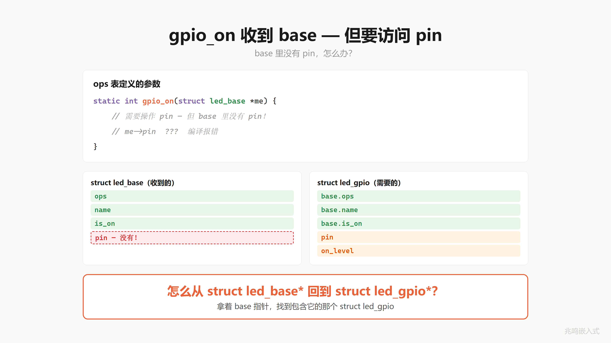
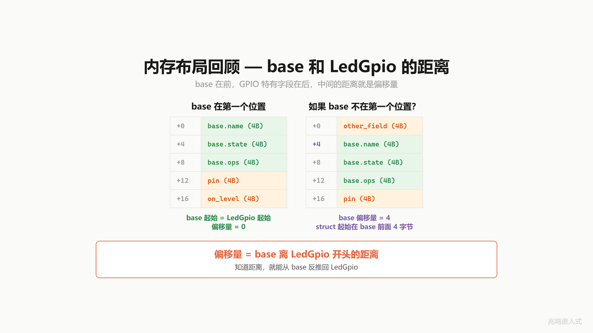
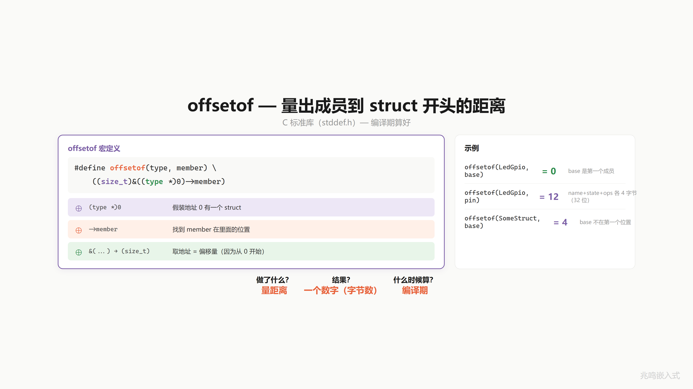
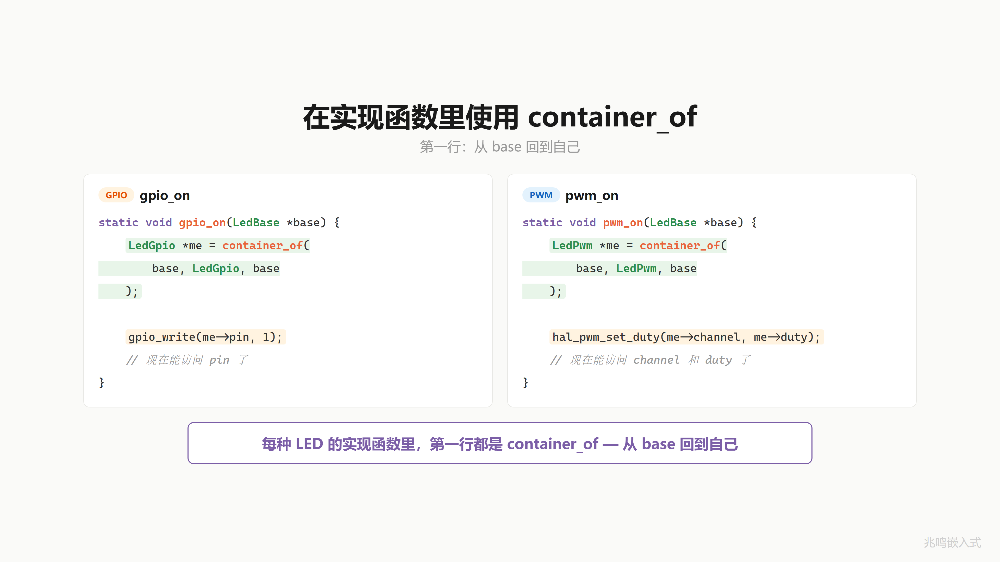
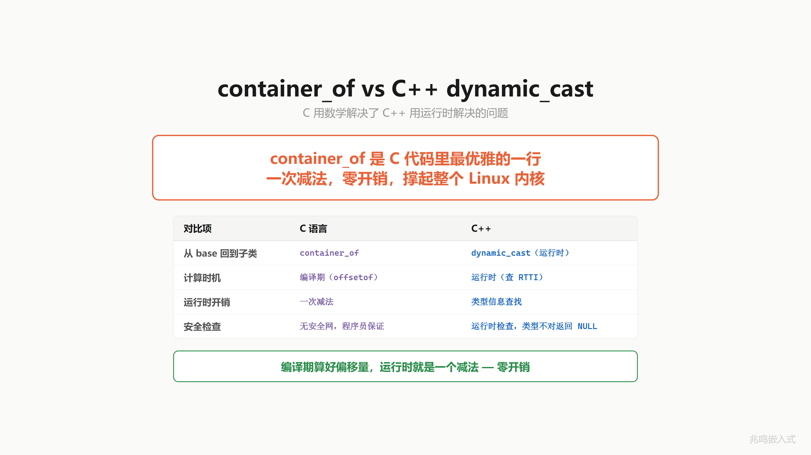

# 第 13 章 · container_of 的地址魔法 · 向下转型

配套代码：[`oop-in-c/code/13-container-of/`](https://github.com/ZhaoChengBo/zhaoming-embedded/tree/master/oop-in-c/code/13-container-of/)

第 12 章解决了向上转型：应用层用 `struct led_base *` 句柄，硬件是谁都不问。

但反过来呢？子类的实现函数 `gpio_on` 收到的也是 `struct led_base *`。它要操作 `pin`，`pin` 在 `struct led_gpio` 里，不在 base 里。怎么从 base 反推回 gpio？

这一章揭穿。

## 13.1 base 里没有 pin

打开第 12 章的 `gpio_on`：

```c
static int gpio_on(struct led_base *me)
{
	struct led_gpio *self = (struct led_gpio *)me;
	platform_gpio_write(self->pin, self->on_level);
	/* ... */
}
```

`me` 的类型是 `struct led_base *`，里面只有 `ops`、`name`、`is_on` 三个字段。`pin` 在外层 `struct led_gpio` 里：

```c
struct led_gpio {
	struct led_base base;       /* 偏移 0 */
	uint8_t         pin;
	bool            on_level;
};
```

第一行 `(struct led_gpio *)me` 把 base 指针强转回外层 struct 指针。这一行能跑，但前提是：**base 必须是 `struct led_gpio` 的第 0 个字段**。

需要的是：拿到 base 指针，反推回那个把它当成员的 `struct led_gpio`。怎么找？



## 13.2 偏移量这件事

仔细看，问题里有两个已知量：

1. me 的地址（base 字段在内存里的位置）
2. base 字段在 struct led_gpio 里的偏移

未知量：struct led_gpio 的起始地址。

只要把已知 1 减去已知 2，就是未知量。

```
struct led_gpio 起始地址 = base 地址 - base 在 struct 里的偏移
```

类比生活：你走在一条路上，看见路牌写着"离起点 300 米"。退 300 米，回到起点。

这段距离叫**偏移量**。base 离 struct led_gpio 开头有多远，就是偏移量。



## 13.3 强转能用但脆弱

回到 `(struct led_gpio *)me` 这一招。base 在偏移 0 时它能跑，因为 base 的地址刚好就是 struct led_gpio 的起始地址。

但如果哪天有人为了对齐、为了字段分组、为了塞一个 `magic` 校验字段，把 base 挪到第二个位置：

```c
struct led_gpio {
	uint16_t        magic;      /* 偏移 0 */
	struct led_base base;       /* 偏移 4（含 padding） */
	uint8_t         pin;
	bool            on_level;
};
```

`(struct led_gpio *)me` 算出来的 self 指针就比 gpio 真实地址早 4 字节。`self->pin` 拿到的是 magic 字段的一部分，崩或乱码。编译器一句话不说就让你过了。

需要的是另一种办法：不管 base 在 struct 里第几个位置，都能正确算出 struct 起点。


## 13.4 编译期算偏移：offsetof

C 标准库（`stddef.h`）有一个宏专门干这件事：

```c
#include <stddef.h>

size_t off = offsetof(struct led_gpio, base);
```

`offsetof(T, m)` 返回成员 `m` 在结构体 `T` 里的字节偏移。

它怎么知道？编译器知道每个 struct 怎么排（每个字段大小、对齐、padding 都是编译器算出来的），所以这个宏在编译期就能展开成一个常量。常见实现是：

```c
#define offsetof(T, m)    ((size_t)&(((T *)0)->m))
```

假装地址 0 处放了一个 T，看 m 在哪个位置。从 0 数起的距离就是偏移量。整个表达式编译期算完，运行时是一个立即数。

做了什么？量距离。结果？一个数字（字节数）。什么时候算？编译期。



## 13.5 三步宏：container_of

下面这个宏第一次看会头疼，先把三件事记住就够：接收**成员指针 + struct 类型 + 成员名**，返回**外层 struct 首地址**，**编译期**算好偏移量、运行时一条减法指令。带着这三件事往下读，每一行能落到对应的位置。

有了 offsetof，把"成员地址减偏移"这一招包成一个宏：

```c
#define container_of(ptr, type, member)             \
	((type *)((char *)(ptr) - offsetof(type, member)))
```

三步：

1. `(char *)(ptr)`：转成字节指针，让减法按字节算（`int *` 减 1 减的是 4 字节）。
2. `- offsetof(type, member)`：减去成员在外层 struct 里的偏移，退回 struct 起点。
3. `(type *)`：把结果按外层 struct 的类型解读。

一次减法。编译期算好偏移量，运行时零开销。

注意一个事实：**`container_of` 不在 C 标准里**。它是 Linux 内核自己写的宏，用 offsetof 构造出来。本书配套代码 `pc/container_of.h` 里就是上面这个最简版。Linux 内核真实版还在外面包了 `static_assert` 做编译期类型检查、用 statement expression 把 ptr 抓到局部变量避免重求值，原理同，细节见 § 13.8.4。


## 13.6 在 gpio_on 里用一下

把第 12 章的 `gpio_on` 改成 container_of 版本：

```c
#include "container_of.h"

static int gpio_on(struct led_base *me)
{
	struct led_gpio *self = container_of(me, struct led_gpio, base);
	platform_gpio_write(self->pin, self->on_level);
	me->is_on = true;
	return 0;
}
```

注意第三个参数 `base`，是成员名，不是变量名。这一行字面意思："给我从 me 出发，找到那个把 me 当作 `base` 字段的 `struct led_gpio` 对象"。

PWM、I2C 子类同套路，每个实现函数第一行都是 container_of。

> 为了证明 container_of 与位置无关，本章配套代码故意把 GPIO 子类的 base 挪到第二个字段、前面加一个 `magic` 占位。这是教学变形。真实工业代码里 base 仍然推荐放在第一个位置：向上转型零开销（不需要算偏移），取 ops 表也是单条 LDR 指令。换 magic 在前，container_of 一字不改，这才是它的核心威力。位置无关性的具体演示见 § 13.8.2。



## 13.7 这个东西叫什么

你刚才做的这件事，拿到一个父类指针，反推回原本的子类对象，计算机科学里叫**向下转型**（downcasting）。

C++ 的对应物是 `dynamic_cast`：

```cpp
LedBase *base = ...;
LedGpio *gpio = dynamic_cast<LedGpio *>(base);
if (gpio) {
	gpio->pin = ...;
}
```

`dynamic_cast` 干两件事：

1. 编译期检查 `LedBase` 和 `LedGpio` 之间真有继承关系（不然报错）。
2. 运行时查 RTTI（Run-Time Type Information）表，确认 base 指针指向的是不是真的 `LedGpio` 对象，不是就返回 nullptr。

C++ 给你一张安全网。代价是有运行时开销：每个含 virtual 函数的类要带上 type_info 元数据，dynamic_cast 调用要走这一层。

container_of 没有安全网，但代价是零：

> container_of 一旦编译完，就是一条减法指令。零运行时开销。

C 用编译期数学解决了 C++ 用运行时类型信息解决的同一个问题。

第 12 章看的是 C++ 偏移加法的手写版，第 13 章看的是 C++ RTTI 查表的零开销替代版。两章一起讲完了 C++ 类型转换的对偶。



## 13.8 视频里没讲透的几个细节

### 13.8.1 编译器算偏移的过程

```c
struct led_gpio {
	uint16_t        magic;     /* 偏移 0，2 字节 */
	struct led_base base;      /* 偏移 4 */
	uint8_t         pin;
	bool            on_level;
};
```

为什么 base 不在偏移 2 而在偏移 4？因为 `struct led_base` 第一个成员是 `const struct led_ops *ops`，指针在 32 位机器上对齐 4 字节，所以编译器在 `magic` 后面塞 2 字节 padding，让 base 落到 4 的倍数。

`offsetof(struct led_gpio, base)` 在编译期算出 4，编进 container_of 宏。运行时就是一句 `sub r0, r0, #4`。

### 13.8.2 base 想放哪就放哪

为了把"位置无关"看见，配套代码故意把 GPIO 子类的 base 挪到第二个位置：

```c
struct led_gpio {
	uint16_t        magic;
	struct led_base base;
	uint8_t         pin;
	bool            on_level;
};
```

跑一下 `./demo`，节选 GPIO 子类那一段：

```
offsetof(struct led_gpio, base) = 4
offsetof(struct led_pwm,  base) = 0
offsetof(struct led_i2c,  base) = 0

  [base] "ERR" common init done, ops=...
[GPIO] Pin10 init as OUTPUT
[GPIO] Pin10 -> LOW (OFF)

--- toggle ERR ---
[GPIO] Pin10 -> HIGH (ON)
  [ERR] GPIO Pin10 ON (magic=0xCAFE)
[GPIO] Pin10 -> LOW (OFF)
  [ERR] GPIO Pin10 OFF
```

GPIO 的 base 在偏移 4，但 `gpio_on` 还是正确还原了 `magic = 0xCAFE`、`pin = 10`、`on_level = true`。container_of 和位置无关。

如果把 `container_of` 换回第 12 章的 `(struct led_gpio *)me`，self 指针位置算错 4 字节，`magic` 当场变成乱码。

### 13.8.3 container_of 在内核里出现多少次

整个 Linux 内核源码 `git grep -c container_of` 大概 4-5 万处。从字符设备到网络栈到块层到内存管理子系统，到处都是这一行。

它撑起了 Linux 整套"基类（subsystem 的 struct）+ 子类（驱动 driver 的 struct）"模式。读到内核任何一个驱动的回调函数，第一行十有八九就是 container_of。

### 13.8.4 Linux 内核版宏剖析（硬核·可跳过）

刚学完 § 13.5 那个三步宏不需要看这一节。这里只是给后面真正读 Linux 内核源码的人留个完整记录，知道内核里那个长得吓人的版本到底在干什么。

完整版定义在 Linux 内核 v6.6 LTS `include/linux/container_of.h` 第 18-23 行（如何获取内核源码做参考阅读见附录 D）：

```c
#define container_of(ptr, type, member) ({                              \
	void *__mptr = (void *)(ptr);                                   \
	static_assert(__same_type(*(ptr), ((type *)0)->member) ||       \
		      __same_type(*(ptr), void),                        \
		      "pointer type mismatch in container_of()");       \
	((type *)(__mptr - offsetof(type, member))); })
```

内核版用 GNU C 的 statement expression（`({ ... })`）多包了一层。一行行看：

第一行 `void *__mptr = (void *)(ptr);` 把传进来的 ptr 抓到一个局部 void 指针变量。两个理由：

1. **避免重求值**。如果你写 `container_of(get_next_base(), struct led_gpio, base)`，`get_next_base()` 是函数调用。最简版那个三步宏会把 `(ptr)` 展开两次（一次进 char 强转、一次进 type 强转），等于调两次 `get_next_base()`，第二次返回值可能完全不一样。statement expression 把 ptr 求值一次，存进 `__mptr`，后面的步骤都用 `__mptr` 不再碰 ptr。**所以 container_of 的入参表达式不要带副作用**。配套代码那个最简版没做这一层防护，写代码时尽量传一个已经求值好的指针变量。
2. **统一指针类型**。后面要做减法，`__mptr` 用 void * 类型，让 GCC 把它当字节指针算（GCC 扩展里 `void *` 算术合法），写起来比 `(char *)` 干净。

第二行的 `static_assert + __same_type`：

```c
static_assert(__same_type(*(ptr), ((type *)0)->member) ||
	      __same_type(*(ptr), void),
	      "pointer type mismatch in container_of()");
```

`static_assert` 是 C11 关键字（C++11 也有），编译期断言。`__same_type` 是 GCC 扩展，比较两个表达式的类型是不是一致。整行字面意思：**编译期检查 `ptr` 指向的类型和 `((type *)0)->member` 的类型一致**。

为什么必要？看个错例：

```c
struct led_gpio {
	struct led_base base;
	uint8_t         pin;
};

struct led_pwm {
	struct led_base base;
	uint8_t         channel;
};

void f(struct led_base *me)
{
	struct led_gpio *self = container_of(me, struct led_pwm, base);
	/* 笔误，写成了 led_pwm */
	self->pin = 99;   /* 但 led_pwm 没有 pin 字段 */
}
```

老的最简版 container_of 这个错要等到链接报错才发现（甚至有时候不会报）。内核版的 `static_assert` 在你写 container_of 这一行就编译失败：`*(ptr)` 是 `struct led_base`，`((struct led_pwm *)0)->base` 也是 `struct led_base`，看起来相同。但如果你写的是 `container_of(some_int_ptr, struct led_gpio, base)`，`*(some_int_ptr)` 是 int，`((struct led_gpio *)0)->base` 是 struct led_base，不同，立刻报 `pointer type mismatch in container_of()`。

把"传错指针"挡在编译期，是这个 static_assert 的核心价值。第二个 OR 条件 `__same_type(*(ptr), void)` 是放行 `void *` 入参（少数代码这么用）。

第三行才是真正的减法：

```c
((type *)(__mptr - offsetof(type, member)));
```

statement expression 的"返回值"是最后一条语句的值，整个 `({ ... })` 求值结果就是这条减法表达式的结果。

**const 属性会在这里丢**。Linux 内核版 container_of 注释里特意写了：

> WARNING: any const qualifier of @ptr is lost.

```c
const struct led_base *me = ...;
struct led_gpio *self = container_of(me, struct led_gpio, base);
self->pin = 99;     /* 编译过，但破坏了 me 的 const 承诺 */
```

container_of 的实现里有一步 `(char *)(ptr)`（最简版）或 `(void *)(ptr)`（内核版），强转之后 const 就没了。Linux 内核 6.5 之后引入了 `container_of_const` 用 `_Generic` 保住 const，但老代码到处都在用裸的 container_of。需要严格 const-correctness 时手动检查一下。

PC 上不依赖 GNU C 扩展的最简版就是 § 13.5 那个三步宏，本书配套代码 `pc/container_of.h` 里就是这一份。逻辑等价，编译期约束少一点，PC 上跑没影响。生产代码里可以直接用内核版，那个 static_assert 能在 commit 前帮你抓住低级错。

### 13.8.5 配套代码 ops 表多了一个字段：set_brightness

差异原则详见前言「配套代码 vs 视频版」。下面是本章具体差异。

打开本章配套代码 `oop-in-c/code/13-container-of/pc/led.h`，会发现 `struct led_ops` 比第 12 章多了一个字段：

```c
struct led_ops {
	int (*on)(struct led_base *me);
	int (*off)(struct led_base *me);
	int (*set_brightness)(struct led_base *me, uint8_t brightness);  /* 第 13 章新增 */
};
```

PWM 子类填了 `pwm_set_brightness`，按 duty 调亮度。GPIO 和 I2C 子类没填，`set_brightness` 字段保持 NULL。

为什么这一章就把 `set_brightness` 加进 ops 表？因为后续章节代码包沿用同一份字段集，提前加进去，跨章演化更平滑。这一章的主线还是 container_of，`set_brightness` 字段只是顺便挂上。

至于"`set_brightness` 字段为 NULL 怎么办"、"PWM 填、GPIO 不填这种'子类各自决定'怎么处理"，正是第 14 章「虚函数不实现 · 三种策略」的主题。这一章先把字段挂上，下一章展开机制。

main.c 里有 `led_set_brightness(handles[1], 60)` 的调用，跑 demo 能看到 PWM 灯的 duty 从 50% 调到 60%、再调到 0%。具体输出见 § 13.12。

## 13.9 你现在的代码在 STM32 上长什么样

container_of 在 STM32 上是同一个宏，编译产物就是 ARM Cortex-M 的 `SUB Rd, Rn, #imm`。STM32 工程里你直接 `#include <linux/types.h>` 不行（那是内核头），但 STM32CubeIDE 的 `arm-none-eabi-gcc` 自带 `<stddef.h>`，offsetof 一直可用。把 § 13.5 那个三步宏放进 utility 头文件就能用。

本节用的是函数式包装的教学简化版（4 个 `platform_gpio_*` 独立函数）。真正工业级的 platform 抽象用 ops 表（虚函数表）。第 16 章会把 platform 层从函数式升级成 ops 表式（gpio_chip 子系统），和工业代码对齐。

完整 STM32 snippet 见 [`oop-in-c/code/13-container-of/stm32-snippet/`](https://github.com/ZhaoChengBo/zhaoming-embedded/tree/master/oop-in-c/code/13-container-of/stm32-snippet/)。

## 13.10 你现在的代码在 Linux 用户态长什么样

Linux 用户态可以直接借 `<stddef.h>` 的 offsetof。绝大多数 user-space 项目自定义自己的 container_of 宏，比如 systemd、gobject、libnl 都各写一份，逻辑都一样。在 Linux 用户态写 OOP 风格 C 代码，container_of 这一招几乎是入场券。

本节同样是函数式包装的教学简化版（sysfs 实现的 4 个 `platform_gpio_*`），ops 表式重构在 ch15 展开。

完整 Linux 用户态 snippet 见 [`oop-in-c/code/13-container-of/linux-snippet/`](https://github.com/ZhaoChengBo/zhaoming-embedded/tree/master/oop-in-c/code/13-container-of/linux-snippet/)。

## 13.11 工业代码里的 container_of

工业控制板 driver 里：

```c
/* drivers/encoder/encoder.h */
struct encoder_base;

struct encoder_ops {
	int (*read)(struct encoder_base *me, int32_t *count);
	int (*reset)(struct encoder_base *me);
};

struct encoder_base {
	const struct encoder_ops *ops;
	const char               *name;
};

/* drivers/encoder/encoder_quad.c */
struct encoder_quad {
	struct encoder_base base;
	int32_t             count;
	uint8_t             a_pin;
	uint8_t             b_pin;
};

static int quad_read(struct encoder_base *me, int32_t *count)
{
	struct encoder_quad *self = container_of(me, struct encoder_quad, base);
	*count = self->count;
	return 0;
}
```

整个工业项目里，10 多个 driver 模块，每个子类实现函数第一行都是 container_of。这一行已经稳定到所有同事看一眼就知道意思，不需要解释。

读完这一章，你拿到内核源码、读到 driver 源码、读到 GObject 源码，第一行的 container_of 不会再让你头疼。

## 13.12 跑一遍

```
cd oop-in-c/code/13-container-of/pc
make
./demo
```

完整输出：

```
=========================================
  ch13 - container_of
=========================================
offsetof(struct led_gpio, base) = 4
offsetof(struct led_pwm,  base) = 0
offsetof(struct led_i2c,  base) = 0

  [base] "ERR" common init done, ops=...
[GPIO] Pin10 init as OUTPUT
[GPIO] Pin10 -> LOW (OFF)
  [base] "STAT" common init done, ops=...
  [base] "NET" common init done, ops=...

--- toggle ERR ---
[GPIO] Pin10 -> HIGH (ON)
  [ERR] GPIO Pin10 ON (magic=0xCAFE)
[GPIO] Pin10 -> LOW (OFF)
  [ERR] GPIO Pin10 OFF

--- toggle STAT ---
  [STAT] PWM ch1 duty=50%
  [STAT] PWM ch1 duty=0%

--- toggle NET ---
  [NET] I2C bus0 addr=0x20 reg=0x01
  [NET] I2C bus0 addr=0x20 reg=0x00

--- breath stat ---
  [STAT] PWM ch1 duty=60%
  [STAT] PWM ch1 duty=0%

=========================================
  base offset != 0 still works
=========================================
```

几处看点：

- `offsetof(struct led_gpio, base) = 4` 证明 GPIO 子类 base 故意挪到了第二个位置（`magic` 占了前 2 字节 + 2 字节 padding）。
- 三行 `[base] "..." common init done` 是 `led_base_init` 打的，跟 ch10 / ch11 一样：每个子类 init 第一行调 `led_base_init`，把对应的 const ops 表交给 base，共有字段一次填好。`ops=...` 是表的运行时地址，每次链接会变。
- `[ERR] GPIO Pin10 ON (magic=0xCAFE)` 这一行里 `magic = 0xCAFE` 准确还原，证明 `container_of` 在 base 偏移 4 的布局下也能正确反推回 `struct led_gpio` 起点。
- `--- breath stat ---` 段是 `led_set_brightness(handles[1], 60)` 和 `led_set_brightness(handles[1], 0)` 两次调用的输出。STAT 是 PWM 子类，填了 `pwm_set_brightness`，duty 从 60% 改到 0%。GPIO 和 I2C 子类没填这个字段，具体行为见第 14 章「虚函数不实现 · 三种策略」。

## 13.13 视频回放

> [《C 语言·向下转型｜container_of·从成员反推 struct》](https://www.bilibili.com/video/BV1LEo4B5EZu/)

## 下一章

类型机制完整了：上转下转都能干。

但还有一个洞：如果某种 LED 的 ops 表里 `on` 没填呢？应用层调 `led_on(handle)` 内部走到 `me->ops->on(me)`，NULL 被当函数地址跳过去，程序直接崩。

下一章：虚函数不实现会怎样。

下一篇：[第 14 章 · 虚函数不实现 · 三种策略](14-纯虚与抽象类.md)
