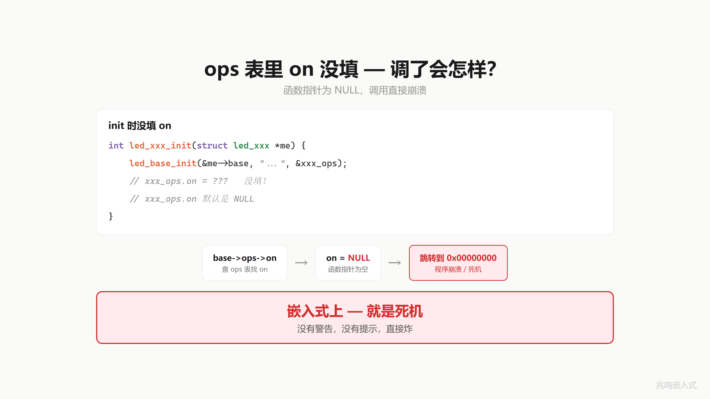
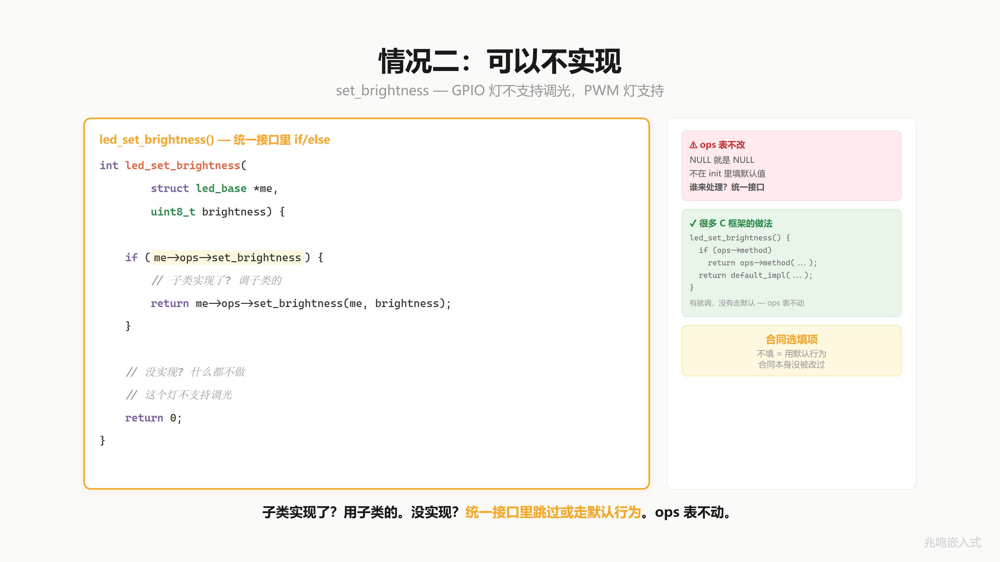
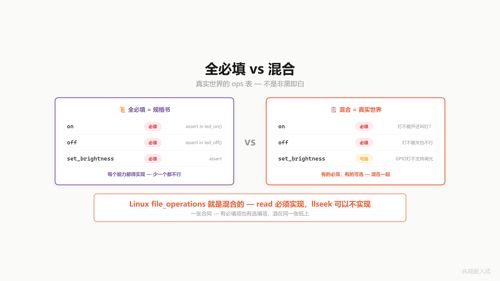
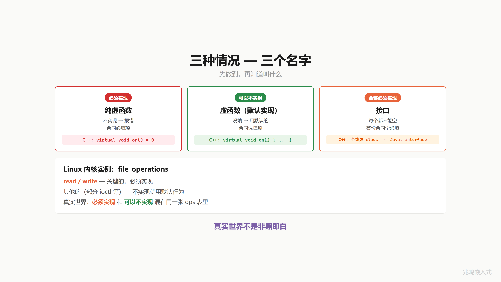

# 第 14 章 · 虚函数不实现 · 三种策略

配套代码：[`oop-in-c/code/14-pure-virtual/`](https://github.com/ZhaoChengBo/zhaoming-embedded/tree/master/oop-in-c/code/14-pure-virtual/)

类型机制完整了，上转下转都能干。但 ops 表里有一颗雷你可能还没意识到：如果某种 LED 在 `init` 的时候，`ops->on` 没填呢？

## 14.1 ops 表里有一颗雷 · NULL 函数指针崩溃

第 11 章演化出来的 `led_on` 长这样：

```c
int led_on(struct led_base *me)
{
	return me->ops->on(me);
}
```

如果某个子类 ops 表少填了 `on`：

```c
static const struct led_ops broken_ops = {
	.off = my_off,
	/* on 忘了填 */
};
```

C 标准说静态存储的对象未显式初始化的字段会被零初始化，所以 `broken_ops.on` 是 NULL。

应用层调 `led_on(handle)`，进到 `me->ops->on(me)`，把 NULL 当函数地址跳过去。在 STM32 上一般是 0 地址（向量表起点），跳进去取出"函数指针"再跳，行为不可预测，多半是 HardFault 死循环。在 Linux 用户态收到 SIGSEGV，进程当场死。

编译器一句话不说就让你过了。它觉得你是故意填 NULL 的。



## 14.2 必填策略 · 调用前 assert

第一种做法：在统一接口里加一行检查。

```c
int led_on(struct led_base *me)
{
	if (!me)
		return -1;

	assert(me->ops && me->ops->on &&
	       "led_on: subclass must implement on()");
	return me->ops->on(me);
}
```

`assert` 在调试构建里直接 abort，告诉你哪个文件哪一行触发了。Release 构建把 `NDEBUG` 打开，assert 编译产物直接消失，0 开销。

调试期就抓住"忘记实现"的子类。这一类操作叫 **必填**，子类不实现，整个对象无效。

灯的 `on` 和 `off` 就是必填。一颗灯不能开、不能关，那还叫什么灯？合同里的必填项，不填合同无效。


## 14.3 选填策略 · 父类提供默认行为

但有些操作不是每种子类都需要自己实现。

`set_brightness`：PWM 灯支持调光，GPIO 灯不支持。GPIO 灯只有"开"和"关"，没有亮度概念。

如果让 `led_set_brightness` 也走 `assert` 必填策略，GPIO 子类就得写一个空函数：

```c
static int gpio_set_brightness(struct led_base *me, uint8_t b)
{
	(void)me;
	(void)b;
	return 0;        /* 啥都不做 */
}
```

每个不支持调光的子类都得写一个空函数，烦。

更好的做法：把"安静跳过"的默认行为放到统一接口里：

```c
int led_set_brightness(struct led_base *me, uint8_t brightness)
{
	if (!me || !me->ops)
		return -1;

	if (!me->ops->set_brightness) {
		/* 默认行为：这种 LED 不支持调光，安静跳过 */
		return 0;
	}
	return me->ops->set_brightness(me, brightness);
}
```

子类填了 `set_brightness` 就走子类。子类没填，统一接口走默认。**ops 表本身从来不改**，NULL 就是 NULL，处理这个 NULL 的责任落在父类的统一接口上。

这一类操作叫 **选填**。合同里的选填项，不填用默认条款，但合同主体没改过。



## 14.4 全必填策略 · 接口（interface）

把策略推到极致：如果一张 ops 表里每一个 op 都是必填呢？

```c
struct sensor_ops {
	int (*read)(struct sensor *me, int32_t *out);
	int (*calibrate)(struct sensor *me);
	int (*self_test)(struct sensor *me);
};

int sensor_read(struct sensor *me, int32_t *out)
{
	assert(me->ops && me->ops->read);
	return me->ops->read(me, out);
}

int sensor_calibrate(struct sensor *me)
{
	assert(me->ops && me->ops->calibrate);
	return me->ops->calibrate(me);
}

int sensor_self_test(struct sensor *me)
{
	assert(me->ops && me->ops->self_test);
	return me->ops->self_test(me);
}
```

三个 op 全部 assert。任何 sensor 子类要加进这套体系，三件套必须全填。少一个，调试期立刻爆。

这种"全是必填的 ops 表"，软件工程里叫 **接口**（interface）。一份只有规格、没有实现的合同。



真实工业项目里，传感器、电机、通讯模块这种"加入体系就要完整实现"的对象，ops 表都是接口风格。LED 这种"有些操作可有可无"的对象，是必填 + 选填混合。

## 14.5 三种策略一张表

把刚才三种放一起看：

| 策略 | C 里的写法 | C++ 里的写法 | 子类不填的后果 |
|---|---|---|---|
| 必填 | 统一接口里 `assert` | 纯虚函数 `virtual void f()=0;` | 调试期 assert 失败 / C++ 编译器拒绝实例化子类 |
| 选填 | 统一接口里检查 NULL，提供默认 | 虚函数有默认实现 `virtual void f() {...}` | 子类继承父类默认行为 |
| 全必填 | ops 表所有字段都走必填 | 全是纯虚函数的类（"接口"）| 子类必须实现每一个 |

C++ 里编译器替你把这三种区分开。C 里你自己在统一接口里实现这套区分。底下逻辑一样。



Linux 内核的 `struct file_operations` 就是混合策略的代表：`read` / `write` 这种关键操作必填，`unlocked_ioctl` / `mmap` 这些选填，文件系统不支持就 NULL，VFS 层走默认行为。第 16 章会展开 file_operations 的实例。

## 14.6 C 对比 C++

```cpp
class LedBase {
public:
	virtual int on()  = 0;          /* 纯虚（必填） */
	virtual int off() = 0;          /* 纯虚 */

	virtual int set_brightness(uint8_t b) {   /* 虚（选填，有默认） */
		(void)b;
		return 0;
	}
};

class LedGpio : public LedBase {
public:
	int on() override  { /* ... */ return 0; }
	int off() override { /* ... */ return 0; }
	/* set_brightness 不实现，继承父类默认 */
};
```

C++ 编译器看到子类没实现 `on` / `off`，**编译期拒绝**让你 `LedGpio gpio_led;`：抽象类不能直接实例化。

C 里编译器一句话不说，运行时 assert 才发现。区别只在出错的时机。

一句话：**C 语言自己约束自己，C++ 编译器约束你**。


## 14.7 视频里没讲透的几个细节

### 14.7.1 assert 在 release 构建里防线

assert 在 release 构建里被 `NDEBUG` 关掉。生产代码里如果你只靠 assert，关掉之后那一行就成了空语句，NULL 又能打过来了。

更稳的做法：assert + 错误返回值并存。

```c
int led_on(struct led_base *me)
{
	if (!me)
		return -1;

	assert(me->ops && me->ops->on);
	if (!me->ops || !me->ops->on)
		return -2;          /* release 构建的最后一道闸 */

	return me->ops->on(me);
}
```

调试期 assert 帮你定位问题，生产期错误码兜底。两个都不能少。

### 14.7.2 ops 表一定要 const

工业项目里 ops 表都是这样定义：

```c
static const struct led_ops gpio_ops = {
	.on  = gpio_on,
	.off = gpio_off,
};
```

`static const` 意味着这个表在编译期就确定，链接到 `.rodata` 段（只读）。运行时任何修改都会触发段错误。

为什么要 const？两个理由：

1. **安全**：跑飞的代码可能踩到 ops 表，把 `on` 改成野指针。const + .rodata 让这种踩踏立刻爆出来，比静默崩好。
2. **缓存**：所有相同子类的对象共享一份 ops 表（一个 ops 实例服务全部 GPIO LED 对象），只读段对 cache 友好。

### 14.7.3 接口还是混合：什么时候选哪种

什么时候用全必填的接口风格，什么时候用必填 + 选填混合？

如果 ops 里的每一个 op，子类都必须自己实现才有意义，那就是接口。例子：sensor 模块的 read / calibrate / self_test，每一个传感器都得自己提供。

如果 ops 里有些 op 是"通用默认行为可用、子类需要的话覆写"，那就是混合。例子：LED 的 set_brightness，大部分 LED 默认走"不支持调光"是合理的。

判据：**没有合理的默认行为 → 必填 → 接口风格**。**有合理默认 → 选填 → 混合**。

读源码遇到一个 ops 表先看父类的统一接口怎么处理 NULL：每一个 NULL 都 assert，那是接口；有些 NULL 走默认行为，那是混合。

### 14.7.4 __cxa_pure_virtual：C++ 里那个占位地址

```cpp
virtual int on() = 0;     /* 纯虚 */
```

C++ 这个 `= 0` 不是赋值。它是一个语法占位，告诉编译器"这个函数没实现，子类必须实现"。底层做法是给虚函数表的对应槽位填一个特殊地址（一般是 `__cxa_pure_virtual`），子类没覆写就调到这个特殊函数，运行时报"pure virtual function called"。

C 里你手动让 ops 表的对应字段保持 NULL，再在统一接口里 assert，做的是同一件事。C++ 把这一招用语法藏起来，C 让你看见齿轮。

和你 ch11 学的 ops 分发是同一个机制。

### 14.7.5 默认行为长什么样

`led_set_brightness` 的默认是"安静跳过"。但默认也可以是别的。比如：

```c
int led_set_brightness(struct led_base *me, uint8_t brightness)
{
	if (!me || !me->ops)
		return -1;

	if (me->ops->set_brightness)
		return me->ops->set_brightness(me, brightness);

	/* 默认：用 on/off 模拟 brightness */
	if (brightness > 50)
		return me->ops->on(me);
	else
		return me->ops->off(me);
}
```

GPIO 灯虽然不支持真调光，亮度大于 50% 就开、小于就关，也是一种合理默认。

默认行为是父类设计的责任。子类要的"非默认"才填 ops 字段。

## 14.8 一句金句

接口是一份合同 · 签了就必须全部履行。


## 14.9 你现在的代码在 STM32 上长什么样

assert 在 STM32 上要小心：默认实现会调 `__assert_func`，里面常常是 `printf("..."); abort()`。printf 在 MCU 上要 retarget UART，abort 默认会跑 `_exit` 死循环。生产代码倾向于把 assert 替换成项目自己的错误日志 + 复位机制：

```c
#define ASSERT(cond)							\
	do {								\
		if (!(cond)) {						\
			error_log(__FILE__, __LINE__, #cond);		\
			system_reset();					\
		}							\
	} while (0)
```

错误日志写到非易失存储，下次开机能拉出来看哪一行炸了。完整 STM32 snippet 见 [`oop-in-c/code/14-pure-virtual/stm32-snippet/`](https://github.com/ZhaoChengBo/zhaoming-embedded/tree/master/oop-in-c/code/14-pure-virtual/stm32-snippet/)。

## 14.10 你现在的代码在 Linux 用户态长什么样

Linux 用户态 assert 直接走 glibc 的实现，会把诊断信息打到 stderr 然后 abort。core dump 如果 ulimit 开了，gdb 拉出来能看到完整调用栈。

完整 Linux 用户态 snippet 见 [`oop-in-c/code/14-pure-virtual/linux-snippet/`](https://github.com/ZhaoChengBo/zhaoming-embedded/tree/master/oop-in-c/code/14-pure-virtual/linux-snippet/)。

## 14.11 工业代码里的策略选择

工业控制板的 led 模块用混合策略（on / off 必填，set_brightness 选填），和本章 14.3 节一致。motor 模块就不一样，motor_base 的 ops 表有 24 个 op，全部必填：

```c
struct motor_ops {
	int (*init)(struct motor_base *me, const struct motor_cfg *cfg);
	int (*deinit)(struct motor_base *me);
	int (*enable)(struct motor_base *me);
	int (*disable)(struct motor_base *me);
	int (*set_target_position)(struct motor_base *me, int32_t pos);
	int (*get_current_position)(struct motor_base *me, int32_t *pos);
	int (*set_target_speed)(struct motor_base *me, int32_t speed);
	int (*emergency_stop)(struct motor_base *me);
	/* ... 还有 16 个 ... */
};
```

电机这种安全相关、行为复杂的对象，每一个 op 子类都必须明确表态，能做就实现，不能做就报错返回。没有"合理默认"。motor_ops 是接口风格的典型。

判据回到 14.7.3：**有没有合理的默认**。没有，全必填，做成接口。有，混合。

## 14.12 跑一遍

```
cd oop-in-c/code/14-pure-virtual/pc
make
./demo
```

输出节选：

```
[GPIO] Pin10 init as OUTPUT

=========================================
  ch14 - pure virtual / virtual / interface
=========================================

--- 1. GPIO LED, no dimming support ---
[GPIO] Pin10 -> HIGH (ON)
  [ERR] GPIO Pin10 ON
[GPIO] Pin10 -> LOW (OFF)
  [ERR] GPIO Pin10 OFF
  [ERR] no dimming support, skip (brightness=50)

--- 2. PWM LED, full ops ---
  [STAT] PWM ch1 duty=50%
  [STAT] PWM ch1 duty=70%
  [STAT] PWM ch1 duty=0%

--- 3. sensor, all required ---
  [TEMP] self_test
  [TEMP] calibrate
  [TEMP] read = 25 C
```

GPIO 灯调 set_brightness 走默认行为（"no dimming support, skip"），不崩。PWM 灯三件套全填，每次都走子类。sensor 三件套全必填，调过去都能进子类实现。

如果你想体验"忘了填 on"的崩溃：把 led_gpio_init 里的 `me->base.ops = &gpio_ops;` 改成 `me->base.ops = NULL;`，再编译跑，`led_on` 里的 assert 立刻报错。

## 14.13 视频回放

> [《C 语言·虚函数不实现会怎样｜纯虚·虚函数·接口》](https://www.bilibili.com/video/BV1ZeoxB5EGS/)

## 下一章

封装、继承、多态、向上转型、向下转型、纯虚 / 虚 / 接口，C 里做 OOP 的全套武器你都见过了。

但你还没见过它们组装在一起在一个真实项目里跑的样子。下一章把武器全部组装起来，演示一套完整的 LED 框架，换硬件应用层 0 改动。

下一篇：[第 15 章 · 换硬件不改应用 · OOP 完整框架](15-Platform抽象.md)
