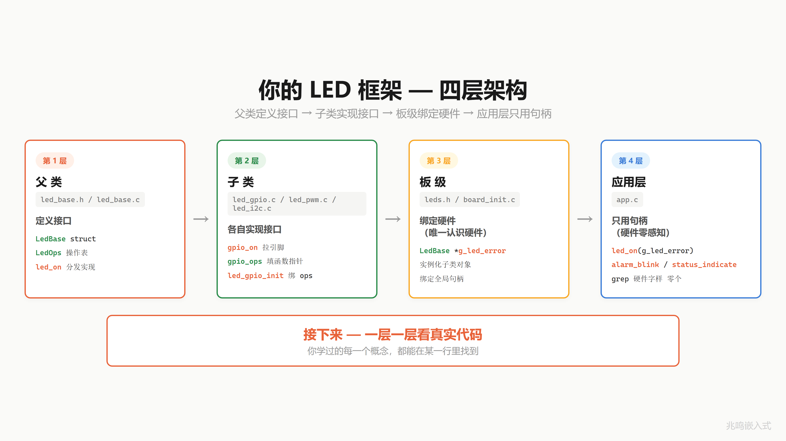
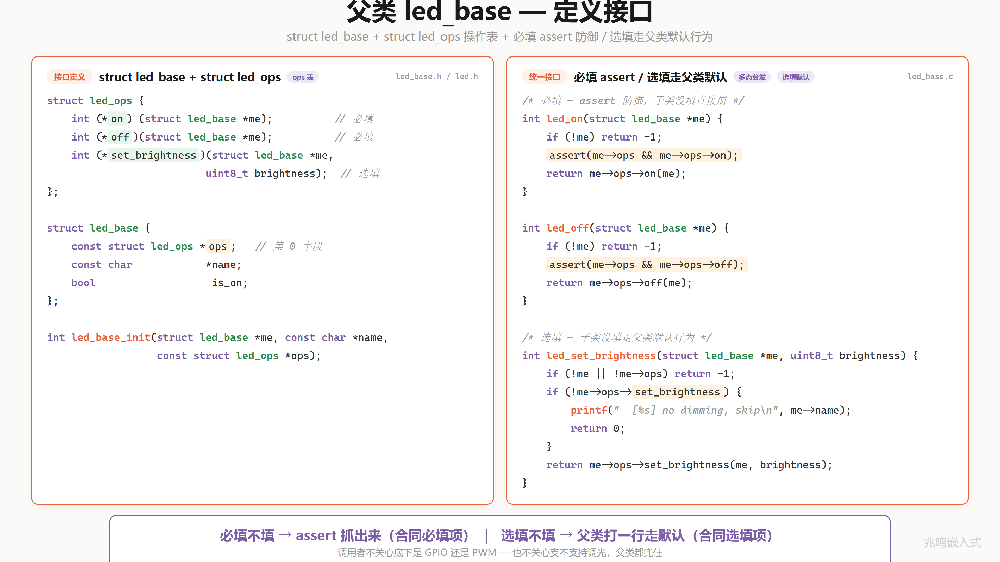
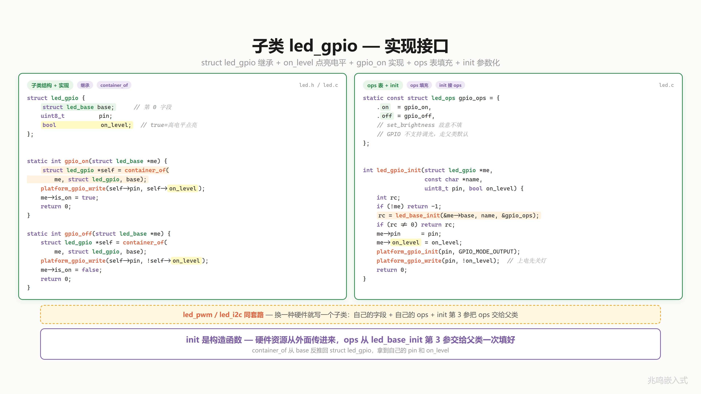
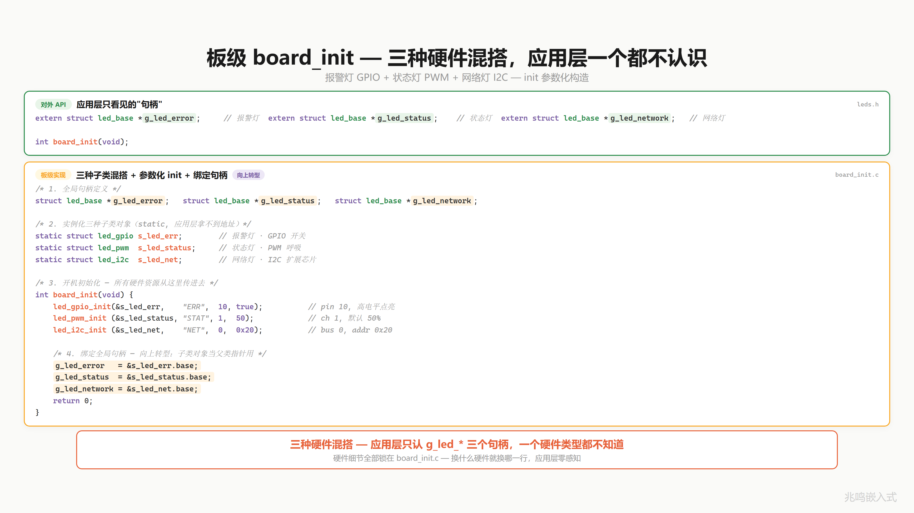
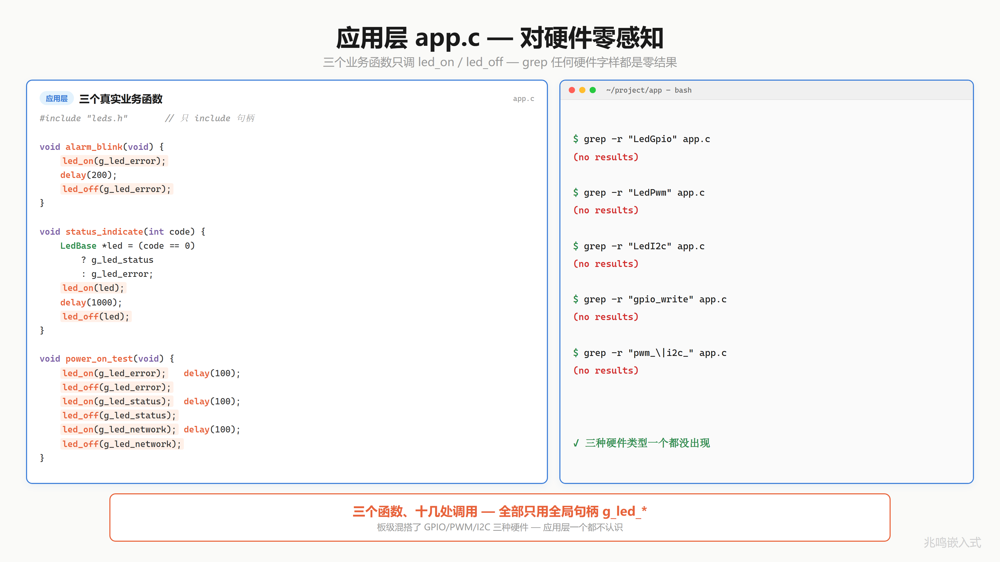
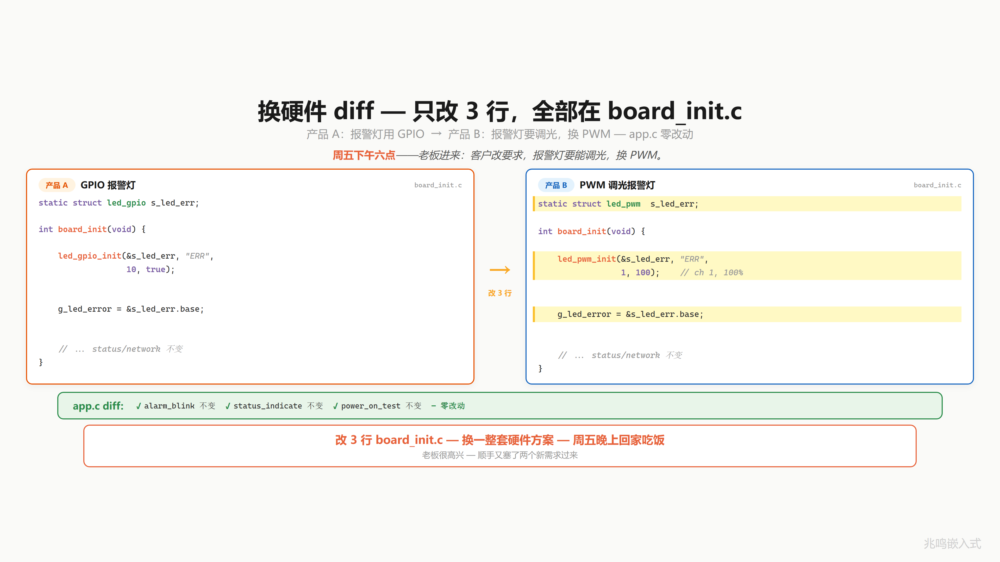
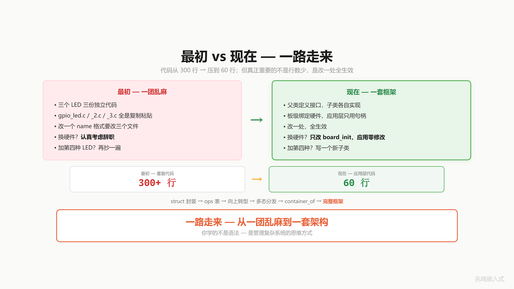
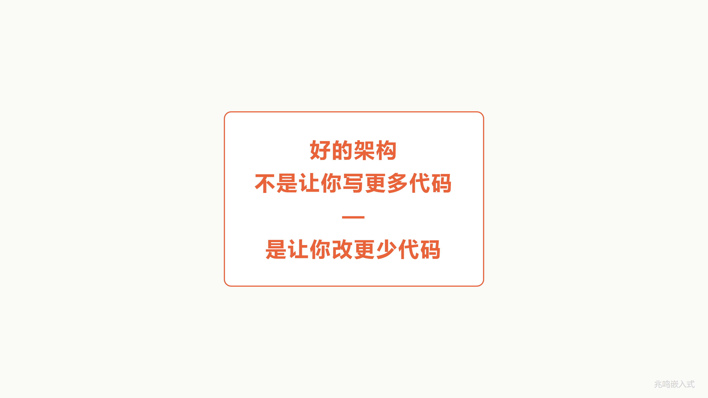

# 第 15 章 · 换硬件不改应用 · OOP 完整框架

配套代码：[`oop-in-c/code/15-platform/`](https://github.com/ZhaoChengBo/zhaoming-embedded/tree/master/oop-in-c/code/15-platform/)

封装、继承、多态、向上转型、向下转型、纯虚 / 选填 / 接口，C 里做 OOP 的全部武器你都见过了。

这一章不引入任何新概念。把武器全部组装起来，演示一套完整的 LED 框架：父类 / 子类 / 板级 / 应用四层，每层一个职责，每层只调下一层。同一份应用代码挂着 GPIO + PWM + I2C 三种硬件混搭的 LED，应用层 grep 拿不到任何硬件字样。换硬件方案，应用 0 修改。

最初你一份代码控一盏灯、三盏灯三份代码。现在 300 多行复制粘贴的代码，被压到应用层 60 行。一路走来，从一团乱麻到一套架构。

## 15.1 四层架构

打开配套代码 `oop-in-c/code/15-platform/pc/`，8 个文件按调用方向从上往下分四层：

```
应用层    app.h, app.c              alarm_blink / status_indicate / power_on_test
子类层    led.h, led.c              led_gpio / led_pwm / led_i2c, container_of 反推
父类层    led_base.h, led_base.c    led_base + led_base_init + 必填 / 选填分发
板级层    leds.h, board_init.c      实例化 + 向上转型, 唯一认识硬件的文件
```

底下还有一份 `common/platform_pc.c`，提供 4 个 GPIO 封装函数（`platform_gpio_init / write / read / deinit`），从 ch01 起整本书一字不变。STM32 / Linux 真机上换成对应实现，上面 4 层一字不动。

每一层只关心自己。每一层只调下一层。



## 15.2 父类层：led_base + 必填选填

父类层一份 `led_base.h` 一份 `led_base.c`，从 ch10 / ch11 一脉相承：父类只关心共有数据（`ops + name + is_on`）和共有 init，把"我用哪张 ops 表"作为参数传进来一次填好。

```c
/* led_base.h */
struct led_ops;     /* 前向声明, 完整定义在 led.h, 减少头文件耦合 */

struct led_base {
	const struct led_ops *ops;     /* 第一个字段, 对象起始地址处 */
	const char           *name;
	bool                  is_on;
};

int led_base_init(struct led_base *me, const char *name,
                  const struct led_ops *ops);
```

三个字段：`name`（每盏灯一个字符串名字，打日志用）、`is_on`（当前开关状态，父类记账）、`ops`（指向子类的 ops 表）。这三个字段从 ch11 多态那一章定型之后再没动过。

`led_base_init` 是父类共有 init，子类的 init 第一行调它一次，把对应的 `const ops` 表交给父类存到 `me->ops`：

```c
/* led_base.c */
int led_base_init(struct led_base *me, const char *name,
                  const struct led_ops *ops)
{
	if (!me || !name || !ops)
		return -1;

	me->ops   = ops;
	me->name  = name;
	me->is_on = false;
	return 0;
}
```

`ops` 表的 `set_brightness` 槽位采用 ch14 的"必填 + 选填"混合策略，对应的父类统一接口分两种处理：

```c
/* led_base.c */
int led_on(struct led_base *me)
{
	if (!me)
		return -1;
	/* 必填: 子类必须实现 on. assert 抓到忘填的子类立刻 abort 给行号. */
	assert(me->ops && me->ops->on &&
	       "led_on: subclass must implement on()");
	return me->ops->on(me);
}

int led_set_brightness(struct led_base *me, uint8_t b)
{
	if (!me || !me->ops)
		return -1;
	if (!me->ops->set_brightness) {     /* 选填, 父类提供默认行为 */
		printf("  [%s] no dimming, skip (brightness=%u)\n",
		       me->name, (unsigned)b);
		return 0;
	}
	return me->ops->set_brightness(me, b);
}
```

`on / off` 必填，对应 C++ 纯虚函数，子类不实现 `assert` 立刻报错。`set_brightness` 选填，对应 C++ 带默认行为的虚函数，子类不实现父类走默认（GPIO 灯没法调光）。同一个父类接口里，必填和选填两种做法同时出现。这就是 ch14 的精确兑现。

> 注意从 ch15 起 ops 表把 `toggle` 槽位换成 `set_brightness`。toggle 教学到 ch11 已讲透·set_brightness 是为了 ch14 § 14.4 演示选填策略·两者按"留一个槽演化"原则替换。



## 15.3 子类层：三种硬件

子类把 `led_base` 嵌进自己的结构体，第一个字段（`container_of` 不挑位置，但工业代码里 base 仍推荐放第一个）：

```c
struct led_gpio {
	struct led_base base;
	uint8_t         pin;
	bool            on_level;       /* 0=低电平亮, 1=高电平亮 */
};

struct led_pwm {
	struct led_base base;
	uint8_t         channel;
	uint8_t         duty;
};

struct led_i2c {
	struct led_base base;
	uint8_t         bus;
	uint8_t         addr;
};
```

每个子类的实现函数第一行都是 `container_of`，从 base 反推回子类对象：

```c
static int gpio_on(struct led_base *me)
{
	struct led_gpio *self = container_of(me, struct led_gpio, base);
	platform_gpio_write(self->pin, self->on_level);
	me->is_on = true;
	printf("  [%s] led_on  -> GPIO Pin%u\n",
	       me->name, (unsigned)self->pin);
	return 0;
}
```

反推成功之后，就能访问 `self->pin` 和 `self->on_level` 这些子类自己的字段。`platform_gpio_write` 是 ch01 起就存在的封装函数，子类不直接碰寄存器，调下层一个普通 C 函数。

每种子类对应一张 `const` ops 表：

```c
static const struct led_ops gpio_ops = {
	.on  = gpio_on,
	.off = gpio_off,
};

static const struct led_ops pwm_ops = {
	.on             = pwm_on,
	.off            = pwm_off,
	.set_brightness = pwm_set_brightness,
};

static const struct led_ops i2c_ops = {
	.on  = i2c_on,
	.off = i2c_off,
};
```

GPIO 和 I2C 子类只填 `on / off`，`set_brightness` 留空（C 标准里静态存储未显式初始化的字段会被零初始化为 NULL，父类的选填默认行为会接住）。PWM 子类三件套全填。三张表全 `static`，应用层连地址都拿不到，只能通过子类 init 间接挂上 base。

最后是参数化的子类构造函数，第一行调 `led_base_init` 把对应的 ops 表交给父类：

```c
int led_gpio_init(struct led_gpio *me, const char *name,
                  uint8_t pin, bool on_level)
{
	int rc;
	if (!me)
		return -1;
	rc = led_base_init(&me->base, name, &gpio_ops);
	if (rc != 0)
		return rc;
	me->pin      = pin;
	me->on_level = on_level;
	platform_gpio_init(pin, GPIO_MODE_OUTPUT);
	platform_gpio_write(pin, !on_level);    /* 上电先关灯 */
	return 0;
}
```

四个参数从外面传进来：对象指针、名字、引脚号、点亮电平。硬件资源不在子类定义里写死。返回 `int`：0 表示成功，< 0 表示参数非法，调用方（板级层）拿到这个返回值才能在出错时立刻知道哪盏灯没初始化好。这是 C 模拟构造函数的标准做法。

`led_pwm_init / led_i2c_init` 同套路：先调 `led_base_init`，再填子类自己的硬件字段，返回 `int`。换一种硬件，再写一个子类文件，父类 / 板级 / 应用 一字不动。



## 15.4 板级层：唯一认识硬件的文件

`leds.h` 对外只暴露三个全局句柄 + `board_init` 入口：

```c
#ifndef LEDS_H
#define LEDS_H

#include "led.h"

extern struct led_base *g_led_error;
extern struct led_base *g_led_status;
extern struct led_base *g_led_network;

int board_init(void);

#endif
```

句柄类型是父类指针 `struct led_base *`，不是具体子类。应用层 `#include "leds.h"` 拿到的就是这一组句柄，分不清底下挂的是 GPIO 还是 PWM 还是 I2C。

`board_init.c` 是整个工程里**唯一**认识硬件的文件：

```c
static struct led_gpio s_led_err;       /* 文件作用域, 外部不可见 */
static struct led_pwm  s_led_status;
static struct led_i2c  s_led_net;

struct led_base *g_led_error;
struct led_base *g_led_status;
struct led_base *g_led_network;

int board_init(void)
{
	int rc;

	rc = led_gpio_init(&s_led_err, "ERR", 10, true);
	if (rc != 0) {
		printf("[board] led_gpio_init(ERR) failed, rc=%d\n", rc);
		return rc;
	}

	rc = led_pwm_init(&s_led_status, "STAT", 1, 50);
	if (rc != 0) {
		printf("[board] led_pwm_init(STAT) failed, rc=%d\n", rc);
		return rc;
	}

	rc = led_i2c_init(&s_led_net, "NET", 0, 0x20);
	if (rc != 0) {
		printf("[board] led_i2c_init(NET) failed, rc=%d\n", rc);
		return rc;
	}

	g_led_error   = &s_led_err.base;
	g_led_status  = &s_led_status.base;
	g_led_network = &s_led_net.base;
	return 0;
}
```

报警灯用 GPIO 开关，最简单；状态灯用 PWM 呼吸，要能调亮度；网络灯挂在 I2C 扩展芯片上，是远程芯片上的灯。三种不同硬件，通过同一个 `struct led_base *` 接口对外暴露。

实例化三行：三个子类对象都是空的，没赋任何值。硬件资源全部 `init` 的时候传进去。pin 编号、PWM 通道、I2C 地址这些常量集中在这一个文件里。

每盏灯的 init 都返回 `int`，板级层一一接住。任何一盏失败立刻 `return rc`，把错误码继续往上传给 `main`。真实板子上漏了一盏灯的初始化，应用跑起来时才发现 `led_on` 走 NULL ops 直接 abort，不如开机时就拒绝起来。

最后三行绑定：每个子类对象取 `&xxx.base` 拿到 base 字段地址，赋给对应的全局父类指针句柄。这一步就是把子类对象"当作"父类指针在用。**向上转型**（ch12 § 12.2）：因为 `base` 是子类的字段，C99 § 6.7.2.1 保证结构体字段的地址等于结构体加上偏移量后的地址，编译器替我们算偏移（base 在第一个字段时偏移是 0，一条 `ADD r0, #0` 就被优化掉了）。

绑定完成后，全局句柄准备好了。应用层 `#include "leds.h"`，随便用。

`main` 拿到 `board_init` 的返回值，失败就直接退：

```c
int main(void)
{
	int rc = board_init();
	if (rc != 0) {
		printf("[main] board_init failed, rc=%d, abort.\n", rc);
		return 1;
	}
	power_on_test();
	alarm_blink();
	status_indicate(0);
	status_indicate(1);
	return 0;
}
```



## 15.5 应用层：grep 零硬件字样

`app.c` 三个真实业务函数：

```c
#include "leds.h"
#include "app.h"
#include <stdio.h>

void alarm_blink(void)
{
	led_on(g_led_error);
	led_off(g_led_error);
}

void status_indicate(int err_code)
{
	if (err_code == 0)
		led_on(g_led_status);
	else
		led_on(g_led_error);
}

void power_on_test(void)
{
	led_on(g_led_error);    led_off(g_led_error);
	led_on(g_led_status);   led_off(g_led_status);
	led_on(g_led_network);  led_off(g_led_network);
}
```

不是一个 `test_led` 就完了，是三个业务函数：报警闪烁（一开一关）、状态指示（按错误码挑亮哪盏）、开机自检（三盏灯依次亮一遍）。十几处调用，全部只用 `g_led_*` 全局句柄。

不信？打开终端：

```
$ grep -nE "led_gpio|led_pwm|led_i2c"  app.c
$ grep -nE "gpio_write|HAL_GPIO|sysfs"  app.c
$ grep -nE "BSRR|0x[0-9A-F]"            app.c
```

三条 grep 全部 0 命中。板级混搭了 GPIO、PWM、I2C 三种硬件，应用层一个都不认识。它只看到三个 `struct led_base *` 句柄，调 `led_on / led_off / led_set_brightness`。剩下的事，是哪种子类、走哪个 ops、哪个引脚、哪个总线，全部不关心。



## 15.6 换硬件 diff：board_init 改三行，app.c 零改动

真实场景：周五下午六点，老板进来。客户改要求：报警灯要能调光，从 GPIO 换成 PWM。

打开 `board_init.c`，改 3 行：

```diff
-static struct led_gpio s_led_err;
+static struct led_pwm  s_led_err;
 static struct led_pwm  s_led_status;
 static struct led_i2c  s_led_net;

 int board_init(void)
 {
     int rc;
-    rc = led_gpio_init(&s_led_err, "ERR", 10, true);
+    rc = led_pwm_init (&s_led_err, "ERR",  2, 80);
     if (rc != 0) { ... }

     rc = led_pwm_init (&s_led_status, "STAT", 1, 50);
     ...
     g_led_error   = &s_led_err.base;
     g_led_status  = &s_led_status.base;
     g_led_network = &s_led_net.base;
     return 0;
 }
```

类型那行：`struct led_gpio` 改成 `struct led_pwm`。
init 那行：`led_gpio_init` 换成 `led_pwm_init`，参数从"10 号引脚、高电平点亮"换成"2 号通道、80% 亮"。
绑定那行：`&s_led_err.base` 一字不动，`base` 这个字段名两个子类都有，绑定逻辑天然兼容。

三行改动全部在 `board_init.c` 里面。`app.c`、`led.c`、`led_base.c`、`leds.h` 全部 0 改动。`alarm_blink`、`status_indicate`、`power_on_test` 三个业务函数一行不动。

周五晚上回家吃饭。

老板很高兴，顺手又塞了两个新需求过来。



## 15.7 Before / After：300 行 → 60 行

来看你走了多远。

**最初**（ch01 - ch04）：

```c
/* gpio_led.c, gpio_led_2.c, gpio_led_3.c — 三份独立代码 */
void red_led_on(void)    { HAL_GPIO_WritePin(GPIOA, GPIO_PIN_13, GPIO_PIN_SET);   }
void red_led_off(void)   { HAL_GPIO_WritePin(GPIOA, GPIO_PIN_13, GPIO_PIN_RESET); }
void green_led_on(void)  { HAL_GPIO_WritePin(GPIOB, GPIO_PIN_5,  GPIO_PIN_SET);   }
void green_led_off(void) { HAL_GPIO_WritePin(GPIOB, GPIO_PIN_5,  GPIO_PIN_RESET); }
/* ... 8 颗 LED 乘 4 个函数 = 32 个几乎一模一样的函数, 300 多行 */
```

应用层和 HAL 库直接耦合。改一个名字格式要改三个文件。换硬件？认真考虑辞职。

**现在**（ch15）：

```c
/* app.c */
led_on(g_led_error);
led_set_brightness(g_led_status, 80);
```

四层架构：父类定义接口、子类实现接口、板级绑定硬件、应用层只用句柄。应用层 60 行。换硬件方案改 `board_init.c` 三行，应用 0 修改。

代码从 300 多行压到 60 行。

但**真正重要**的不是行数少，是改一处全生效。

一路走来，从一团乱麻到一套架构。

你学的不是语法，是管理复杂系统的思维方式。



## 15.8 好的架构

> 好的架构不是让你写更多代码，是让你改更少代码。



## 15.9 视频里没讲透的几个细节

### 15.9.1 应用层只 include leds.h 不 include led_gpio.h 的纪律

`app.c` 顶上你看到的是：

```c
#include "leds.h"
```

不是：

```c
#include "led.h"          /* 不行: 暴露 struct led_gpio / led_pwm / led_i2c */
#include "led_gpio.h"     /* 不行: 应用层就知道有 GPIO 这种东西了 */
```

`leds.h` 里只 include `led.h`（拿父类接口声明 + 子类类型，但子类类型是给板级用的，应用层不该取），完全不暴露子类的内部字段访问需求。这条纪律保证应用层 grep 不到任何硬件字样。

工业项目里这一招会做得更彻底：连 `led.h` 都不让应用层看到，应用层只 include `leds.h`，而 `leds.h` 里把 `struct led_base` 做成不完整类型（forward declaration），只允许指针操作：

```c
/* leds.h - 工业版 */
struct led_base;     /* 不完整类型, 应用层只能用指针 */
extern struct led_base *g_led_error;
int led_on(struct led_base *me);
```

应用层连 `struct led_base` 长什么样都不知道，更别提 `struct led_gpio`。本书早期章节为了演示方便没做到这么彻底，真实工业代码里"应用层连父类内部都看不见"是常态。

### 15.9.2 全局句柄 vs static + getter 的取舍

ch15 用的是一组 `extern struct led_base *g_led_xxx` 全局句柄。简单直接，一行 `extern` 就能让应用层拿到。

工业项目里另一种常见做法是 `static + getter`：

```c
/* board_init.c */
static struct led_base *s_led_error;       /* static, 只这个文件可见 */

struct led_base *led_error_get(void)        /* 暴露 getter */
{
	return s_led_error;
}
```

应用层调 `led_error_get()` 而不是直接读 `g_led_error`。代价是多一层函数调用，好处是：

- 可以加 lazy init（第一次调用时才初始化）
- 可以加访问日志 / 锁 / 引用计数
- 可以在 getter 里做"未初始化检查"

教学版用 extern 全局句柄因为最直观；工业版常见 getter，因为接口更稳定（句柄实现可换）。两种都见过你就够了。

### 15.9.3 板级 mix-and-match：GPIO + PWM + I2C 同时混搭的可读性

ch15 `board_init.c` 同时实例化了 GPIO 灯、PWM 灯、I2C 灯。这是**故意的**。

很多教学项目只敢做一种：要么全 GPIO，要么全 PWM。讲分层架构的书就栽在这里：读者看到三盏 LED 三个 `struct led_gpio`，会以为"分层只在同种硬件之间分层"。

混搭演示的是另一件事：分层的真正威力是**应用层不知道也不必知道每盏灯具体是哪种硬件**。`alarm_blink` 调 `led_on(g_led_error)`，背后是 GPIO 拉高电平、PWM 设占空比、还是 I2C 发包，上层一字不知。

工业项目里这种混搭是常态：一块板子上几十路输出，有的是 MCU 自己 GPIO，有的接 PWM 控制器，有的挂在 I2C 扩展芯片上。`board_init.c` 把这些差异全部吸收掉，应用层只见统一的 `led_base * `句柄。

### 15.9.4 把"换硬件 diff"思路推广到 motor / sensor

LED 这一招完全可以复用到其他外设。Motor：

```c
struct motor_ops {
	int (*set_speed)(struct motor *me, int rpm);
	int (*get_position)(struct motor *me, int32_t *pos);
	int (*stop)(struct motor *me);
};

struct motor {
	const struct motor_ops *ops;
	const char             *name;
};

/* 子类 */
struct motor_pwm { struct motor base; uint8_t pwm_ch; };       /* 直流 PWM 调速 */
struct motor_can { struct motor base; uint8_t can_id; };       /* 总线伺服 */
```

Sensor 同理：温度传感器、压力传感器、IMU，每种都是一种子类。应用层调 `sensor_read(handle, &val)`，背后是 ADC、是 I2C、是 SPI，无所谓。

整本书 ch07 - ch14 学到的所有武器，每种外设都套得进去。LED 是教学线索，但这套思维方式是通用的。ch20 工业实战会再用一次：温度传感器 + 压力传感器 + 流量计混搭在同一个采集任务里。

## 15.10 你现在的代码在 STM32 上长什么样

> 提示：§15.1 - §15.9 视频版讲的是函数式 `platform_gpio_*` 抽象（一组独立函数 + 数字 pin 编号）·让概念跑通最快。本节起进入工业级兑现层：把厂家差异锁到一份 `platform/arch/<mcu>/pin_board.c`·上面的 `drivers/led/* / platform/*.c 接口实现` 跨 MCU 一字不变。两套都讲是因为它们对应"教学引入"和"工业落地"两个不同的复杂度档位。

工业级跨 MCU 工程会把 ch15 这一套四层架构再细分: 应用层 / 设备驱动层 (`drivers/led/`) / platform 接口层 (`platform/platform_*.h+c`) / platform 实现层 (`platform/arch/<mcu>/pin_board.c`)。前三层跨 MCU 字节级不变, **唯一变化点是 platform 实现层一份 `pin_board.c`**。

`oop-in-c/code/15-platform/` 目录组织就是这套分层:

```
15-platform/
├── pc/                              PC 教学版四层架构
├── drivers/led/                     设备驱动层·跨 MCU 不变
│   ├── led_base.{h,c}
│   ├── led_gpio.{h,c}
│   ├── led_pwm.{h,c}
│   └── led_i2c.{h,c}
├── platform/                        platform 接口层·跨 MCU 不变
│   ├── platform_pin.{h,c}           ops 表 + register dispatcher
│   ├── platform_pwm.{h,c}
│   ├── platform_i2c.{h,c}
│   └── arch/                        MCU 厂家差异收拢点
│       ├── stm32/pin_board.c        STM32 HAL 实现
│       └── nxp/pin_board.c          NXP MCUXpresso SDK 实现
└── linux-driver/userspace/          Linux 用户态 (没有 platform 层)
```

STM32 端的实现写在 `platform/arch/stm32/pin_board.c`, 启动期 `platform_hw_pin_init()` 把三组 ops 表 (`_stm32_pin_ops` / `_stm32_pwm_ops` / `_stm32_i2c_ops`) 注册到 dispatcher:

```c
/* platform/arch/stm32/pin_board.c */
static GPIO_TypeDef *const _gpio_table[] = {
    GPIOA, GPIOB, GPIOC, GPIOD, GPIOE, /* ... */
};

static void _stm32_pin_write(int32_t pin, int32_t value)
{
    GPIO_TypeDef *port = _gpio_table[PIN_PORT(pin)];
    HAL_GPIO_WritePin(port, PIN_MASK(pin),
                      value ? GPIO_PIN_SET : GPIO_PIN_RESET);
}

static const struct platform_pin_ops _stm32_pin_ops = {
    .mode  = _stm32_pin_mode,
    .write = _stm32_pin_write,
    .read  = _stm32_pin_read,
    .get   = _stm32_pin_get,
};
```

`drivers/led/led_gpio.c` 子类调 `platform_pin_write(self->pin, ...)`, framework 内部 dispatch 就落到 `_stm32_pin_write`, 最终 `HAL_GPIO_WritePin -> GPIOx->BSRR = (1u << pin)`, 一次 32 位 store, 原子。

PIN 编码: 高 4 位 port (字母 A-Z 偏移), 低 4 位 num. PA.0 = 0x00, PD.12 = 0x3C, PI.14 = 0x8E。一份 `uint8_t` 同时编码 port 字母和 pin 号, 接口签名只有一个 `pin` 参数 -- 换 MCU 时接口不动, 解码表跟着换。

## 15.11 Linux 用户态对照·内核做完别再抽

Linux 用户态实现这一套, **禁自抽 platform 层**, 内核已经做完。libgpiod / sysfs PWM / i2c-dev 这一组接口本身就是内核 driver model 暴露给用户态的 OOP 接口, 应用层再套一层 `platform_gpio_write -> gpiod_line_set_value` 就是过度封装, 没拦下任何变化, 反而多了一层没意义的 indirection。

`linux-driver/userspace/` 给的就是 "内核做完别再抽" 的代码兑现版本: `led_gpio.c` 直接 `gpiod_line_set_value(self->line, ...)`, `led_pwm.c` 直接写 `/sys/class/pwm/pwmchipN/pwmM/duty_cycle`, `led_i2c.c` 直接 `open("/dev/i2c-1") + ioctl(I2C_SLAVE) + write(fd, [reg, val], 2)`. 没有 `platform_gpio_init` 这种自抽中间层。父类 ops 表保留 (OOP 抽象任何平台都该有), 但 platform 抽象层没有, 内核已经做完。

LED 这种通用外设 Linux 内核已经有 `drivers/leds/leds-gpio.c` 这份内核驱动 -- 标准 driver model 写好的版本, 上千种板子用过。所以本目录 `linux-driver/` 不再贴自家内核驱动版本, 应用层只走用户态 libgpiod / sysfs / i2c-dev 三条路径。要看真实工业级原型, 直接读内核源 `drivers/leds/leds-gpio.c`, 完整论述见 § 15.15 + ch16 § 16.13 + 附录 C。"应用层 vs 内核层"这个判断标准 ch16 § 16.14 还会展开。

## 15.11.5 STM32 vs NXP·换 MCU 不改应用

§ 15.10 给的是 STM32 上 `pin_board.c` 长什么样。如果要换一颗 MCU -- 比如把 STM32F407 换成 NXP i.MX RT1170 -- 同一套应用层 / 设备驱动层 / platform 接口层要改多少行?

> 注意 `drivers/led/led_gpio.h` 的 `led_gpio_init` 比 § 15.3 教学版多一层"字符串 pin 名 + 解析"·签名是 `(me, name, pin_name, active_high)`·目的是把 pin 名跨 MCU 解耦——同样的字符串 `"PA.13"` 在 stm32 / nxp 下解析出对应 port + bit。教学版直接用 `uint8_t pin` 是为了让 § 15.3 学生第一眼跑得通。

`platform/arch/nxp/` 给出答案: **应用层 + drivers/led + platform 接口层 0 行**。**唯一变化点是 `platform/arch/<mcu>/{pin_board.c, pwm_board.c, i2c_board.c}` 三份文件**, 一外设一文件。

按文件清单一过:

| 文件 | 跨 MCU 是否变化 |
| --- | --- |
| `main.c` / `app.c` (应用层) | 不变 |
| `drivers/led/*` 4 对 .h/.c (设备驱动层) | 不变 |
| `platform/platform_*.h` + `platform/platform_*.c` (platform 接口层) | 不变 |
| `platform/arch/<mcu>/pin_board.c` (GPIO 后端) | **变** |
| `platform/arch/<mcu>/pwm_board.c` (PWM 后端) | **变** |
| `platform/arch/<mcu>/i2c_board.c` (I2C bus 后端) | **变** |

换 MCU 改一组 (3 份), 应用层一字不动。这是 platform 层抽象的真正威力。一外设一文件的好处: 加一种新外设 (uart / spi) 只新增 `uart_board.c` / `spi_board.c` 一份, 已有三份字节不动; review 时也能 `git log pwm_board.c` 直接拿 PWM 这一路的独立演化历史。

差别在哪里? 三种外设并排比一过 (左 STM32 HAL, 右 NXP MCUXpresso SDK):

| 外设 | `stm32/xxx_board.c` 调用 | `nxp/xxx_board.c` 调用 |
| --- | --- | --- |
| GPIO | `HAL_GPIO_WritePin` | `GPIO_PinWrite` |
| PWM | `__HAL_TIM_SET_COMPARE` | `PWM_UpdatePwmDutycycle` |
| I2C | `HAL_I2C_Master_Transmit` | `LPI2C_MasterTransferBlocking` |
| 时钟使能 | `__HAL_RCC_GPIOA_CLK_ENABLE` | MCUXpresso `BOARD_BootClockRUN` |
| 启动入口 | `platform_hw_{pin,pwm,i2c}_init()` | 同左 (签名一字不差) |

三外设三份后端, 厂家 SDK 类型 (`GPIO_TypeDef *` vs `GPIO_Type *`)、寄存器 API 名字、时钟机制全部锁在 `platform/arch/<mcu>/` 这一组文件里。这种厂家差异如果漏到 `drivers/led/led_gpio.c` / `led_pwm.c` / `led_i2c.c`, 换 MCU 要改三个子类 + 板级 + 应用层 -- ch15 的金句"换硬件不改应用"就破了。

GPIO 写一段并排:

```c
/* platform/arch/stm32/pin_board.c - GPIO 写 */
static GPIO_TypeDef *const _gpio_table[] = {
    GPIOA, GPIOB, GPIOC, GPIOD, GPIOE, /* ... */
};

static void _stm32_pin_write(int32_t pin, int32_t value)
{
    GPIO_TypeDef *port = _gpio_table[PIN_PORT(pin)];
    HAL_GPIO_WritePin(port, PIN_MASK(pin),
                      value ? GPIO_PIN_SET : GPIO_PIN_RESET);
}
```

```c
/* platform/arch/nxp/pin_board.c - GPIO 写 */
static GPIO_Type *const _gpio_table[] = {
    GPIO1, GPIO2, GPIO3, GPIO4, GPIO5,
};

static void _nxp_pin_write(int32_t pin, int32_t value)
{
    GPIO_Type *port = _gpio_table[PIN_PORT(pin)];
    GPIO_PinWrite(port, PIN_OFFSET(pin), value ? 1U : 0U);
}
```

PWM 设占空比一段并排 (落到不同的 TIM PWM API):

```c
/* platform/arch/stm32/pwm_board.c - PWM 设占空比 */
static int _stm32_pwm_set_duty(int32_t channel, uint8_t duty)
{
    uint32_t ccr = (uint32_t)duty * 1000U / 255U;   /* ARR=999 */
    __HAL_TIM_SET_COMPARE(&htim3, _pwm_channel_to_hal(channel), ccr);
    return 0;
}
```

```c
/* platform/arch/nxp/pwm_board.c - PWM 设占空比 */
static int _nxp_pwm_set_duty(int32_t channel, uint8_t duty)
{
    uint8_t pct = (uint8_t)((uint32_t)duty * 100U / 255U);
    PWM_UpdatePwmDutycycle(PWM1, kPWM_Module_0,
                           (pwm_channels_t)channel, kPWM_SignedCenterAligned, pct);
    PWM_SetPwmLdok(PWM1, (1U << kPWM_Module_0), true);
    return 0;
}
```

I2C 一段 master_xfer 并排 (落到 HAL 阻塞 / LPI2C 阻塞):

```c
/* platform/arch/stm32/i2c_board.c - I2C bus master_xfer */
if (msgs[i].flags & PLATFORM_I2C_RD)
    st = HAL_I2C_Master_Receive(&hi2c1, addr8, msgs[i].buf, msgs[i].len, 100);
else
    st = HAL_I2C_Master_Transmit(&hi2c1, addr8, msgs[i].buf, msgs[i].len, 100);
```

```c
/* platform/arch/nxp/i2c_board.c - I2C bus master_xfer */
xfer.slaveAddress = (uint8_t)msgs[i].addr;
xfer.direction    = (msgs[i].flags & PLATFORM_I2C_RD) ? kLPI2C_Read : kLPI2C_Write;
xfer.data         = msgs[i].buf;
xfer.dataSize     = msgs[i].len;
st = LPI2C_MasterTransferBlocking(LPI2C1, &xfer);
```

`drivers/led/*` 子类只调 `platform_pin_xxx / platform_pwm_xxx / platform_i2c_xxx` ops 表层接口, 跨 MCU 字节级不变。`platform/platform_*.c` dispatcher 维护 `static const struct platform_xxx_ops *_g_ops` 指针 (i2c 多一个 bus 槽), 启动期由 `platform/arch/<mcu>/{pin,pwm,i2c}_board.c` 三个 `platform_hw_*_init()` 函数各调一次 register 把 ops 填进来 -- 上层调封装函数时框架内部 dispatch 到对应 MCU 的实现。这就是 ch11 ops 表多态在 ch15 platform 层的工业级落地。

板级启动序列也是一字对照: `board_init` 里依次调 `platform_hw_pin_init() -> platform_hw_pwm_init() -> platform_hw_i2c_init()` 三行, STM32 / NXP 两家板级代码这三行完全一样, 改的只是链接的 `arch/stm32/` 还是 `arch/nxp/` 子目录里那 3 份后端。

## 15.12 工业代码里的"换硬件 diff"长什么样

工业项目里这一章的精神已经渗透到每个层级。挑一个真实场景：报警子系统。

需求：板子上有 8 路报警输出。客户 A 用 LED 灯提示，客户 B 接蜂鸣器，客户 C 接外接报警柱（24V 信号）。三家客户买的是同一个主控板，只有"报警这一路"硬件不同。

工业代码里 `board_init.c` 长这样：

```c
/* board_init_customerA.c - 8 路全 LED */
static struct led_gpio s_alarm[8];

int board_init(void)
{
	int rc = led_gpio_init(&s_alarm[0], "ALM_0", 10, true);
	if (rc != 0) return rc;
	/* ... 7 个 ... */
	for (int i = 0; i < 8; i++)
		g_alarm[i] = &s_alarm[i].base;
	return 0;
}
```

```c
/* board_init_customerB.c - 8 路全蜂鸣器 (PWM 控频率) */
static struct led_pwm s_alarm[8];

int board_init(void)
{
	int rc = led_pwm_init(&s_alarm[0], "ALM_0", 1, 50);
	if (rc != 0) return rc;
	/* ... 7 个 ... */
	for (int i = 0; i < 8; i++)
		g_alarm[i] = &s_alarm[i].base;
	return 0;
}
```

```c
/* board_init_customerC.c - 8 路全外接报警柱 (I2C 扩展芯片) */
static struct led_i2c s_alarm[8];

int board_init(void)
{
	int rc = led_i2c_init(&s_alarm[0], "ALM_0", 0, 0x20);
	if (rc != 0) return rc;
	/* ... 7 个 ... */
	for (int i = 0; i < 8; i++)
		g_alarm[i] = &s_alarm[i].base;
	return 0;
}
```

三家客户三份 `board_init_*.c`，编译期挑一份链进去。应用层报警逻辑（`alarm_trigger / alarm_clear / alarm_run_self_test`）一份代码三家共用。这就是"产品角色 → 硬件映射"的工程化形态：业务代码完全不知道客户 A B C 之间的硬件差异，硬件差异全部锁在 `board_init` 这一个文件里。

ch19 / ch20 工业实战会展开真实主控板项目里的板级文件，看看一份 `board_init.c` 怎么管 30+ 路硬件。

## 15.13 完整源码清单 + 跑一遍

把下面的代码块分别保存到对应文件，目录结构和 [`oop-in-c/code/15-platform/pc/`](https://github.com/ZhaoChengBo/zhaoming-embedded/tree/master/oop-in-c/code/15-platform/pc/) 一致。`make && ./demo` 即可跑通。

完整文件清单：

```
15-platform/
├── pc/                              本节代码块, make && ./demo 直接跑
│   ├── main.c                       主程序入口
│   ├── app.h, app.c                 应用层 - 三个业务函数
│   ├── leds.h                       板级对外暴露的 g_led_xxx 句柄声明
│   ├── board_init.c                 板级 - 唯一认识硬件的文件
│   ├── led_base.h, led_base.c       父类 - led_base + ops 表 + 父类统一接口
│   ├── led_gpio.h, led_gpio.c       子类一 - GPIO LED (on/off, set_brightness 走父类默认)
│   ├── led_pwm.h, led_pwm.c         子类二 - PWM LED (三件套全填, 支持调光)
│   ├── led_i2c.h, led_i2c.c         子类三 - I2C 扩展芯片 LED (on/off)
│   ├── container_of.h               与 ch13 同款 (最小可用版)
│   └── Makefile                     链接 ../../common/platform_pc.c
├── drivers/led/                     设备驱动层·跨 MCU 不变
│   ├── led_base.{h,c}               父类层 (调 platform_pin/pwm/i2c ops 接口)
│   ├── led_gpio.{h,c}
│   ├── led_pwm.{h,c}
│   └── led_i2c.{h,c}
├── platform/                        platform 接口层·跨 MCU 不变
│   ├── platform_pin.{h,c}           ops 表 + register dispatcher
│   ├── platform_pwm.{h,c}
│   ├── platform_i2c.{h,c}
│   └── arch/                        MCU 厂家差异收拢点
│       ├── stm32/pin_board.c        STM32 HAL 实现
│       └── nxp/pin_board.c          NXP MCUXpresso SDK 实现
└── linux-driver/userspace/          Linux 用户态 (直接 libgpiod / sysfs / i2c-dev,
                                                  没有 platform 层)
```

每个子类一份独立的 `.h / .c`，和工业项目里 LED 驱动模块的组织一字不差。教学上的好处：加一种新硬件 (例如 SPI 移位寄存器 LED) 只新增 `led_spi.h / led_spi.c` 一对文件，原有三个子类一字不动；review 时也能 `git log led_pwm.c` 直接拿到 PWM 这一路独立的演化历史。`led.h / led.c` 单文件版本 ch15 第一稿用过, 拆开后子类边界更清晰, ch16 / 附录 B / 附录 C 也都按这个组织.

`drivers/` + `platform/` + `platform/arch/<mcu>/` 这一组工业级跨 MCU 分层在本章正文 § 15.10 / § 15.11.5 已经讲过, 是 STM32 vs NXP "换 MCU 改一份 pin_board.c" 的代码兑现层, 不在本节的"代码块抄一遍跑通"流程里。`linux-driver/userspace/` 是 Linux 用户态实战代码 (没有 platform 层), 见 § 15.11.

### 文件 1：`main.c`

```c
/* SPDX-License-Identifier: MIT */
#include "app.h"
#include "leds.h"
#include <stdio.h>

int main(void)
{
	int rc;

	printf("=========================================\n");
	printf("  ch15 - OOP complete framework demo\n");
	printf("=========================================\n");

	rc = board_init();
	if (rc != 0) {
		printf("[main] board_init failed, rc=%d, abort.\n", rc);
		return 1;
	}

	power_on_test();
	alarm_blink();
	status_indicate(0);   /* 正常 -> 状态灯 */
	status_indicate(1);   /* 故障 -> 报警灯 */

	printf("\n=========================================\n");
	printf("  app.c never named any hardware type\n");
	printf("=========================================\n");

	printf("\nPress Enter to exit...\n");
	getchar();
	return 0;
}
```

### 文件 2：`app.h`

```c
/* SPDX-License-Identifier: MIT */
#ifndef APP_H
#define APP_H

void alarm_blink(void);
void status_indicate(int err_code);
void power_on_test(void);

#endif
```

### 文件 3：`app.c`

```c
/* SPDX-License-Identifier: MIT */
#include "leds.h"
#include "app.h"
#include <stdio.h>

void alarm_blink(void)
{
	printf("\n--- alarm_blink ---\n");
	led_on(g_led_error);
	led_off(g_led_error);
}

void status_indicate(int err_code)
{
	printf("\n--- status_indicate(err_code=%d) ---\n", err_code);
	if (err_code == 0)
		led_on(g_led_status);
	else
		led_on(g_led_error);
}

void power_on_test(void)
{
	printf("\n--- power_on_test ---\n");
	led_on(g_led_error);    led_off(g_led_error);
	led_on(g_led_status);   led_off(g_led_status);
	led_on(g_led_network);  led_off(g_led_network);
}
```

### 文件 4：`leds.h`

```c
/* SPDX-License-Identifier: MIT */
#ifndef LEDS_H
#define LEDS_H

#include "led_base.h"

extern struct led_base *g_led_error;
extern struct led_base *g_led_status;
extern struct led_base *g_led_network;

int board_init(void);

#endif
```

应用层 `app.c` 只 `#include "leds.h"`, 看到的就是 `struct led_base *` 三个父类指针。这一份头从来不 `#include "led_gpio.h"` / `"led_pwm.h"` / `"led_i2c.h"`, 子类类型在应用层完全消失。

### 文件 5：`board_init.c`

```c
/* SPDX-License-Identifier: MIT */
#include "leds.h"
#include "led_gpio.h"
#include "led_pwm.h"
#include "led_i2c.h"
#include <stdio.h>

static struct led_gpio s_led_err;
static struct led_pwm  s_led_status;
static struct led_i2c  s_led_net;

struct led_base *g_led_error;
struct led_base *g_led_status;
struct led_base *g_led_network;

int board_init(void)
{
	int rc;

	rc = led_gpio_init(&s_led_err, "ERR", 10, true);
	if (rc != 0) {
		printf("[board] led_gpio_init(ERR) failed, rc=%d\n", rc);
		return rc;
	}

	rc = led_pwm_init(&s_led_status, "STAT", 1, 50);
	if (rc != 0) {
		printf("[board] led_pwm_init(STAT) failed, rc=%d\n", rc);
		return rc;
	}

	rc = led_i2c_init(&s_led_net, "NET", 0, 0x20);
	if (rc != 0) {
		printf("[board] led_i2c_init(NET) failed, rc=%d\n", rc);
		return rc;
	}

	g_led_error   = &s_led_err.base;
	g_led_status  = &s_led_status.base;
	g_led_network = &s_led_net.base;
	return 0;
}
```

### 文件 6：`led_base.h`

```c
/* SPDX-License-Identifier: MIT */
#ifndef LED_BASE_H
#define LED_BASE_H

#include "platform.h"

struct led_base;

struct led_ops {
	int (*on)(struct led_base *me);                 /* 必填 */
	int (*off)(struct led_base *me);                /* 必填 */
	int (*set_brightness)(struct led_base *me,      /* 选填 */
	                      uint8_t brightness);
};

struct led_base {
	const struct led_ops *ops;
	const char           *name;
	bool                  is_on;
};

int led_base_init(struct led_base *me, const char *name,
                  const struct led_ops *ops);

int led_on(struct led_base *me);
int led_off(struct led_base *me);
int led_set_brightness(struct led_base *me, uint8_t brightness);

#endif
```

`struct led_ops` 完整定义放在父类头里. 子类头 (led_gpio.h / led_pwm.h / led_i2c.h) 一行 `#include "led_base.h"` 就能拿到 ops 表类型, 不再需要前向声明 + 子类头反向暴露 ops 字段集.

### 文件 7：`led_base.c`

```c
/* SPDX-License-Identifier: MIT */
#include "led_base.h"
#include <assert.h>
#include <stdio.h>

int led_base_init(struct led_base *me, const char *name,
                  const struct led_ops *ops)
{
	if (!me || !name || !ops)
		return -1;

	me->ops   = ops;
	me->name  = name;
	me->is_on = false;
	return 0;
}

int led_on(struct led_base *me)
{
	if (!me)
		return -1;
	assert(me->ops && me->ops->on &&
	       "led_on: subclass must implement on()");
	return me->ops->on(me);
}

int led_off(struct led_base *me)
{
	if (!me)
		return -1;
	assert(me->ops && me->ops->off &&
	       "led_off: subclass must implement off()");
	return me->ops->off(me);
}

int led_set_brightness(struct led_base *me, uint8_t b)
{
	if (!me || !me->ops)
		return -1;
	if (!me->ops->set_brightness) {
		printf("  [%s] no dimming, skip (brightness=%u)\n",
		       me->name, (unsigned)b);
		return 0;
	}
	return me->ops->set_brightness(me, b);
}
```

### 文件 8：`led_gpio.h` / `led_gpio.c`（子类一）

`led_gpio.h`：

```c
/* SPDX-License-Identifier: MIT */
#ifndef LED_GPIO_H
#define LED_GPIO_H

#include "led_base.h"

struct led_gpio {
	struct led_base base;       /* 父类, 第 0 字段 */
	uint8_t         pin;
	bool            on_level;   /* 1 = 高电平点亮, 0 = 低电平点亮 */
};

int led_gpio_init(struct led_gpio *me, const char *name,
                  uint8_t pin, bool on_level);

#endif
```

`led_gpio.c`：

```c
/* SPDX-License-Identifier: MIT */
#include "led_gpio.h"
#include "container_of.h"
#include "platform.h"
#include <stdio.h>

static int gpio_on(struct led_base *me)
{
	struct led_gpio *self = container_of(me, struct led_gpio, base);
	platform_gpio_write(self->pin, self->on_level);
	me->is_on = true;
	printf("  [%s] led_on  -> GPIO Pin%u\n",
	       me->name, (unsigned)self->pin);
	return 0;
}

static int gpio_off(struct led_base *me)
{
	struct led_gpio *self = container_of(me, struct led_gpio, base);
	platform_gpio_write(self->pin, !self->on_level);
	me->is_on = false;
	printf("  [%s] led_off -> GPIO Pin%u\n",
	       me->name, (unsigned)self->pin);
	return 0;
}

/* set_brightness 故意不填, GPIO 不支持调光, 走父类默认行为 */
static const struct led_ops gpio_ops = {
	.on  = gpio_on,
	.off = gpio_off,
};

int led_gpio_init(struct led_gpio *me, const char *name,
                  uint8_t pin, bool on_level)
{
	int rc;
	if (!me)
		return -1;
	rc = led_base_init(&me->base, name, &gpio_ops);
	if (rc != 0)
		return rc;
	me->pin      = pin;
	me->on_level = on_level;
	platform_gpio_init(pin, GPIO_MODE_OUTPUT);
	platform_gpio_write(pin, !on_level);    /* 上电先关灯 */
	return 0;
}
```

### 文件 9：`led_pwm.h` / `led_pwm.c` + `led_i2c.h` / `led_i2c.c`（子类二、三）

PWM 子类 (三件套全填, 支持调光) + I2C 子类 (两件套, 只控开/关) 跟 GPIO 一字同套路：子类头里只装 struct + init 声明, 子类 .c 里 file-static 实现 + file-static const ops 表 + 公开的 init 函数。完整源码见 [`oop-in-c/code/15-platform/pc/led_pwm.{h,c}`](https://github.com/ZhaoChengBo/zhaoming-embedded/tree/master/oop-in-c/code/15-platform/pc/) 和 [`led_i2c.{h,c}`](https://github.com/ZhaoChengBo/zhaoming-embedded/tree/master/oop-in-c/code/15-platform/pc/)。

加一种新硬件 (例如 SPI 移位寄存器 LED) 就是新增一对 `led_spi.h / led_spi.c`，原有三个子类 0 改动，`board_init.c` 多挂一行实例。这就是 OOP 多态在文件组织层面的兑现。

### 文件 10：`Makefile`

```makefile
CC      = gcc
CFLAGS  = -Wall -Wextra -std=c99 -I../../common
TARGET  = demo
SRCS    = main.c app.c \
          led_base.c led_gpio.c led_pwm.c led_i2c.c \
          board_init.c \
          ../../common/platform_pc.c

.PHONY: all clean run
all: $(TARGET)
$(TARGET): $(SRCS)
	$(CC) $(CFLAGS) -o $(TARGET) $(SRCS)
run: $(TARGET)
	./$(TARGET)
clean:
	rm -f $(TARGET) $(TARGET).exe
```

### 跑一遍

```
cd oop-in-c/code/15-platform/pc
make
./demo
```

期望输出：

```
=========================================
  ch15 - OOP complete framework demo
=========================================
[GPIO] Pin10 init as OUTPUT
[GPIO] Pin10 -> LOW (OFF)

--- power_on_test ---
[GPIO] Pin10 -> HIGH (ON)
  [ERR] led_on  -> GPIO Pin10
[GPIO] Pin10 -> LOW (OFF)
  [ERR] led_off -> GPIO Pin10
  [STAT] led_on  -> PWM ch1 duty=50%
  [STAT] led_off -> PWM ch1 duty=0%
  [NET] led_on  -> I2C bus0 addr=0x20
  [NET] led_off -> I2C bus0 addr=0x20

--- alarm_blink ---
[GPIO] Pin10 -> HIGH (ON)
  [ERR] led_on  -> GPIO Pin10
[GPIO] Pin10 -> LOW (OFF)
  [ERR] led_off -> GPIO Pin10

--- status_indicate(err_code=0) ---
  [STAT] led_on  -> PWM ch1 duty=50%

--- status_indicate(err_code=1) ---
[GPIO] Pin10 -> HIGH (ON)
  [ERR] led_on  -> GPIO Pin10

=========================================
  app.c never named any hardware type
=========================================
```

`[ERR] led_on  -> GPIO Pin10` 这一行打的就是子类层在做的事：同一句 `led_on(g_led_error)`，对 ERR 落到 GPIO 拉高电平、对 STAT 落到 PWM 设占空比、对 NET 落到 I2C 发包。应用层一字不知。

开机第一行 `[GPIO] Pin10 init as OUTPUT` + `[GPIO] Pin10 -> LOW (OFF)` 是 GPIO 子类 init 末尾把灯先关掉的痕迹（见 `led_gpio_init` 最后一行 `platform_gpio_write(pin, !on_level)`），避免上电瞬间 LED 莫名其妙亮起来。

## 15.14 视频回放

> [《C 语言·换硬件不改应用｜OOP 完整框架·全系列工具组装》](https://www.bilibili.com/video/BV1Zpo9BxEYG/)

## 15.15 什么时候不要 Platform 层

到这里你已经看完一整套 platform 抽象层. 别急着把它套到所有项目上.

Platform 抽象层是工具, 不是教条. 工业级代码不等于"不管什么环境都自己写一套 platform_pin / platform_i2c / platform_pwm". 判断标准只有一条: **宿主环境有没有现成的设备模型**. 没有就要自抽, 有就别重复造.

四种环境拉平来看:

| 环境 | 现成的设备模型 | platform 抽象层 |
| --- | --- | --- |
| 裸机 (STM32 + HAL) | 无, HAL 只是寄存器封装 | 必须自抽 |
| 简单 RTOS (FreeRTOS 单纯 kernel) | 无, kernel 只管任务和同步 | 必须自抽 |
| 带 device subsystem 的 RTOS (Zephyr / RT-Thread / NuttX) | 有, 内核已抽好 device + driver | 禁自抽 |
| Linux 用户态 | 有, libgpiod / i2c-dev / sysfs PWM | 禁自抽, 直接用 |
| Linux 内核态驱动 | 有, driver model + bus 框架 | 禁自抽, 用 driver model |

HAL 不是设备模型. HAL 只是把 `GPIOA->BSRR = bit` 这种寄存器操作封了一层 `HAL_GPIO_WritePin`. 它没有"设备"概念, 没有"驱动注册", 没有"统一接口". 子类要换 STM32 / GD32 / 瑞萨, 应用层就崩. 这种环境必须自抽 platform 层.

Linux 用户态完全相反. 内核已经把 GPIO 抽成 `/dev/gpiochipN`, libgpiod 一个 `gpiod_line_set_value` 跨芯片厂家通吃. 这时再写一份 `platform_pin_write → libgpiod_line_set_value`, 读者第一眼就会问 "为什么还要套一层". 答不出来. 这就是反工程.

这里要分清两件事. **OOP 抽象**和**platform 抽象层**不是一回事:

- OOP 抽象: `struct led_base` + 多子类多态 + 设备句柄统一对外. 解决的是"应用层不知道下层硬件细节". 任何环境都该有.
- platform 抽象层: `platform_pin / platform_i2c` + ops 表 + register 机制. 解决的是"裸机没有设备模型, 自己造一个". 只在没现成设备模型的环境有价值.

OOP 抽象是必备. platform 抽象层是工程工具. 别把后者当成 OOP 的标配.

后面三章给完整光谱. ch16 看 Linux 内核怎么做 platform 抽象, 内核版本是工业级原型. 附录 B 看裸机 STM32 自抽 platform 层, 是没有内核帮忙时的标准做法. 附录 C 看 Linux 用户态怎么直接用内核接口, 是"已经有现成设备模型时, 应用层别再叠一层"的反例教学.

Platform 抽象层是工具, 不是工业级的标志. 看到一份 Linux 应用层代码自己抽 platform_pin, 第一反应应当是 "这一层是不是多余". 看到一份裸机 STM32 代码不抽 platform 层, 应用直接调 HAL_GPIO_WritePin, 第一反应应当是 "换芯片就崩". 工程判断力, 是分清这两种场景, 不是无脑套抽象.

## 15.16 给真实工程的建议：别自己写 platform 层

讲到这里我得给你掏一句真心话: 这本书 ch15 / ch16 / 附录 B 教你怎么自抽 platform 层, 是为了让你看清机制. 真实工程里, 这一层尽量别自己写. 写出来就要自己维护.

**资源不紧的项目, 用 Zephyr, 第一推荐.** 几乎所有 MCU 项目都属于这一档 -- 分层设计本身不占资源, 一份 device + driver 模型加上去, ROM 几 KB, RAM 几百字节, 现代 STM32 / nRF / ESP32 / GD32 都扛得住. Zephyr 内核已经把 device tree binding + driver_api ops 表 + initcall 全做完了. 你 ch15 / ch16 / ch17 学的所有 platform 抽象 + ops 多态 + 链接器收卡片, 在 Zephyr 里都是 builtin, 而且是 Linux Foundation 在维护, 跨芯片厂家的 driver 已经写好上千份, 你直接 `device_get_binding("gpio0")` 就能用.

**RT-Thread 第二推荐.** 国产 RTOS, 中文文档全, `rt_pin_write / rt_device_register` 一套接口和 ch16 教的 `gpio_chip` 多态 dispatch 一字不差. 国内项目和厂家芯片支持也到位, BSP 列表覆盖主流国产 MCU.

**FreeRTOS 是裸机化 RTOS, 慎用.** 它只是一个调度核 + 同步原语, 不带 device subsystem, 不带 driver model. 用 FreeRTOS 等于 "FreeRTOS + HAL + 你自己抽 platform 层", 这本书 ch15 教的全套你得自己造一遍, 维护成本你扛. 简单板卡可以这么干, 中等以上规模 (10+ 路硬件 / 多客户多产品形态) 别这么干.

**资源极紧但仍想用这套思想**, 不要自己手写 platform 层. clone Zephyr 或 RT-Thread, 把它们的 driver framework 拔下来直接用 -- driver 注册机制 + ops 表 + device tree 解析这一坨, Zephyr / RT-Thread 已经写了十几年, 上万种硬件验证过, 比你三周自抽出来的 ops 表稳得多. 你拔下来用就完了, 自己写一份是没意义的.

**这本书 stm32_full 工程那一份 platform 层是教学示范.** 让读者建立认知 -- 看清 platform 抽象长什么样、ops 表怎么挂、register 机制怎么落. 真实工程里, 这一份你别自己写, 去用 Zephyr / RT-Thread.

**MPU / SoC 平台直接用 Linux**. 跑得起 Linux 内核的硬件, driver model + bus 框架 + device tree + sysfs / udev 全套完整, 你 ch16 / 附录 C 看到的就是工业级原型. 应用层走 libgpiod / iio / spidev, 内核驱动写在 driver_model 里, 全平台都不用自己抽 platform 层.

把它合成一句话: **MCU 用 Zephyr / RT-Thread, MPU / SoC 用 Linux, 全平台都不要自己抽 platform 层**. 这才是工业级.

那 ch15 这一章是不是白学了? 不是. 你学的是 Zephyr / RT-Thread / Linux 内核 driver model 在做什么 -- 它们底下就是 ops 表 + 多子类多态 + 子类向上转型 + 父类统一接口, 一字不差. 没看过 ch15 / ch16 这一遍, 你打开 Zephyr 源码看 `gpio_driver_api`、打开 RT-Thread 源码看 `rt_pin_ops`, 第一反应是 "这函数指针表怎么这么乱". 看完 ch15 / ch16, 你的反应是 "ops 表 + 子类填表, ch15 教过, 直接用".

学这本书是为了看懂别人的 platform 层, 不是为了让你自己写一个. 看懂了, 你就敢用别人写好的; 看不懂, 你才会被迫自己造一份糟糕版本.

看完 § 15.11.5 的 `platform/arch/stm32` vs `platform/arch/nxp` 对照, 你应当看到: platform 层抽象的真正本质, 是把厂家差异 (`GPIO_TypeDef *` / `GPIO_Type *` / `HAL_GPIO_WritePin` / `GPIO_PinWrite`) 收拢到一份 `pin_board.c`。`drivers/led/*` 设备驱动层 + `platform/platform_*.c` 接口层跨 MCU 字节级不变, 唯一变化点是 `platform/arch/<mcu>/pin_board.c` 一份文件。换 MCU 改一份, 应用层一字不动。Linux / Zephyr / RT-Thread 内核已经做完同款工作, 所以应用层别再自抽。这就是上面 § 15.15 那张表的另一种写法: 没有内核 driver model 帮忙的环境 (裸机 / FreeRTOS) 自抽这层是在为换 MCU 留余地; 有 driver model 帮忙的环境 (Zephyr / RT-Thread / Linux) 自抽这层是在重复造轮子。

最后一节 § 15.17 把 ch15 主线之外的 platform 层全貌补齐: 工业项目 platform 层完整有几个外设、I2C 为什么比 GPIO 多一层 bus + client、这一套设计跟 Linux i2c 子系统骨架的逐字对应关系。看完 § 15.17, 你看到的就不是 ch15 教学版三个外设, 而是整个 platform 抽象的完整光谱。

## 15.17 工业 platform 层完整清单 + I2C 二层 + Linux i2c 子系统对照

### 15.17.1 工业项目 platform 层有多大

ch15 主线只展示 `platform_pin` / `platform_pwm` / `platform_i2c` 三个外设。我做过的一台 STM32H7 控制板项目, 真实的 platform 层覆盖一组 12 个接口:

> 注: 表格列的是工业完整版的 ops 数·教学版 § 15.17.3 简化为只 `master_xfer`·让读者第一眼跑通。`slave_xfer / control` 在工业实际工程里齐全·读者真机做完整工程时按本节描述补齐即可。

| 外设 | ops 函数指针数 | bus / device 二层? | 文件量级 |
| --- | --- | --- | --- |
| device | 6 (init / open / close / read / write / control) | 父类 | ~400 行 |
| pin | 7 | 单层 | ~230 行 |
| pwm | 1 (control 内 8 cmd) | 单层 | ~280 行 |
| **i2c** | **3 (master_xfer / slave_xfer / control)** | **是, bus + client + msg** | **~370 行** |
| **spi** | **2 (configure / xfer)** | **是, bus + device** | **~460 行** |
| uart | 5 (open / close / read / write / configure) | 单层 | ~300 行 |
| adc / hwtimer / rtc / watchdog | 各几条 ops | 单层 | 各几十到几百行 |

ch15 教学版选 3 个讲透机制, 完整 12 个接口的形态在本节后面顺手点过。机制都是同一个 -- ops 表 + register 注册 -- 学一个推所有, 多出来的那 9 个看清 ops 表上挂什么函数即可。

### 15.17.2 i2c 为什么比 GPIO 多一层

GPIO 是单点 IO, 一个 pin 一个值。i2c 是**总线 + 多设备**: 一条 i2c 总线上挂多颗芯片 (温度传感器 0x48 + EEPROM 0x50 + RTC 0x68 ...), **多颗芯片共享同一组 SDA / SCL 线**。

这一脚就要二层抽象:

- **bus 控制器层** 管 SCL / SDA 时序、中断、DMA、**多 client 抢同一总线的互斥锁**。一颗 MCU 通常 1-4 条 i2c bus。
- **client 设备层** 记录: 我挂在哪条 bus 上, 我的 7-bit 地址是多少。一颗芯片 (温度传感器 / EEPROM / IO expander) 一个 client。

bus 由 board 启动期注册一次 (`platform_i2c_bus_register`), client 由具体外设驱动构造期填好 (启动期上层调一次拿到 bus 句柄, 挂进 client.bus 字段)。GPIO 没这个问题: 一个 pin 编号已经唯一定位一个引脚, 不存在"挂在哪个 GPIO 控制器上"的二层关系 (内核里其实有 `gpio_chip`, 但应用层基本不感知)。

> **二层抽象本身和 OS 无关**: 工业项目里 `struct platform_i2c_bus_device` 通常带一个 `osMutex` 字段, 解决"多线程多 client 抢同一 bus"的并发问题。教学版单线程跑, 去掉 mutex, **保留 bus + client + msg 三个 struct 即可** —— 二层是设计抽象, mutex 是 OS 落地, 两件事分开看。读者读教学版时把 mutex 想象不存在, 机制本身完全成立; 真上 RTOS / Linux 多线程时把 mutex 加回来, 调一行 osMutexAcquire / osMutexRelease 包住 master_xfer 即可, 三个 struct 字段不动。

### 15.17.3 三个核心 struct + ops

ch15 教学版 `platform_i2c.h` 升级到 bus + client 二层后的核心三件:

```c
/* oop-in-c/code/15-platform/platform/platform_i2c.h, 教学简化版,
   签名和工业项目的 platform_i2c.h 对齐 */

#define PLATFORM_I2C_WR          0x0000
#define PLATFORM_I2C_RD          0x0001
#define PLATFORM_I2C_NO_START    0x0002

struct platform_i2c_msg {
    uint16_t addr;     /* 7-bit 从机地址 */
    uint16_t flags;    /* WR / RD / NO_START */
    uint16_t len;
    uint8_t  *buf;
};

struct platform_i2c_bus_device_ops {
    uint32_t (*master_xfer)(struct platform_i2c_bus_device *bus,
                            struct platform_i2c_msg *msgs, uint32_t num);
    /* 工业版还有 slave_xfer / control, 教学版省略 */
};

struct platform_i2c_bus_device {
    const struct platform_i2c_bus_device_ops *ops;
    /* 工业版还有 osMutex 锁 + parent device, 教学版省略 */
};

struct platform_i2c_client {
    struct platform_i2c_bus_device *bus;   /* 我挂在哪条总线 */
    uint16_t                        client_addr; /* 我是哪片 (例如 0x48) */
};
```

`led_i2c` 子类内嵌一个 `struct platform_i2c_client`, 启动期调 `led_i2c_init(me, name, bus, 0x20, 0x01)` 把 bus 句柄 + 客户端地址 + 控制寄存器一次填好。每次 `led_on / led_off` 拼一段 msg 走 `platform_i2c_transfer(self->client.bus, &msg, 1)`。子类不直接碰 bus 控制器, 只通过 client 间接定位。

教学包 `oop-in-c/code/15-platform/pc/` 端补了一份 `platform_i2c_pc.c`, 实现一个 `pc_i2c_bus`, 把 `master_xfer` 翻译成 stdout printf。`board_init` 启动期调一次 `platform_pc_i2c_init` 把 bus 注册进 dispatcher, 再 `platform_i2c_bus_get` 拿到 bus 句柄, 喂给 `led_i2c_init(&s_led_net, "NET", i2c_bus, 0x3C, 0x00)` 装配 client。`led_on(g_led_network)` 走父类 dispatch 进 `i2c_on`, 拼 msg 走 `platform_i2c_transfer`, 落到 PC 后端打出:

```
[NET] led_on  -> I2C client_addr=0x3C reg=0x00
[I2C] addr=0x3C W len=2 data=00 01
```

第一行是子类层打出来的语义日志 (NET 灯亮, 走 0x3C 客户端 0x00 寄存器), 第二行是 bus 控制器层打出来的字节流 (寄存器地址 0x00 + 写入值 0x01 共 2 字节)。**两行对应二层的两次 dispatch -- 子类 -> bus**, 第一眼跑 demo 就看到二层兑现的可视化输出。换成 STM32 真机, 第二行 printf 换成 `HAL_I2C_Master_Transmit` 一行, 子类源码字节级不动, 这就是二层抽象在跨平台移植上的代价 = 0。

### 15.17.4 应用层用例: 温度传感器 max31827 (脱敏后的工业代码)

工业项目里 max31827 这种温度传感器走 i2c 读 12-bit 温度。它持有 bus + 客户端地址, 一次 transfer 拼两段 msg:

```c
/* 简化自工业项目里 max31827_temp_read 的真实实现 */
struct platform_i2c_msg msg[2];
uint8_t tx_buf[1] = { 0x00 };  /* 寄存器地址 = 0x00 */
uint8_t rx_buf[2];

msg[0].addr  = dev->client.client_addr;  /* 0x48 */
msg[0].buf   = tx_buf;
msg[0].len   = 1;
msg[0].flags = PLATFORM_I2C_WR;

msg[1].addr  = dev->client.client_addr;
msg[1].buf   = rx_buf;
msg[1].len   = 2;
msg[1].flags = PLATFORM_I2C_RD;

uint32_t done = platform_i2c_transfer(dev->client.bus, msg, 2);
/* msg[0] 写寄存器地址, msg[1] 用 Repeated-Start 接读 2 字节温度数据.
 * done == 2 表示两段都成功. */
```

**两段 msg 一次 transfer 是 i2c 标准玩法 -- write 寄存器地址 + Repeated-Start + read 数据**。GPIO 没有这个东西: 你要读 GPIO 就直接 `platform_pin_read(pin)` 一行, 没有"先告诉对方我要读哪个寄存器"这一步。这就是 i2c 的 msg 数组语义为什么必须留出来。

### 15.17.5 这套设计 = Linux i2c 子系统的骨架

把上面三个 struct 名字打开看, 你会发现一件让人发笑的事:

> `struct platform_i2c_bus_device` = Linux `struct i2c_adapter`
>
> `struct platform_i2c_client` = Linux `struct i2c_client`
>
> `struct platform_i2c_msg` = Linux `struct i2c_msg`
>
> 连 "client" 这个命名都是直接借 Linux 的。写嵌入式 i2c 驱动的人, 学的就是 Linux i2c 子系统的骨架。

`master_xfer` 这个函数名也是 Linux 的: `struct i2c_algorithm` 里有一个 `int (*master_xfer)(struct i2c_adapter *adap, struct i2c_msg *msgs, int num)`, 工业 platform 层和 ch15 教学版的签名一字不差, 就少了 `struct i2c_algorithm` 这一层封装 (Linux 把 ops 表抽到独立的 `i2c_algorithm` 结构体里, 一个 algorithm 可以被多个 adapter 复用; 工业版省了这一层, 直接把 ops 表挂到 bus 上)。

ch11 已经看过这套对应 (RT-Thread `gpio_chip` vs Linux `gpio_chip`), ch18 / 附录 C 还会再次看到 (Linux i2c 子系统的内核驱动如何通过 `i2c_register_driver` 挂上 `i2c_adapter`)。本书的"工业代码 = Linux 内核子系统骨架"主线在 i2c 这一层兑现得最直白: 不需要任何类比, 字段一一对应。

把镜头切到 Zephyr 也是同一回事。Zephyr 的 i2c 抽象在 `include/zephyr/drivers/i2c.h`, 核心 ops 表叫 `struct i2c_driver_api`, 6 个核心函数指针 + 2 个条件编译可选: `configure / get_config / transfer / target_register / target_unregister / recover_bus`。`transfer` 对应教学版的 `master_xfer`, 签名 `int (*transfer)(const struct device *dev, struct i2c_msg *msgs, uint8_t num_msgs, uint16_t addr)` 几乎一字不差; `target_register / target_unregister` 是 i2c 从机角色 (Linux 走 `i2c_register_driver` 走的也是这一套 client 注册路径); `recover_bus` 是 i2c 总线 hang 死之后的恢复入口, Linux 走 `i2c_recover_bus`。命名拉成对照表:

| 教学版 (ch15) | Zephyr i2c device | Linux i2c subsystem |
|---|---|---|
| `struct platform_i2c_bus_device` | `const struct device *` (i2c controller) | `struct i2c_adapter` |
| `struct platform_i2c_client` | i2c target (从机角色经 `i2c_target_register`) | `struct i2c_client` |
| `struct platform_i2c_msg` | `struct i2c_msg` | `struct i2c_msg` |
| `master_xfer` | `i2c_driver_api.transfer` | `i2c_algorithm.master_xfer` |

Zephyr 把 i2c 抽成两层 (controller / target) 和 Linux i2c subsystem (adapter / client) 思路一致, 只是命名不同, 都是教学版 i2c 二层抽象的工业级版。Zephyr i2c device 的完整工程跑法见**附录 B**。

### 15.17.6 spi 也是同款二层

最后顺手点一句, 不展开:

spi 也是 bus + device 二层 (一颗 MCU 1-4 条 SPI bus, 每 bus 挂多个 cs 片选下的设备)。机制和 i2c 同源 -- 共享 SCK / MOSI / MISO 线, 用片选区分挂在 bus 上的多颗芯片。完整接口工业项目里有一份 `platform_spi.h`, 字段一一对照 Linux `struct spi_master / struct spi_device`。

那 12 个外设里, **只有 i2c 和 spi 是二层**。其他全是单层 -- pin / pwm / uart / adc / hwtimer 这些都不存在 "一条总线挂多颗芯片" 的物理结构。看清楚二层只在 bus 类外设上需要, 你就抓到了 platform 层抽象的完整光谱: 大部分外设单层就够, 只有总线类外设升二层。

## 下一章

你的框架完整了。但它只隔离了主板的变化（同一份应用，三种 LED 硬件混搭）。

子类里这一行 `platform_gpio_write(self->pin, self->on_level)` 落到底，还是 STM32 的 BSRR、Linux 的 sysfs、瑞萨的 DR 寄存器。硬件名字一变，这一行就要重写。

主板的变化，LED 层隔离了。芯片的变化，谁来隔离？

下一章揭穿。同一招用第二次。

下一篇：[第 16 章 · 为什么 Linux 一点都不难](16-Linux不难.md)
