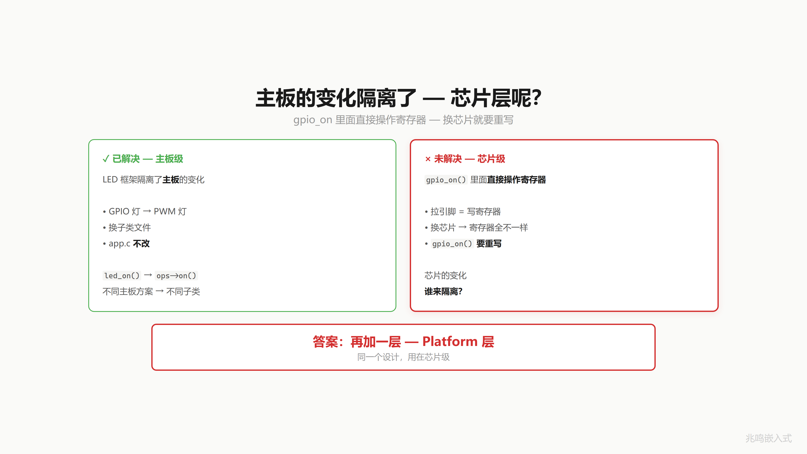
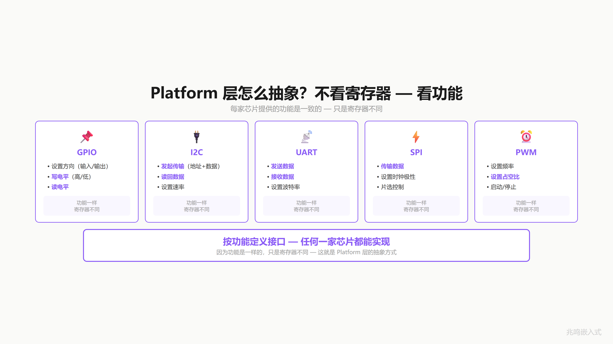
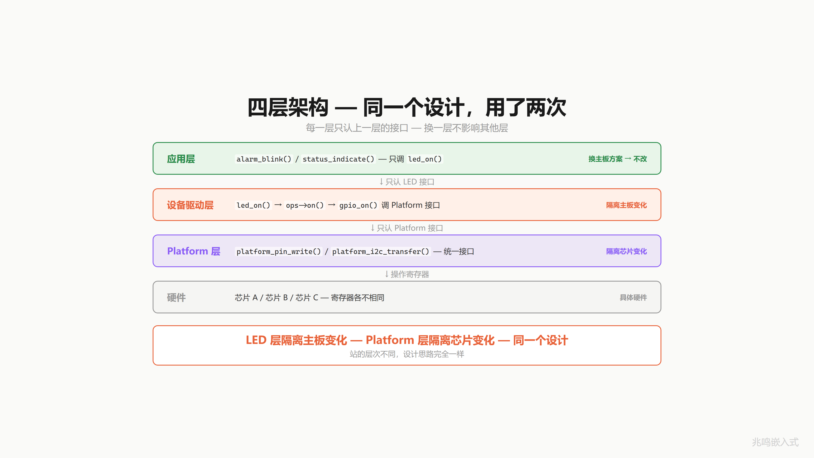
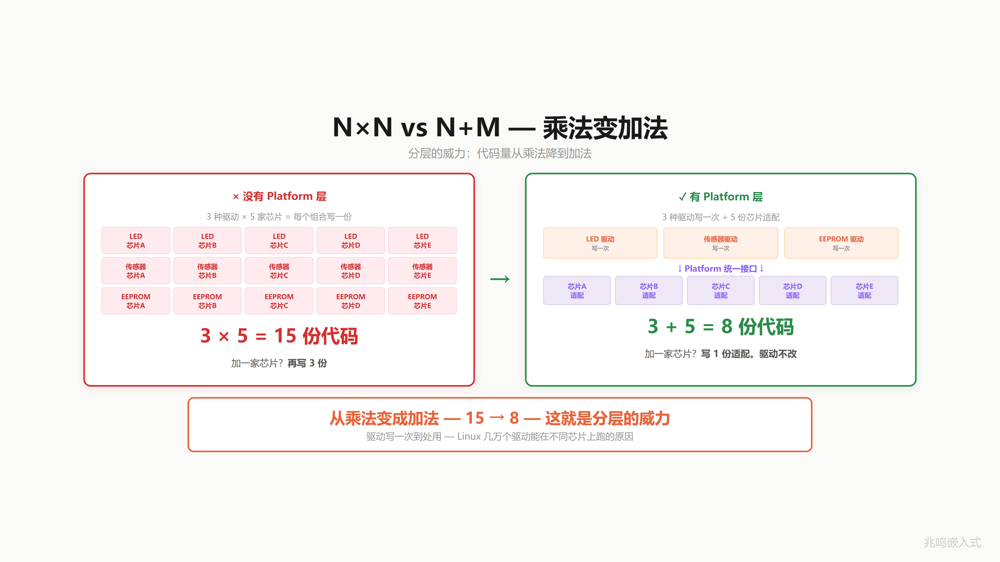
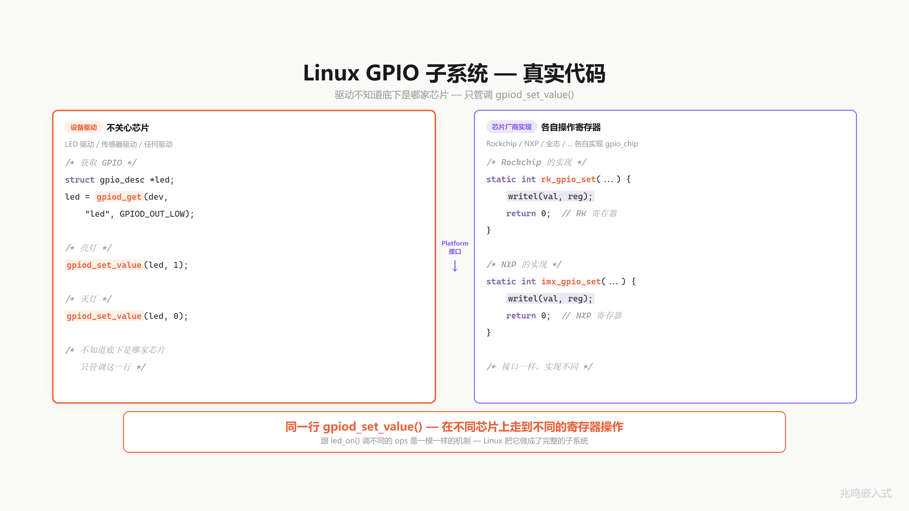
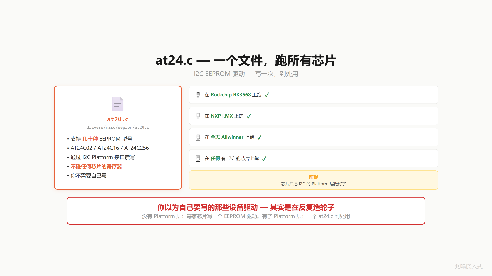
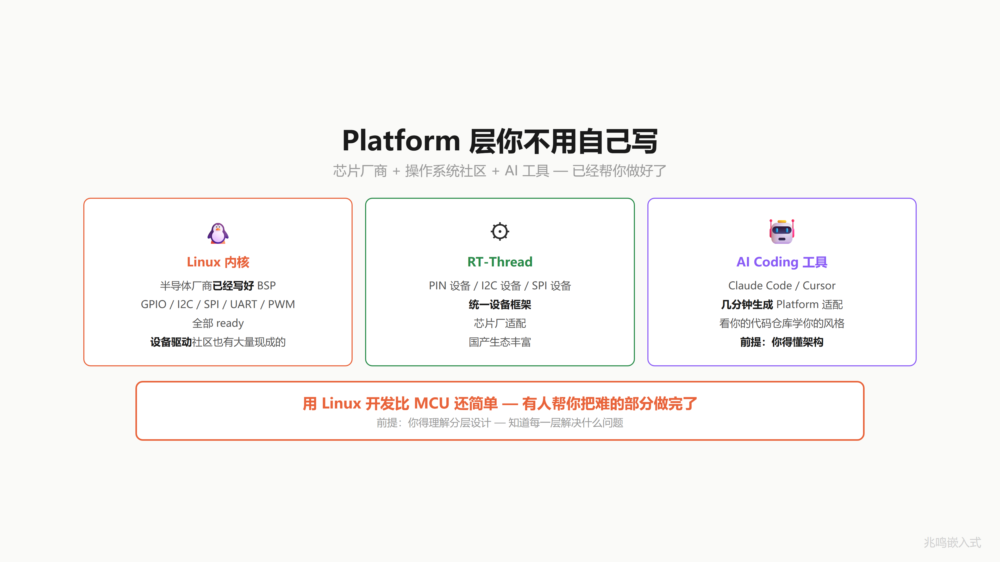

# 第 16 章 · 为什么 Linux 一点都不难 · 你已经在写 Linux 风格代码

配套代码：[`oop-in-c/code/16-linux-style/`](https://github.com/ZhaoChengBo/zhaoming-embedded/tree/master/oop-in-c/code/16-linux-style/)

做嵌入式 11 年，我发现 Linux 一点都不难。

是有人故意让你觉得它难。

这一章给你戳穿。前提是你已经懂了 ch15 的 platform 抽象。

## 16.1 上一章隔离了主板，但芯片层呢

ch15 的 LED 框架隔离了主板：换主板方案，应用层 0 改动。

但 `gpio_on` 里头调的是 `platform_gpio_write` 这个封装函数，封装函数内部走 ops 分发到当前选定的 platform 实例（PC 版 / STM32 版 / Linux 版），platform 实例本身就是写寄存器、写 sysfs 的具体代码。换芯片呢？从 STM32 换到瑞萨，BSRR 寄存器换名字了，`led_stm32.c` 里的实现要重写。

主板的变化你的 LED 层隔离了。芯片的变化，谁来隔离？



## 16.2 同一招用第二次：再加一层

答案，再加一层。Platform 层。

ch15 的 `struct led_base + led_ops` 框架是设备层，跑在 LED / sensor / motor 这一类业务对象上。ch16 要在它下面加一层，把"具体芯片的 GPIO 怎么写电平"这件事也用 ops 表抽象出来。结构和上一章一字不差，只是层次往下移了一层：

```
ch15 设备层：    led_base   +   led_ops          应用层调 led_on(handle)
ch16 平台层：    gpio_chip  +   gpio_chip 里的函数指针   led 驱动调 gpiod_set_value(desc)
```

之前你看不到的 `platform_gpio_write` 内部，今天打开看里面：它要落到具体芯片的寄存器，本章把这一层用 `gpio_chip` 抽象起来。

不看寄存器，看功能。

每家芯片的 GPIO 都能干什么？设方向、写电平、读电平。功能一样，寄存器不同。

每家芯片的 I2C 都能干什么？发起传输、接收数据。功能一样，寄存器不同。

UART、SPI 也一样，每家芯片提供同一组功能（产生时序、收发字节），实现不同。

所以不看实现，按功能定义接口：

```c
struct gpio_ops {
	int (*direction_output)(struct gpio_chip *gc, unsigned int offset, int value);
	int (*get)(struct gpio_chip *gc, unsigned int offset);
	void (*set)(struct gpio_chip *gc, unsigned int offset, int value);
};
```

任何一家芯片都能实现这套接口。功能一样。



## 16.3 四层架构

```
应用层      只认 LED 接口     换主板方案不改
LED 驱动层  只认 Platform 接口  换芯片不改
Platform 层 对接具体芯片        芯片 A、B、C 各一份
具体硬件    寄存器             芯片厂卖给你的
```

应用层调 led_on，led 驱动层调 platform 的写引脚接口，platform 层调具体芯片的寄存器。每一层只调下一层。

LED 层隔离主板变化（同一份 led 代码，跑在 GPIO / PWM / I2C 三种灯上）。Platform 层隔离芯片变化（同一份 platform 接口，跑在不同 SoC 上）。

同一招，隔离变化，用了两次。站的层次不同，机制完全相同。



## 16.4 1×N vs N+M：乘法变加法

来算一笔账。

**没有 platform 层**：你有 3 种设备驱动（LED / sensor / motor），要跑在 5 家 SoC 上。每种驱动对每家 SoC 写一份。

```
driver × chip = 3 × 5 = 15 份代码
```

加一家 SoC？再写 3 份。15 → 18。

**有 platform 层**：3 种设备驱动只写一次，通过 platform 接口调用。5 家 SoC 各写一份 platform 适配。

```
driver + chip = 3 + 5 = 8 份代码
```

加一家 SoC？写 1 份 platform 适配就够。8 → 9。设备驱动一行不动。

从乘法变成了加法。3 × 5 = 15，3 + 5 = 8。



而且这 3 份设备驱动写出来，谁都能用。换芯片不影响。这就是 Linux 内核几万个驱动能在不同 SoC 上跑的原因。

## 16.5 Linux GPIO 子系统：真实代码

打开 Linux 内核 `drivers/gpio/gpiolib.c` 第 3245 行：

```c
void gpiod_set_value(struct gpio_desc *desc, int value)
{
	VALIDATE_DESC_VOID(desc);
	WARN_ON(desc->gdev->chip->can_sleep);
	gpiod_set_value_nocheck(desc, value);
}
EXPORT_SYMBOL_GPL(gpiod_set_value);
```

调到底是同一个 `gpiolib.c` 第 3051 行的 `gpiod_set_raw_value_commit`：

```c
static void gpiod_set_raw_value_commit(struct gpio_desc *desc, bool value)
{
	struct gpio_chip	*gc;

	gc = desc->gdev->chip;
	trace_gpio_value(desc_to_gpio(desc), 0, value);
	gc->set(gc, gpio_chip_hwgpio(desc), value);
}
```

最后一行 `gc->set(gc, gpio_chip_hwgpio(desc), value)`，

这就是你 ch11 / ch15 学的多态 dispatch。`gc` 是 `struct gpio_chip *`，`gc->set` 是函数指针。每家芯片的 `set` 字段指向自己的 `set` 实现。同一行 `gc->set(...)`，红灯走 vendorA 的 `set`，绿灯走 vendorB 的 `set`。

驱动作者一行不改。

```c
/* drivers/leds/leds-gpio.c 的简化版 */
static void gpio_led_set(struct led_classdev *led_cdev,
			 enum led_brightness value)
{
	struct gpio_led_data *led_dat =
		container_of(led_cdev, struct gpio_led_data, cdev);
	gpiod_set_value(led_dat->gpiod, !!value);
}
```

这一行 `container_of` 你 ch13 学过。这一行 `gpiod_set_value` 你刚刚见到，它内部走 `gc->set` 多态 dispatch 到具体 SoC。

整个 `leds-gpio.c` 文件 200 多行，跨所有 SoC 通吃。芯片厂的工作只是写自己那份 `gc->set` 实现，driver 作者一行不动。

`struct gpio_chip` 真身在 `include/linux/gpio/driver.h` 第 415 行，挑核心字段看：

```c
struct gpio_chip {
	const char	*label;       /* "vendorA-gpio" 这种名字 */
	struct device	*parent;      /* 关联的 device 节点 */

	int  (*direction_output)(struct gpio_chip *gc,
				 unsigned int offset, int value);
	int  (*get)(struct gpio_chip *gc, unsigned int offset);
	void (*set)(struct gpio_chip *gc, unsigned int offset, int value);
	/* ... 还有 30 多个字段：中断、热插拔、debug、节点管理 ... */
};
```

第一段是元数据（`label`、`parent`），相当于 ch11 你的 `struct led_base` 里的 `name`。中间一大堆函数指针，就是你的 `struct led_ops`，只是字段更多。后面省略的字段是中断、热插拔、debug 这些工业级特性。

骨架，就是 ch11 你演化出来的 base + ops，**放大成工业级**的样子。



## 16.6 一个驱动跨所有芯片：at24 案例

Linux 内核里有一个文件 `drivers/misc/eeprom/at24.c`。I2C EEPROM 的驱动。一个文件，支持几十种 EEPROM 型号（AT24C01、AT24C02、24C16、24C512……），跑在任何家 SoC 上，只要芯片厂的 I2C platform 层做好了。

你不需要自己写 EEPROM 驱动。社区已经写好了。同样：I2C 扩展 IO、SPI 屏幕驱动、PWM 电机控制器，大部分都有现成的内核驱动。

你以为自己要写的那些设备驱动，多数是在反复造轮子。

没有 platform 层的时候，你给每家 SoC 写一份 EEPROM 驱动。有了 platform 层，一份 at24.c，到处用。



## 16.7 Platform 层你不用自己写

但 platform 层本身要不要写？

不需要。

Linux 内核：半导体厂商已经把 platform 层写好了。你买一颗 SoC，BSP 包里 GPIO / I2C / SPI / UART，全部 ready。

RT-Thread 也一样：PIN 设备、I2C 设备、SPI 设备，统一框架，芯片厂适配。

Zephyr 同样：device tree binding + driver model，芯片厂提供 `gpio_dw.c` / `i2c_nrfx_twim.c` 这种文件。

所以你的项目只需要关心：

1. 设备驱动层（多数从社区拿现成的）
2. 应用层（你自己写）

Platform 层？芯片厂做好了。设备驱动？大部分社区已经有了。

这就是为什么用 Linux 开发比裸机 MCU 还简单，不是 Linux 简单，是有人替你把难的部分做完了。前提是你得理解这种分层设计，知道每一层解决什么问题。



## 16.8 AI 时代

有人说 AI 时代不需要学架构了，AI 能写代码。

AI 能帮你写 gpio_on，能帮你写 platform 层适配，能从零生成一个 I2C 驱动。

但决定"这里该用 ops 表还是 if-else"、"这层该抽象到什么程度"、"这个接口够不够稳定"，这一类问题不是 AI 给你答案，是你给 AI 答案，AI 才能照你的骨架往下写。

而且 AI 是看你的代码仓库学习你的风格的。你的代码有分层，AI 输出就有分层。你的代码是一坨，AI 输出也是一坨。

这就是 AI 时代你的核心竞争力，你的架构能力，决定了 AI 能帮你放大多少。


## 16.9 视频里没讲透的几个细节

### 16.9.1 trace_gpio_value 这一行干什么

第 16.5 节贴的 `gpiod_set_raw_value_commit` 里有一行：

```c
trace_gpio_value(desc_to_gpio(desc), 0, value);
```

这是内核 ftrace 框架的 trace 埋点。打开 ftrace 之后，每一次 GPIO 写入都会被记录到 trace buffer，开发期 debug 极方便。生产构建里 trace 框架可以彻底关掉，那一行编译期消失。

这是 Linux 内核常见的"埋点 + 可关闭"模式。本书 ch14 讲 assert 时提过类似思路（assert 在 release 关掉零开销）。

### 16.9.2 EXPORT_SYMBOL_GPL 是什么

`gpiod_set_value` 函数末尾这一行：

```c
EXPORT_SYMBOL_GPL(gpiod_set_value);
```

它做了两件事：

1. 把 `gpiod_set_value` 这个符号加到内核的导出符号表，让 loadable module 能链接到。
2. 标记 `_GPL`，意思是只有 GPL 兼容许可证的 module 才能用。

这一招和下一章要讲的注册机制同源，都是用 `__attribute__((section()))` 把信息塞进特殊段，运行时遍历。下一章你会看到完整玩法。

### 16.9.3 RT-Thread / Zephyr 同源

打开 RT-Thread `components/drivers/include/drivers/pin.h`：

```c
struct rt_pin_ops {
	void (*pin_mode)(struct rt_device *device, rt_base_t pin, rt_uint8_t mode);
	void (*pin_write)(struct rt_device *device, rt_base_t pin, rt_uint8_t value);
	rt_int8_t (*pin_read)(struct rt_device *device, rt_base_t pin);
	rt_err_t (*pin_attach_irq)(struct rt_device *device, rt_int32_t pin,
				   rt_uint32_t mode, void (*hdr)(void *args), void *args);
	rt_err_t (*pin_detach_irq)(struct rt_device *device, rt_int32_t pin);
	rt_err_t (*pin_irq_enable)(struct rt_device *device, rt_base_t pin,
				   rt_uint32_t enabled);
	rt_base_t (*pin_get)(const char *name);
};
```

Zephyr 的 `gpio_driver_api`：

```c
struct gpio_driver_api {
	int (*pin_configure)(const struct device *port, gpio_pin_t pin, gpio_flags_t flags);
	int (*port_get_raw)(const struct device *port, gpio_port_value_t *value);
	int (*port_set_masked_raw)(const struct device *port, gpio_port_pins_t mask,
				    gpio_port_value_t value);
	/* ... */
};
```

字段名稍有不同，机制完全一致。三个项目（Linux 内核、RT-Thread、Zephyr）都是 C 写的，都用 ops 表 + 函数指针。读完本书你打开任何一个项目源码不会陌生。

### 16.9.4 device tree：怎么把硬件树挂上 ops 表

这个细节本章不展开。简单说：device tree 是 Linux / Zephyr 用来描述硬件拓扑的文本文件（比如 "GPIO bank A 在地址 0x40020000，连了 16 个引脚"）。启动期 device tree 被解析成 `struct device` 节点，每个节点根据 `compatible` 字符串找到对应的驱动，挂上 `ops` 表。

device tree 解决的是"如何把 ops 表上挂的 chip 实例和实际硬件连起来"。本章你只要知道：注册（从静态全局 → device tree 动态）这一步，和 ops 表本身的机制无关。

### 16.9.5 不要把 HAL 库当 platform 层

ST 的 HAL 库（`HAL_GPIO_WritePin` 那一套）经常被人当作 platform 抽象的例子。其实不是。HAL 库是"绑死 STM32 一家 + 函数式包装"，`HAL_GPIO_WritePin(GPIOA, ...)` 里的 GPIOA 是 STM32 寄存器布局的 typedef，绑得死死的。换到瑞萨 RA 上 GPIOA 这个符号都不存在。

真正的 platform 层是抽象到"任何 SoC 都能实现"的程度。ops 表才是 platform 层的标准形态。HAL 库是 platform 层下面、绑死单家的实现，你用的时候只是 platform 层的一个具体子类。

## 16.10 你现在的代码在 STM32 / Linux 上长什么样

ch16 是工程哲学章，本章 STM32 端没有特殊代码片段，你已经会的 ch15 platform_ops 就是 STM32 端的样子。

如果你想把本章 pc/ 里山寨的 gpio_chip 框架移植到 STM32 裸机上，做法是：

1. 把 `vendor_a_set` 里的 printf 替换成真实的 BSRR 写入。
2. 启动期（或下一章的 initcall）调一次 `gpiochip_add(&vendor_a_chip)`。
3. led 驱动一行不改。

效果就是"一份 leds-gpio.c 跑在不同 SoC 上"，这就是 Linux 内核的工作模式。详见 [`oop-in-c/code/16-linux-style/platform-mcu/stm32/`](https://github.com/ZhaoChengBo/zhaoming-embedded/tree/master/oop-in-c/code/16-linux-style/platform-mcu/stm32/)。

Linux 用户态视角是另一档代码: [`oop-in-c/code/16-linux-style/linux-driver/userspace/`](https://github.com/ZhaoChengBo/zhaoming-embedded/tree/master/oop-in-c/code/16-linux-style/linux-driver/userspace/) 给一份 libgpiod 最小例——应用层一行 `gpiod_line_set_value(line, 1)`，跨进程 syscall 进内核之后跑的就是本章 16.5 节那一套 `gc->set` 多态 dispatch（真身，不是山寨）。pc/ 是教学版骨架，linux-driver/userspace/ 是产品上每天跑的应用层调用形态。

LED 这种通用外设, Linux 内核 mainline 已经有 `drivers/leds/leds-gpio.c` 标准内核驱动 (上千种板子用过), 这本书不再重写一份"教学用 LED 内核驱动" (过度演示). 真要写新硬件的内核驱动, 先看 § 16.14 三步判断流程。

Linux 内核侧的"snippet"就是内核源码本身（如何获取内核源码做本地参考见附录 D，下面是 v6.6 LTS 的关键路径）：

- `include/linux/gpio/driver.h` 第 415 行：`struct gpio_chip` 真身
- `drivers/gpio/gpiolib.c` 第 3245 行：`gpiod_set_value`
- `drivers/misc/eeprom/at24.c`：一个文件跨所有 SoC 的 EEPROM 驱动
- `include/linux/container_of.h` 第 18 行：`container_of` 真身

读完本章 pc/ 山寨版再去读这几个内核源文件，你会发现"原来就是这一招"。

## 16.11 工业代码里的对照

工业控制板项目里没有 Linux 内核（裸机 + RTOS），但用的是同一套思路：

```c
/* drivers/gpio/gpio_chip.h */
struct gpio_chip {
	const char *name;
	const struct gpio_chip_ops *ops;
	uint32_t base;
	uint32_t ngpio;
};

struct gpio_chip_ops {
	int  (*request)(struct gpio_chip *gc, uint32_t offset);
	void (*set)(struct gpio_chip *gc, uint32_t offset, bool value);
	bool (*get)(struct gpio_chip *gc, uint32_t offset);
};
```

5 套产品，3 款主控芯片，driver 模块（led / motor / encoder / sensor / eeprom）跨产品共享。每款芯片提供一份 `gpio_chip` 实现 + 注册一次 `gpiochip_add`。

跟 Linux 内核 90% 一致。这套架构是"工业总结的最佳工程实践"，不是某个项目独创的。

## 16.12 完整源码清单

把下面的代码块分别保存到对应的文件，目录结构和 [`oop-in-c/code/16-linux-style/pc/`](https://github.com/ZhaoChengBo/zhaoming-embedded/tree/master/oop-in-c/code/16-linux-style/pc/) 一致。`make && ./demo` 即可跑通。

### 文件 1：`main.c`（43 行）

启动入口。注册两家芯片，然后用同一份 `leds-gpio` 驱动接口分别点亮两家芯片上的灯。

```c
/* SPDX-License-Identifier: MIT */
/*
 * main.c - 山寨内核启动 + 同一份 leds-gpio 跑两家芯片
 */

#include "gpio_chip.h"
#include <stdio.h>
#include <stdlib.h>

void vendor_a_probe(void);
void vendor_b_probe(void);
void led_gpio_brightness_set(struct gpio_desc *desc, int value);

int main(void)
{
	printf("=========================================\n");
	printf("  ch16 - linux-style gpio subsystem\n");
	printf("=========================================\n");

	/* 启动期注册 chip。真实内核里走 module_init。 */
	vendor_a_probe();
	vendor_b_probe();

	/* leds-gpio 驱动通过 chip + offset 拿到 desc */
	struct gpio_desc *led_red   = gpio_get_desc("vendorA-gpio", 5);
	struct gpio_desc *led_green = gpio_get_desc("vendorB-gpio", 2);

	printf("\n--- leds-gpio drives both chips ---\n");
	led_gpio_brightness_set(led_red,   1);
	led_gpio_brightness_set(led_green, 1);
	led_gpio_brightness_set(led_red,   0);
	led_gpio_brightness_set(led_green, 0);

	printf("\n>>> same gpiod_set_value() dispatches to two vendors <<<\n");

	free(led_red);
	free(led_green);

	printf("\nPress Enter to exit...\n");
	getchar();
	return 0;
}
```

### 文件 2：`leds_gpio.c`（24 行）

设备驱动层。它只调一行 `gpiod_set_value`，不知道也不需要知道底下是哪家 SoC 的 GPIO 控制器。这就是真实内核 `drivers/leds/leds-gpio.c` 的山寨版。

```c
/* SPDX-License-Identifier: MIT */
/*
 * leds_gpio.c - 内核里的 leds-gpio 驱动山寨版
 *
 * 真实内核版定义在 drivers/leds/leds-gpio.c。它就调一行 gpiod_set_value，
 * 不关心底下是哪家 SoC 的 GPIO 控制器。
 *
 * 这就是 Linux 内核驱动作者的世界：通过 ops 表 + 抽象接口，写一份代码
 * 服务所有芯片。
 */

#include "gpio_chip.h"
#include <stdio.h>

void led_gpio_brightness_set(struct gpio_desc *desc, int value)
{
	/*
	 * 这一行内部走 gc->set ， 多态 dispatch。
	 * vendorA 走 vendor_a_set，vendorB 走 vendor_b_set。
	 * 这个驱动不知道也不需要知道。
	 */
	gpiod_set_value(desc, value);
}
```

### 文件 3：`gpio_chip.h`（49 行）

父类接口。`struct gpio_chip` 是每家芯片要实现的"模板"，`struct gpio_desc` 是 consumer 拿到的句柄。

```c
/* SPDX-License-Identifier: MIT */
/*
 * gpio_chip.h - "山寨" 一份 Linux 内核 gpio_chip
 *
 * 把 ch15 的 platform_ops 改个名字、改成"按 chip 分组"的形态，
 * 你就得到了一份和 Linux 内核 GPIO 子系统 90% 相像的接口。
 *
 * 真实内核版定义在 include/linux/gpio/driver.h 第 415 行起，
 * 字段比这里多得多（中断、热插拔、debug 等），但骨架就是这样。
 */

#ifndef GPIO_CHIP_H
#define GPIO_CHIP_H

#include <stdint.h>
#include <stdbool.h>

struct gpio_chip {
	const char *label;
	uint32_t    base;
	uint32_t    ngpio;

	int  (*request)(struct gpio_chip *gc, unsigned int offset);
	void (*free)(struct gpio_chip *gc, unsigned int offset);
	int  (*direction_output)(struct gpio_chip *gc,
				 unsigned int offset, int value);
	int  (*get)(struct gpio_chip *gc, unsigned int offset);
	void (*set)(struct gpio_chip *gc, unsigned int offset, int value);

	void *driver_data;     /* 给具体 chip 实现挂自己的 context */
};

/* 内核态 gpio consumer 接口（简化版） */
struct gpio_desc {
	struct gpio_chip *gc;
	unsigned int      offset;
};

void gpiod_set_value(struct gpio_desc *desc, int value);
int  gpiod_get_value(struct gpio_desc *desc);

/* 注册 chip（真正内核里叫 gpiochip_add_data） */
int gpiochip_add(struct gpio_chip *gc);

/* 通过 chip + offset 拿 desc（真正内核走 device tree） */
struct gpio_desc *gpio_get_desc(const char *chip_label, unsigned int offset);

#endif /* GPIO_CHIP_H */
```

### 文件 4：`gpiolib.c`（66 行）

"内核"侧的注册表 + dispatch。`gpiod_set_value` 最后一行 `desc->gc->set(...)` 就是 16.5 节内核源码的山寨版。

```c
/* SPDX-License-Identifier: MIT */
/*
 * gpiolib.c - "山寨" 内核 gpiolib 的最小内核态
 *
 * 注册一组 gpio_chip，通过 desc 反向找到 chip，调 chip->set / chip->get。
 * 真实内核版见 drivers/gpio/gpiolib.c 第 3245 行 gpiod_set_value。
 *
 * 内核里那段关键调用是这样：
 *   gpiod_set_value -> gpiod_set_value_nocheck -> gpiod_set_raw_value_commit
 *   -> gc->set(gc, gpio_chip_hwgpio(desc), value);
 *
 * 最后一行 gc->set 就是你 ch11 学的多态 dispatch。
 */

#include "gpio_chip.h"
#include <stdio.h>
#include <string.h>
#include <stdlib.h>

#define MAX_CHIPS	8

static struct gpio_chip *s_chips[MAX_CHIPS];
static int s_num_chips;

int gpiochip_add(struct gpio_chip *gc)
{
	if (s_num_chips >= MAX_CHIPS)
		return -1;
	s_chips[s_num_chips++] = gc;
	printf("[gpiolib] chip '%s' registered (base=%u, ngpio=%u)\n",
	       gc->label, gc->base, gc->ngpio);
	return 0;
}

struct gpio_desc *gpio_get_desc(const char *chip_label, unsigned int offset)
{
	for (int i = 0; i < s_num_chips; i++) {
		if (strcmp(s_chips[i]->label, chip_label) == 0) {
			struct gpio_desc *d = malloc(sizeof(*d));
			d->gc     = s_chips[i];
			d->offset = offset;
			return d;
		}
	}
	return NULL;
}

void gpiod_set_value(struct gpio_desc *desc, int value)
{
	if (!desc || !desc->gc)
		return;

	/* 这一行是 Linux 内核 drivers/gpio/gpiolib.c L3057 的山寨版：
	 *   gc->set(gc, gpio_chip_hwgpio(desc), value);
	 * 把 desc->offset 当 hwgpio 直接传过去。
	 */
	desc->gc->set(desc->gc, desc->offset, value);
}

int gpiod_get_value(struct gpio_desc *desc)
{
	if (!desc || !desc->gc)
		return -1;
	return desc->gc->get(desc->gc, desc->offset);
}
```

### 文件 5：`gpio_vendor_a.c`（68 行）

厂商 A 的 `gpio_chip` 实现。每家芯片厂提供一份这样的文件，内核里对应 `drivers/gpio/gpio-rockchip.c` / `gpio-mxc.c` 这一族。

```c
/* SPDX-License-Identifier: MIT */
/*
 * gpio_vendor_a.c - 厂商 A 的 gpio_chip 驱动
 *
 * 假装这是某家 SoC 的 GPIO 控制器实现。把 chip->set 指向自己的
 * 寄存器操作。在 PC 上用 printf 模拟。
 *
 * 真实 Linux 内核里的等价物：drivers/gpio/gpio-mxc.c、gpio-rockchip.c
 * 等等。每家芯片厂提供一份这样的文件。
 */

#include "gpio_chip.h"
#include <stdio.h>

static int vendor_a_request(struct gpio_chip *gc, unsigned int offset)
{
	printf("    [vendorA] request offset=%u (write reg PORT_EN)\n",
	       offset);
	(void)gc;
	return 0;
}

static void vendor_a_free(struct gpio_chip *gc, unsigned int offset)
{
	printf("    [vendorA] free offset=%u\n", offset);
	(void)gc;
}

static int vendor_a_direction_output(struct gpio_chip *gc,
				     unsigned int offset, int value)
{
	printf("    [vendorA] direction_output offset=%u (write reg DIR)\n",
	       offset);
	(void)gc;
	(void)value;
	return 0;
}

static int vendor_a_get(struct gpio_chip *gc, unsigned int offset)
{
	(void)gc;
	(void)offset;
	return 0;
}

static void vendor_a_set(struct gpio_chip *gc, unsigned int offset, int value)
{
	printf("    [vendorA] set offset=%u value=%d (DR_REG <- 0x%08X)\n",
	       offset, value, value ? (1u << offset) : 0);
	(void)gc;
}

static struct gpio_chip vendor_a_chip = {
	.label            = "vendorA-gpio",
	.base             = 0,
	.ngpio            = 32,
	.request          = vendor_a_request,
	.free             = vendor_a_free,
	.direction_output = vendor_a_direction_output,
	.get              = vendor_a_get,
	.set              = vendor_a_set,
};

void vendor_a_probe(void)
{
	gpiochip_add(&vendor_a_chip);
}
```

### 文件 6：`gpio_vendor_b.c`（66 行）

厂商 B 的 `gpio_chip` 实现。同样的接口，不同的寄存器风格（BSRR 模式，类似 STM32）。

```c
/* SPDX-License-Identifier: MIT */
/*
 * gpio_vendor_b.c - 厂商 B 的 gpio_chip 驱动
 *
 * 同样的接口，不同的内部实现（不同寄存器布局）。这一份是为了演示
 * 同一份 gpiod_set_value 在不同芯片下走到不同实现。
 */

#include "gpio_chip.h"
#include <stdio.h>

static int vendor_b_request(struct gpio_chip *gc, unsigned int offset)
{
	printf("    [vendorB] request offset=%u (clear reg LOCK)\n", offset);
	(void)gc;
	return 0;
}

static void vendor_b_free(struct gpio_chip *gc, unsigned int offset)
{
	printf("    [vendorB] free offset=%u\n", offset);
	(void)gc;
}

static int vendor_b_direction_output(struct gpio_chip *gc,
				     unsigned int offset, int value)
{
	printf("    [vendorB] direction_output offset=%u (set reg MODE)\n",
	       offset);
	(void)gc;
	(void)value;
	return 0;
}

static int vendor_b_get(struct gpio_chip *gc, unsigned int offset)
{
	(void)gc;
	(void)offset;
	return 0;
}

static void vendor_b_set(struct gpio_chip *gc, unsigned int offset, int value)
{
	/* 厂商 B 用 SET / CLR 两个寄存器（类似 STM32 BSRR） */
	uint32_t reg = value ? (1u << offset) : (1u << (offset + 16));
	printf("    [vendorB] set offset=%u value=%d (BSRR <- 0x%08X)\n",
	       offset, value, reg);
	(void)gc;
}

static struct gpio_chip vendor_b_chip = {
	.label            = "vendorB-gpio",
	.base             = 32,
	.ngpio            = 16,
	.request          = vendor_b_request,
	.free             = vendor_b_free,
	.direction_output = vendor_b_direction_output,
	.get              = vendor_b_get,
	.set              = vendor_b_set,
};

void vendor_b_probe(void)
{
	gpiochip_add(&vendor_b_chip);
}
```

### 文件 7：`Makefile`（19 行）

```makefile
# Makefile - ch16 linux-style (PC)

CC      = gcc
CFLAGS  = -Wall -Wextra -std=c99
TARGET  = demo
SRCS    = main.c gpiolib.c gpio_vendor_a.c gpio_vendor_b.c leds_gpio.c

.PHONY: all clean run

all: $(TARGET)

$(TARGET): $(SRCS)
	$(CC) $(CFLAGS) -o $(TARGET) $(SRCS)

run: $(TARGET)
	./$(TARGET)

clean:
	rm -f $(TARGET) $(TARGET).exe
```

### 跑一遍

```bash
cd oop-in-c/code/16-linux-style/pc
make
./demo
```

### 期望输出

```
=========================================
  ch16 - linux-style gpio subsystem
=========================================
[gpiolib] chip 'vendorA-gpio' registered (base=0, ngpio=32)
[gpiolib] chip 'vendorB-gpio' registered (base=32, ngpio=16)

--- leds-gpio drives both chips ---
    [vendorA] set offset=5 value=1 (DR_REG <- 0x00000020)
    [vendorB] set offset=2 value=1 (BSRR <- 0x00000004)
    [vendorA] set offset=5 value=0 (DR_REG <- 0x00000000)
    [vendorB] set offset=2 value=0 (BSRR <- 0x00040000)

>>> same gpiod_set_value() dispatches to two vendors <<<
```

`led_gpio_brightness_set` 这个驱动函数对两个 LED 调同一行 `gpiod_set_value`。红灯走 vendorA 的寄存器（DR_REG），绿灯走 vendorB 的寄存器（BSRR 风格）。驱动一行不改。

这就是 Linux 内核驱动作者每天的工作模式。

## 16.13 不只是 Linux：Zephyr / RT-Thread 也是同款

ch16 前面一整章给你看的是 Linux 内核 `gpio_chip` 子系统. 读到这里很自然要问: 那其他 RTOS 呢, 是不是只有 Linux 这么干. 不是. 凡是带 device subsystem 的 RTOS 都是同款, 内核已经把 platform 层做完, 应用层别再抽.

**Zephyr** 用 device tree binding + driver model, 编译期从 `.dts` 文件生成 device 实例, 应用层拿到一个 `const struct device *` 直接用:

```c
/* Zephyr 应用层调 GPIO·内核已经做完 platform 抽象·应用层直接用 */
const struct device *gpio = DEVICE_DT_GET(DT_NODELABEL(gpio0));
gpio_pin_configure(gpio, 17, GPIO_OUTPUT);
gpio_pin_set(gpio, 17, 1);
```

`gpio_pin_set` 内部走 `gpio_driver_api` 这张 ops 表 dispatch 到 `gpio_nrfx.c` / `gpio_stm32.c` 之类的具体芯片实现. 你 ch16 学的 `gc->set` 多态 dispatch 一字不差, 字段名换成 `port_set_masked_raw` 而已.

**RT-Thread** 走 `rt_device_register` / `rt_device_find` / `rt_device_open` / `rt_device_read/write/control` 一套接口. PIN / serial / i2c / spi 各自一个子类, 父类是 `struct rt_device`. 应用层直接调高层 API:

```c
/* RT-Thread 应用层·rt_pin_write 内部走 ops dispatch·和 ch15 教学版一字不差 */
rt_pin_mode(LED_PIN, PIN_MODE_OUTPUT);
rt_pin_write(LED_PIN, PIN_HIGH);
```

`rt_pin_write` 内部走 `struct rt_pin_ops` (16.9.3 节贴过), `pin_write` 函数指针落到具体 SoC 的实现. 和这本书 ch15 自抽的 platform 层骨架一字不差, 只是字段更全.

**NuttX** 也一样. 它走 POSIX 风格的 character device + driver_model. GPIO 挂 `/dev/gpioN` 节点, 应用层 `open / write / ioctl` 就够, 内核底下走 driver registration. 跟 Linux 用户态接口同款.

把四种环境拉平对照:

| 环境 | platform 抽象层 | 谁做的 |
| --- | --- | --- |
| 裸机 + HAL | 必须自抽 | 你自己 (ch15 / 附录 B 教的) |
| 带 device subsystem 的 RTOS (Zephyr / RT-Thread / NuttX) | 禁自抽 | 内核做完, 直接用 |
| Linux 用户态 | 禁自抽 | 内核做完, 直接 libgpiod (附录 C 实战) |
| Linux 内核态驱动 | 禁自抽 | 用 driver model (本章 16.5 节讲的 gpio_chip) |

裸机那一行是 ch15 + 附录 B 的主战场, 没人帮你, 你必须自抽. 中间两行是这一节的重点, 内核已经把 platform 层做完, 应用层 / 业务层再套一层 `platform_pin → rt_pin_write` 就是过度封装. 这种代码评审里很常见, 第一眼看像架构师, 仔细一看是把内核已经抽好的接口又包了一遍, 没拦下任何变化, 反而多了一层没意义的 indirection.

把 RT-Thread 应用代码套一层 `platform_pin → rt_pin_write` 和把 Linux 用户态套一层 `platform_pin → libgpiod_line_set_value` 是同一种错. 内核已经做完的事别重做.

> 这本书 ch15 教你怎么自抽 platform 层. 它的反面同样重要: 看到内核已经抽好的环境 (Linux / Zephyr / RT-Thread / NuttX), 别再抽. 自抽 platform 不是工业级的标志, **会判断什么时候不抽才是**. 这是 ch15 / ch16 / 附录 B / 附录 C 四个章节合起来想送给你的工程判断力.

Zephyr driver framework 完整工程·照着 5 分钟跑通·见**附录 B**。

## 16.14 应用层驱动 vs 内核层驱动：怎么选

上一节讲清楚了"内核已做完别再抽". 但 Linux 这一档环境上还有第二个问题: 你要写一个新硬件的驱动, 写在哪一层. 应用层 (libgpiod / sysfs / iio / spidev / i2c-dev) 还是内核层 (driver model / kernel module). 工程师面试聊到这一关, 一半人答不清楚. 这一节给你一份判断表.

先把两种位置的差别拉平来看:

| 维度 | 应用层 (libgpiod / sysfs / iio / spidev) | 内核层 (driver model / kmod) |
| --- | --- | --- |
| 开发难度 | 低 (gdb / strace / printf, 崩了重启进程) | 高 (KGDB / printk / qemu, 崩了 kernel panic) |
| 故障影响 | 进程挂, 系统不挂 | 内核挂, 全挂 |
| 实时性 | 受用户态调度, 有 jitter | ISR / softirq, 延迟低 |
| 性能 | syscall + 数据拷贝 | 零拷贝 / DMA, 直接 ioremap |
| 多进程共享 | 要 IPC (mmap / dbus / socket) | 内核里多进程透明共享 |
| Licensing | 可闭源 (你自己产品的 license) | GPL (内核接口要求) |
| 部署 | 拷贝二进制就行 | 重编内核, 或 DKMS 动态模块 |

7 个维度里, 前三行决定 "能不能写在应用层", 后四行决定 "写在应用层划不划算". 对照表硬记没意思, 给你一个三步判断流程, 真做项目的时候按顺序问:

**第一步**: Linux 内核已经有这一颗硬件的驱动, 而且接口够用. 直接用, 别写. 99% 的 GPIO / I2C / SPI / UART / 温度传感器 / 加速度计在内核 mainline 里已经有, 接口齐, 你写完一份新驱动, 维护一辈子. 内核里已有的, 直接 `apt install libgpiod-dev` + `gpiod_line_set_value`, 完事.

**第二步**: 内核没有, 或者厂家给的源码不开源 (做不到合并 mainline). 这时才轮到 "应用层 OR 内核层". 看四件事:

- 中断密度: 高频 (> 1 kHz) + 抖动敏感, 用户态调度顶不住, 内核层. 低频 + 抖动可容忍, 应用层够.
- 延迟要求: us 级, 内核层. ms 级, 应用层够.
- 多进程并发访问: 多个进程要共享同一颗设备, 内核层 (driver 提供 device 节点, 多进程 open 同一个 fd). 单进程独占, 应用层够.
- 数据吞吐: > 100 MB/s + 零拷贝刚需, 内核层 + DMA. 否则应用层 syscall 也跑得动.

**第三步** (跨平台兜底): 这是 MCU 不是 Linux 跑的硬件, 资源紧张到上不了完整内核, 但仍想要 device + driver 这套思想. 答案不是 "在 FreeRTOS 上自抽一份 platform 层", 是 **clone Zephyr 或 RT-Thread, 把它们的 driver framework 拔下来直接用**. driver 注册 + ops 表 + device tree 解析人家写了十几年, 你三周自抽的版本和它没法比. 完整论述见 ch15 § 15.16 给真实工程的建议.

举一个常见例子: 你要给一颗外接温度传感器写驱动. 走应用层还是内核层?

- 中断密度低 (温度采样 1 Hz / 10 Hz 就够), 延迟不敏感 (温度变化慢), 单进程独占 (一个采集任务读), 数据吞吐小. 四件事全往应用层这边倒.
- 应用层版本: `int fd = open("/dev/i2c-1");  ioctl(fd, I2C_SLAVE, 0x48);  read(fd, buf, 2);` 几十行代码, gdb 调试, 崩了重启进程, 闭源没问题. 半天搞定.
- 内核层版本: 写一份 i2c_driver, 注册 hwmon device, 走 sysfs 出温度. 一千行代码, KGDB 调试, 崩了 kernel panic, 必须 GPL 出来. 三周搞定.

你猜结果. 工业项目里 99% 的温度传感器走应用层. **能在应用层做的事就不要进内核**, 这是 Linux 内核社区自己的纪律, 也是工程判断力.

什么时候真要写内核驱动? 一个反例: 高速雷达 ADC, 1 MSPS 采样率 + DMA + ms 级延迟容忍上限. 这种应用层抗不住调度抖动, syscall + 拷贝吃不消, 必须写内核驱动用零拷贝 mmap / iio_buffer 暴露给用户态. 这一档项目一年遇不到几个.

判断三句话总结:
1. 内核已有内核驱动且满足 -> 直接用 libgpiod / iio / spidev, 不写.
2. 没有 -> 按延迟 / 中断密度 / 多进程需求选位置, 默认应用层, 上面四件有一件命中再上内核层.
3. MCU 资源紧仍想要这套 -> clone Zephyr / RT-Thread 拔现成框架, 别自抽.

> 写驱动的本事不在于会写, 在于会判断 "这一层该不该有". 工业代码里最贵的不是开发时间, 是 5 年后还能不能维护得动. 走对位置, 维护成本砍 10 倍.

Linux 用户态写应用 + 自己写一个 platform driver 模块的完整流程·见**附录 C**·你会亲手在 Raspberry Pi 4B 上跑一个 leds-status.ko。

## 16.15 视频回放

> [《C 语言·为什么 Linux 一点都不难·Platform 层·分层威力·AI 时代》](https://www.bilibili.com/video/BV13WofBcEmv/)

## 下一章

驱动注册这一步在本章 main 里手写：`vendor_a_probe(); vendor_b_probe();`。Linux 内核几千个驱动是怎么注册的？也是手写一长串调用？

不是。Linux 内核的 `main` 函数（你叫它 `start_kernel`）从来不改。加一个新驱动只写一行 `module_init(my_init)`，启动期自动挂上来。

下一章揭穿这一招：链接器收卡片，启动时按号码拨。

下一篇：[第 17 章 · 4000 万行一招写完 · 链接自动初始化](17-initcall.md)
