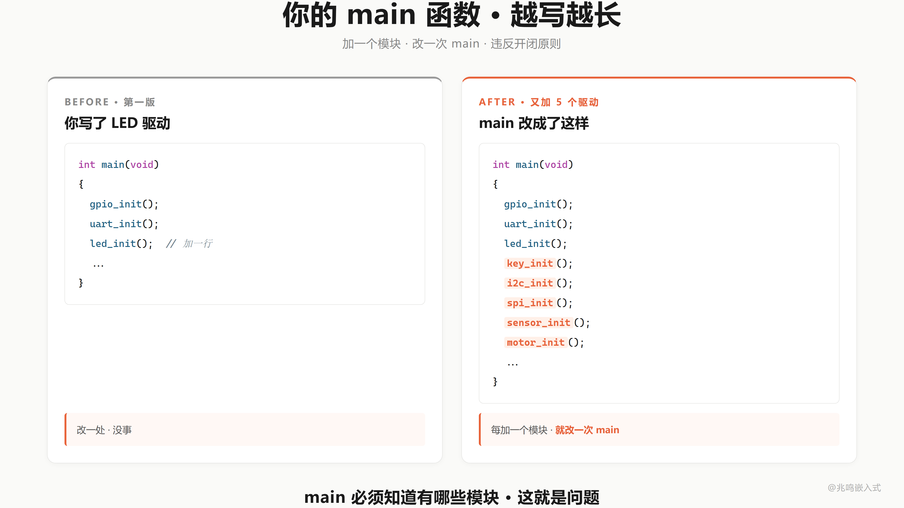
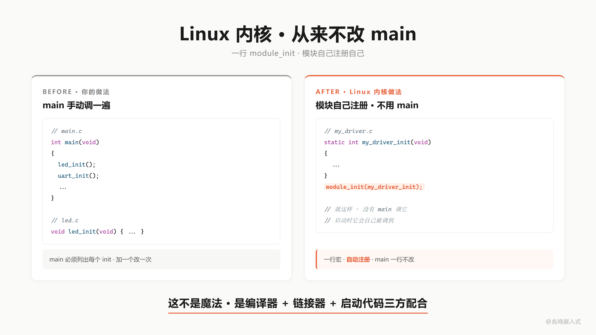
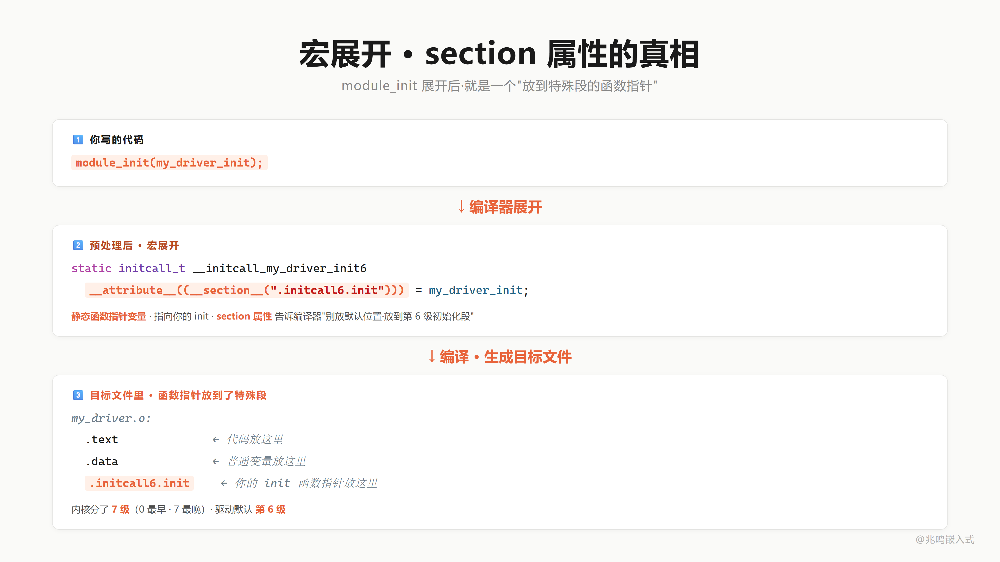
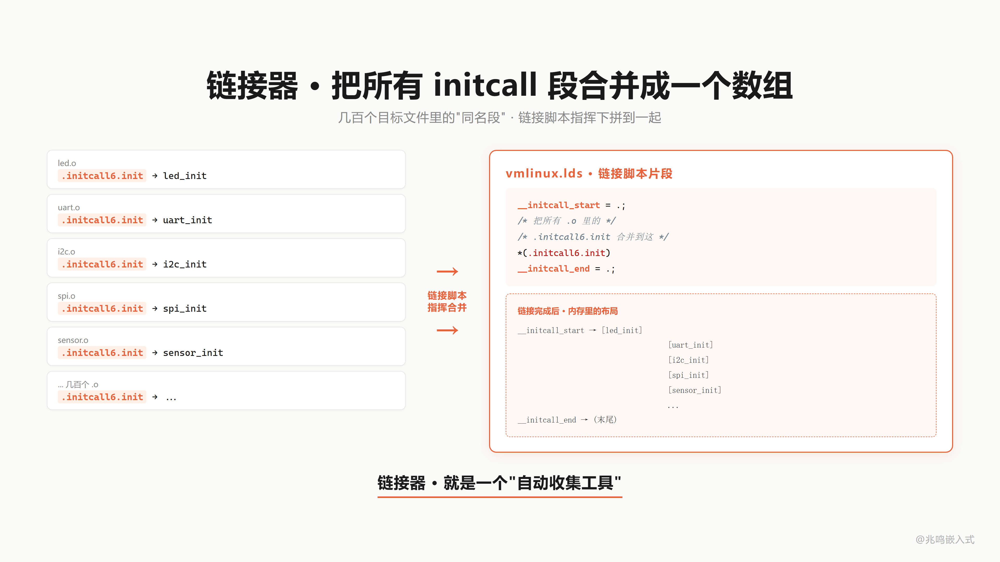
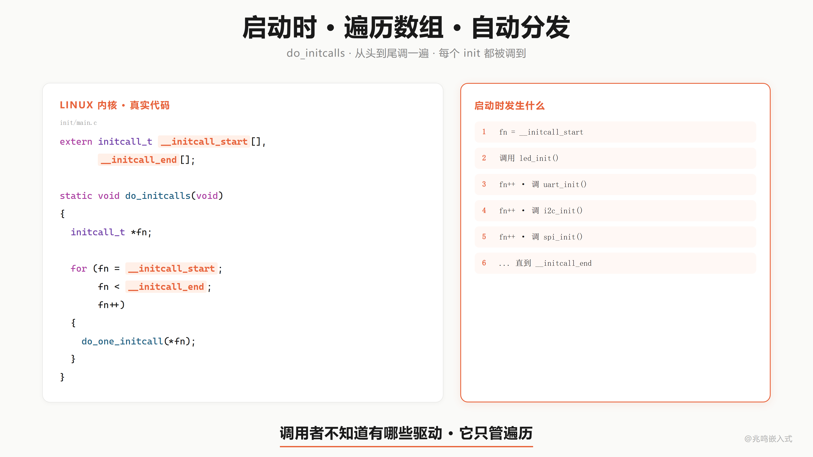
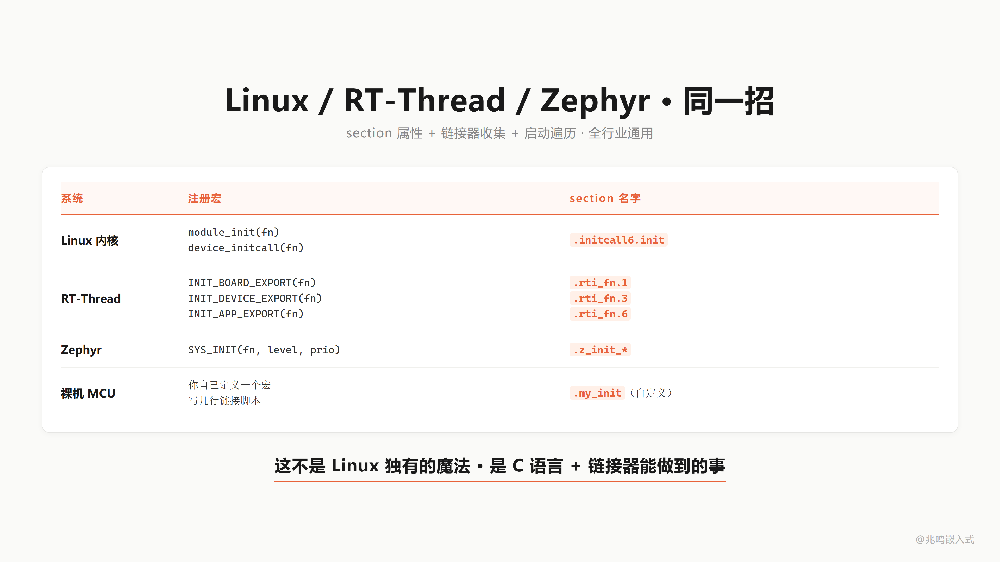
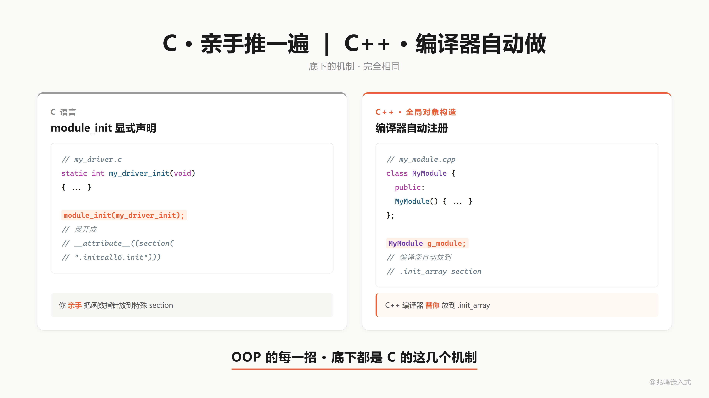

# 第 17 章 · 4000 万行一招写完 · 链接自动初始化

配套代码：[`oop-in-c/code/17-initcall/`](https://github.com/ZhaoChengBo/zhaoming-embedded/tree/master/oop-in-c/code/17-initcall/)

ch16 给你看了 Linux 内核 GPIO 子系统的骨架：ops 表 + 多态 dispatch。但有一件事 ch16 没解释，几千个驱动是怎么注册到 gpiolib 的？

不是手写一长串 `vendor_a_probe(); vendor_b_probe(); vendor_c_probe(); ...` 在 `start_kernel` 里。

Linux 内核的 `start_kernel` 从来不改。加一个新驱动，只写一行 `module_init(my_init)`。

这一章揭穿这个魔法。

## 17.1 main 越写越长

裸机或者教学项目里，启动期初始化是这样：

```c
int main(void)
{
	led_init();
	uart_init();
	i2c_init();
	spi_init();
	encoder_init();
	motor_init();
	temp_sensor_init();
	/* ... 又一个新驱动 ... */
	new_driver_init();

	while (1) { /* 业务循环 */ }
}
```

每加一个驱动，`main` 里加一行。文件越来越长，main 越来越胖。

更糟的是，`main` 必须知道有哪些驱动。这违反一个最基本的设计原则：

> **开闭原则**（Open / Closed Principle）：对扩展开放，对修改关闭。

加新驱动是"扩展"，本来不应该改 `main`。但你不得不改 `main`。每改一次 `main` 都是一次回归测试机会。

Linux 内核几千个驱动如果每加一个都要改一次 `start_kernel`，早就乱了。



## 17.2 module_init 是个魔法吗

打开 Linux 内核任何一个驱动文件 `drivers/leds/leds-gpio.c` 末尾，你会看到：

```c
static int __init gpio_led_init(void)
{
	return platform_driver_register(&gpio_led_driver);
}
module_init(gpio_led_init);
```

就一行 `module_init(gpio_led_init)`。

然后这个驱动作者**不写 main**。内核启动的时候，`gpio_led_init` 自己就被调到了。

魔法？不是。是编译器 + 链接器 + 启动代码三方配合的机制。

`module_init(fn)` 这一行，做了一件事，把 `fn` 这个函数指针的地址，塞进了一个特殊的地方。



## 17.3 宏展开真相

把 `module_init` 这个宏展开看看。打开 Linux 内核 `include/linux/init.h`：

第 316 行：`#define __initcall(fn) device_initcall(fn)`，并且第 318 行附近 `module_init` 等价于 `__initcall`。

第 311 行：`#define device_initcall(fn) __define_initcall(fn, 6)`

第 282 行：`#define __define_initcall(fn, id) ___define_initcall(fn, id, .initcall##id)`

第 268 行（关键展开）：

```c
#define ____define_initcall(fn, __unused, __name, __sec)	\
	static initcall_t __name __used 			\
		__attribute__((__section__(__sec))) = fn;
```

最终展开成（简化）：

```c
static initcall_t __initcall_gpio_led_init __used
	__attribute__((__section__(".initcall6.init"))) = gpio_led_init;
```

一行。

这一行做的事：

1. `static initcall_t __initcall_gpio_led_init`：定义一个静态函数指针变量。
2. `= gpio_led_init`：让它指向 `gpio_led_init` 这个函数。
3. `__attribute__((__section__(".initcall6.init")))`：**告诉编译器，把这个变量放到 `.initcall6.init` 段**。
4. `__used`：告诉编译器，这个变量虽然没人显式引用，也不要优化掉。

这个 `.initcall6.init` 段是关键。每个驱动文件写一行 `module_init`，编译后每个 `.o` 文件里都有一个函数指针变量、放在 `.initcall6.init` 段。

为什么是 6？看 `include/linux/init.h` 第 296-313 行，内核分了 8 级 initcall：

```
0  pure         最早，纯逻辑初始化
1  core         核心子系统
2  postcore     核心子系统之后
3  arch         架构相关
4  subsys       子系统
5  fs           文件系统
6  device       设备驱动（默认级别，module_init 落在这里）
7  late         最晚
```

不同级别让你控制初始化顺序。`module_init` 走第 6 级（device），适合大多数普通驱动。



## 17.4 链接器收集

编译完，几百个 `.o` 文件，每个都有自己的 `.initcall6.init` 段。

接下来链接器上场。

Linux 内核链接脚本 `include/asm-generic/vmlinux.lds.h` 第 908-925 行：

```c
#define INIT_CALLS_LEVEL(level)						\
		__initcall##level##_start = .;				\
		KEEP(*(.initcall##level##.init))			\
		KEEP(*(.initcall##level##s.init))

#define INIT_CALLS							\
		__initcall_start = .;					\
		KEEP(*(.initcallearly.init))				\
		INIT_CALLS_LEVEL(0)					\
		INIT_CALLS_LEVEL(1)					\
		INIT_CALLS_LEVEL(2)					\
		INIT_CALLS_LEVEL(3)					\
		INIT_CALLS_LEVEL(4)					\
		INIT_CALLS_LEVEL(5)					\
		INIT_CALLS_LEVEL(rootfs)				\
		INIT_CALLS_LEVEL(6)					\
		INIT_CALLS_LEVEL(7)					\
		__initcall_end = .;
```

字面意思：把所有 `.o` 文件里的 `.initcall0.init`、`.initcall1.init`……`.initcall7.init` 段，按级别合并到一起。`__initcall_start` 标记数组开头，`__initcall_end` 标记结尾。`KEEP(*(...))` 防止 LTO 优化把"没人显式引用"的变量裁掉。

合并之后，整个内核 ROM 里有一片连续的内存，里面是几千个驱动 init 函数的指针，按 level 排好。



## 17.5 启动时遍历

内核启动到一定阶段，会调一个函数 `do_initcalls`。打开 `init/main.c` 第 1297 行：

```c
static void __init do_initcalls(void)
{
	int level;
	size_t len = saved_command_line_len + 1;
	char *command_line;

	command_line = kzalloc(len, GFP_KERNEL);
	if (!command_line)
		panic("%s: Failed to allocate %zu bytes\n", __func__, len);

	for (level = 0; level < ARRAY_SIZE(initcall_levels) - 1; level++) {
		/* Parser modifies command_line, restore it each time */
		strcpy(command_line, saved_command_line);
		do_initcall_level(level, command_line);
	}

	kfree(command_line);
}
```

`initcall_levels[]` 在第 1252 行：

```c
static initcall_entry_t *initcall_levels[] __initdata = {
	__initcall0_start,
	__initcall1_start,
	__initcall2_start,
	__initcall3_start,
	__initcall4_start,
	__initcall5_start,
	__initcall6_start,
	__initcall7_start,
	__initcall_end,
};
```

按级别循环，每一级调 `do_initcall_level`，里面就是一个 for 循环遍历该级数组（`init/main.c` 第 1282 行）：

```c
static void __init do_initcall_level(int level, char *command_line)
{
	initcall_entry_t *fn;
	/* ... parse command line ... */
	for (fn = initcall_levels[level]; fn < initcall_levels[level+1]; fn++)
		do_one_initcall(initcall_from_entry(fn));
}
```

就这么简单。

调用者从头到尾不知道有哪些驱动。它只管按级别遍历这片内存，挨个调过去。

加一个新驱动，你只写 `module_init(xxx)` 一行。链接器自动把你塞进数组，启动时自动调到你。

`start_kernel` 一行不改。



## 17.6 在 PC 上山寨一份

配套代码 `pc/initcall.h` 把这一招砍到最小：

```c
typedef int (*initcall_t)(void);

#define MODULE_INIT(fn)							\
	static initcall_t __initcall_##fn				\
		__attribute__((used, section("my_initcall"))) = fn

extern initcall_t __start_my_initcall[];
extern initcall_t __stop_my_initcall[];

void do_initcalls(void);
```

只有一个级别（不分 0-7），段名叫 `my_initcall`。GCC 在 ELF/PE 平台上为合法 C 标识符段名（不以点开头）自动生成 `__start_<sec>` / `__stop_<sec>` 符号，所以这里不需要自己写链接脚本。

`do_initcalls` 实现极简（`pc/initcall.c`）：

```c
void do_initcalls(void)
{
	initcall_t *fn;

	for (fn = __start_my_initcall; fn < __stop_my_initcall; fn++) {
		(*fn)();
	}
}
```

然后给 4 个驱动文件 `drv_led.c` / `drv_uart.c` / `drv_i2c.c` / `drv_spi.c` 各加一行：

```c
/* drv_led.c */
static int led_init(void)
{
	printf("[led] led_init: register LED driver\n");
	return 0;
}

MODULE_INIT(led_init);
```

`main.c` 里只调一次 `do_initcalls()`：

```c
int main(void)
{
	do_initcalls();
	return 0;
}
```

`main` 里没有任何 `led_init` / `uart_init` / `i2c_init` / `spi_init` 的字样。`main` 不知道有哪些驱动。

跑 `./demo`：

```
[do_initcalls] sweep .my_initcall section from 0040b000 to 0040b010
[do_initcalls] call 004015e1
    [led]    led_init: register LED driver
[do_initcalls] call 00401625
    [uart]   uart_init: register UART driver
[do_initcalls] call 00401669
    [i2c]    i2c_init: register I2C driver
[do_initcalls] call 004016ad
    [spi]    spi_init: register SPI driver
[do_initcalls] done, 4 initcalls
```

4 个驱动全部被调到，`main` 一字不动。

加第 5 个驱动？新建 `drv_temp.c`：

```c
#include "initcall.h"
#include <stdio.h>

static int temp_init(void)
{
	printf("[temp] temp_init\n");
	return 0;
}

MODULE_INIT(temp_init);
```

加到 Makefile 的 SRCS。`main.c` 0 改动。这就是开闭原则的工业级落地。

## 17.7 RT-Thread / Zephyr / 裸机一样能用

有的朋友会问，我用 RT-Thread、用 FreeRTOS、用 Zephyr，这一招用得了吗？

用得了。机制完全一样，只是宏的名字不同。

**RT-Thread**（`include/rtdef.h`）：

```c
INIT_BOARD_EXPORT(fn)     /* 段名 .rti_fn.1 */
INIT_DEVICE_EXPORT(fn)    /* 段名 .rti_fn.3 */
INIT_COMPONENT_EXPORT(fn) /* 段名 .rti_fn.4 */
INIT_ENV_EXPORT(fn)       /* 段名 .rti_fn.5 */
INIT_APP_EXPORT(fn)       /* 段名 .rti_fn.6 */
```

完全一样的 `__attribute__((section()))` + 链接脚本合并 + 启动遍历。`rt_components_init()` 是它的 `do_initcalls`。

**Zephyr**：`SYS_INIT(fn, level, priority)`，level 取 PRE_KERNEL_1 / PRE_KERNEL_2 / POST_KERNEL / APPLICATION，机制同源。

**裸机 STM32**：自己定义 section + 链接脚本里加几行（详见 [`oop-in-c/code/17-initcall/platform-mcu/stm32/`](https://github.com/ZhaoChengBo/zhaoming-embedded/tree/master/oop-in-c/code/17-initcall/platform-mcu/stm32/)），main 里调一次 `do_initcalls()`。

这不是 Linux 独有的魔法。这是 C 语言 + 链接器就能做到的事，任何 C 项目都能用。



## 17.8 C 对比 C++：全局对象自动构造

C++ 有一个特性：全局对象的构造函数会在 main 之前自动跑：

```cpp
class LedDriver {
public:
	LedDriver() {
		register_with_kernel();   // 启动期自动跑
	}
};

LedDriver g_led_driver;   // 全局对象，构造函数 main 之前调
```

你可能觉得这是黑魔法。其实 C++ 编译器做的事和你刚才学的 `module_init` **一模一样**：

1. 把每个全局对象的构造函数地址，塞进一个特殊段叫 `.init_array`（或 `.ctors`）。
2. C 运行时启动代码（crt0）启动期遍历 `.init_array`，挨个调用。
3. 调完了才进 main。

`__initcall6.init` 段 ↔ `.init_array` 段。
`module_init(fn)` ↔ 全局对象的构造函数。
`do_initcalls()` ↔ crt0 的启动代码遍历。

C 里你亲手写 `MODULE_INIT(fn)` + section attribute + 链接脚本，C++ 编译器自动做同一招。

你以为 C++ 全局对象自动构造是黑魔法。你写过 `module_init` 你就明白：底下就是这一招。



## 17.9 视频里没讲透的几个细节

### 17.9.1 KEEP(*) 防止 LTO 裁掉

Linux 内核链接脚本里 `KEEP(*(.initcall6.init))` 这一行的 `KEEP`，是告诉链接器"哪怕没人显式引用这个段里的内容，也不要把它优化掉"。

LTO（Link-Time Optimization）会做"死代码消除"，没人引用的变量直接丢。你的 `__initcall_xxx` 变量本来就没人显式引用（它是被链接器收集的），LTO 一开就把它整段干掉了。

`__used` attribute 在编译期保留，`KEEP` 在链接期保留。两条都不能少。

### 17.9.2 PE / ELF 平台的差异

Linux 内核是 ELF。ELF 平台上 GCC + `ld` 自动给"以 C 标识符开头的 section"生成 `__start_<sec>` / `__stop_<sec>` 符号。

PC 上 MinGW 用 PE 格式，但 GCC 端的处理一致。所以 ch17 PC 版能直接用 `__start_my_initcall` / `__stop_my_initcall`，不需要写链接脚本。

注意：section 名字必须不以点开头才是合法 C 标识符（Linux 内核里用 `.initcall6.init` 走自己的链接脚本，绕过这个限制）。

### 17.9.3 段名带点是怎么处理的

Linux 内核段名 `.initcall6.init` 带点，链接器不会自动给它生成 `__start__initcall6.init` 这种符号（C 标识符里不能有点）。所以内核自己在 vmlinux.lds.h 里手动写 `__initcall6_start = .;` 和后面的标记。

如果你给 STM32 项目自己写 initcall，建议两条路二选一：

1. 段名用合法 C 标识符（`my_initcall` 不带点），让 GCC 自动生成边界符号。
2. 段名带点，自己在 .ld 里手写 `__my_initcall_start = .;` 标记。

走哪条都行，习惯就好。

### 17.9.4 级别（level）什么时候有用·BOARD / DEVICE / APP 三档

简单项目就一个级别够用，复杂项目分级别。例子：

- I2C 总线驱动必须在 I2C 设备驱动之前 init（不然设备 init 时找不到总线）。给总线 level=2，设备 level=4，启动期总线先跑。

设计原理就一句：**基础设施在前，上层依赖在后**。GPIO 没初始化好的时候让 LED 驱动 probe 是会崩的，所以 LED 必须晚于 GPIO；I2C 控制器没初始化好的时候让 I2C 设备驱动 probe 也会崩，所以 I2C 设备必须晚于控制器。级别的存在就是把这种"前后依赖"显式写出来，不用驱动作者去 main 里手排顺序。

BOARD / DEVICE / APP 三档够多数项目用。Linux 内核 0-7 共 8 级（pure / core / postcore / arch / subsys / fs / device / late）。工业代码命名习惯不同，对应不严格，思路是一样的：基础设施在前，上层依赖在后。

裸机项目可以从简单 1 级版本起步（本章 PC demo 就是一级），项目复杂度起来再加级别。

### 17.9.5 同一级别内部的顺序

同级别内部的初始化顺序，由链接顺序决定（`.o` 文件在 `gcc xxx.c yyy.c zzz.c` 命令行里的顺序）。理论上不应该依赖这个顺序，同级别的驱动应该没有相互依赖。如果有，提级别。

LTO 模式下编译器会换顺序，所以 Linux 内核 `include/linux/init.h` 里有专门的 `CONFIG_LTO_CLANG` 分支处理（第 223 行起），强制保序。

### 17.9.6 失败处理

每个 initcall 函数返回 int。失败返回非 0。Linux 内核 `do_one_initcall`（`init/main.c` 第 1222 行）：

```c
int __init_or_module do_one_initcall(initcall_t fn)
{
	int count = preempt_count();
	char msgbuf[64];
	int ret;

	if (initcall_blacklisted(fn))
		return -EPERM;

	do_trace_initcall_start(fn);
	ret = fn();
	do_trace_initcall_finish(fn, ret);
	/* ... 抢占计数检查、IRQ 检查 ... */
	return ret;
}
```

它会抓住返回值，但不会因为一个驱动失败就停整个启动。日志里记一行 "initcall xxx returned with -ENODEV"，继续跑下一个。

为什么不 panic？内核启动期 1000 多个 initcall，少一个驱动的硬件没插不应该让整机起不来，工程上的"宽容启动"思路。裸机 / RTOS 项目的 do_initcalls 可以根据需要决定：失败立刻 panic 还是只记日志继续。生产代码里大多是后者，方便边出 bug 边迭代。

### 17.9.7 模块自卸载

本章只讲 `module_init`。Linux 内核还有 `module_exit(fn)`，把 `fn` 塞进 `.exitcall` 段。卸载模块时遍历这个段调过去。

裸机不需要这一招（设备开机用到关机，不卸载）。RTOS 偶尔用（动态加载脚本插件之类）。

## 17.10 你现在的代码在 STM32 上长什么样

STM32 工程比 PC 多一步：链接脚本（`.ld`）里要手动加段定义。打开 CubeMX 生成的 `STM32xxx_FLASH.ld`，在 `.text` 段后面加：

```
SECTIONS
{
	/* ... 已有的 .isr_vector / .text / .rodata 等 ... */

	.my_initcall : ALIGN(4)
	{
		__start_my_initcall = .;
		KEEP(*(my_initcall*))
		__stop_my_initcall = .;
	} > FLASH
}
```

要点：

- `KEEP(...)` 防止链接器 LTO 优化把"没人显式引用"的 initcall 段裁掉。
- `__start_my_initcall` / `__stop_my_initcall` 是手写边界符号（PC 上 GCC 自动生成，STM32 链接脚本里要手写）。
- 段挂在 `> FLASH`，函数指针表存在 ROM 里，不占 RAM。

驱动文件写法和 PC 版完全一样：

```c
/* drv_led_stm32.c */
#include "initcall.h"

static int led_stm32_init(void)
{
	/* 真机上这里调 HAL_GPIO_Init 等 */
	register_my_led_driver();
	return 0;
}
MODULE_INIT(led_stm32_init);
```

`main` 里启动期 `do_initcalls()` 调一次。每加一个新驱动就多一份 `.c` + 一行 `MODULE_INIT`，`main` 0 改动，链接器自动把所有驱动收集到那个段里。

完整说明见 [`oop-in-c/code/17-initcall/platform-mcu/stm32/README.md`](https://github.com/ZhaoChengBo/zhaoming-embedded/tree/master/oop-in-c/code/17-initcall/platform-mcu/stm32/README.md)。

## 17.11 你现在的代码在 Linux 上长什么样

Linux 用户态代码（不写内核驱动）也能用同一招。glibc 的 `__attribute__((constructor))` 把函数指针塞进 `.init_array` 段，crt0 启动期遍历。等价于你的 `MODULE_INIT`：

```c
__attribute__((constructor))
static void my_init(void)
{
	printf("called before main\n");
}
```

效果一样，机制同源。

## 17.12 工业代码里的 initcall 长什么样

工业控制板项目用的就是 RT-Thread 风格的 initcall：每个 driver 文件末尾一行 `INIT_DEVICE_EXPORT(xxx_init)`，`main` 里只 `rt_components_init()` 调一次，全部驱动自动挂上。多套产品共用一份驱动代码，每套产品只是板级初始化文件不同，这套机制让"共享驱动 + 独立板级"成为现实。

工业实战的完整代码和踩坑细节放在第 19 章主控案例里展开，这里不重复。

## 17.13 完整源码清单

把下面的代码块分别保存到对应的文件，目录结构和 [`oop-in-c/code/17-initcall/pc/`](https://github.com/ZhaoChengBo/zhaoming-embedded/tree/master/oop-in-c/code/17-initcall/pc/) 一致。`make && ./demo` 即可跑通。

### 文件 1：`main.c`（33 行）

启动入口。注意 `main` 里没有显式调用 `led_init` / `uart_init` / `i2c_init` / `spi_init`，只调一次 `do_initcalls()`。

```c
/* SPDX-License-Identifier: MIT */
/*
 * main.c - 启动入口
 *
 * 注意 main 里没有显式调用 led_init / uart_init / i2c_init / spi_init。
 * 加一个驱动文件 drv_xxx.c 写一行 MODULE_INIT(xxx_init)，main 一字不改。
 *
 * 这就是 Linux 内核的开闭原则：对扩展开放，对修改关闭。
 */

#include "initcall.h"
#include <stdio.h>

int main(void)
{
	printf("=========================================\n");
	printf("  ch17 - linker-time auto registration\n");
	printf("=========================================\n");

	printf("\n>>> kernel boot, run initcalls <<<\n\n");

	do_initcalls();

	printf("\n>>> all drivers ready <<<\n");
	printf("\n=========================================\n");
	printf("  main never references any drv_* function\n");
	printf("=========================================\n");

	printf("\nPress Enter to exit...\n");
	getchar();
	return 0;
}
```

### 文件 2：`initcall.h`（48 行）

机制核心。`MODULE_INIT(fn)` 宏把函数指针塞进 `.my_initcall` 段，启动期遍历。

```c
/* SPDX-License-Identifier: MIT */
/*
 * initcall.h - 山寨 Linux 内核 initcall 机制
 *
 * 核心三件套：
 *   1. __attribute__((section(...)))：把函数指针塞进特殊段
 *   2. 链接器 / 链接脚本把所有这种段合并到一起
 *   3. 启动代码遍历这个段，挨个调用
 *
 * 真实内核版定义在 include/linux/init.h 第 268 行起：
 *   #define ____define_initcall(fn, __unused, __name, __sec)   \
 *       static initcall_t __name __used                        \
 *           __attribute__((__section__(__sec))) = fn;
 *
 * 书里的 PC 版砍掉级别（内核分 8 级），就一个级别 ".my_initcall"。
 */

#ifndef INITCALL_H
#define INITCALL_H

typedef int (*initcall_t)(void);

/*
 * MODULE_INIT(fn)：把 fn 的地址塞进 .my_initcall 段
 *
 * GCC 的 section attribute 把变量放到指定段。
 * 链接器自动收集所有 .my_initcall 段的内容到一起。
 *
 * __used 告诉编译器：这个变量虽然没人显式引用，也不要优化掉。
 * 内核里的 __used 和这一招同源。
 */
#define MODULE_INIT(fn)							\
	static initcall_t __initcall_##fn				\
		__attribute__((used, section("my_initcall"))) = fn

/*
 * 启动代码用这两个标记找到段的边界。
 * GCC 在 ELF / PE 平台上会为合法 C 标识符段名（不以点开头）自动生成
 * __start_<sec> / __stop_<sec> 符号。Linux 内核里也用同源机制，
 * 不过内核自己写链接脚本生成 __initcall_start / __initcall_end。
 */
extern initcall_t __start_my_initcall[];
extern initcall_t __stop_my_initcall[];

void do_initcalls(void);

#endif /* INITCALL_H */
```

### 文件 3：`initcall.c`（39 行）

启动期遍历 `.my_initcall` 段，挨个调过去。这就是 Linux 内核 `do_initcalls` 砍到最小的版本。

```c
/* SPDX-License-Identifier: MIT */
/*
 * initcall.c - 启动期遍历 .my_initcall 段
 *
 * 真实内核的 do_initcalls 在 init/main.c 第 1297 行：
 *
 *   static void __init do_initcalls(void)
 *   {
 *       int level;
 *       ...
 *       for (level = 0; level < ARRAY_SIZE(initcall_levels) - 1; level++) {
 *           ...
 *           do_initcall_level(level, command_line);
 *       }
 *   }
 *
 * 书里的版本砍掉级别和命令行，直接遍历从 __start 到 __stop。
 */

#include "initcall.h"
#include <stdio.h>

void do_initcalls(void)
{
	initcall_t *fn;

	printf("[do_initcalls] sweep .my_initcall section "
	       "from %p to %p\n",
	       (void *)__start_my_initcall, (void *)__stop_my_initcall);

	for (fn = __start_my_initcall; fn < __stop_my_initcall; fn++) {
		printf("[do_initcalls] call %p\n", (void *)*fn);
		(*fn)();
	}

	printf("[do_initcalls] done, %ld initcalls\n",
	       (long)(__stop_my_initcall - __start_my_initcall));
}
```

### 文件 4：`drv_led.c`（21 行）

LED 驱动模块。文件里没有任何对 main 或别人的函数引用，通过 `MODULE_INIT` 把自己注册到段里。

```c
/* SPDX-License-Identifier: MIT */
/*
 * drv_led.c - LED 驱动模块
 *
 * 这个文件里没有任何对 main 或别人的函数引用，它通过 MODULE_INIT
 * 注册自己。启动期 do_initcalls 会扫到 led_init 并调到。
 *
 * Linux 内核的 module_init(fn) 宏，最终也展开到这个机制。
 */

#include "initcall.h"
#include <stdio.h>

static int led_init(void)
{
	printf("    [led]    led_init: register LED driver\n");
	return 0;
}

MODULE_INIT(led_init);
```

### 文件 5：`drv_uart.c`（12 行）

UART 驱动模块。和 `drv_led.c` 同构，只是函数名不同。

```c
/* SPDX-License-Identifier: MIT */
#include "initcall.h"
#include <stdio.h>

static int uart_init(void)
{
	printf("    [uart]   uart_init: register UART driver\n");
	return 0;
}

MODULE_INIT(uart_init);
```

### 文件 6：`drv_i2c.c`（12 行）

I2C 驱动模块。

```c
/* SPDX-License-Identifier: MIT */
#include "initcall.h"
#include <stdio.h>

static int i2c_init(void)
{
	printf("    [i2c]    i2c_init: register I2C driver\n");
	return 0;
}

MODULE_INIT(i2c_init);
```

### 文件 7：`drv_spi.c`（12 行）

SPI 驱动模块。

```c
/* SPDX-License-Identifier: MIT */
#include "initcall.h"
#include <stdio.h>

static int spi_init(void)
{
	printf("    [spi]    spi_init: register SPI driver\n");
	return 0;
}

MODULE_INIT(spi_init);
```

### 文件 8：`Makefile`（25 行）

```makefile
# Makefile - ch17 initcall (PC)
#
# 注意：__start_my_initcall / __stop_my_initcall 这两个符号是 GNU ld 在
# ELF 平台自动生成的（任何独立 section 都会有）。MinGW 的 PE 链接器同样支持。
#
# 书里额外在 drv_dummy.c 里准备一份 fallback，确保即使链接器没有给你
# 自动生成边界符号，也能跑通。

CC      = gcc
CFLAGS  = -Wall -Wextra -std=c99
TARGET  = demo
SRCS    = main.c initcall.c drv_led.c drv_uart.c drv_i2c.c drv_spi.c

.PHONY: all clean run

all: $(TARGET)

$(TARGET): $(SRCS)
	$(CC) $(CFLAGS) -o $(TARGET) $(SRCS)

run: $(TARGET)
	./$(TARGET)

clean:
	rm -f $(TARGET) $(TARGET).exe
```

### 跑一遍

```bash
cd oop-in-c/code/17-initcall/pc
make
./demo
```

### 期望输出

```
=========================================
  ch17 - linker-time auto registration
=========================================

>>> kernel boot, run initcalls <<<

[do_initcalls] sweep .my_initcall section from 0040b000 to 0040b010
[do_initcalls] call 004015e1
    [led]    led_init: register LED driver
[do_initcalls] call 00401625
    [uart]   uart_init: register UART driver
[do_initcalls] call 00401669
    [i2c]    i2c_init: register I2C driver
[do_initcalls] call 004016ad
    [spi]    spi_init: register SPI driver
[do_initcalls] done, 4 initcalls

>>> all drivers ready <<<

=========================================
  main never references any drv_* function
=========================================
```

`main.c` 里没有任何 `led_init / uart_init / i2c_init / spi_init` 字样。它不知道有这些驱动，但它们全部被调到了。

加第 5 个驱动？新建一个 `drv_temp.c`，加到 Makefile 的 SRCS 里。`main` 0 改动。

## 17.14 视频回放

> [《C 语言·一行代码·自动注册所有模块·链接期初始化·编译器 + 链接器 + 启动代码三方配合》](https://www.bilibili.com/video/BV1nKofBkE4V/)

## 一句话

调用者不需要知道有哪些模块，模块自己注册。

这才是真正的开闭原则，对扩展开放，对修改关闭。


## 下一章

下一章把走过的路在书里串一遍。

下一篇：[第 18 章 · 全书地图回顾 · 一颗 LED 走过的演化路径](18-全书地图.md)
