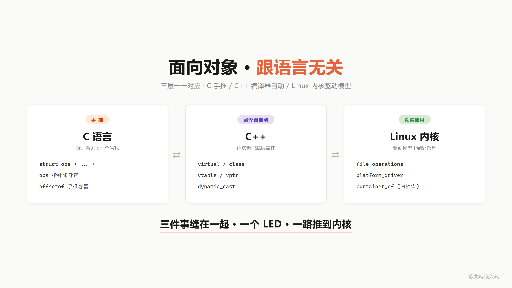
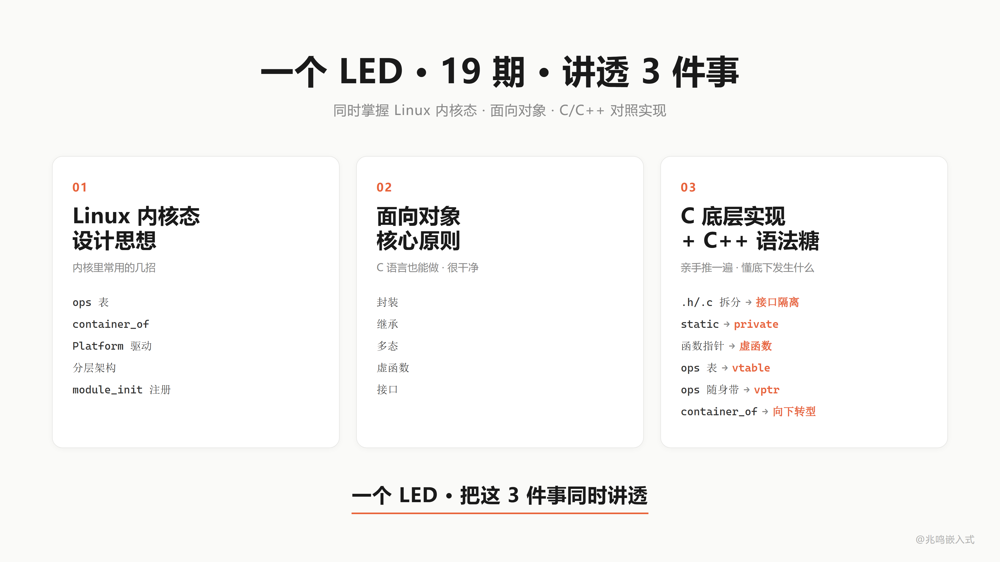
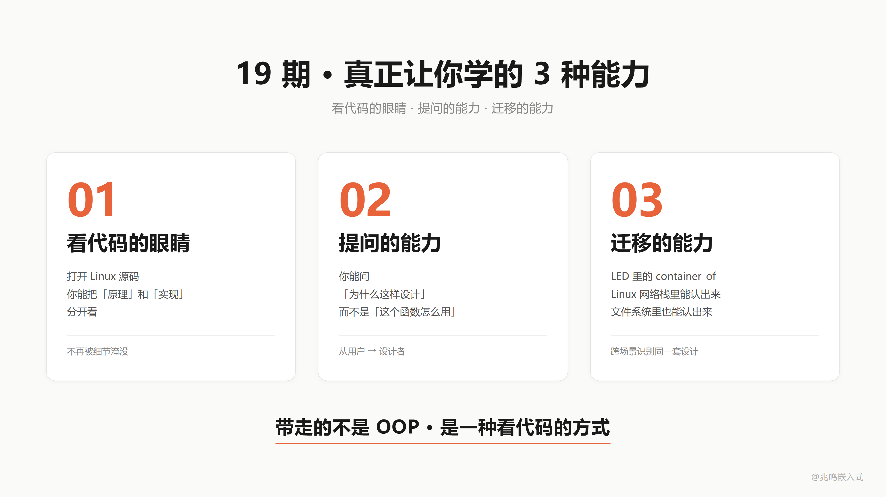
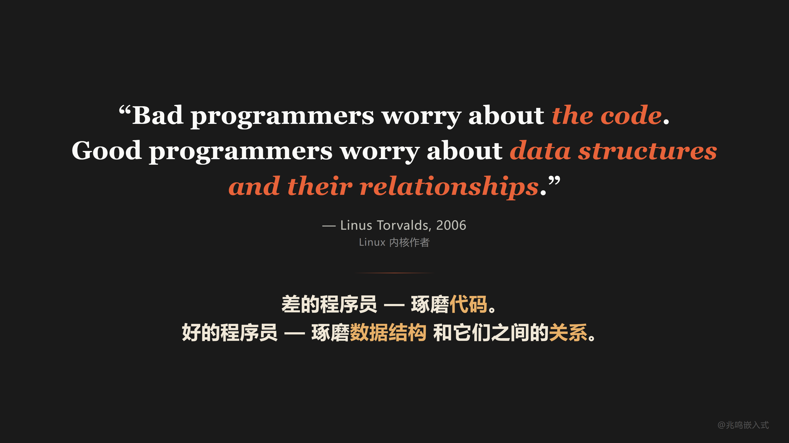
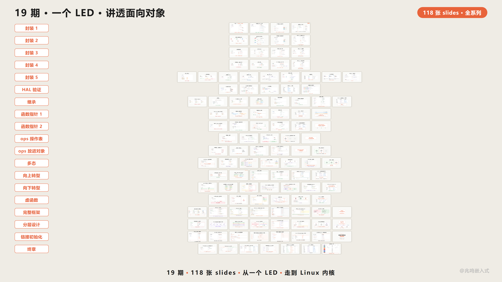

# 第 18 章 · 全书地图回顾 · 一颗 LED 走过的演化路径

配套代码：[`oop-in-c/code/18-roadmap/`](https://github.com/ZhaoChengBo/zhaoming-embedded/tree/master/oop-in-c/code/18-roadmap/)

ch01 到 ch17 走完了。这一章不引入任何新概念，只做一件事，把一颗 LED 走过的演化路径在书里串一遍。

## 18.1 三层缝在一起

市面上讲 C 语法的书不少，讲 C++ 面向对象的也很多，讲 Linux 内核的也有。单独都能找到。

但**真正讲透 C 怎么实现 OOP 底层机制的，我看到的不多**。把这套机制和 C++ 编译器自动帮你做的对应起来，更少。再和 Linux 内核驱动模型里的真实使用对应起来，我个人是真没找到合适的。

这本书想做的是把这三件事缝在一起：

```
C 怎么手写 OOP 底层
        ↓ 一一对应
C++ 编译器自动帮你做的
        ↓ 一一对应
Linux 内核里的真实使用
```

从一颗 LED 一路推到内核。



## 18.2 为什么是一颗 LED 讲 18 章

LED 简单，门槛低。但它足够完整，从一个寄存器，能一路走到 Linux 内核。

每一章你拿到的不是我自己想出来的东西，都是我在 Linux 内核、一线工业项目里长期看到的共通做法，用一颗 LED 串起来。

学完这本书你同时拿到 3 样东西：

**第一·Linux 内核的设计思想**。ops 表、container_of、Platform 驱动、分层架构、module_init 模块自注册，这些都是内核里反复使用的招。

**第二·面向对象的核心原则**。封装、继承、多态、向上转型、向下转型、虚函数 / 纯虚 / 接口，C 语言也能做，而且做得很干净。

**第三·C 底层实现 + C++ 语法糖对应**。每一章末尾都给了对应的 C++ 写法。头文件拆分对应接口隔离。static 对应 private。函数指针对应虚函数。ops 表对应 vtable。ops 指针随身带对应 vptr。container_of 对应 dynamic_cast。

C 里亲手推一遍的，C++ 一个语法糖自动帮你做。一颗 LED，C 和 C++ 同时掌握。



## 18.3 演化路径全景

回头看走过的路。

### 第一阶段：封装篇（ch01 - ch05）

```
ch01  三份函数 → struct + me 指针         封装的最朴素形态
ch02  struct 字段从 .h 移到 .c            信息隐藏 / static
ch03  led_init / led_deinit 命名前缀      手搓 class
ch04  数据三级分类（auto/static/heap）    数据归位
ch05  HAL 库源码漫游                      验证课，看真实 HAL 是同一招
```

到 ch05，你已经知道：你写过 `int sum(int *arr, int len)`，你就在做封装。封装不是高级特性，是你已经在做的事。

### 第二阶段：继承篇（ch06）

```
ch06  共性提取 → struct led_base { name, is_on }
       struct led_gpio { struct led_base base; uint8_t pin; ... };
```

把所有 LED 共有的"状态层"字段（`name`、`is_on`）抽到一个共同基类，硬件字段（`pin` 等）下沉到子类。继承在 C 里就是 "把基类当字段嵌进子类"。

### 第三阶段：多态篇（ch07 - ch11）

```
ch07  函数指针入门：变量存函数地址
ch08  函数指针传参：注册 / 拆解 callback
ch09  ops 表：struct led_ops { on / off / toggle }
ch10  ops 放进对象：const struct led_ops *ops 字段
ch11  多态完整：led->ops->on(led) runtime dispatch
```

到 ch11 末尾，`struct led_base` 长这样：

```c
struct led_base {
	const struct led_ops *ops;    /* 虚函数表指针 */
	const char           *name;
	bool                  is_on;
};
```

### 第四阶段：工程威力篇（ch12 - ch17）

```
ch12  向上转型：struct led_base * 句柄，应用层零硬件字样
ch13  向下转型：container_of 反推子类，编译期算偏移
ch14  必填 / 选填 / 接口：纯虚、虚、interface 的 C 实现
ch15  Platform 抽象：3 个 platform_ops 实例运行时切换
ch16  Linux 内核映射：file_operations / gpio_chip / i2c_algorithm 同源
ch17  链接自动初始化：MODULE_INIT 一行，main 不动
```

### 第五阶段：终章（本章）

ch18 不引入新概念。把走过的路在书里 replay 一遍。


## 18.4 演化路径 replay：一颗 LED 的简史

配套代码 `oop-in-c/code/18-roadmap/pc/main.c` 把这条路在屏幕上 replay 一遍。

### Stage 1：三份独立函数

```c
static void s1_red_on(void)   { write_reg(13, 1); }
static void s1_green_on(void) { write_reg(14, 1); }
static void s1_blue_on(void)  { write_reg(15, 1); }
```

3 个 LED，3 份代码。每个函数体 1 行，但有 3 份。加 5 个 LED？复制 5 遍。痛点的起点。

### Stage 2：struct + me 指针

```c
struct s2_led {
	uint8_t pin;
	bool    is_on;
};

static void s2_led_on(struct s2_led *me)
{
	me->is_on = true;
	write_reg(me->pin, 1);
}
```

3 个 LED 共用一份 `s2_led_on`，传不同的 me 指针。封装最朴素的形态。

### Stage 3：继承 + ops 表 + 多态

```c
struct s3_led_ops {
	void (*on)(struct s3_led_base *me);
};

struct s3_led_base {
	const struct s3_led_ops *ops;
	const char              *name;
};

struct s3_led_gpio {
	struct s3_led_base base;
	uint8_t            pin;
};

struct s3_led_pwm {
	struct s3_led_base base;
	uint8_t            channel;
	uint8_t            duty;
};

/* 父类统一接口：一行 dispatch */
static void s3_led_on(struct s3_led_base *me)
{
	me->ops->on(me);    /* 多态 dispatch */
}

/* 两种子类各自的 on 实现 */
static void s3_gpio_on(struct s3_led_base *me)
{
	struct s3_led_gpio *self = (struct s3_led_gpio *)me;
	printf("    s3_gpio_on  [%s]: write reg(%u) = 1\n",
	       me->name, (unsigned)self->pin);
}

static void s3_pwm_on(struct s3_led_base *me)
{
	struct s3_led_pwm *self = (struct s3_led_pwm *)me;
	printf("    s3_pwm_on   [%s]: PWM ch=%u duty=%u%%\n",
	       me->name, (unsigned)self->channel, (unsigned)self->duty);
}

/* 两份 ops 表，一份服务 GPIO 子类，一份服务 PWM 子类 */
static const struct s3_led_ops gpio_ops = { .on = s3_gpio_on };
static const struct s3_led_ops pwm_ops  = { .on = s3_pwm_on  };
```

GPIO 灯和 PWM 灯共享 `s3_led_on` 接口，背后走不同的实现。多态通过 ops 表实现。

### Stage 4：向上转型 + 全局句柄

```c
static struct s3_led_gpio g_gpio;
static struct s3_led_pwm  g_pwm;
static struct s3_led_base *g_led_red;
static struct s3_led_base *g_led_status;

static void board_init(void)
{
	/* 子类对象构造：填 ops 字段 + 自己的硬件参数 */
	g_gpio.base.ops  = &gpio_ops;
	g_gpio.base.name = "RED";
	g_gpio.pin       = 13;

	g_pwm.base.ops   = &pwm_ops;
	g_pwm.base.name  = "STAT";
	g_pwm.channel    = 1;
	g_pwm.duty       = 100;

	g_led_red    = &g_gpio.base;     /* 向上转型 */
	g_led_status = &g_pwm.base;
}

/* 应用层调用 */
s3_led_on(g_led_red);      /* 走 s3_gpio_on */
s3_led_on(g_led_status);   /* 走 s3_pwm_on */
```

应用层只见 `struct s3_led_base *` 句柄，调同一个 `s3_led_on(handle)`。换硬件改 board_init 里那几行字段赋值，应用 0 修改。

### Stage 5：链接自动注册

```c
/* drv_led.c */
static int led_init(void)
{
	printf("    [led]    led_init: register LED driver\n");
	return 0;
}
MODULE_INIT(led_init);     /* 一行宏代替 main 里的手写调用 */

/* MODULE_INIT 宏的实现（来自 ch17）：
 * 把 fn 的地址塞进 .my_initcall 段，链接器自动收集。
 */
#define MODULE_INIT(fn)							\
	static initcall_t __initcall_##fn				\
		__attribute__((used, section("my_initcall"))) = fn

/* 启动代码遍历该段 */
extern initcall_t __start_my_initcall[];
extern initcall_t __stop_my_initcall[];

void do_initcalls(void)
{
	for (initcall_t *fn = __start_my_initcall;
	     fn < __stop_my_initcall; fn++)
		(*fn)();
}

/* main.c 里 */
int main(void)
{
	do_initcalls();      /* 不知道有哪些 init，但都会被调到 */
	while (1) { /* 业务循环 */ }
}
```

main 函数 0 引用 `led_init`。链接器收集所有 MODULE_INIT 段，启动期遍历。加新驱动写一行宏，main 不动。这就是 ch17 的完整 demo。

跑 `oop-in-c/code/18-roadmap/pc/demo`：

```
[stage 1] ch01 - 3 LEDs, 3 copies
    s1_red_on: write reg(13) = 1
    s1_green_on: write reg(14) = 1
    s1_blue_on: write reg(15) = 1

[stage 2] ch01 - struct + me pointer
    s2_led_on(pin=13): write reg = 1
    s2_led_on(pin=14): write reg = 1
    s2_led_on(pin=15): write reg = 1

[stage 3] ch06-ch11 - inheritance + ops + polymorphism
    s3_gpio_on  [RED]: write reg(13) = 1
    s3_pwm_on   [STAT]: PWM ch=1 duty=100%

[stage 4] ch12-ch15 - upcasting + handle + board_init
    s3_gpio_on  [RED]: write reg(13) = 1
    s3_pwm_on   [STAT]: PWM ch=1 duty=100%

[stage 5] ch17 - linker auto registration
    main never references *_init, drivers register themselves
```

一颗 LED，5 个阶段，5 行代码风格的演化。一路走到 Linux 内核风格的全套架构。

## 18.5 全系列概念到 Linux 内核的映射

把每一章学到的招，映射到 Linux 内核里的对应物：

| 你学过的 | Linux 内核里 |
|---|---|
| `struct led_base` | `struct device` / `struct file` |
| `me` 指针 | `dev` / `file` / `i2c_client` / `spi_device` 等指针参数 |
| static 信息隐藏 | 内核函数大量 `static`，跨文件用 EXPORT_SYMBOL |
| 命名前缀 `led_` | 内核子系统前缀 `gpio_` / `i2c_` / `dev_` |
| init / deinit | `probe` / `remove` |
| `struct led_base` 嵌入子类 | `struct gpio_chip` 嵌入 driver-private 结构 |
| `struct led_ops` | `struct file_operations` / `struct gpio_chip` 字段 |
| `me->ops->on(me)` | `f_op->read(file, ...)` / `gc->set(gc, offset, value)` |
| container_of | container_of（同名同源） |
| 必填 + 选填 + 接口 | file_operations 混合策略，read/write 必填，ioctl 选填 |
| 全局句柄 | `extern struct device *some_device;` |
| `board_init` | `arch_init_call` / device tree |
| Platform 抽象 | `struct platform_driver` / `platform_device` |
| `MODULE_INIT(fn)` | `module_init(fn)` / `device_initcall(fn)` |
| 链接器自动收集 | `__attribute__((__section__(".initcall6.init")))` |
| `do_initcalls()` | `do_initcalls()`（同名） |

每一行你学过的东西，内核里都有对应。分层一模一样，每一项一模一样。

## 18.6 C 对比 C++ 的全套对照

每一章末尾给了 C 对比 C++ 的局部对照。这里把全套放一起：

| C（你亲手写） | C++（编译器替你做） |
|---|---|
| `struct led { ... }` + `int led_on(struct led *me)` | `class Led { void on(); }` |
| `me` 指针 | `this` 指针 |
| 头文件拆 .h / .c | private / public 关键字 |
| `struct led_base` 嵌入子类 | `class Led : public LedBase {}` 继承 |
| `struct led_ops` | vtable |
| `const struct led_ops *ops` 字段 | vptr |
| `me->ops->on(me)` | `me->on()` |
| `&gpio_led.base` | 隐式 LedBase \* 转换 |
| `container_of` | `dynamic_cast` |
| 统一接口里 assert NULL | 纯虚函数 `virtual void on() = 0` |
| 统一接口里走默认 | 虚函数有默认实现 |
| 全 ops 必填 | 全纯虚抽象类（接口） |
| `MODULE_INIT(fn)` | 全局对象构造函数 |
| `__section__("my_initcall")` | `.init_array` 段 |
| `do_initcalls()` | crt0 启动代码 |

每一对，C++ 编译器自动做的，你亲手推了一遍。

你不再是背面向对象的名词。你知道底下发生了什么。

## 18.7 4000 万行的骨架

Linux 内核 4000 万行代码，骨架就是这几招：

1. **struct 装数据**（`struct led` / `struct file` / `struct device`）
2. **函数指针装行为（ops 表）**（`struct led_ops` / `struct file_operations` / `struct gpio_chip`）
3. **嵌入式继承**（子类把父类放在第一个或任意字段，C 没有 `extends` 关键字，靠字段嵌入）
4. **container_of 反推**（成员地址 - offsetof = 外层 struct 起点）
5. **多态 dispatch**（`me->ops->op(me)`，一行 dispatch 到具体子类实现）
6. **必填 + 选填 + 接口策略**（assert NULL / 父类提供默认 / 全 op 必填的接口）
7. **板级初始化分离硬件配置**（component_cfg + board_init.c，硬件描述独立成目录，往设备树演化）
8. **Platform 抽象隔离芯片变化**（一份 driver + N 份 platform 适配 = N+M 不再 N×M）
9. **链接自动初始化**（`__attribute__((section()))` + 链接器收集 + 启动期遍历，加新驱动 main 一字不动）

剩下的 3999 万行？是各种设备、各种协议、各种场景，但骨架，就是你学的这九招。

19 期前你打开内核源码，看到的是天书。

今天你打开同一段代码，你看到的是 struct，是 ops 表，是 container_of。

你能读了。

不是代码变简单了，是你变强了。

不是因为你聪明，是因为它就用了这几招。

## 18.8 OOP 三种能力

学完这本书你带走的不只是 OOP 的几个名词，是 3 种能力：

**第一·看代码的眼睛**。打开 Linux 源码，能把"原理"和"实现"分开看。

**第二·提问的能力**。你能问"这里为什么这样设计"，而不是只能问"这个函数怎么用"。

**第三·迁移的能力**。LED 里的 container_of，你在 Linux 网络栈里能认出来，在文件系统里能认出来，在驱动子系统里也能认出来。

这一本书之后，你带走的不只是 OOP 的几个概念，是一种看代码的方式。



## 18.9 工程师版图：你停在哪一层

```
第一层 · 普通工程师    写功能、调 bug、配寄存器
第二层 · 高级工程师    写架构、识别屎山、主导设计
第三层 · 技术领导      定方向、给规范、影响团队
```

这本书能帮你从第一层往第二层走。这一步跨起来挺难的，但走完这本书，你会有路径感。

## 18.10 为什么不直接讲 C++

你可能问，为什么花这么多篇幅用 C 推 OOP，不直接讲 C++ 一了百了？

C++ 我项目里也在用，应用层很顺手。但**用 C 讲 OOP**，有它自己的理由。

直接上 C++、Java、Python，你能用，但你看不见底层。虚函数怎么实现的、多态怎么调度，这些在 C++ 里都被语法糖盖住了。用 C 手推一遍，你能拆开看见每一个齿轮，回头再用 C++，那些"魔法"你心里都有数。

更关键的一点，嵌入式里几个绕不开的大块头：**Linux 内核、Zephyr、RT-Thread**，全是 C 写的。你不懂 C 怎么做 OOP，打开源码看到 ops 表、看到 container_of，只能照抄，不知道为什么这么设计。

而嵌入式工程师有一个天然的优势，汇编、计算机原理、编译器和链接器、操作系统底层，这些上层语言出身的工程师摸不到的东西，你都能从底往上串成一条线。

这本书是从底往上推。等你看明白底层，C++ 那些机制只是把你手推的东西换了语法糖。

## 18.11 AI 时代

AI 时代了，写代码这件事确实越来越快。

但能不能给 AI 一个好骨架，让它一直能写下去，这是工程师的事。

AI 帮你写代码，参考的就是你项目里已有的代码，你写得清楚，AI 才能写得清楚；你给一坨屎山，它就接着生一坨屎山。

这就是 AI 时代你的核心竞争力，你的架构能力，决定了 AI 能帮你放大多少。

## 18.12 一句金句

19 章讲了一件事，但有一句话比我讲得更好。是 Linus Torvalds 说的，Linux 内核的作者：

> Bad programmers worry about the code.
> Good programmers worry about data structures and their relationships.
>
> 差的程序员琢磨代码。好的程序员琢磨数据结构，和它们之间的关系。
>
> Linus Torvalds, Git mailing list, 2006

整本书 17 章一直在写 struct，也一直在画 struct 之间的关系。

把这句话截图保存吧。



## 18.13 18 期合集封面墙

视频版的合集走过 18 期，每一期对应这本书的一个章节（ch01-ch17 + 终章）。



## 18.14 完整源码清单

把下面的代码块分别保存到对应的文件，目录结构和 [`oop-in-c/code/18-roadmap/pc/`](https://github.com/ZhaoChengBo/zhaoming-embedded/tree/master/oop-in-c/code/18-roadmap/pc/) 一致。`make && ./demo` 即可跑通。

本章配套代码不引入新机制，只把 ch01 → ch17 一颗 LED 走过的演化路径在屏幕上 replay 一遍。一份 `main.c` 包揽全部 5 个阶段的代码（每段对应书里的一个章节，前面 18.4 节里贴的就是它的片段）。

### 文件 1：`main.c`（164 行）

5 个阶段：复制粘贴 → struct + me 指针 → 继承 + ops 表 + 多态 → 向上转型 + 全局句柄 → 链接自动注册（说明性占位，真实机制见 ch17）。

```c
/* SPDX-License-Identifier: MIT */
/*
 * main.c - 一颗 LED 演化路径全景
 *
 * 这个文件不教新东西。它把 ch01 → ch17 一颗 LED 走过的演化路径
 * 在屏幕上 replay 一遍，让读者看见自己走过的路。
 *
 * 每一段对应书里的一个章节。每一段都能跑（虽然有些段刻意保留了
 * "原始痛点"，比如 stage 1 的三份独立函数）。
 */

#include <stdint.h>
#include <stdbool.h>
#include <stdio.h>

/* ======================== Stage 1: ch01 ========================
 * 三个 LED 三份代码 - 复制粘贴
 */

static void s1_red_on(void)
{
	printf("    s1_red_on: write reg(13) = 1\n");
}

static void s1_green_on(void)
{
	printf("    s1_green_on: write reg(14) = 1\n");
}

static void s1_blue_on(void)
{
	printf("    s1_blue_on: write reg(15) = 1\n");
}

/* ======================== Stage 2: ch01 ========================
 * 一份函数 + me 指针。封装的最朴素形态。
 */

struct s2_led {
	uint8_t pin;
	bool    is_on;
};

static void s2_led_on(struct s2_led *me)
{
	me->is_on = true;
	printf("    s2_led_on(pin=%u): write reg = 1\n", (unsigned)me->pin);
}

/* ======================== Stage 3: ch06 - ch11 ========================
 * 继承 + ops 表 + 多态 dispatch
 */

struct s3_led_base;

struct s3_led_ops {
	void (*on)(struct s3_led_base *me);
};

struct s3_led_base {
	const struct s3_led_ops *ops;
	const char              *name;
};

struct s3_led_gpio {
	struct s3_led_base base;
	uint8_t            pin;
};

struct s3_led_pwm {
	struct s3_led_base base;
	uint8_t            channel;
};

static void s3_gpio_on(struct s3_led_base *me)
{
	struct s3_led_gpio *self = (struct s3_led_gpio *)me;
	printf("    s3_gpio_on  [%s]: write reg(%u) = 1\n",
	       me->name, (unsigned)self->pin);
}

static void s3_pwm_on(struct s3_led_base *me)
{
	struct s3_led_pwm *self = (struct s3_led_pwm *)me;
	printf("    s3_pwm_on   [%s]: PWM ch=%u duty=100%%\n",
	       me->name, (unsigned)self->channel);
}

static void s3_led_on(struct s3_led_base *me)
{
	me->ops->on(me);    /* 多态 dispatch */
}

/* ======================== Stage 4: ch12 - ch15 ========================
 * 向上转型 + 全局句柄 + 板级初始化
 */

static struct s3_led_gpio g_gpio;
static struct s3_led_pwm  g_pwm;

static struct s3_led_base *g_led_red;
static struct s3_led_base *g_led_status;

static const struct s3_led_ops gpio_ops = { .on = s3_gpio_on };
static const struct s3_led_ops pwm_ops  = { .on = s3_pwm_on };

static void s4_board_init(void)
{
	g_gpio.base.ops  = &gpio_ops;
	g_gpio.base.name = "RED";
	g_gpio.pin       = 13;

	g_pwm.base.ops   = &pwm_ops;
	g_pwm.base.name  = "STAT";
	g_pwm.channel    = 1;

	g_led_red    = &g_gpio.base;     /* 向上转型 */
	g_led_status = &g_pwm.base;
}

/* ======================== Replay ======================== */

int main(void)
{
	printf("=========================================\n");
	printf("  ch18 - the road one LED has walked\n");
	printf("=========================================\n");

	printf("\n[stage 1] ch01 - 3 LEDs, 3 copies\n");
	s1_red_on();
	s1_green_on();
	s1_blue_on();

	printf("\n[stage 2] ch01 - struct + me pointer\n");
	struct s2_led red   = { .pin = 13, .is_on = false };
	struct s2_led green = { .pin = 14, .is_on = false };
	struct s2_led blue  = { .pin = 15, .is_on = false };
	s2_led_on(&red);
	s2_led_on(&green);
	s2_led_on(&blue);

	printf("\n[stage 3] ch06-ch11 - inheritance + ops + polymorphism\n");
	struct s3_led_gpio g = { .base = {.ops = &gpio_ops, .name = "RED"}, .pin = 13 };
	struct s3_led_pwm  p = { .base = {.ops = &pwm_ops,  .name = "STAT"}, .channel = 1 };
	s3_led_on(&g.base);
	s3_led_on(&p.base);

	printf("\n[stage 4] ch12-ch15 - upcasting + handle + board_init\n");
	s4_board_init();
	s3_led_on(g_led_red);
	s3_led_on(g_led_status);

	printf("\n[stage 5] ch17 - linker auto registration (see 17-initcall)\n");
	printf("    main never references *_init, drivers register themselves\n");

	printf("\n=========================================\n");
	printf("  one LED, 17 chapters, 4000 lines covered\n");
	printf("=========================================\n");

	printf("\nPress Enter to exit...\n");
	getchar();
	return 0;
}
```

### 文件 2：`Makefile`（19 行）

```makefile
# Makefile - ch18 roadmap recap (PC)

CC      = gcc
CFLAGS  = -Wall -Wextra -std=c99
TARGET  = demo
SRCS    = main.c

.PHONY: all clean run

all: $(TARGET)

$(TARGET): $(SRCS)
	$(CC) $(CFLAGS) -o $(TARGET) $(SRCS)

run: $(TARGET)
	./$(TARGET)

clean:
	rm -f $(TARGET) $(TARGET).exe
```

### 跑一遍

```bash
cd oop-in-c/code/18-roadmap/pc
make
./demo
```

### 期望输出

```
=========================================
  ch18 - the road one LED has walked
=========================================

[stage 1] ch01 - 3 LEDs, 3 copies
    s1_red_on: write reg(13) = 1
    s1_green_on: write reg(14) = 1
    s1_blue_on: write reg(15) = 1

[stage 2] ch01 - struct + me pointer
    s2_led_on(pin=13): write reg = 1
    s2_led_on(pin=14): write reg = 1
    s2_led_on(pin=15): write reg = 1

[stage 3] ch06-ch11 - inheritance + ops + polymorphism
    s3_gpio_on  [RED]: write reg(13) = 1
    s3_pwm_on   [STAT]: PWM ch=1 duty=100%

[stage 4] ch12-ch15 - upcasting + handle + board_init
    s3_gpio_on  [RED]: write reg(13) = 1
    s3_pwm_on   [STAT]: PWM ch=1 duty=100%

[stage 5] ch17 - linker auto registration (see 17-initcall)
    main never references *_init, drivers register themselves

=========================================
  one LED, 17 chapters, 4000 lines covered
=========================================
```

一颗 LED，5 个阶段，5 行代码风格的演化。看自己一路走过的路。

## 18.15 不止于这 18 章 OOP 主体（外加工业实战 2 章）

封装、继承、多态，这本书 18 章 OOP 主体是面向对象的基本功。

工业级嵌入式架构还有几座山：分层架构、层次化状态机、事件驱动 + 发布订阅、非阻塞驱动框架。

这些不是 PPT 上的名词。是真正能让 11 万行业务代码保持清醒的工具。

这本书是这套思想的入门。后面的山一座一座去做，做好了在 GitHub Issues 或 Gitee Issues 第一时间告诉你。

## 18.16 视频回放

> [《C 语言·终章·四千万行代码的秘密武器·OOP 系列·Linux 内核映射·Linus 金句》](https://www.bilibili.com/video/BV13qREBGEgv/)

## 写在最后

走完这本书，你再看任何 C 代码，眼里都是设计。

不管你刚入行，还是已经做了 5 年、10 年，能走到这里，你已经在路上了。

下一篇：[第 19 章 · 工业控制板主控案例](../05-工业实战/19-主控案例.md)
