# 第 18 章 · 全书地图回顾 · 一颗 LED 走过的演化路径

配套代码：[`oop-in-c/code/18-roadmap/`](https://github.com/ZhaoChengBo/zhaoming-embedded/tree/master/oop-in-c/code/18-roadmap/)

ch01 到 ch17 走完了。这一章不引入任何新概念，只做一件事：把你写过的 LED 代码，跟 Linux 内核里的真实代码摆在一起看。

终章不教新东西。全部是回顾，是映射，是 C 对比 C++ 的代码对照，是工业级数据，是 Linus 的一句金句。

## 18.1 file_operations · 是不是很眼熟

Linux 内核里有一个结构体，叫 `file_operations`。

打开文件调 open。读文件调 read。写文件调 write。关文件调 release。

```c
struct file_operations {
    ssize_t (*read)(struct file *, char __user *, size_t, loff_t *);
    ssize_t (*write)(struct file *, const char __user *, size_t, loff_t *);
    int     (*open)(struct inode *, struct file *);
    int     (*release)(struct inode *, struct file *);
    /* ... 更多函数指针 */
};
```

是不是很眼熟。

它就是你学的 ops 表。一个 struct，里面全是函数指针。

同一个 read，不同的文件系统有不同的实现。ext4 有 ext4 的 read，socket 有 socket 的 read，pipe 有 pipe 的 read。这不就是你学的那条 `base->ops->on(base)` 调用链吗。

你写的 `LedOps`，跟内核的 `file_operations`，是同一个模式。

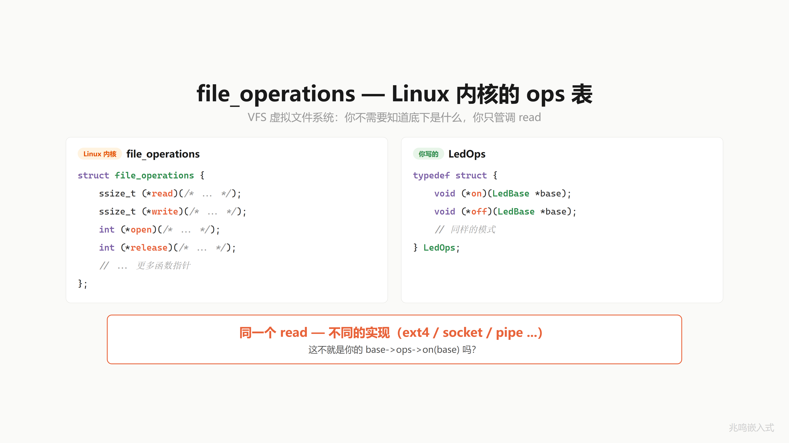

但这只是冰山一角。来看一个更完整的。

## 18.2 你的 LED 代码 vs Linux I2C 完整链路

你用过 I2C 吧。读传感器、写 EEPROM，都是 I2C。

Linux 内核的 I2C 子系统，跟你的 LED 代码，一模一样的四层架构。

**第一层 · 应用层**。你的 `led_on(me)`，内核叫 `i2c_transfer(adap, msgs, num)`。对上一个口子，不关心硬件长什么样。

**第二层 · 抽象层**。你的 `LedBase` 里塞个 ops 指针，`LedOps` 装函数指针。内核里 `i2c_adapter` 塞 algo 指针，`i2c_algorithm` 装函数指针。一个负责传输，一个报告能力。adapter 就是 I2C 控制器对象，algo 这个名字是 Linux 内核的历史叫法，你就当它是 ops 表。这一层定义"必须实现什么"。

**第三层 · 实现层**。你的 `gpio_on(me)`，内核叫 `rk3x_i2c_xfer(adap, ...)`。Rockchip 的 I2C 传输实现，对下操作硬件寄存器。

**第四层 · 注册层**。你以前要在 main 里手动调 init，内核用 `module_platform_driver` 一行宏，启动时系统自动找到你的驱动。

同一条调用链，上下完全对应：

```
你的 LED:    led_on(me)        →  me->ops->on(me)         →  gpio_on(me)
Linux I2C:   i2c_transfer(adap)→  adap->algo->xfer(adap)  →  rk3x_i2c_xfer(adap)
```

跟你的 LED 从头到尾，一模一样的四层。

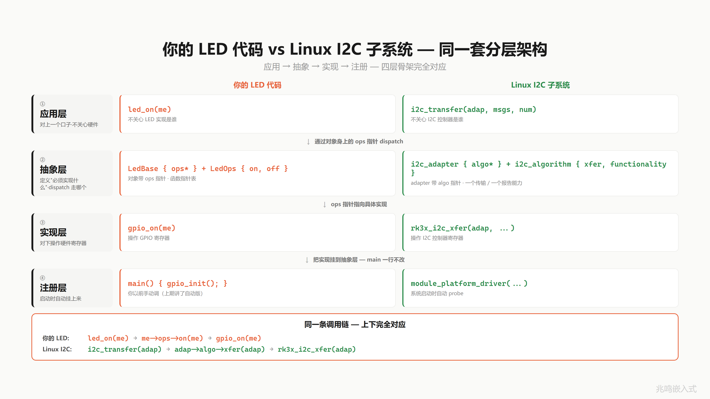

## 18.3 真实内核代码 · 四层一一对应

来看真实的内核代码，按四层一一对应。代码来自 Linux 内核 `drivers/i2c/busses/i2c-rk3x.c`。

**第一层 · 接口层**。`i2c_algorithm` 真实定义。两个函数指针，一个负责传输，一个报告能力。跟你的 `LedOps` 一模一样：

```c
struct i2c_algorithm {
    int (*xfer)(struct i2c_adapter *adap,
                struct i2c_msg *msgs, int num);
    u32 (*functionality)(struct i2c_adapter *);
};
```

**第二层 · 实现层**。`rk3x_i2c_algorithm`，把 Rockchip 自己的传输函数填进去。跟你在 `gpio_init` 里填 `gpio_ops`，一模一样：

```c
static const struct i2c_algorithm rk3x_i2c_algorithm = {
    .xfer          = rk3x_i2c_xfer,
    .functionality = rk3x_i2c_func,
};
```

**第三层 · 绑定层**。probe 函数里把这张表的地址绑到 adapter 上。跟你把 ops 放进 `LedBase`，一模一样：

```c
static int rk3x_i2c_probe(struct platform_device *pdev)
{
    /* 分配对象 */
    i2c_dev = devm_kzalloc(&pdev->dev, ...);

    /* 绑定 ops 表 */
    adap->algo = &rk3x_i2c_algorithm;

    /* 注册到 I2C 总线 */
    i2c_add_adapter(adap);
}
```

**第四层 · 启动层**。`module_platform_driver` 一个宏告诉内核：我是一个 I2C 平台驱动，启动时自动找到我。

```c
static struct platform_driver rk3x_i2c_driver = {
    .driver = { .name = "rk3x-i2c", .of_match_table = ..., .pm = ... },
    .probe  = rk3x_i2c_probe,
    .remove = rk3x_i2c_remove,
};

module_platform_driver(rk3x_i2c_driver);
```

每一行你都见过。不是教学案例，是真实世界的骨架。

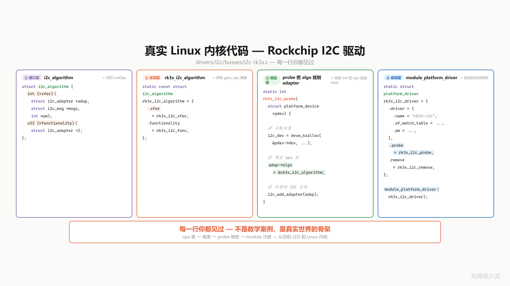

## 18.4 到处都是 ops

不只是 I2C。

| 子系统 ops 表 | 用途 | 关键函数指针 |
|---|---|---|
| `file_operations` | 文件系统 · 读 / 写 / 打开 / 关闭 | `.read` `.write` `.open` |
| `i2c_algorithm` | I2C 总线 · 数据传输 | `.xfer` |
| `spi_controller` | SPI 控制器 · 数据传输 | `.transfer_one` |
| `gpio_chip` | GPIO 控制器 · 引脚操作 | `.get` `.set` `.direction` |
| `net_device_ops` | 网络设备 · 发包 / 收包 | `.ndo_start_xmit` |

内核到处都是这个模式。一个 struct 装函数指针，不同的驱动填不同的实现。

你学的那套东西，不是教学案例，是真实世界的骨架。

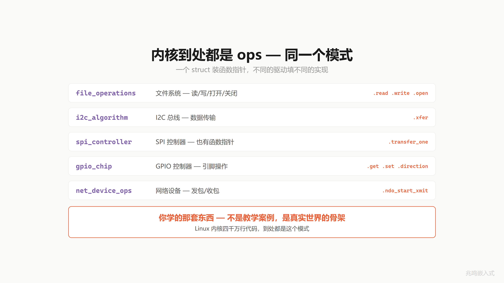

## 18.5 全系列概念到 Linux 内核映射总表

把每一章学到的招，映射到 Linux 内核里的对应物。

先看顶上这一行：应用层、抽象层、实现层、注册层。所有内核子系统都是这四层。

```
①  应用层    led_on  ·  vfs_read  ·  i2c_transfer
       ↓
②  抽象层    LedOps  ·  file_operations  ·  i2c_algorithm
       ↓
③  实现层    gpio_on  ·  ext4_read  ·  rk3x_i2c_xfer
       ↓
④  注册层    main  ·  module_init  ·  module_platform_driver
```

往下看每一项：

| 概念 | 你写的（LED） | Linux 内核 | 系列阶段 |
|---|---|---|---|
| struct 封装数据 | `LedGpio { pin, ... }` | 到处是 struct | 封装 |
| me 指针 | `LedGpio *me` | `struct device` · `i2c_client` · `spi_device` · `platform_device` | 封装 |
| static 信息隐藏 | `static void gpio_on` | 本地用 static · 跨模块用 EXPORT_SYMBOL | 信息隐藏 |
| 前缀命名 | `led_` · `gpio_` · `led_gpio_` | `i2c_` · `spi_` · `gpio_` · `vfs_` | 命名 |
| init / deinit | `led_gpio_init` / `led_gpio_deinit` | `probe` / `remove` | 构造析构 |
| 模块自动注册 | `main()` 手动调 init | `module_init` · `.initcall` · `do_initcalls` | 链接初始化 |
| 全局设备句柄 | `LedBase *g_led_error` | `struct device *`（内核） · `/dev/xxx`（用户层） | 向上转型 |
| struct 嵌套继承 | `LedGpio { LedBase base }` | `struct i2c_client { struct device }` | 继承 |
| 函数指针 + ops 表 | `LedOps { on, off }` | `file_operations` · `gpio_chip` · `i2c_algorithm { xfer, functionality }` | 函数指针 |
| 统一接口 + dispatch | `led_on() → base->ops->on` | `vfs_read() → fops->read` | 多态 |
| 向下转型 | `container_of(base, LedGpio, base)` | 出现数万次 | 向下转型 |
| 纯虚 / 虚函数 / 接口 | NULL 检查 / 默认实现 / 全必填 | `file_operations` 混合模式 | 虚函数 |

每一行你学过的东西，内核里都有对应。分层一模一样。每一项一模一样。

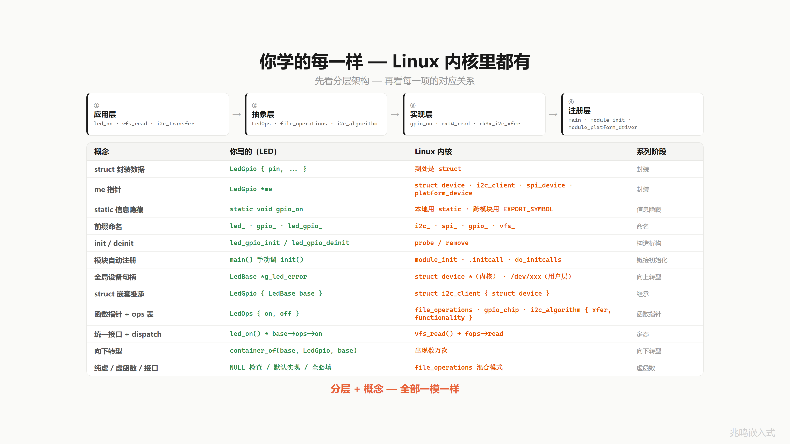

## 18.6 C 对比 C++ 三组代码对照

> 本节做 C vs C++ 对照·命名跟 C++ 习惯改成 `LedBase / LedOps` 大驼峰·和 ch01-ch17 的 `struct led_base / led_ops` 是同一套接口的不同命名形式·非新 API。

接下来把你 18 章写的 C 代码，跟 C++ 的写法摆一起看。每一对，C++ 都帮你做了你亲手做的事。

挑了三组最有戏的：多态 dispatch、向下转型、模块自动注册。

### 18.6.1 多态 dispatch

先看多态 dispatch。

**左边是 C**。一个 `LedOps` 结构体装两个函数指针 on 和 off。`LedBase` 里有一个 ops 指针。`led_on` 调用 `base->ops->on(base)`，两次跳转：

```c
typedef struct {
    void (*on)(LedBase *);
    void (*off)(LedBase *);
} LedOps;

struct LedBase {
    LedOps *ops;     /* 对象身上的 ops 指针 */
};

void led_on(LedBase *base)
{
    base->ops->on(base);    /* 两次跳转 */
}

led_on(red);   /* 调用方写法 */
```

**右边是 C++**。`class LedBase` 里两个 virtual 函数。一个父类引用 red 绑到 led_gpio，直接调 `red.on()`。编译器悄悄查 vptr、查 vtable、找到 on 函数。也是两次跳转：

```cpp
class LedBase {
public:
    virtual void on()  = 0;
    virtual void off() = 0;
};
/* 编译器自动加 vptr · 自动建 vtable */

LedBase &red = led_gpio;   /* 父类引用 → 子类对象 */
red.on();                  /* virtual 调用 */
```

底层完全一样：

```
base->ops->on(base)   ≡   red.on()
```

`LedOps` 就是 vtable。ops 指针就是 vptr。`base->ops->on` 就是 `red.on`。

C 你亲手做，C++ 编译器替你做。

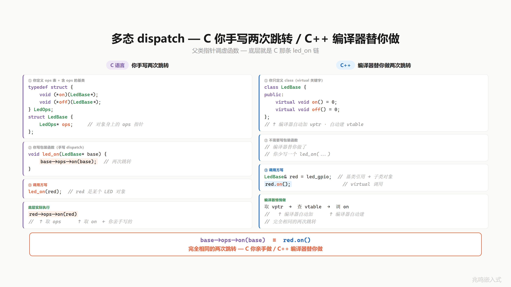

### 18.6.2 向下转型

向下转型这一对最有戏。

**左边是 C 的 `container_of`**。一个宏：拿当前指针，减去成员在 struct 里的偏移量，得到外层 struct 的起始地址。一行宏，编译期算偏移，运行时就一条减法指令。零开销。

```c
#define container_of(ptr, type, member) \
    ((type *)((char *)(ptr) - offsetof(type, member)))

void led_handle(LedBase *base)
{
    LedGpio *me = container_of(base, LedGpio, base);
    gpio_set(me->pin);
}
/* 编译期 · 一条减法指令 · 零运行时开销 */
```

**右边是 C++ 的 `dynamic_cast`**。RTTI 运行时类型识别。每个含 virtual 的类都带 `type_info`，`dynamic_cast` 跑一次去查这张表，确认指针的真实类型再返回。运行时有开销。

```cpp
/* 编译器生成 RTTI 信息 · 每个 virtual 类带 type_info */

void led_handle(LedBase *base)
{
    LedGpio *me = dynamic_cast<LedGpio *>(base);
    if (me) gpio_set(me->pin);
}
/* 运行时 · 查 type_info 表 · 有性能开销 */
```

同样是"父类指针反推子类"，C 在编译期就算完了。C++ 运行时算。

`container_of` 一旦编译完，就是一条减法指令。

这是 C 在嵌入式不输 C++ 的关键：零运行时代价做完同样的事。

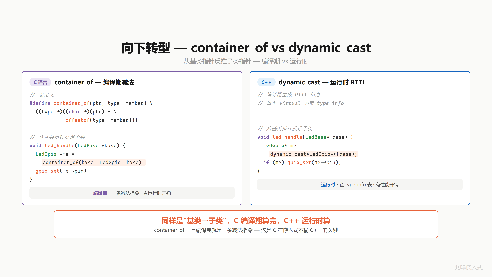

### 18.6.3 模块自动注册

最后这一对。上一章讲到 main 函数一行不改，模块自己挂上来。

**左边是 C**。`led_gpio_init` 是初始化函数，加一个 `module_init` 宏。宏展开把这个函数地址塞进一个特殊 section，叫 `.initcall6.init`。链接器把所有 `.initcall` 段合并成一片，启动时 `do_initcalls` 遍历这一片，挨个调用：

```c
static int led_gpio_init(void)
{
    /* 注册 LED 驱动 */
    return 0;
}
module_init(led_gpio_init);

/* 宏展开（链接器自动收集） */
__attribute__((section(".initcall6.init")))
static initcall_t __initcall_led_gpio_init = led_gpio_init;

/* 启动时 do_initcalls() 遍历段 · 自动调用所有 initcall */
```

**右边是 C++**。一个 `LedGpio` 类，它的全局对象 `g_led_gpio`，构造函数里做注册。但是 main 没有手动调它的构造，靠的是编译器把这个全局对象的构造函数地址，自动塞进 `.init_array` 段。crt0 启动代码遍历 `.init_array`，挨个调用所有构造函数：

```cpp
class LedGpio : public LedBase {
public:
    LedGpio() {           /* ← 构造函数 */
        /* 注册 LED 驱动 */
    }                     /* = 你的 init */
};

static LedGpio g_led_gpio;   /* 全局对象 */

/* 编译器把 g_led_gpio 的构造函数地址 · 自动塞进 .init_array 段 */
/* crt0 启动时遍历段 · 挨个调用所有构造函数 */
```

同一招：把"启动时要做的事"塞进特殊 section，启动代码遍历执行。

```
.initcall6.init   =  .init_array
module_init       =  全局对象构造函数
do_initcalls      =  crt0
```

你以为 C++ 全局对象自动构造是黑魔法。你写过 `module_init` 你就明白：底下就是这一招。

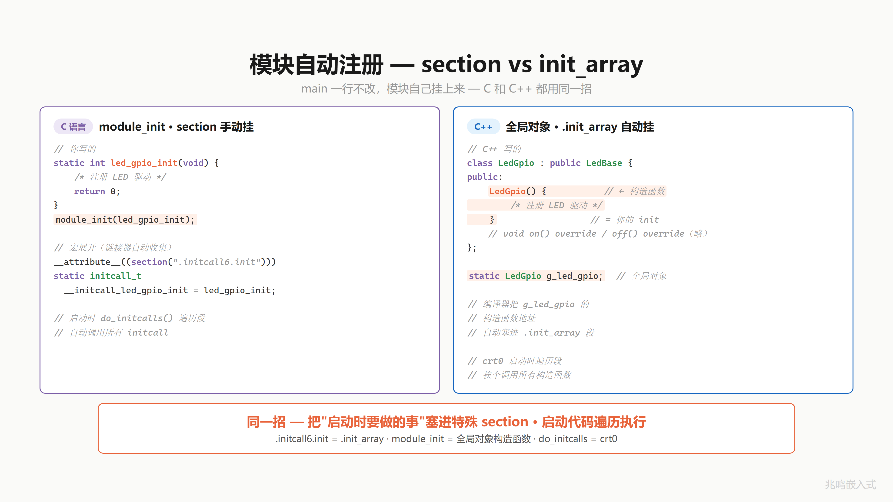

## 18.7 C vs C++ 全套总表

来看全貌。C 你亲手做的每一件事，C++ 都有对应的语法糖。

| 概念 | C 语言（你写的） | C++（编译器帮你写） |
|---|---|---|
| 封装 | struct + 函数（me 指针） | class + 成员函数（this） |
| 信息隐藏 | static / .h 不暴露 | private / protected |
| 构造 / 析构 | `xxx_init` / `xxx_deinit` | 构造函数 / 析构函数 |
| 继承 | struct 嵌套 LedBase | `class : public LedBase` |
| 父类初始化 | 调 `led_base_init()` | 初始化列表自动调父类构造 |
| 行为继承 | `led_get_name(&x.base)` | `x.getName()`（自动查父类） |
| 虚函数表 | `LedOps` struct（手动） | vtable（编译器自动生成） |
| ops 指针随身带 | `base.ops = &gpio_ops`（手动） | 含 virtual 的类 · 编译器自动加 vptr |
| 多态 dispatch | `base->ops->on(base)` | `base->on()`（virtual） |
| 向上转型 | `&gpio_led.base`（取 base 地址） | `LedBase *p = &gpio_led`（隐式） |
| 向下转型 | container_of（编译期减法） | `dynamic_cast<T *>`（运行时 · RTTI） |
| 纯虚 / 虚函数 / 接口 | NULL 检查 / 默认实现 / 全必填 | `= 0` / `virtual { }` / 全纯虚 class |
| 模块自动注册 | `module_init` · section 手动挂 | 全局对象 · `.init_array` 自动挂 |

每一对，C++ 编译器自动做的，你亲手推了一遍。

你不再是背面向对象的名词。你知道底下发生了什么。

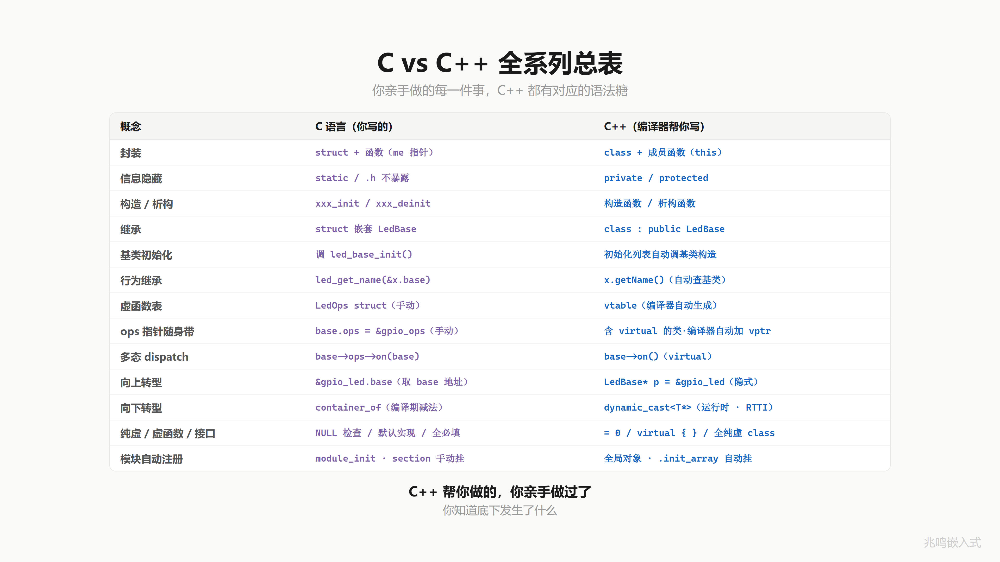

## 18.8 全系列学习旅程

看看你走过的路。

```
封装 5 期      struct + me  ·  三份代码  ·  static 隐藏  ·  前缀+init  ·  数据归位
验证 1 期      HAL 库源码漫游  ·  源码映射
继承 1 期      struct 嵌套  ·  数据 + 行为共享
函数指针 3 期  函数有地址  ·  延迟绑定  ·  ops 表 (typedef + 打包)
多态 2 期      ops 随身带（vptr） ·  多态 dispatch（vcall）
向上转型 1 期  全局句柄 + 应用层零感知
向下转型 1 期  container_of 成员地址反推
虚函数接口 1 期 纯虚 / 虚函数 / 接口
完整框架 1 期  换硬件不改应用 · 全系列工具组装
分层设计 1 期  Platform 层 · 芯片层隔离
链接初始化 1 期 module_init · section 自动挂载 · main 一行不改
终章 1 期      Linux 内核映射 · 四千万行代码的骨架
```

18 章（视频 19 期）。从一个 LED 开始。

> **面向对象不是语言特性，是思维方式。**

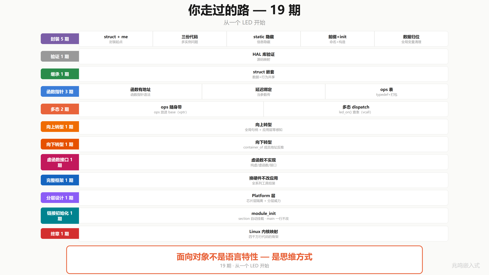

## 18.9 4000 万行的骨架 · 你能读了

Linux 内核 4000 万行代码，骨架就是这几招：

1. **struct 装数据**（`struct led` / `struct file` / `struct device`）
2. **函数指针装行为（ops 表）**（`LedOps` / `file_operations` / `gpio_chip`）
3. **嵌入式继承**（子类把父类放在第一个或任意字段，C 没有 `extends` 关键字，靠字段嵌入）
4. **container_of 反推**（成员地址 - offsetof = 外层 struct 起点）
5. **多态 dispatch**（`me->ops->op(me)`，一行 dispatch 到具体子类实现）
6. **必填 + 选填 + 接口策略**（assert NULL / 父类提供默认 / 全 op 必填的接口）
7. **板级初始化分离硬件配置**（component_cfg + xxx_board_init.c，每个外设各一份板级文件，硬件描述独立成目录，往设备树演化）
8. **Platform 抽象隔离芯片变化**（一份 driver + N 份 platform 适配 = N+M 不再 N×M）
9. **链接自动初始化**（`__attribute__((section()))` + 链接器收集 + 启动期遍历，加新驱动 main 一字不动）

剩下的 3999 万行？是各种设备、各种协议、各种场景。但骨架，就是你学的这几招。

18 章前你打开内核源码，看到的是天书。

今天你打开同一段代码，你看到的是 struct，是 ops 表，是 container_of。

你能读了。

不是代码变简单了，是你变强了。

不是因为你聪明，是因为它就用了这几招。

面向对象，从来不是 class，不是 virtual，不是语法。是你看待问题的方式。

C 语言能做面向对象，是因为面向对象，从来就不在语言里，在你脑子里。

## 18.10 演化路径 replay · 一颗 LED 的简史

回头看走过的路。配套代码 `oop-in-c/code/18-roadmap/pc/main.c` 把这条路在屏幕上 replay 一遍。

### Stage 1：三份独立函数（ch01）

```c
static void s1_red_on(void)   { write_reg(13, 1); }
static void s1_green_on(void) { write_reg(14, 1); }
static void s1_blue_on(void)  { write_reg(15, 1); }
```

3 个 LED，3 份代码。每个函数体 1 行，但有 3 份。加 5 个 LED，复制 5 遍。痛点的起点。

### Stage 2：struct + me 指针（ch01）

```c
struct s2_led {
    uint8_t pin;
    bool    is_on;
};

static void s2_led_on(struct s2_led *me)
{
    me->is_on = true;
    write_reg(me->pin, 1);
}
```

3 个 LED 共用一份 `s2_led_on`，传不同的 me 指针。封装最朴素的形态。

### Stage 3：继承 + ops 表 + 多态（ch06 - ch11）

```c
struct s3_led_ops {
    void (*on)(struct s3_led_base *me);
};

struct s3_led_base {
    const struct s3_led_ops *ops;
    const char              *name;
};

struct s3_led_gpio {
    struct s3_led_base base;
    uint8_t            pin;
};

struct s3_led_pwm {
    struct s3_led_base base;
    uint8_t            channel;
    uint8_t            duty;
};

/* 父类统一接口：一行 dispatch */
static void s3_led_on(struct s3_led_base *me)
{
    me->ops->on(me);    /* 多态 dispatch */
}

/* 两份 ops 表，一份服务 GPIO 子类，一份服务 PWM 子类 */
static const struct s3_led_ops gpio_ops = { .on = s3_gpio_on };
static const struct s3_led_ops pwm_ops  = { .on = s3_pwm_on  };
```

GPIO 灯和 PWM 灯共享 `s3_led_on` 接口，背后走不同的实现。多态通过 ops 表实现。

### Stage 4：向上转型 + 全局句柄（ch12 - ch15）

```c
static struct s3_led_gpio g_gpio;
static struct s3_led_pwm  g_pwm;
static struct s3_led_base *g_led_red;
static struct s3_led_base *g_led_status;

static void led_board_init(void)
{
    /* 子类对象构造：填 ops 字段 + 自己的硬件参数 */
    g_gpio.base.ops  = &gpio_ops;
    g_gpio.base.name = "RED";
    g_gpio.pin       = 13;

    g_pwm.base.ops   = &pwm_ops;
    g_pwm.base.name  = "STAT";
    g_pwm.channel    = 1;
    g_pwm.duty       = 100;

    g_led_red    = &g_gpio.base;     /* 向上转型 */
    g_led_status = &g_pwm.base;
}

s3_led_on(g_led_red);      /* 走 s3_gpio_on */
s3_led_on(g_led_status);   /* 走 s3_pwm_on */
```

应用层只见 `struct s3_led_base *` 句柄，调同一个 `s3_led_on(handle)`。换硬件改 led_board_init 里那几行字段赋值，应用 0 修改。

### Stage 5：链接自动注册（ch17）

```c
/* drv_led.c */
static int led_init(void)
{
    /* 注册 LED 驱动 */
    return 0;
}
MODULE_INIT(led_init);     /* 一行宏代替 main 里的手写调用 */

/* MODULE_INIT 宏的实现（来自 ch17）：
 * 把 fn 的地址塞进 .my_initcall 段，链接器自动收集。
 */
#define MODULE_INIT(fn)                              \
    static initcall_t __initcall_##fn                \
        __attribute__((used, section("my_initcall"))) = fn

/* 启动代码遍历该段 */
extern initcall_t __start_my_initcall[];
extern initcall_t __stop_my_initcall[];

void do_initcalls(void)
{
    for (initcall_t *fn = __start_my_initcall;
         fn < __stop_my_initcall; fn++)
        (*fn)();
}

int main(void)
{
    do_initcalls();      /* 不知道有哪些 init，但都会被调到 */
    while (1) { /* 业务循环 */ }
}
```

main 函数 0 引用 `led_init`。链接器收集所有 `MODULE_INIT` 段，启动期遍历。加新驱动写一行宏，main 不动。这就是 ch17 的完整 demo。

跑 `oop-in-c/code/18-roadmap/pc/demo`：

```
[stage 1] ch01 - 3 LEDs, 3 copies
    s1_red_on: write reg(13) = 1
    s1_green_on: write reg(14) = 1
    s1_blue_on: write reg(15) = 1

[stage 2] ch01 - struct + me pointer
    s2_led_on(pin=13): write reg = 1
    s2_led_on(pin=14): write reg = 1
    s2_led_on(pin=15): write reg = 1

[stage 3] ch06-ch11 - inheritance + ops + polymorphism
    s3_gpio_on  [RED]: write reg(13) = 1
    s3_pwm_on   [STAT]: PWM ch=1 duty=100%

[stage 4] ch12-ch15 - upcasting + handle + led_board_init
    s3_gpio_on  [RED]: write reg(13) = 1
    s3_pwm_on   [STAT]: PWM ch=1 duty=100%

[stage 5] ch17 - linker auto registration
    main never references *_init, drivers register themselves
```

一颗 LED，5 个阶段，5 行代码风格的演化。一路走到 Linux 内核风格的全套架构。

## 18.11 视频合集封面墙

视频版的 OOP 系列从第一期一路走到终章，每一期对应这本书的一个章节。


## 18.12 不止于这 18 章 · 工业级架构还有几座山

封装、继承、多态。这本书 18 章 OOP 主体是面向对象的基本功。

工业级嵌入式架构还有几座山：分层架构、层次化状态机、事件驱动 + 发布订阅、非阻塞驱动框架。

市面上讲 C 语法的书不少，讲 C++ 面向对象的也很多，讲 Linux 内核的也有，单独都能找到。但**真正讲透 C 怎么实现 OOP 底层机制的，我看到的不多**。把这套机制和 C++ 编译器自动帮你做的对应起来，更少。再和 Linux 内核驱动模型里的真实使用对应起来，**我个人是真没找到合适的**。

这本书想做的是把这三件事缝在一起：

```
C 怎么手写 OOP 底层
        ↓ 一一对应
C++ 编译器自动帮你做的
        ↓ 一一对应
Linux 内核里的真实使用
```

但这只是入门。后面的几座山再往上走。

我做产品做了几年，把数据拉出来给你看一组。

| 工业级数据 | 数值 |
|---|---|
| 业务代码 | 11.2 万行 |
| 业务文件 | 625 个 |
| 事件驱动模块 | 8 个 |
| 事件发布点 | 144 个 |
| 硬件抽象接口 | 8 种（adc / eeprom / rtc / i2c / spi / uart ...） |
| 最深状态嵌套 | 8 层 |
| 跨项目共享 Platform | 5 套产品 · 一套抽象层 |

换主控芯片，业务代码零修改。换电机，业务零修改。换协议，业务零修改。

这些不只是数据。是每天的开发体验。

加新功能几乎都是「加一个文件」，老代码很少动。加一个新外设，驱动层加一个文件。换主控芯片，platform 层加一个文件。换整块主板方案，platform 层加几个文件，应用层不知不觉。加一个新功能，加一个层次化状态机，订阅事件。

全是「加」，不是「改」。每一层只关心自己。应用层 11 万行，一行不动。

普通嵌入式代码里那种全局 flag 一堆、if 嵌套五层、大脑根本追不下去的代码，我们的产品里很少出现。复杂逻辑交给层次化状态机。跨模块协调交给事件订阅。模块之间不互相调用，只通过事件通信。

举个真实的例子。项目早期屏幕方案还没定下来。屏幕的用户输入，我们用 shell 命令模拟；屏幕要显示什么，我们直接 printf 打到终端上。业务逻辑全部跑通，一行没动。后来屏幕方案选定，我们加了一个 UI 状态机，订阅同样的事件。命令行 UI 不用拆，业务逻辑也完全不用动。UI 和业务彻底解耦。

分层架构、层次化状态机、事件驱动 + 发布订阅，这些不是 PPT 上的名词。是真正能让 11 万行业务代码保持清醒的工具。

而这 18 章只是这套思想的入门。后面的山一座一座去做，做好了在 GitHub Issues 或 Gitee Issues 第一时间告诉你。

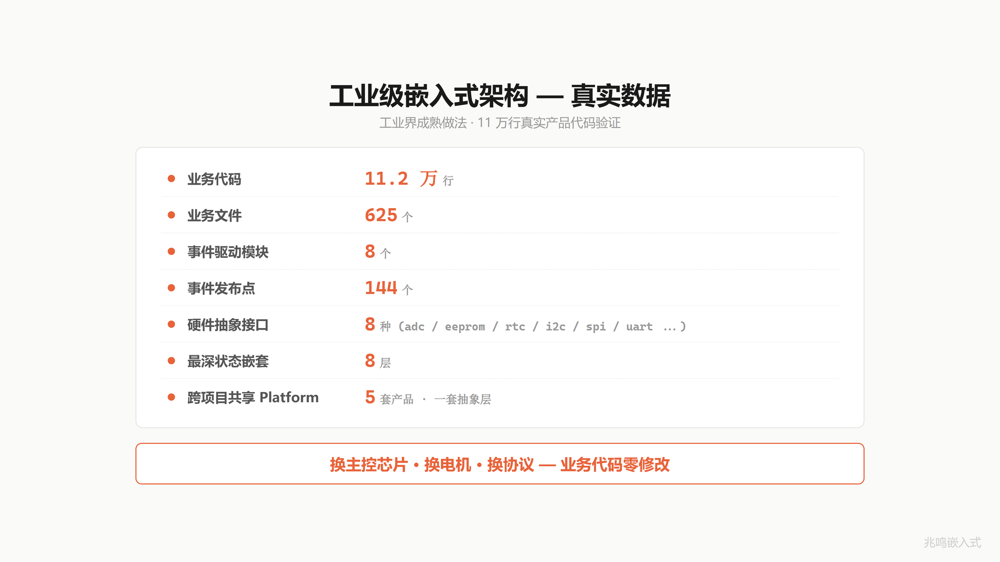

## 18.13 Linus Torvalds 那句话

18 章讲了一件事，但有一句话比我讲得更好。是 Linus Torvalds 说的，Linux 内核的作者：

> Bad programmers worry about the code.
> Good programmers worry about data structures and their relationships.
>
> 差的程序员琢磨代码。好的程序员琢磨数据结构，和它们之间的关系。
>
> Linus Torvalds, Git mailing list, 2006

整本书 18 章一直在写 struct，也一直在画 struct 之间的关系。

把这句话截图保存吧。


## 18.14 配套代码

把下面的代码块分别保存到对应的文件，目录结构和 [`oop-in-c/code/18-roadmap/pc/`](https://github.com/ZhaoChengBo/zhaoming-embedded/tree/master/oop-in-c/code/18-roadmap/pc/) 一致。`make && ./demo` 即可跑通。

本章配套代码不引入新机制，只把 ch01 → ch17 一颗 LED 走过的演化路径在屏幕上 replay 一遍。一份 `main.c` 包揽全部 5 个阶段（每段对应书里的一个章节，前面 18.10 节里贴的就是它的片段）。

### 文件 1：`main.c`（164 行）

5 个阶段：复制粘贴 → struct + me 指针 → 继承 + ops 表 + 多态 → 向上转型 + 全局句柄 → 链接自动注册（说明性占位，真实机制见 ch17）。

```c
/* SPDX-License-Identifier: MIT */
/*
 * main.c - 一颗 LED 演化路径全景
 *
 * 这个文件不教新东西。它把 ch01 → ch17 一颗 LED 走过的演化路径
 * 在屏幕上 replay 一遍，让读者看见自己走过的路。
 *
 * 每一段对应书里的一个章节。每一段都能跑（虽然有些段刻意保留了
 * "原始痛点"，比如 stage 1 的三份独立函数）。
 */

#include <stdint.h>
#include <stdbool.h>
#include <stdio.h>

/* ======================== Stage 1: ch01 ========================
 * 三个 LED 三份代码 - 复制粘贴
 */

static void s1_red_on(void)
{
    printf("    s1_red_on: write reg(13) = 1\n");
}

static void s1_green_on(void)
{
    printf("    s1_green_on: write reg(14) = 1\n");
}

static void s1_blue_on(void)
{
    printf("    s1_blue_on: write reg(15) = 1\n");
}

/* ======================== Stage 2: ch01 ========================
 * 一份函数 + me 指针。封装的最朴素形态。
 */

struct s2_led {
    uint8_t pin;
    bool    is_on;
};

static void s2_led_on(struct s2_led *me)
{
    me->is_on = true;
    printf("    s2_led_on(pin=%u): write reg = 1\n", (unsigned)me->pin);
}

/* ======================== Stage 3: ch06 - ch11 ========================
 * 继承 + ops 表 + 多态 dispatch
 */

struct s3_led_base;

struct s3_led_ops {
    void (*on)(struct s3_led_base *me);
};

struct s3_led_base {
    const struct s3_led_ops *ops;
    const char              *name;
};

struct s3_led_gpio {
    struct s3_led_base base;
    uint8_t            pin;
};

struct s3_led_pwm {
    struct s3_led_base base;
    uint8_t            channel;
};

static void s3_gpio_on(struct s3_led_base *me)
{
    struct s3_led_gpio *self = (struct s3_led_gpio *)me;
    printf("    s3_gpio_on  [%s]: write reg(%u) = 1\n",
           me->name, (unsigned)self->pin);
}

static void s3_pwm_on(struct s3_led_base *me)
{
    struct s3_led_pwm *self = (struct s3_led_pwm *)me;
    printf("    s3_pwm_on   [%s]: PWM ch=%u duty=100%%\n",
           me->name, (unsigned)self->channel);
}

static void s3_led_on(struct s3_led_base *me)
{
    me->ops->on(me);    /* 多态 dispatch */
}

/* ======================== Stage 4: ch12 - ch15 ========================
 * 向上转型 + 全局句柄 + 板级初始化
 */

static struct s3_led_gpio g_gpio;
static struct s3_led_pwm  g_pwm;

static struct s3_led_base *g_led_red;
static struct s3_led_base *g_led_status;

static const struct s3_led_ops gpio_ops = { .on = s3_gpio_on };
static const struct s3_led_ops pwm_ops  = { .on = s3_pwm_on };

static void s4_board_init(void)
{
    g_gpio.base.ops  = &gpio_ops;
    g_gpio.base.name = "RED";
    g_gpio.pin       = 13;

    g_pwm.base.ops   = &pwm_ops;
    g_pwm.base.name  = "STAT";
    g_pwm.channel    = 1;

    g_led_red    = &g_gpio.base;     /* 向上转型 */
    g_led_status = &g_pwm.base;
}

/* ======================== Replay ======================== */

int main(void)
{
    printf("=========================================\n");
    printf("  ch18 - the road one LED has walked\n");
    printf("=========================================\n");

    printf("\n[stage 1] ch01 - 3 LEDs, 3 copies\n");
    s1_red_on();
    s1_green_on();
    s1_blue_on();

    printf("\n[stage 2] ch01 - struct + me pointer\n");
    struct s2_led red   = { .pin = 13, .is_on = false };
    struct s2_led green = { .pin = 14, .is_on = false };
    struct s2_led blue  = { .pin = 15, .is_on = false };
    s2_led_on(&red);
    s2_led_on(&green);
    s2_led_on(&blue);

    printf("\n[stage 3] ch06-ch11 - inheritance + ops + polymorphism\n");
    struct s3_led_gpio g = { .base = {.ops = &gpio_ops, .name = "RED"}, .pin = 13 };
    struct s3_led_pwm  p = { .base = {.ops = &pwm_ops,  .name = "STAT"}, .channel = 1 };
    s3_led_on(&g.base);
    s3_led_on(&p.base);

    printf("\n[stage 4] ch12-ch15 - upcasting + handle + led_board_init\n");
    s4_led_board_init();
    s3_led_on(g_led_red);
    s3_led_on(g_led_status);

    printf("\n[stage 5] ch17 - linker auto registration (see 17-initcall)\n");
    printf("    main never references *_init, drivers register themselves\n");

    printf("\n=========================================\n");
    printf("  one LED, 17 chapters, 4000 lines covered\n");
    printf("=========================================\n");

    printf("\nPress Enter to exit...\n");
    getchar();
    return 0;
}
```

### 文件 2：`Makefile`（19 行）

```makefile
# Makefile - ch18 roadmap recap (PC)

CC      = gcc
CFLAGS  = -Wall -Wextra -std=c99
TARGET  = demo
SRCS    = main.c

.PHONY: all clean run

all: $(TARGET)

$(TARGET): $(SRCS)
	$(CC) $(CFLAGS) -o $(TARGET) $(SRCS)

run: $(TARGET)
	./$(TARGET)

clean:
	rm -f $(TARGET) $(TARGET).exe
```

### 跑一遍

```bash
cd oop-in-c/code/18-roadmap/pc
make
./demo
```

### 期望输出

```
=========================================
  ch18 - the road one LED has walked
=========================================

[stage 1] ch01 - 3 LEDs, 3 copies
    s1_red_on: write reg(13) = 1
    s1_green_on: write reg(14) = 1
    s1_blue_on: write reg(15) = 1

[stage 2] ch01 - struct + me pointer
    s2_led_on(pin=13): write reg = 1
    s2_led_on(pin=14): write reg = 1
    s2_led_on(pin=15): write reg = 1

[stage 3] ch06-ch11 - inheritance + ops + polymorphism
    s3_gpio_on  [RED]: write reg(13) = 1
    s3_pwm_on   [STAT]: PWM ch=1 duty=100%

[stage 4] ch12-ch15 - upcasting + handle + led_board_init
    s3_gpio_on  [RED]: write reg(13) = 1
    s3_pwm_on   [STAT]: PWM ch=1 duty=100%

[stage 5] ch17 - linker auto registration (see 17-initcall)
    main never references *_init, drivers register themselves

=========================================
  one LED, 17 chapters, 4000 lines covered
=========================================
```

一颗 LED，5 个阶段，5 行代码风格的演化。看自己一路走过的路。

## 18.15 视频回放

> [《C 语言·终章·四千万行代码的秘密武器·OOP 系列·Linux 内核映射·Linus 金句》](https://www.bilibili.com/video/BV13qREBGEgv/)

## 写在最后

走完这本书，你再看任何 C 代码，眼里都是设计。

不管你刚入行，还是已经做了 5 年、10 年，能走到这里，你已经在路上了。

下一篇：[第 19 章 · 工业控制板主控案例](../05-工业实战/19-主控案例.md)
