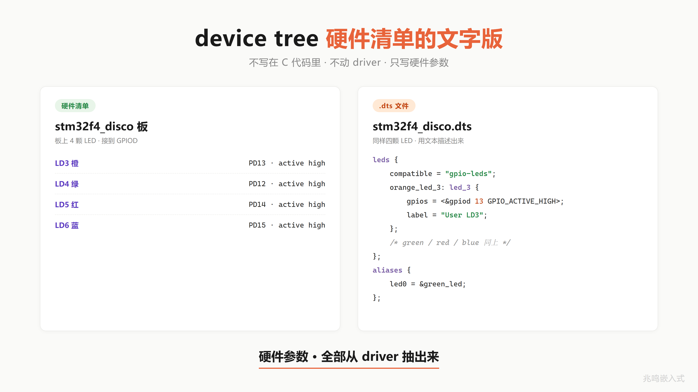
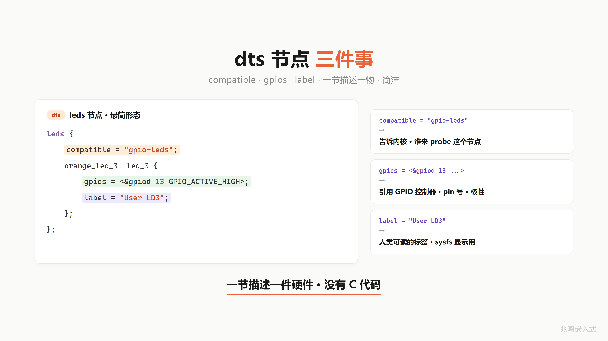
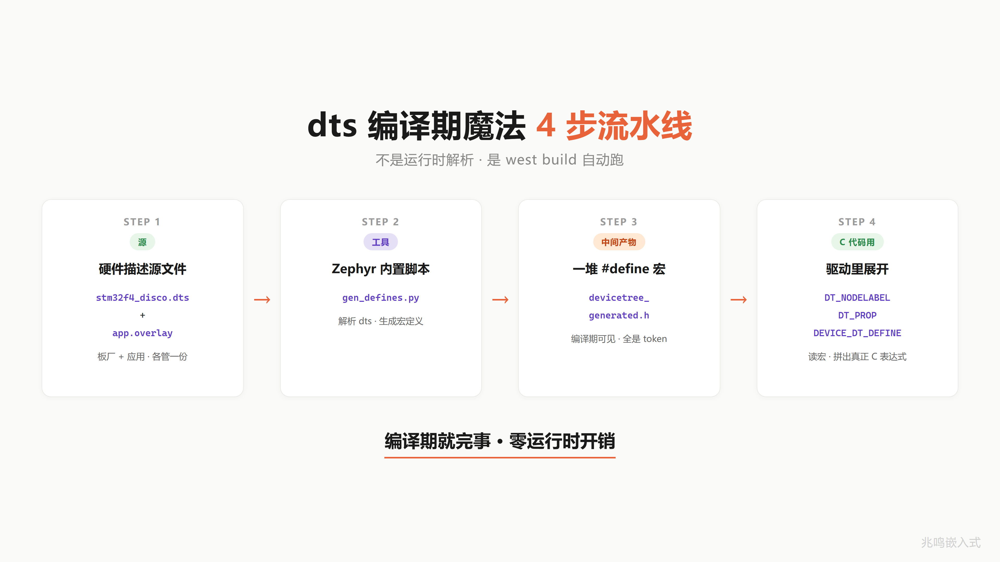
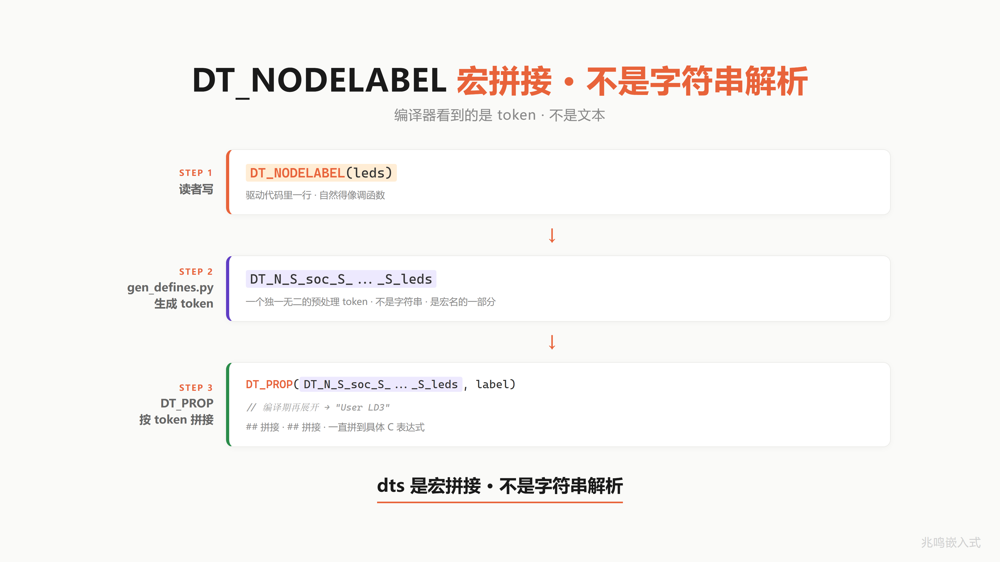
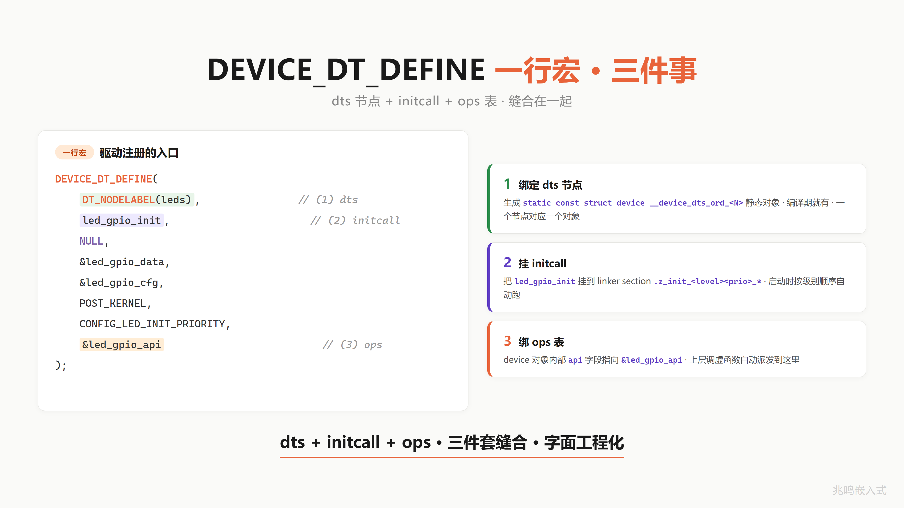
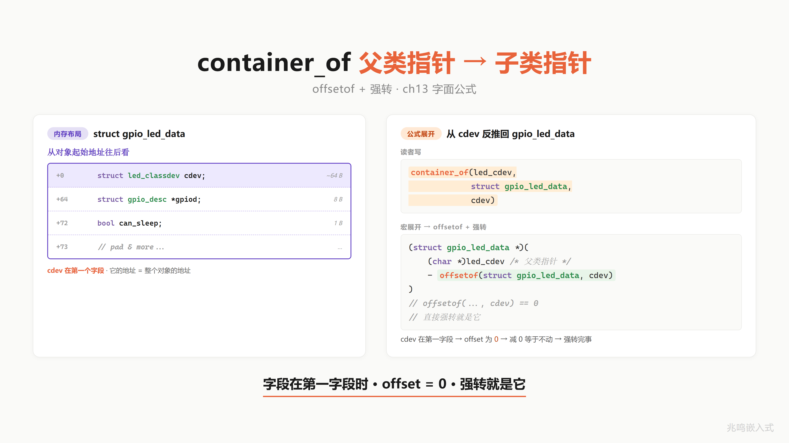

# 第 19 章 · Zephyr 实战 · 用前 18 章的眼睛读 driver subsystem

前 18 章一颗 LED 演化出所有 OOP 抽象。这一章去工业级开源 RTOS 的现场抓证据：把书前面推出来的每个概念，拿到 Zephyr v3.7.0 LTS 的源码里，字节级对得上。

## 19.0 章节首部

第一次接触 Zephyr 的读者别急着翻代码段。先把"它是什么 / 这本书为什么选它 / 这一章会出现哪些术语"三件事过一遍，后面读源码会顺很多。

### 19.0.1 Zephyr 是什么

Zephyr 是 Linux 基金会（Linux Foundation）旗下的开源实时操作系统项目，2016 年 2 月由 Linux 基金会官方宣布成立。初始贡献来自 Wind River、Intel、NXP、Synopsys 等公司，之后由社区接力发展。Zephyr 的定位非常清楚：面向资源受限设备、跨架构、社区驱动、商业友好的现代 RTOS。

它不是某一家公司私有的 RTOS。治理结构跟 Linux 内核类似，有 Governing Board 和 Technical Steering Committee，商标和基础设施由 Linux 基金会托管。这一点对工程选型很重要：你不会因为某家公司战略调整、被收购或者倒闭而失去这个 RTOS。

License 是 Apache License 2.0。商业产品里使用 Zephyr 不需要开源你的应用层代码，没有 GPL 那种"传染性"问题，还附带明确的专利授权条款，企业法务部门接受度高。

到 2026 年，Zephyr 项目的 Platinum 级成员（最高一级）一共 13 家，包括 Intel、Nordic Semiconductor、NXP、Qualcomm、Renesas、Google、Meta、Wind River 等。Silver 级 28 家，涵盖 Arduino、Arm、Microchip、ST、TI 等。从硅厂、模组厂、汽车 OEM 到互联网巨头，主流玩家几乎都在桌上。

技术上，Zephyr 把几个关键能力做齐了：

- 跨架构原生支持。ARM Cortex-M / Cortex-R / Cortex-A、RISC-V、x86、Tensilica Xtensa（ESP32 用的就是这个）、ARC、SPARC、MIPS。一份应用代码可以跨架构编译。
- Device Tree + Driver Model + Kconfig。设备描述用 dts 文件，驱动用 `struct device` 加 ops 表加 `DEVICE_DT_DEFINE` 注册，初始化用 `SYS_INIT` 多优先级链。这套机制和 Linux 内核 driver model 几乎是同一个思路的简化版。
- 抢占式内核 + SMP。原生支持对称多核 SoC。
- 板级支持超过 1000 块官方 board（数据出处：zephyrproject.org 主页），`boards/` 目录里完整带 dts、defconfig、driver。

生态方面，Nordic 的 nRF Connect SDK 直接构建在 Zephyr 之上，并且是项目最大贡献方之一。Espressif 从 2020 年起官方支持 ESP32 系列在 Zephyr 上跑。NXP 是 Platinum 成员，i.MX RT、LPC、Kinetis 系列在主线里都有 board 支持。

对学完前 18 章的读者，Zephyr 的独特价值在于：它把 Linux 内核 driver model 的思路，简化、移植到了 MCU 这个量级的资源约束下，用同一套 OOP 抽象。前面学的每一个机制，`struct device` + ops 表、`container_of` 宏、初始化链、子系统接口，在 Zephyr 源码里都能找到一一对应、规模可读的实现。

### 19.0.2 为什么这本书选 Zephyr

国内嵌入式工程师常用的 RTOS 大致有 FreeRTOS、RT-Thread、Zephyr 三条主线，每一个都有自己的位置。选 Zephyr 的理由集中在两条。

第一，教学定位匹配。本书前 18 章一直在用纯 C 演示一种思路：`struct device` + ops 表 + `container_of` + 初始化链 + 子系统注册。这些不是教学场景的简化模型，而是 Linux 内核 driver model 的核心抽象。Zephyr 的 driver model 是这套抽象在 MCU 资源约束下的精简版，规模适合一个人通读。学完前 18 章，第 19 章直接打开 Zephyr 的 `drivers/led/`、`drivers/gpio/` 或 `drivers/i2c/`，每一行代码都对应得上。这是本书想要的"前 18 章学完直接读 upstream"的闭环，Zephyr 提供的对应关系最直接。

第二，国际化生态。Nordic 的 nRF Connect SDK 直接构建在 Zephyr 之上；Espressif 的 ESP32 系列从 2020 年起官方支持 Zephyr；NXP、Renesas、ST、TI、Qualcomm 是 Zephyr 项目的 Platinum 或 Silver 成员。读者将来如果接触欧美客户的项目、或者面试国际嵌入式岗位，Zephyr 出现的频率比较高，前期投入可以覆盖更广的项目场景。

关于 RT-Thread。选择 Zephyr 不代表 RT-Thread 不好。RT-Thread 在国产 MCU 适配、中文文档、本土生态运营这几件事上做得扎实，国内很多产线和教学场景里它是更顺手的选择。本书选 Zephyr，是因为"前 18 章学完直接读 upstream"这个教学目标下，Zephyr 的 driver model 跟 Linux 内核结构最接近、迁移成本最低。如果你已经在用 RT-Thread，本书前 18 章学到的 OOP 抽象同样适用，只是 ops 表的命名约定和注册宏不一样，不用从零再学一遍。

### 19.0.3 术语小词典

后续小节里会反复出现下面这些词，先放一份最小定义，随用随翻。

**`struct device`**：Zephyr 里所有外设驱动的统一句柄类型，定义在 `include/zephyr/device.h`。每个 GPIO、I2C、UART 实例对应一个 `struct device` 对象，里面带 ops 函数表指针和私有数据指针。应用层一律拿 `const struct device *dev` 调用。

**device tree**：用 dts 文件描述硬件拓扑（哪个 SoC、哪些外设、哪个引脚连哪里），不写在 C 代码里。编译时翻译成 C 宏，驱动用 `DT_NODELABEL(...)`、`DT_INST(...)` 这类宏在编译期取出节点信息。源头来自 Linux 内核同名机制。

**dts overlay**：不直接修改 board 自带的 dts，而是写一个小补丁文件叠加在上面，专门给本应用改一两个引脚或加一个外设。文件名 `app.overlay` 或 `<board>.overlay`，`west build` 自动合并。

**Kconfig + `prj.conf`**：和 Linux 内核同源的配置系统。`Kconfig` 文件定义所有可选配置项及其依赖，`prj.conf` 是本应用的最终选择列表（`CONFIG_LED=y` 这种）。`west build` 据此生成 `autoconf.h`，C 代码用 `#ifdef CONFIG_XXX` 来裁剪。

**`west`**：Zephyr 官方命令行工具，Python 写的，类似 git 的子命令风格。常用三条：`west init` 拉项目、`west build` 编译、`west flash` 烧录。

**`SYS_INIT`**：注册一个初始化函数，让它在系统启动时按指定优先级和阶段（`PRE_KERNEL_1`、`PRE_KERNEL_2`、`POST_KERNEL`、`APPLICATION`）自动被调用。本质和 Linux 内核的 `subsys_initcall` 是同一类机制：链接器收集，启动时遍历调用。

**`DEVICE_DT_DEFINE`**：在编译期为某个 dts 节点定义一个 `struct device` 对象的宏。展开后会生成静态对象、初始化函数、ops 表绑定，并把这个 device 实例放进特殊的链接段供运行时遍历。是"`struct device` + ops + initcall"三件套在 Zephyr 里的合成宏。

**`boards/`**：官方支持的板级目录，每块板子一个子目录，里面包含 dts、defconfig、Kconfig、board 启动代码。超过 1000 块板子。

**`samples/`**：官方仓库根目录下的示例代码集合，按子系统分类（`samples/basic/blinky`、`samples/drivers/i2c/` 等）。新手适合从这里入门，复制改动比从零写快得多。

下面正式进入"前 18 章抽象 → Zephyr 源里在哪 → 字节级对应"四步走。本章只贴源码段做叙事，完整可跑工程在附录 B。

---

## 19.1 struct device 是父类

ch11 推过"父类 + vptr 表"的结构：父类只装一个 ops 函数表指针，所有子类挂同一份函数指针表。Zephyr 这个抽象就在 `struct device` 里。

源：`include/zephyr/device.h`·permalink：<https://github.com/zephyrproject-rtos/zephyr/blob/v3.7.0/include/zephyr/device.h>

```c
struct device {
    const char *name;
    const void *config;          /* ROM 不变配置 */
    const void *api;             /* ops 表指针 = ch11 的 vptr */
    struct device_state *state;  /* 公共运行态 */
    void *data;                  /* RAM 子类私有数据 */
};
```

把这五行和 ch11 教过的父类对照看，一一对得上：

| 教学版父类 | Zephyr 字段 | 角色 |
|---|---|---|
| `me->ops` | `const void *api` | ops 函数表指针·ch11 的 vptr |
| `const config` | `const void *config` | 子类出厂参数·ROM 不变·ch04 配置外置 |
| 子类私有 data | `void *data` | 子类运行态·RAM·LED 用不到时填 NULL |
| 无 | `struct device_state *state` | Zephyr 公共运行态·记 init 是否成功 |
| 无 | `const char *name` | 调试用·dts label 取来 |

`const void *api` 就是 ch11 推过的"父类 vptr"。类型为什么擦除成 `void *`，原因是各子系统的 ops 表 struct 不一样，`led_driver_api`、`gpio_driver_api`、`i2c_driver_api` 都不是同一个 struct。父类层不知道每个子系统具体的 ops 表长什么样，只能擦成 `void *`，调用前由子系统头文件把它还原回真实的 ops 表类型。

`const void *config` 是子类出厂参数。GPIO LED 驱动里它是"几颗 LED + 每颗的引脚号"，I2C 控制器里它是"基地址 + 时钟 + DMA 通道"。`const` 关键字告诉链接器放进 ROM，和 ch04 推过的 const config 完全一致。

`void *data` 是子类运行态。LED 不需要，后面看到的 `led_gpio_config_##i` 把 data 留成 NULL。I2C 控制器需要存"当前传输到第几个字节、信号量、DMA 状态"，这种就放在 `data` 里。

`state` 是 Zephyr 公共字段，记 init 是否成功。这个字段是 Zephyr 在教学版基础上多加的，和 OOP 抽象本身关系不大，先了解就够。

一句话：ch11 一个人推出来的 `struct base { const ops_t *ops; }`，Zephyr 把它扩成 5 个字段的工业版本，核心还是那一个 ops 表指针。

### 19.1.1 这里的"强转"和 ch13 的"向下转型"不是一回事

后面几节会反复看到 `(const struct led_driver_api *)dev->api` 这种强转。这不是 ch13 教的那种"向下转型"，要分清楚。

ch13 教的向下转型：父类是子类的**内嵌字段**（`struct gpio_led_data { struct led_classdev cdev; ... }`），拿到 `led_classdev *` 反推回 `gpio_led_data *`，必须 `container_of + offsetof` 减偏移。这是"继承 by 嵌入"，工业代码里 Linux 内核的 leds-gpio 走的就是这条路（ch20 会看到）。

Zephyr `dev->api` / `dev->config` 这种强转：父类只把指针存进 `void *` 槽位，槽里指向的具体类型由子系统决定，强转就是把 `void *` 还原回原类型，**不需要 offsetof**，因为根本不是嵌套关系。这是"组合 by 指针"，C 圈一般叫"void 指针类型还原"，C++ 里对应的是 `static_cast<T*>(void*)`，不是 `dynamic_cast`。

ch19 这一章里 `dev->api` / `dev->config` 反复出现的强转，全部是后一种"void 指针类型还原"。真正 ch13 教的那种向下转型，会在 19.9 节看到，那是 `CONTAINER_OF(cb, struct ht16k33_data, irq_cb)` 在 GPIO 中断回调里反推子类，工业代码里 Zephyr 自己也用同一招。

两种都是 C 工业代码常见手法，不要混。

## 19.2 driver_api 是 ops 表

每个子系统都有自己的 driver_api，写法完全是 ch11 的 ops 表 struct。先看 LED 子系统。

源：`include/zephyr/drivers/led.h`·permalink：<https://github.com/zephyrproject-rtos/zephyr/blob/v3.7.0/include/zephyr/drivers/led.h>

```c
__subsystem struct led_driver_api {
    /* Mandatory callbacks. */
    led_api_on  on;
    led_api_off off;
    /* Optional callbacks. */
    led_api_blink           blink;
    led_api_get_info        get_info;
    led_api_set_brightness  set_brightness;
    led_api_set_color       set_color;
    led_api_write_channels  write_channels;
};
```

七个函数指针，分两组。Mandatory 必填，Optional 可空。这就是 ch16 对比"纯虚方法 vs 接口"时讲过的两层设计，Zephyr 在工业代码里给了一个真实样本。

LED 子系统提供给应用层的 `led_on(dev, idx)` 是怎么 dispatch 的，看下面这段：

```c
static inline int z_impl_led_on(const struct device *dev, uint32_t led)
{
    const struct led_driver_api *api =
        (const struct led_driver_api *)dev->api;
    return api->on(dev, led);
}
```

`(const struct led_driver_api *)dev->api` 这一行就是 19.1.1 节讲过的"void 指针类型还原"。父类层把 ops 表存成 `void *`，调用前每个子系统的公开头文件负责把它还原回自己的 ops 表 struct，然后通过 `api->on` 一次间接跳转，命中具体的子类实现。

应用层调一次 `led_on(dev, 0)`，内核里走的路径用一行链路就能看完：

`led_on(dev,0)` → `z_impl_led_on` → `(led_driver_api *)dev->api` → `api->on(dev,0)` → `led_gpio_on` → `gpio_pin_set_dt` → 拨 PD12 寄存器位 → LED 亮

链路里只有一次"父类 `void *api` 强转回 LED 子系统 ops 表"，只有一次"通过 `api->on` 间接跳转命中具体子类实现"。其余几步都是普通函数调用。这不是教学杜撰，就是 Zephyr v3.7.0 LED 子系统应用层每天调的那行代码。

可空 ops 怎么处理，继续看 `led_blink`：

```c
static inline int z_impl_led_blink(const struct device *dev, uint32_t led,
                                   uint32_t delay_on, uint32_t delay_off)
{
    const struct led_driver_api *api =
        (const struct led_driver_api *)dev->api;

    if (api->blink == NULL) {
        return -ENOSYS;
    }
    return api->blink(dev, led, delay_on, delay_off);
}
```

子系统先把 `dev->api` 强转回来，然后 if 一下函数指针是不是 NULL。是 NULL 就返回 `-ENOSYS`（Function not implemented）。这正是 ch16 讲的"接口最严格 = 必须全部实现 / 可空 ops 留给父类兜底"两极方案的工业样本：mandatory 的 `on/off` 等价于 C++ 纯虚，optional 的 `blink/set_brightness` 是父类提供 NULL 检查 + 错误码兜底。

## 19.3 LED GPIO 子类完整链路

ch12 用 LED 推出"子类 = config struct + data struct + 实现函数 + ops 表实例化 + 注册到父类"。Zephyr 的 LED GPIO 驱动整文件 102 行，这五件事字节级齐全。

源：`drivers/led/led_gpio.c`·permalink：<https://github.com/zephyrproject-rtos/zephyr/blob/v3.7.0/drivers/led/led_gpio.c>

第一段，子类 config struct：

```c
struct led_gpio_config {
    size_t num_leds;
    const struct gpio_dt_spec *led;
};
```

`num_leds` 是这个 device 实例下挂了几颗 LED，`led` 是一个 `gpio_dt_spec` 数组指针，每项装一颗 LED 的"GPIO 控制器 + 引脚号 + flag"。这一份 struct 就是 ch12 推过的子类出厂参数。

第二段，子类实现：

```c
static int led_gpio_set_brightness(const struct device *dev, uint32_t led,
                                   uint8_t value)
{
    const struct led_gpio_config *config = dev->config;
    const struct gpio_dt_spec *led_gpio;

    if ((led >= config->num_leds) || (value > 100)) {
        return -EINVAL;
    }
    led_gpio = &config->led[led];
    return gpio_pin_set_dt(led_gpio, value > 0);
}

static int led_gpio_on (const struct device *dev, uint32_t led)
{ return led_gpio_set_brightness(dev, led, 100); }

static int led_gpio_off(const struct device *dev, uint32_t led)
{ return led_gpio_set_brightness(dev, led, 0); }
```

第一行 `const struct led_gpio_config *config = dev->config;` 是 19.1.1 节讲过的"void 指针类型还原"，和 ch13 教的向下转型不是同一种操作。父类把出厂参数存在 `dev->config` 这个 `const void *` 字段里，子类一进来把它还原回自己的 `led_gpio_config *`，然后访问字段。这里没有嵌入关系，不需要 offsetof：`led_gpio_config` 不是嵌入在某个父类里的子对象，它就是 GPIO LED 子类自己定义的独立 config struct，父类只是把指针存进 `void *` 槽位。这是"组合 by 指针"在工业代码里的标准写法。

`led_gpio_on` 和 `led_gpio_off` 都是直接复用 `set_brightness`，这是子类内部的代码组织，跟父类无关。

第三段，ops 表实例化：

```c
static const struct led_driver_api led_gpio_api = {
    .on             = led_gpio_on,
    .off            = led_gpio_off,
    .set_brightness = led_gpio_set_brightness,
};
```

只挂了三个函数，`blink / get_info / set_color / write_channels` 没挂。这就是上一节那张可空 ops 表的来由：应用层调 `led_blink(dev, 0, 500, 500)`，走到 `z_impl_led_blink`，查到 `api->blink == NULL`，返回 `-ENOSYS`。不是 bug，是这个子类明确声明"我不支持 blink"。

第四段，子类挂载到父类：

```c
#define LED_GPIO_DEVICE(i)                                              \
    static const struct gpio_dt_spec gpio_dt_spec_##i[] = {             \
        DT_INST_FOREACH_CHILD_SEP_VARGS(i, GPIO_DT_SPEC_GET, (,), gpios)\
    };                                                                  \
    static const struct led_gpio_config led_gpio_config_##i = {         \
        .num_leds = ARRAY_SIZE(gpio_dt_spec_##i),                       \
        .led      = gpio_dt_spec_##i,                                   \
    };                                                                  \
    DEVICE_DT_INST_DEFINE(i, &led_gpio_init, NULL,                      \
                          NULL, &led_gpio_config_##i,                   \
                          POST_KERNEL, CONFIG_LED_INIT_PRIORITY,        \
                          &led_gpio_api);

DT_INST_FOREACH_STATUS_OKAY(LED_GPIO_DEVICE)
```

`DT_INST_FOREACH_STATUS_OKAY` 这一行很关键。dts 里写了 `compatible = "gpio-leds"` 的节点，这里就展开几次。stm32f4_disco 这块板子 dts 里只有一个 leds 节点，所以这里只展开一次，得到一份 `led_gpio_config_0`、一份 `gpio_dt_spec_0[]`，里面塞 4 颗 LED 的引脚信息。

ch12 / ch13 推出来的所有抽象，led_gpio.c 整文件 102 行字节级齐全。五段拆解列出来：

- 子类 config struct·5 行：对应 ch12 推过的"子类出厂参数"
- `led_gpio_set_brightness` 等实现函数·24 行：对应 ch12 子类实现 + `void *config` 类型还原（见 19.1.1）
- `led_driver_api` ops 表实例化·5 行：对应 ch11 ops 表
- `LED_GPIO_DEVICE(i)` 宏 + `DT_INST_FOREACH_STATUS_OKAY`，一行完成 initcall 注册和父类挂载
- 剩余 60 多行是头文件 include、`led_gpio_init` 入口函数、Kconfig 开关等基础设施

这是工业级 OOP 在 C 里能做到的最简密度。

## 19.4 DEVICE_DT_DEFINE 是 ch17 initcall 升级版

ch17 做的教学版 initcall：定义一组 section（`.init_pre`、`.init_drv`、`.init_app`），每个文件用 `INIT_xxx_EXPORT(fn)` 宏把函数指针放进对应 section，启动时 main 函数遍历这几个 section 依次调。

Zephyr 把这个机制做得更工业。源：`include/zephyr/init.h`·permalink：<https://github.com/zephyrproject-rtos/zephyr/blob/v3.7.0/include/zephyr/init.h>

第一，init level 不是 3 级，是 6 级：

```c
#define Z_INIT_ORD_EARLY        0
#define Z_INIT_ORD_PRE_KERNEL_1 1
#define Z_INIT_ORD_PRE_KERNEL_2 2
#define Z_INIT_ORD_POST_KERNEL  3
#define Z_INIT_ORD_APPLICATION  4
#define Z_INIT_ORD_SMP          5
```

`EARLY` 在进 C 域之后立刻跑，内核都还没起来。`PRE_KERNEL_1` / `PRE_KERNEL_2` 是内核初始化期间，还不能用 kernel 服务（信号量、互斥锁还不能调）。`POST_KERNEL` 是内核已经活着，可以用所有 kernel API。`APPLICATION` 在 main 之前。`SMP` 只在多核启用时出现。这种分级粒度对应了 driver 在不同硬件依赖深度下的初始化顺序需求。

第二，section 名字编进 level + prio + sub_prio 三层排序键：

```c
#define Z_INIT_ENTRY_SECTION(level, prio, sub_prio)                    \
    __attribute__((__section__(                                        \
        ".z_init_" #level STRINGIFY(prio)"_" STRINGIFY(sub_prio)"_")))
```

教学版 section 名只有"`.init_drv`"这种粒度，Zephyr 这里直接编出"`.z_init_POST_KERNEL_50_0_`"这种字符串，链接器拿到一堆 section 名按字典序排，三层排序键就生效了。`prio` 取值 0 到 99，`sub_prio` 是同 prio 内的细分。

字节级对应 ch17：教学版 `INIT_xxx_EXPORT(fn)` 把 fn 指针放进 `.init_xxx` section，Zephyr 把 fn 包在一个 `struct init_entry` 里（多带几个字段，比如关联的 `struct device *`），放进 `.z_init_<level><prio>_<subprio>_` section。启动时遍历依次调，和教学版的核心机制完全一致，只是分级更细 + 排序键更精细。

`DEVICE_DT_INST_DEFINE` 这个宏的背后，一部分是上一节看到的"实例化 `struct device`"，另一部分就是这一节看到的"塞进 init section"。两件事用一个宏一次做完，是 Zephyr 在工业代码里把 ch17 那套机制工程化的产物。

## 19.5 device tree · 配置外置

ch04 讲过 `const config` 配置外置，ch15 推出 platform 层"应用层不动驱动，只动 board.h"。这两层抽象在 Zephyr 里就是 device tree（dts）。

第一次看到 dts 文件的读者，把它当成"硬件清单的文字版"。一份 dts 描述这块板子上有哪些 SoC、哪些外设、外设之间怎么连，和电路图一一对应，只是用文本写出来。



dts 不写在 C 代码里，`west build` 时被翻译成 C 宏，驱动用 `DT_NODELABEL(...)` 一类宏在编译期取出节点信息。源头来自 Linux 内核同名机制，Zephyr 把它精简了一遍照搬过来。

下面 6 个小节按顺序：dts 节点长什么样、dts 编译期 4 步流水线、`DT_NODELABEL` 不是字符串、`DEVICE_DT_DEFINE` 一行宏三件事、dts 节点和 driver 怎么 match 上的、dts overlay。

### 19.5.1 dts 节点长什么样

直接看 stm32f4_disco 板子上 4 颗 LED 的 dts 节点。

源：`boards/st/stm32f4_disco/stm32f4_disco.dts`·permalink：<https://github.com/zephyrproject-rtos/zephyr/blob/v3.7.0/boards/st/stm32f4_disco/stm32f4_disco.dts>

```dts
leds {
    compatible = "gpio-leds";
    orange_led_3: led_3 {
        gpios = <&gpiod 13 GPIO_ACTIVE_HIGH>;
        label = "User LD3";
    };
    green_led_4: led_4 {
        gpios = <&gpiod 12 GPIO_ACTIVE_HIGH>;
        label = "User LD4";
    };
    red_led_5: led_5 {
        gpios = <&gpiod 14 GPIO_ACTIVE_HIGH>;
        label = "User LD5";
    };
    blue_led_6: led_6 {
        gpios = <&gpiod 15 GPIO_ACTIVE_HIGH>;
        label = "User LD6";
    };
};
```

读这一段只看三件事就够。



第一，`compatible = "gpio-leds"`。这是节点的"型号字符串"，告诉编译期工具链：这个节点要用哪个 driver 处理。19.5.5 节会展开讲它怎么 match 上 `drivers/led/led_gpio.c`。

第二，`gpios = <&gpiod 13 GPIO_ACTIVE_HIGH>` 三元组。`&gpiod` 是这块板子上 GPIOD 控制器节点的 phandle（指针引用），`13` 是引脚号，`GPIO_ACTIVE_HIGH` 是极性。这一行就把"这颗 LED 接在 PD13"写死了。

第三，`label = "User LD3"`。一个人类可读的字符串，应用层调 `led_get_info(dev, idx, &info)` 能拿到。`orange_led_3:` 这个冒号前的标识符叫 dts label，后面其他节点（比如 `aliases`）可以用 `&orange_led_3` 引用它。

四颗 LED 全在 PD12 / PD13 / PD14 / PD15。`leds` 父节点带 `compatible = "gpio-leds"`，四个子节点不需要再写 compatible，它们一起作为这个父节点的 4 颗 LED 出场。

### 19.5.2 dts 编译期魔法·4 步流水线

dts 不是运行时数据，是编译期数据。这一点决定了 Zephyr 启动后没有"dts 解析"过程，零运行时开销。

整条流水线 4 步：



第一步，读者写好 `stm32f4_disco.dts`（板级）+ `app.overlay`（应用补丁，可选）。

第二步，`west build` 触发时，`gen_defines.py`（位于 `zephyr/scripts/dts/`）这个 Zephyr 内建 Python 脚本把这些 dts 文件读进来，按命名约定把每个节点、每个属性拆成 token，生成 `devicetree_generated.h`。这个头文件几千行 `#define`，读者从不直接看，人眼读不进去也不需要读。

第三步，driver 和应用代码 `#include <zephyr/devicetree.h>`（间接 include 到上面那份生成头文件），写 `DT_NODELABEL(leds)`、`DT_PROP(node, gpios)`、`GPIO_DT_SPEC_GET(node, gpios)` 这些宏。预处理阶段（`cpp`）把这些宏全部展开成静态结构体字面量。

第四步，编译器看到的已经是普通 C 代码，`led_gpio_config_0` 是静态 const 数组，烧进 ROM，跑起来和手写常量一模一样快。

关键一句话：dts 是 build 时被处理，zephyr 启动后没有"dts 解析"运行时。

### 19.5.3 DT_NODELABEL 不是字符串·是宏拼接

第一次看 Zephyr 代码，`DT_NODELABEL(leds)` 容易让人误以为它运行时去查一个名叫 "leds" 的字符串。其实不是。它的本质是 token 拼接。



dts 里 `leds {...}` 这个节点，`gen_defines.py` 给它生成一个独一无二的 token 名，形如 `DT_N_S_soc_S_..._S_leds`，路径反映节点在 dts 树里的位置。`DT_NODELABEL(leds)` 这个宏展开就是这串 token。这串 token 不是变量名，是后面其他宏拼接用的"命名约定"。

举个例子。要拿 `leds` 节点的 `gpios` 属性，写 `DT_PROP(DT_NODELABEL(leds), gpios)`。这个宏第一步展开成 `DT_N_S_..._S_leds_P_gpios`（中间的 `_P_` 表示 property），然后这又是一个 `#define`，定义在 `devicetree_generated.h` 里，继续展开成 `{DEVICE_DT_GET(DT_NODELABEL(gpiod)), 13, GPIO_ACTIVE_HIGH}` 这种 C 表达式。

整套机制不是字符串解析，是宏拼接 + 多层 `#define` 接力。每一层都在预处理阶段完成，走到代码生成时，已经是纯 C 常量。编译器看到的是 token，不是字符串。

记住一句话就够：看到 `DT_xxx` 开头的宏，脑子里把它当编译期常量，不是运行时函数调用，后面读源码就顺了。

### 19.5.4 DEVICE_DT_DEFINE 一行宏完成三件事

`DEVICE_DT_DEFINE` 是 Zephyr 把 ch11 ops 表 + ch12 子类实例化 + ch17 initcall 三个机制合并到一个宏里的产物。



宏的形式：

```
DEVICE_DT_DEFINE(node_id,                 // dts 节点 token
                 init_fn,                  // ch12 子类 init 函数
                 NULL,                     // pm·先忽略
                 NULL,                     // ch12 子类 data·LED 不需要
                 &led_gpio_config_##i,     // ch04 const config·dts 翻译来的
                 POST_KERNEL,              // ch17 init level
                 CONFIG_LED_INIT_PRIORITY, // ch17 init prio
                 &led_gpio_api);           // ch11 ops 表
```

展开后一次性做三件事：

1. 生成一个静态 `struct device __device_dts_ord_<N>` 实例，里面 `api` 指向 `led_gpio_api`、`config` 指向 `led_gpio_config_##i`、`name` 取自 dts 的 label，这是 ch11 推过的"父类对象 + 子类 ops 表绑定"。
2. 把 `init_fn` 包成 `struct init_entry`，放进特殊链接段 `.z_init_POST_KERNEL_50_0_`，19.4 节讲过的 init 表机制就吃这个段，这是 ch17 推过的"initcall 自动注册"。
3. 应用层后续 `DEVICE_DT_GET(DT_NODELABEL(leds))` 编译期就直接拿到这个静态 `__device_dts_ord_<N>` 的地址，这是 ch15 platform 层推过的"应用拿父类指针，不知道具体子类"。

回到 ch04 推过的"配置外置，让 driver 不知道具体硬件参数"。当时的形态是 `const struct led_config { .pin = 13, ... }` 写在 board.c 里，driver.c 拿指针读。Zephyr 把这个抽象做到极限：硬件参数不写 C 文件，写 dts，`gen_defines.py` 在编译期把 dts 翻译成 C 宏，driver 用 `DT_PROP / GPIO_DT_SPEC_GET` 把宏展开成静态结构体。整条链零运行时开销，连"启动时跑一段函数读 config 表"都不需要。

### 19.5.5 dts 节点 → driver 是怎么 match 上的

读到这里，读者应该已经知道 dts 是编译期数据、`DT_xxx` 宏是编译期 token 拼接、`DEVICE_DT_DEFINE` 一行完成三件事。最后剩一个关键问题：dts 里写 `compatible = "gpio-leds"` 的节点，和 `drivers/led/led_gpio.c` 这份 driver 文件，到底是怎么对上号的。这一节专门拆开讲，不留盲区。

整套 match 机制完全发生在编译期，没有运行时遍历。核心两个工具是 `DT_DRV_COMPAT` 宏和 `DT_INST_FOREACH_STATUS_OKAY` 宏。

第一，driver 端用 `DT_DRV_COMPAT` 声明它认领哪个 compatible 字符串。`drivers/led/led_gpio.c` 第一行就写：

```c
#define DT_DRV_COMPAT gpio_leds
```

意思是"这份 driver 文件认领所有 `compatible = "gpio-leds"` 的 dts 节点"。dts 里写的是 `"gpio-leds"`（带连字符），`DT_DRV_COMPAT` 这里写成 `gpio_leds`（连字符变下划线），这是 Zephyr 的命名转换约定，因为 C 标识符不允许连字符。

第二，driver 端用 `DT_INST_FOREACH_STATUS_OKAY(LED_GPIO_DEVICE)` 在编译期遍历所有 status="okay" 的兼容节点。这一行展开后，`gen_defines.py` 给每个匹配 `DT_DRV_COMPAT` 的 dts 节点编一个 inst 序号（0、1、2...），然后对每个序号 i 调一次 `LED_GPIO_DEVICE(i)`。

第三，`LED_GPIO_DEVICE(i)` 宏在 19.3 节看过，展开后给这个 dts 节点生成：一份 `static const struct gpio_dt_spec gpio_dt_spec_##i[]`、一份 `static const struct led_gpio_config led_gpio_config_##i`、一行 `DEVICE_DT_INST_DEFINE` 把 `struct device` 实例 + ops 表 + init 函数 + 链接段位置全绑定。

把这三步串起来，match 的全过程：

- `gen_defines.py` 编译期扫 dts，遇到 `compatible = "gpio-leds"` 的节点，给它编个序号
- 编译器预处理 `led_gpio.c`，`DT_INST_FOREACH_STATUS_OKAY(LED_GPIO_DEVICE)` 这一行被宏展开成 `LED_GPIO_DEVICE(0) LED_GPIO_DEVICE(1) ...`，序号取自上一步
- 每个 `LED_GPIO_DEVICE(i)` 又被展开，生成一份 `struct device` + 一份 config + 一段 init 段挂载
- 链接器把所有 init 段挂到一起，启动时遍历依次调

stm32f4_disco 板子 dts 里只有一个 `leds` 节点带 `compatible = "gpio-leds"`，所以 `DT_INST_FOREACH_STATUS_OKAY(LED_GPIO_DEVICE)` 只展开一次，得到 `led_gpio_config_0`、`gpio_dt_spec_0[]`、一个 `struct device` 实例。要是某块板子 dts 里挂了两组 LED，`leds0 { compatible = "gpio-leds"; ... }` 和 `leds1 { compatible = "gpio-leds"; ... }`，这一行就展开两次，生成两份独立的 config + 两个独立的 device 实例。

关键一句话：match 不是运行时遍历，是 build 时静态展开，每个 dts 节点编译时已经定好它绑哪个 driver。

这就是为什么 Zephyr 启动快，没有 device 树遍历，没有运行时 `of_match_compatible`。Linux 内核因为要支持热插拔和模块加载，match 是运行时做的，遍历 driver 注册表 + 节点 compatible 字符串比对（这点 ch20 会讲）。Zephyr 为 MCU 做了根本简化，把这件事完全压到编译期，内核里没有任何字符串比对代码。

回头看 ch17 推过的教学版 initcall：定义 section、放函数指针、启动遍历调用。Zephyr 在这个机制上叠加了一层"dts 节点 → driver 静态展开"，把"硬件配置 → 实例化 → 注册到 init 段"全部一次做完。读者写 driver 时只关心 `DT_DRV_COMPAT` 一行 + `DT_INST_FOREACH_STATUS_OKAY` 一行，剩下的全是编译期魔法。

### 19.5.6 dts overlay · 叠加修改不动 board.dts

最后一种 dts 用法，实战中天天用：写一份 `app.overlay` 或 `<board>.overlay`，叠加到 board 自带的 dts 上面，改一两个引脚或加一个外设。`west build` 自动合并。

举个例子，改 stm32f4_disco 上 LD4 的 label：

```dts
&green_led_4 {
    label = "Demo Board LD4";
};
```

三行。`&green_led_4` 这个引用方式叫 phandle，指向板级 dts 里 `green_led_4: led_4 {...}` 那个节点。overlay 的语义是"叠加到原 dts 上面"，这里改了 `label` 字段，`gpios` 字段保持不变。

19.8 节那个 demo 就用这一招演示 ch15 platform 抽象：板子不动、driver 不动、应用 main.c 不动，只新增一份 overlay，LD4 的 label 就改了。

## 19.6 不只是 LED · I2C 温度传感器同款抽象

前 5 节我们用 LED 摸完一整条链路，从 dts 节点到 DT_DRV_COMPAT 到 ops 表到 DEVICE_DT_DEFINE。一个合理的怀疑是，这套抽象是不是只在 LED 这种简单外设上成立。下面换一颗 I2C 温度传感器走一遍同样的路，你会看到完全同款的 OOP 套路。

读者可能心里嘀咕：是不是 LED 太特殊，正好能套这套 OOP，换个外设就不行了？换 I2C 设备来一遍，结论是同款。

这一节切到 LM75，业界经典的 I2C 数字温度传感器，1990 年代 National Semiconductor 推出，之后 NXP / ON / TI 等多家延续生产，几十年来到处都在用，也是 Linux 内核 hwmon 子系统里教科书级别的样本之一。Zephyr v3.7.0 主线带 LM75 driver，路径 `drivers/sensor/lm75/lm75.c`。

### 19.6.1 LM75 在 dts 里 · I2C bus 的 client

LM75 是 I2C 设备，在 dts 里写成 I2C 控制器节点的子节点。给 stm32f4_disco 加一份 overlay，把 LM75 挂到 I2C1 上：

```dts
&i2c1 {
    status = "okay";
    clock-frequency = <I2C_BITRATE_STANDARD>;

    lm75_0: lm75@48 {
        compatible = "lm75";
        reg = <0x48>;
    };
};
```

`&i2c1` 是 phandle，指向 SoC dtsi 里 I2C1 控制器节点，overlay 把它的 `status` 改成 "okay"（默认是 "disabled"），然后挂一个名叫 `lm75@48` 的子节点。

`compatible = "lm75"` 是 driver match 的钥匙，见 19.6.2。`reg = <0x48>` 在 I2C 子节点上有特殊语义，它是 I2C 7-bit 从设备地址，LM75 的 A2/A1/A0 引脚全接地时地址就是 `0x48`，三根地址脚一共能产生 8 个不同地址，所以一条 I2C bus 上最多挂 8 颗 LM75。

dts 里写一行，硬件就描述清楚了。和 LED 那边一模一样：硬件接线写在 dts，driver 代码不动，应用代码不动。

### 19.6.2 LM75 driver 是怎么 match 上的

19.5.5 讲过的 match 机制照搬。`drivers/sensor/lm75/lm75.c` 文件第 8 行：

源：`drivers/sensor/lm75/lm75.c`·permalink：<https://github.com/zephyrproject-rtos/zephyr/blob/v3.7.0/drivers/sensor/lm75/lm75.c>

```c
#define DT_DRV_COMPAT lm75
```

这一行声明 lm75.c 认领所有 `compatible = "lm75"` 的 dts 节点。文件最后一行：

```c
DT_INST_FOREACH_STATUS_OKAY(LM75_INST)
```

编译期遍历所有 status="okay" 的 lm75 节点，一个一个调 `LM75_INST(i)` 宏。`LM75_INST` 宏展开后给每个 LM75 节点生成：一份 `struct lm75_data lm75_data_##inst`（运行态，存温度采样和触发上下文），一份 `static const struct lm75_config lm75_config_##inst`（出厂参数，包含 `i2c_dt_spec` 和 `config_dt` 寄存器位），一行 `SENSOR_DEVICE_DT_INST_DEFINE` 把 `struct device` 实例 + ops 表 + init 函数 + 链接段位置全绑定。

`LM75_INST(0)` 展开后里头这一段是关键：

```c
.i2c = I2C_DT_SPEC_INST_GET(inst),
```

`I2C_DT_SPEC_INST_GET` 这个宏在编译期把 dts 里 `reg = <0x48>` 那个地址 + 父节点 `i2c1` 的 `struct device *` 一起塞进 `struct i2c_dt_spec`。运行时，`lm75_reg_read` 拿到这个 spec，调 `i2c_burst_read_dt(&cfg->i2c, reg, buf, size)` 就能把 LM75 的寄存器读出来。

整套流程和 LED GPIO 一字不差：dts 写硬件，`DT_DRV_COMPAT` 认领 compatible，`DT_INST_FOREACH_STATUS_OKAY` 编译期展开，一个 dts 节点对应一个 `struct device` 实例。

### 19.6.3 sensor_driver_api · 5 个 ops

LED 子系统的 ops 表叫 `led_driver_api`，sensor 子系统的 ops 表叫 `sensor_driver_api`。

源：`include/zephyr/drivers/sensor.h`·permalink：<https://github.com/zephyrproject-rtos/zephyr/blob/v3.7.0/include/zephyr/drivers/sensor.h>

```c
__subsystem struct sensor_driver_api {
    sensor_attr_set_t       attr_set;
    sensor_attr_get_t       attr_get;
    sensor_trigger_set_t    trigger_set;
    sensor_sample_fetch_t   sample_fetch;
    sensor_channel_get_t    channel_get;
    sensor_get_decoder_t    get_decoder;
    sensor_submit_t         submit;
};
```

7 个函数指针，核心 5 个：`attr_set / attr_get` 设/读阈值，`trigger_set` 注册中断回调（温度越线触发），`sample_fetch` 触发一次采样，`channel_get` 把采样值取出来。`get_decoder / submit` 是 v3.7 引入的异步 API，一般不用。

和 LED 子系统对比看：

| 子系统 | 父类 | ops 表 | 子类样本 |
|---|---|---|---|
| LED | `struct device` | `struct led_driver_api`（7 个 ops） | `led_gpio.c` / `led_pwm.c` / `ht16k33.c` |
| sensor | `struct device` | `struct sensor_driver_api`（7 个 ops） | `lm75.c` / `bme280.c` / `tmp116.c` |

`struct device + api` 这套二人转，LED 用一遍，sensor 又用一遍，没换。换的只是 ops 表的字段名，因为 LED 关心的是"开/关/亮度/blink"，温度传感器关心的是"采一次/取一个通道值/设阈值/越线触发"。这个差异是子系统语义的差异，OOP 抽象的形状一字不差。

### 19.6.4 LM75 实现哪几个 ops

`drivers/sensor/lm75/lm75.c` 的 ops 表实例化，文件 309-317 行：

```c
static const struct sensor_driver_api lm75_driver_api = {
    .attr_set     = lm75_attr_set,
    .attr_get     = lm75_attr_get,
#if LM75_TRIGGER_SUPPORT
    .trigger_set  = lm75_trigger_set,
#endif
    .sample_fetch = lm75_sample_fetch,
    .channel_get  = lm75_channel_get,
};
```

挂了 4 个常用 ops：`attr_set / attr_get / sample_fetch / channel_get`，条件编译再挂一个 `trigger_set`（dts 里配了 `int-gpios` 时才打开 `LM75_TRIGGER_SUPPORT`）。`get_decoder / submit` 没挂，应用层调对应 API 时父类返回 `-ENOSYS`，和 LED 那边的 `blink` 留空一个套路。

### 19.6.5 应用层拿温度

应用层一行 `sensor_sample_fetch` + 一行 `sensor_channel_get` 就把温度读出来。

```c
#include <zephyr/drivers/sensor.h>

static const struct device *temp_dev =
    DEVICE_DT_GET(DT_NODELABEL(lm75_0));

void read_once(void)
{
    struct sensor_value val;

    sensor_sample_fetch(temp_dev);
    sensor_channel_get(temp_dev, SENSOR_CHAN_AMBIENT_TEMP, &val);

    printk("temp = %d.%06d C\n", val.val1, val.val2);
}
```

这段代码完全不知道下面是 LM75 还是 TMP102 还是 SHT3X。应用层只见 `const struct device *` 加 `sensor_*` 这套通用 API，换一颗温度传感器，dts 改一个 compatible，应用代码一字不动。Zephyr `samples/sensor/thermometer/src/main.c` 就是这种用法的标准样本。

`sensor_sample_fetch` 内部走的路径和 19.2 节看过的 `led_on` 一模一样：把 `dev->api` 强转回 `const struct sensor_driver_api *`，`api->sample_fetch(dev, SENSOR_CHAN_ALL)` 一次间接跳转，命中 `lm75_sample_fetch`，在 `lm75_sample_fetch` 里调 `lm75_reg_read` 经 I2C 把 `LM75_REG_TEMP` 寄存器读出来，存进 `data->temp`。

### 19.6.6 同款抽象 · 不只是 LED

把 LM75 这一套和 LED GPIO 那一套并排看：

| 步骤 | LED GPIO | LM75 |
|---|---|---|
| dts 节点 | `leds { compatible = "gpio-leds"; ... }` | `lm75@48 { compatible = "lm75"; reg = <0x48>; }` |
| driver match | `#define DT_DRV_COMPAT gpio_leds` | `#define DT_DRV_COMPAT lm75` |
| 编译期展开 | `DT_INST_FOREACH_STATUS_OKAY(LED_GPIO_DEVICE)` | `DT_INST_FOREACH_STATUS_OKAY(LM75_INST)` |
| ops 表 | `struct led_driver_api`·on/off/brightness/blink/... | `struct sensor_driver_api`·sample_fetch/channel_get/... |
| 应用层 API | `led_on(dev, idx)` | `sensor_sample_fetch(dev) + sensor_channel_get(...)` |
| 应用层不知道的事 | 是 GPIO LED 还是 PWM LED 还是 ht16k33 | 是 LM75 还是 TMP102 还是 SHT3X |

读者前 18 章学的所有抽象，LED subsystem 是一种用法，sensor subsystem 是另一种用法，全部是同一种 OOP 写法。换 driver、换芯片，应用层不动，这就是 ch15 platform 抽象一字不差。

## 19.7 Demo 1 · 4 颗 LED 同 ops 表跑

第一个 demo 验证 ch12 向上转型的工程价值：4 颗 LED 是同一份 ops 表的 4 个序号，应用层对它们一视同仁。

应用 main.c 关键代码：

```c
#include <zephyr/kernel.h>
#include <zephyr/drivers/led.h>

#define LED_NODE DT_NODELABEL(leds)

int main(void)
{
    const struct device *led_dev = DEVICE_DT_GET(LED_NODE);

    if (!device_is_ready(led_dev)) {
        return -1;
    }
    while (1) {
        for (int i = 0; i < 4; i++) {
            led_on (led_dev, i);
            k_msleep(200);
            led_off(led_dev, i);
        }
    }
    return 0;
}
```

应用层只见 `const struct device *`，完全不知道这是 GPIO LED 还是 PWM LED 还是 I2C LED 矩阵。`led_on(led_dev, i)` 一行进入 19.2 节那段 dispatch，`(const struct led_driver_api *)dev->api` 拿到子类 ops 表，`api->on(dev, i)` 命中 `led_gpio_on`，再走到 `gpio_pin_set_dt`，最终拨动 PD12 / PD13 / PD14 / PD15。

期望运行结果：板子上 4 颗 LED 依次亮 200 ms 灭，循环跑马灯。

build / flash 命令引到附录 B。这里只看叙事：ch12 向上转型推过的"应用层只持有父类指针，不关心具体子类"，在 Zephyr 这里就是 `const struct device *led_dev` 这一根指针。

## 19.8 Demo 2 · device tree overlay 改 label

第二个 demo 验证 ch15 platform 层抽象：换板 / 改硬件只动 .overlay，应用 / 驱动一字不改。

在工程里加一份 `boards/stm32f4_disco.overlay`：

```dts
&green_led_4 {
    label = "Demo Board LD4 (overlay)";
};
```

三行。`&green_led_4` 这个引用方式叫 phandle，指向 dts 里 `green_led_4: led_4 {...}` 那个节点。overlay 的语义是"叠加到原 dts 上面"，这里把 LD4 的 label 字段改了一下，原节点的 `gpios` 字段保持不变。

`west build` 时加上 `-DEXTRA_DTC_OVERLAY_FILE=boards/stm32f4_disco.overlay`，overlay 自动并入，重 build 之后 LD4 的 label 已经被改成"Demo Board LD4 (overlay)"。应用代码 main.c 一字未动，驱动代码 led_gpio.c 一字未动。

期望运行结果：4 颗 LED 跑马灯效果不变，只是如果用 `led_get_info(dev, 1, &info)` 查 LD4 的 label，拿到的字符串变成了"Demo Board LD4 (overlay)"。

回到 ch15 的命题"应用 #include board.h 不动驱动"。Zephyr 把 board.h 这层换成了 dts overlay，但是核心思路完全一样：硬件参数外置到独立文件，应用和驱动稳定在中间不动。.overlay 的意义就是"应用级的硬件补丁"。

## 19.9 Demo 3 · CONTAINER_OF 现场抓

第三个 demo 验证 ch13 / ch18 推过的 `container_of` 反推逻辑，这一招在 Zephyr 内核态回调里有原汁原味的工业实现。

源：`include/zephyr/sys/util.h`·permalink：<https://github.com/zephyrproject-rtos/zephyr/blob/v3.7.0/include/zephyr/sys/util.h>

```c
#define CONTAINER_OF(ptr, type, field)                               \
    ({                                                               \
        CONTAINER_OF_VALIDATE(ptr, type, field)                      \
        ((type *)(((char *)(ptr)) - offsetof(type, field)));         \
    })
```

四行宏，和 ch13 / ch18 手写的版本一模一样：`offsetof` 算成员相对结构体起始的偏移，把成员指针往回减偏移，得到包含它的结构体指针。多出来的 `CONTAINER_OF_VALIDATE` 是编译期类型检查，防止你传错 field，不影响生成的字节码。

字段偏移示意：`struct ht16k33_data` 从低地址到高地址依次是 `const struct device *dev`（offset 0）、若干别的字段、`struct gpio_callback irq_cb`（offset = N 字节）、`struct k_sem irq_sem` 等。`CONTAINER_OF(cb, struct ht16k33_data, irq_cb)` 这一行把 `cb` 这个指针往回减 N 字节，得到的就是外层 `data` 指针。



这张图原本为 ch20 准备，画的是子类 `data` 把父类成员放在 offset 0 的情况，看 offset 关系一目了然。LM75 的 `lm75_data` 和 LED 矩阵的 `ht16k33_data` 都是同款套路：把 `gpio_callback` 嵌进自己的 data，中断回调里 `CONTAINER_OF(cb, struct xxx_data, 字段名)` 反推外层 data 指针。LM75 那边对应代码是 `CONTAINER_OF(cb, struct lm75_data, int_gpio_cb)`，`lm75.c` 第 245 行能看到。

实战在哪。`drivers/led/ht16k33.c` 这个 LED 矩阵驱动，它注册了一个 GPIO 中断回调，中断回调的标准签名是固定的（gpio 子系统定义），只能拿到 `struct gpio_callback *cb`，拿不到驱动自己的私有 data。怎么从 `cb` 反推到 `struct ht16k33_data`，答案就是 `CONTAINER_OF`。

源：`drivers/led/ht16k33.c`·permalink：<https://github.com/zephyrproject-rtos/zephyr/blob/v3.7.0/drivers/led/ht16k33.c>

```c
static void ht16k33_irq_callback(const struct device *gpiob,
                                 struct gpio_callback *cb, uint32_t pins)
{
    struct ht16k33_data *data;

    ARG_UNUSED(gpiob);
    ARG_UNUSED(pins);

    data = CONTAINER_OF(cb, struct ht16k33_data, irq_cb);
    k_sem_give(&data->irq_sem);
}
```

`data = CONTAINER_OF(cb, struct ht16k33_data, irq_cb);` 这一行，就是 ch13 / ch18 推过的反推逻辑：传进来一根 `cb` 指针，想拿到包含它的 `ht16k33_data`，用 `CONTAINER_OF` 反向减偏移。

ch13 / ch18 推过的这一招，Zephyr 全树用了几百次，Linux 内核全树到处都在用。这不是教学杜撰，是 C 代码里最优雅的反推工具，写内核 / 驱动的人天天在用。

配套 demo 3 在 stm32f4_disco 上用 k_timer 周期回调演示同款机制，原因是这块板载没合适的用户按钮触发 GPIO 中断，k_timer 的回调签名 `void(*)(struct k_timer *t)` 同样只能拿到一根成员指针，靠 `CONTAINER_OF(t, struct app_timer_ctx, timer)` 反推外层上下文，机制和上面 ht16k33 那段一字不差。

## 19.10 Demo 4 · 可空 ops + ENOSYS

第四个 demo 把 19.2 节的可空 ops 现象做成可观测：应用层故意调一个子类没挂的 ops，看运行时返回什么。

回顾 19.3 节，`led_gpio.c` 的 ops 表只挂了三个：

```c
static const struct led_driver_api led_gpio_api = {
    .on             = led_gpio_on,
    .off            = led_gpio_off,
    .set_brightness = led_gpio_set_brightness,
};
```

`blink / get_info / set_color / write_channels` 四个槽都是 NULL。

应用层故意调 `led_blink`：

```c
int rc = led_blink(led_dev, 0, 500, 500);
printk("led_blink returned %d\n", rc);
```

走的路径：

1. `led_blink(...)` 是 syscall 包装，内部跳到 `z_impl_led_blink`。
2. `z_impl_led_blink` 把 `dev->api` 强转回 `const struct led_driver_api *`，这是 19.2 节那段 dispatch。
3. 检查 `api->blink == NULL`，成立。
4. 返回 `-ENOSYS`（值是 -88）。

期望运行结果：UART 打印 `led_blink returned -88`。

回到 ch14 / ch16 对比过的两种策略："接口最严格 = 必须全部实现"和"可空 ops 留给父类兜底"。C++ 的纯虚函数走的是第一种，子类不实现编译期就报错。Zephyr 这里展示了第二种的工业用法：mandatory 必填（如果你的 ops 表 `on`、`off` 没挂，`led_gpio_init` 跑起来会拒绝注册），optional 可空（运行时父类返回 -ENOSYS，应用层据此判断是不是要降级处理）。

两层设计的好处：同一个子系统接口可以容纳能力不一样的硬件。GPIO LED 没有硬件 PWM，所以 `set_brightness` 用"开 / 关"近似实现，`blink` 干脆不挂；PWM LED 有硬件计时器，所以 `set_brightness` / `blink` 都能挂上。应用层用同一个 `led_blink(...)` 调用，硬件支持就跑硬件 PWM，硬件不支持就拿到 `-ENOSYS`，上层自己用 `k_msleep + led_on/off` 做软件模拟。

这就是 ch16 那句"接口最严格 = 合同签了必须全部履行"的另一极：合同允许某几条留空，但留空时父类必须能给出确定的错误码。比 C++ 纯虚柔软，比"什么都不查直接调 NULL 函数指针"安全。

## 19.11 收束 · 你前 18 章学的所有抽象·Zephyr 字节级有

把 19.1 到 19.10 这一路看到的对应关系汇总成一张表：

| 章节 | 抽象 | Zephyr 对应物 | 源文件 |
|---|---|---|---|
| ch11 | 父类 + vptr | `struct device` + `dev->api` | `include/zephyr/device.h` |
| ch11 | ops 表 struct | `struct led_driver_api` / `struct sensor_driver_api` | `include/zephyr/drivers/{led,sensor}.h` |
| ch11 | 公开 dispatch + void 指针类型还原 | `z_impl_led_on` 强转 `dev->api` | `include/zephyr/drivers/led.h` |
| ch12 | 子类 = config + data + 实现 + ops | `led_gpio_config` + `led_gpio_api` + `led_gpio_on/off` | `drivers/led/led_gpio.c` |
| ch12 | I2C 子系统同款 | `lm75_config` + `lm75_driver_api` + `lm75_sample_fetch` | `drivers/sensor/lm75/lm75.c` |
| 19.1.1 | 子类 config 类型还原（组合 by 指针） | `dev->config` 强转 `led_gpio_config *` | `drivers/led/led_gpio.c` |
| ch15 | platform 层 + 配置外置 | device tree（.dts + .overlay） | `boards/st/stm32f4_disco/*.dts` |
| ch15 | dts 节点 → driver 静态 match | `DT_DRV_COMPAT` + `DT_INST_FOREACH_STATUS_OKAY` | `drivers/led/led_gpio.c` / `drivers/sensor/lm75/lm75.c` |
| ch16 | 可空 ops vs 纯虚 | mandatory `on/off` + optional `blink` 等 | `include/zephyr/drivers/led.h` |
| ch17 | initcall 自动注册 | `DEVICE_DT_DEFINE` + 6 级 init level | `include/zephyr/{device,init}.h` |
| ch13 / ch18 | container_of 反推 | `CONTAINER_OF(cb, struct ht16k33_data, irq_cb)` | `drivers/led/ht16k33.c` / `drivers/sensor/lm75/lm75.c` |

11 行对照，覆盖前 18 章用纯 C 推过的全部 OOP 抽象，LED subsystem 一遍，sensor subsystem 又一遍。

收束句，是这一章想留给读者带走的：

> 你前 18 章是从一颗 LED 推出来的所有抽象。Zephyr v3.7.0 的 LED 子系统把这些抽象完整复用了一遍，sensor 子系统又复用了一遍，一字不差。
>
> 这本书前 18 章不是教学杜撰，是工业代码的核心抽象。

学完前 18 章再读 Zephyr，感觉是"原来内核驱动写法和我自己推出来的一样"，而不是"又要从头学一套陌生的 API"。这是本书选 Zephyr 的全部理由。

## 19.12 跳到附录 B 跑通

ch19 给的是叙事，读到这里你已经知道每一段抽象在 Zephyr 哪个文件。想动手把 4 个 demo 跑通，跳到附录 B：5 分钟把 west 装好，`west build` + `west flash` 各一行，板子上看见 4 颗 LED 跑马灯，然后切到 demo 2 / 3 / 4，每个 demo 一份 `prj.conf` + 一份 `main_demoN.c`，验证你刚刚在 ch19 看到的字节级对应关系。
