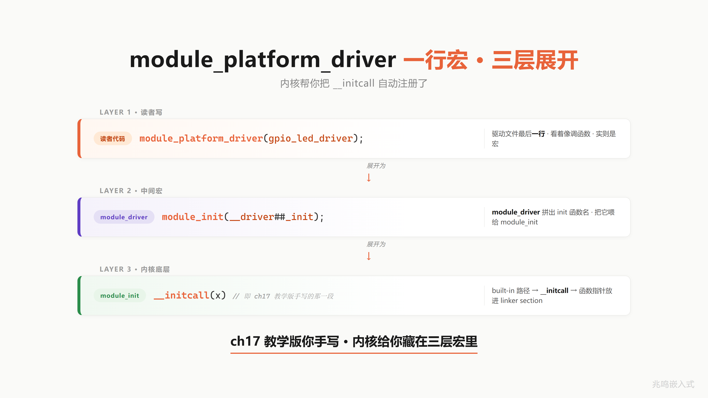

# 第 20 章 · Linux 实战 · 写一个自己的内核驱动

上一章 ch19 在 Zephyr 里看到前 18 章的抽象在 MCU 量级 RTOS 里的字节级实现。这一章去 Linux 6.6 内核现场。Linux 比 Zephyr 大三个数量级，千万行 vs 几十万行，但 OOP 抽象是同一套：`struct led_classdev` 是父类，`leds-gpio.c` 是子类，`container_of` 反推子类，`module_platform_driver` 一行宏完成 ch17 的 initcall 注册。

整章只读 4 个文件就能把这套抽象走完：

- `include/linux/leds.h`
- `drivers/leds/led-class.c`
- `drivers/leds/led-core.c`
- `drivers/leds/leds-gpio.c`

这一章末尾会亲手写一个内核驱动模块 `leds-status.c`，跑在 Raspberry Pi 4B 主线 Linux 6.6 上，`/sys/class/leds/status-led/brightness` 由读者自己创造。我推荐先跑这一段，动手感最强。代码不长，50 行，跑通之后从用户态 `echo 1 > /sys/class/leds/status-led/brightness` 一路下到寄存器，所有路径前 18 章都已经见过。

## 20.1 led_classdev 是父类

打开 `include/linux/leds.h`，往下翻到 `struct led_classdev`：

```c
struct led_classdev {
    const char        *name;
    unsigned int       brightness;
    unsigned int       max_brightness;
    unsigned int       color;
    int                flags;

    void (*brightness_set)(struct led_classdev *led_cdev,
                           enum led_brightness brightness);
    int  (*brightness_set_blocking)(struct led_classdev *led_cdev,
                                    enum led_brightness brightness);
    enum led_brightness (*brightness_get)(struct led_classdev *led_cdev);
    int  (*blink_set)(struct led_classdev *led_cdev,
                      unsigned long *delay_on, unsigned long *delay_off);
};
```

源码：`include/linux/leds.h`·permalink `https://github.com/torvalds/linux/blob/v6.6/include/linux/leds.h`

这就是父类。前面是公共字段，`name / brightness / max_brightness / color / flags`，所有 LED 通用。后面是函数指针，`brightness_set / brightness_set_blocking / brightness_get / blink_set`，子类挂哪个，父类就 dispatch 到哪个。

把它和 ch10 / ch11 的两种风格摆在一起对照：

| 维度 | ch11 风格·瘦 me + 共享 ops 表 | Linux 风格·胖 me + 函数指针内嵌 |
|---|---|---|
| 父类字段布局 | 公共字段 + 一个 `const struct ops *ops` 指针 | 公共字段 + 函数指针字段全部内嵌 |
| ops 表 | 抽成独立 struct·一份 `static const struct ops` | 没有独立 ops 表·函数指针直接是父类字段 |
| 子类挂方法 | 子类自己做一份 `static const struct ops` 然后 `me->ops = &xxx_ops;` | 一行 `led->cdev.brightness_set = my_set;` |
| 多实例 RAM | N 个实例共享一份 ops 表·N 越大越省 | 每个实例自己一份函数指针·实例多就费 RAM |
| 适用场景 | 同型号多实例·方法表稳定·实例数大 | 实例数少·子类按需挂不同方法·灵活性优先 |
| 内核里代表 | `file_operations` / `inode_operations` / `net_device_ops` | `led_classdev` / 大部分 device class |

ch10 推过的教学版 `me` 结构体，公共字段在前，函数指针在后。ch11 把那个函数指针抽到独立 ops 表 struct 里，让多个实例共享一份方法表，省 RAM。Linux 走的是另一条路：函数指针直接内嵌到父类，不抽 ops 表 struct。

这是有意为之。Linux 内核的 LED 不像同一型号 MCU 上的几百个实例，每块板上 LED 数量有限，几个十几个，内嵌函数指针那点 RAM 不心疼。换来的好处是子类初始化简单，`led->cdev.brightness_set = my_set;` 一行就挂上，不用维护一个 static const ops 表。

把这种风格记一笔：函数指针直接进父类的"胖 me"风格，和 ch11 的"瘦 me + 共享 ops 表"风格是 OOP-in-C 的两种正交选项，按场景挑。

什么时候挑哪个，有一条经验：实例数大、方法多、方法表稳定，选 ops 表风格（一份 ops 表，N 个实例共享，N 越大越省）；实例数少、子类经常按需挂不同方法、灵活性优先，选内嵌函数指针风格（每个实例自己一份，初始化简单，不用维护 static const ops 表的命名）。Linux LED 选后者，因为板上 LED 撑死十几颗，不在乎那点函数指针开销，换来子类作者写代码时一行 `led->cdev.brightness_set = my_set;` 就完事，心智负担轻。

但 Linux 内核里两种风格都有。比如 `struct file_operations`、`struct inode_operations`、`struct net_device_ops` 都是独立的 ops 表，因为文件系统和网络栈实例可能上千上万，每个实例少 200 字节函数指针就是省内存。两种风格混用，内核作者按场景挑。

不是 Linux 模仿 OOP。是 Linux 用 C 写 OOP，写了 30 多年。

## 20.2 brightness_set 是函数指针 dispatch

打开 `drivers/leds/led-core.c`，找 `__led_set_brightness`：

```c
static int __led_set_brightness(struct led_classdev *led_cdev,
                                unsigned int value)
{
    if (!led_cdev->brightness_set)
        return -ENOTSUPP;

    led_cdev->brightness_set(led_cdev, value);
    return 0;
}
```

源码：`drivers/leds/led-core.c`·permalink `https://github.com/torvalds/linux/blob/v6.6/drivers/leds/led-core.c`

5 行。父类 dispatch 到子类虚函数，没 magic。第一行检查子类有没有挂 `brightness_set`，没挂返回 `-ENOTSUPP`，让上层走 `brightness_set_blocking` 兜底。第二行直接通过函数指针调用子类实现。

这就是 ch11 多态的字面实现。`led_cdev` 是父类指针，`led_cdev->brightness_set` 是父类里的函数指针字段，指向子类挂上去的具体函数。从内存角度看，`__led_set_brightness` 拿到一个 `struct led_classdev *`，偏移到 `brightness_set` 字段，读出函数指针，间接调用。一条 ARM `blr` 指令的事。

ch10 手算过这一步的反汇编。父类指针存在 x0，`ldr x9, [x0, #0x18]` 把 `brightness_set` 字段的函数指针读到 x9，`blr x9` 跳转，一共两条 ARM 指令完成一次"虚函数 dispatch"。现代乱序 CPU 上有分支预测器，间接跳转命中时 0 周期，没命中时 10 几个周期。和 C++ 虚函数的 vtable 机制开销是同一个量级，因为 vtable 本质也是这一套，只是 C++ 编译器替你藏起来了，C 写的话你自己显式写。

整个 Linux LED subsystem 的多态机制，5 行讲完。父类只负责 dispatch，具体亮不亮、亮多少、怎么亮，全部交给子类。子类换一个，dispatch 逻辑不动。这就是 ch11 多态在内核里和教科书写法一一对应。

## 20.3 leds-gpio.c 是子类

到此父类讲完了。子类长什么样，打开 `drivers/leds/leds-gpio.c`：

```c
struct gpio_led_data {
    struct led_classdev cdev;
    struct gpio_desc   *gpiod;
    u8                  can_sleep;
    u8                  blinking;
    gpio_blink_set_t    platform_gpio_blink_set;
};

static inline struct gpio_led_data *
            cdev_to_gpio_led_data(struct led_classdev *led_cdev)
{
    return container_of(led_cdev, struct gpio_led_data, cdev);
}
```

源码：`drivers/leds/leds-gpio.c`·permalink `https://github.com/torvalds/linux/blob/v6.6/drivers/leds/leds-gpio.c`

看第一字段。`struct led_classdev cdev`，父类内嵌，放第一位置，offset = 0。这是 ch12 教过的子类布局：父类放首字段，子类指针向上转型成父类指针零代价，两个地址字面相同。

布局示意图见下，从低地址到高地址依次是 `struct led_classdev cdev`（公共字段 + `brightness_set` 等函数指针，offset = 0，`led_dat` 子类指针和 `&led_dat->cdev` 父类指针字面相同）、`struct gpio_desc *gpiod`（子类私有）、`u8 can_sleep`、`u8 blinking`、`gpio_blink_set_t platform_gpio_blink_set`。因为父类在 offset 0，`container_of` 减去 0 等于不动，但写法保留，万一以后字段顺序改了，虚函数回调不用跟着改。


后面的 `gpiod / can_sleep / blinking / platform_gpio_blink_set` 是 `gpio_led_data` 自己的私有字段，父类不知道。这是 ch12 子类扩展。

下面这个 helper 函数 `cdev_to_gpio_led_data` 是 ch20 最该记住的命名约定。整个 Linux 内核到处都是 `xxx_to_yyy_data` 这样的小函数，读源码读到这个名字，脑子里立刻知道：父类指针 → 子类指针的反推。一行 `container_of`，把父类指针往回偏移一点点，拿到外层子类指针。

`gpio_led_set` 函数实现就用得上：

```c
static void gpio_led_set(struct led_classdev *led_cdev,
                         enum led_brightness value)
{
    struct gpio_led_data *led_dat = cdev_to_gpio_led_data(led_cdev);

    /* ... 中间省略 blink 处理 ... */

    gpiod_set_value(led_dat->gpiod, !!value);
}
```

第一行 `cdev_to_gpio_led_data(led_cdev)` 把父类指针反推回子类指针，然后 `led_dat->gpiod` 拿到子类私有的 GPIO 描述符，`gpiod_set_value` 一拍就把寄存器写了。这就是 ch13 container_of 和教科书写法一一对应。

到这里，一个 LED 子类长什么样，清晰了：

1. 父类做第一字段·向上转型零代价
2. 子类私有字段紧接在后
3. 一个 `xxx_to_yyy_data` helper·里面一行 `container_of` 把父类指针反推回子类
4. 虚函数实现的第一行就调这个 helper·拿子类指针·然后操作私有字段

这套写法，drivers/leds 里 92 个驱动，全部如此。

## 20.4 container_of 在 Linux 主线

ch13 手写过一个 `container_of`，三行：

```c
#define container_of(ptr, type, member) \
    ((type *)((char *)(ptr) - offsetof(type, member)))
```

Linux 主线的版本多了几行，在 `include/linux/container_of.h`：

```c
#define container_of(ptr, type, member) ({              \
    void *__mptr = (void *)(ptr);                       \
    static_assert(__same_type(*(ptr), ((type *)0)->member) || \
                  __same_type(*(ptr), void),            \
                  "pointer type mismatch in container_of()"); \
    ((type *)(__mptr - offsetof(type, member))); })
```

源码：`include/linux/container_of.h`·permalink `https://github.com/torvalds/linux/blob/v6.6/include/linux/container_of.h`

核心还是 ch13 那一行 `__mptr - offsetof(type, member)`，偏移取减，拿到外层结构体指针。

多出来的两层是类型安全检查。`static_assert` + `__same_type` 是 GCC 内建，编译期对比 `*ptr` 的类型和 `((type *)0)->member` 的类型，不一致直接编译报错。教学版 ch13 没讲这层，借这里展开一下：

`__same_type(a, b)` 是 GCC 的 `__builtin_types_compatible_p` 包装，两边类型一致返回 1，不一致返回 0。`static_assert` 编译期断言，条件假就在编译期报错。整个意思是：`container_of(led_cdev, struct gpio_led_data, cdev)` 这一行，编译期会检查 `led_cdev` 的类型确实是 `struct led_classdev *`，和 `gpio_led_data.cdev` 的类型一致，不一致编译就挂。

这层检查不影响运行时，完全编译期，零代价。教学版不带，内核版加上，防止有人写 `container_of(some_other_ptr, struct gpio_led_data, cdev)` 这种类型不匹配的代码。

数据点：drivers/leds 全树 92 个驱动用 container_of，共 175 处。内核里 container_of 不是教学杜撰，和教科书写法一一对应。读到任何一个 `_to_` 结尾的 helper 函数，里面 9 成是这一行。

把视野放宽到全 drivers/ 目录，container_of 用法是几万次的级别。文件系统层 VFS 用它从 `struct file *` 反推私有数据，网络栈用它从 `struct sk_buff *` 反推协议私有结构，设备模型用它从 `struct device *` 反推总线设备，中断框架用它从 `struct irq_data *` 反推中断控制器私有结构。父类 + 子类 + container_of 反推这套机制，是 Linux 内核的字面骨架，没有它内核根本写不下去。

ch13 教学版那条三行公式，不是为了应试编出来的，是 Linux 内核 30 多年来写驱动写出来的真实工程模式。学到这里，你拿任何一份内核驱动源码，先扫一眼有没有 `container_of`，有就找子类布局，定位父类字段，串起来调用链，读源码的速度直接快一个量级。

## 20.5 platform_driver 是 ch17 initcall 升级版

ch17 手写过 `__initcall` 表，把所有驱动的 init 函数收集到一个 section，内核启动时遍历调用。Linux 主线把这个动作藏在三层宏里。打开 `drivers/leds/leds-gpio.c` 末尾：

```c
static struct platform_driver gpio_led_driver = {
    .probe    = gpio_led_probe,
    .shutdown = gpio_led_shutdown,
    .driver   = {
        .name           = "leds-gpio",
        .of_match_table = of_gpio_leds_match,
    },
};
module_platform_driver(gpio_led_driver);
```

最后一行 `module_platform_driver(gpio_led_driver)` 一行完事。展开三层，见示意图。第一层在 `include/linux/platform_device.h`，把 `module_platform_driver(...)` 替换成 `module_driver(..., platform_driver_register, platform_driver_unregister)`。第二层在 `include/linux/device/driver.h`，把 `module_driver(...)` 替换成 `__init` init 函数 + `module_init` + `__exit` exit 函数 + `module_exit` 这套样板。第三层在 `include/linux/module.h`，把 `module_init(x)` 替换成 `__initcall(x)`，这就是 ch17 教学版的 init 表机制。



逐层 `#define` 替换，一层一层往下展。

第一层在 `include/linux/platform_device.h`：

```c
#define module_platform_driver(__platform_driver) \
    module_driver(__platform_driver, platform_driver_register, \
            platform_driver_unregister)
```

第二层在 `include/linux/device/driver.h`：

```c
#define module_driver(__driver, __register, __unregister, ...) \
static int __init __driver##_init(void) \
{ return __register(&(__driver) , ##__VA_ARGS__); } \
module_init(__driver##_init); \
static void __exit __driver##_exit(void) \
{ __unregister(&(__driver) , ##__VA_ARGS__); } \
module_exit(__driver##_exit);
```

第三层，`module_init` 在 built-in 路径，`include/linux/module.h`：

```c
#define module_init(x)  __initcall(x);
```

三层展开下来，`module_platform_driver(gpio_led_driver)` 等价于：

```c
static int __init gpio_led_driver_init(void) {
    return platform_driver_register(&gpio_led_driver);
}
__initcall(gpio_led_driver_init);
```

ch17 教学版手写的 `__initcall` 表，内核把这个动作藏在三层宏里。读者写自己的 `leds-status.c` 也是一行 `module_platform_driver(...)` 完事，内核帮把 `__initcall` 注册了。

源码：
- `include/linux/platform_device.h`·permalink `https://github.com/torvalds/linux/blob/v6.6/include/linux/platform_device.h`
- `include/linux/device/driver.h`·permalink `https://github.com/torvalds/linux/blob/v6.6/include/linux/device/driver.h`
- `include/linux/module.h`·permalink `https://github.com/torvalds/linux/blob/v6.6/include/linux/module.h`

为什么要绕三层宏，原因是同一段样板代码（init 函数 + exit 函数 + 注册 + 取消注册）在内核里重复了上千次。每个 `platform_driver` 都长这样，每个 `i2c_driver` 也长这样，每个 `spi_driver` 还是长这样。把样板包进 `module_xxx_driver` 一行宏，1500 多个驱动，每个驱动都省下 10 行模板，总共省下一万多行机械代码，而且不会写错。

ch17 手写 `__initcall` 时，宏只有一层，因为教学场景只关心一个驱动。Linux 主线把这层宏扩展到三层，是工程层面的取舍：层数多，调试看反汇编时绕一下，但写驱动的人少打 10 行字，而且如果以后改 init 路径（比如 deferred probe），只改宏定义一处，所有驱动跟着升级。

读到这里，`module_platform_driver` 不再是黑魔法。它就是 ch17 init 表的一行宏包装，包了一层 `register / unregister`，包了一层 `module_init / module_exit`，最后底层还是 `__initcall`。展开下来你都见过。

## 20.6 不只是 LED · I2C 温度传感器在 hwmon subsystem

还记得 ch19 § 19.6 那颗 LM75 吗，在 Zephyr 它走的是 sensor subsystem，这边主线 Linux 走的是 hwmon class。同一颗 I2C 温度芯片，两套子系统，两份对照，都验证你前 18 章学的"换驱动不改应用"。

前面 5 节都在 LED · `leds-gpio.c` 是 platform_driver · 走 device tree 节点匹配。读者可能想问：I2C 设备在 Linux 里怎么 OOP，写法和 platform_driver 一样吗。答案是：套路完全一样，只是父类不同，register 函数不同。这一节切到一颗业界经典 I2C 温度芯片 LM75，主线源码在 `drivers/hwmon/lm75.c`，几十年标杆，Linux 上千万台服务器读温度都是这条路。

### 20.6.1 LM75 在 dts 里

LM75 不挂 GPIO，挂 I2C bus。device tree 写法和 ch19 § 19.6.1 那段同款：

```dts
&i2c1 {
    lm75: lm75@48 {
        compatible = "national,lm75";
        reg = <0x48>;
    };
};
```

这段 dts 说三件事：第一，LM75 是 `&i2c1` 这个 I2C 控制器下的 client。第二，I2C 7-bit 地址 `0x48`，`lm75@48` 这个 unit address 和 `reg = <0x48>` 字面对应。第三，`compatible = "national,lm75"` 是匹配字符串，driver 端用它撮合。

### 20.6.2 i2c_driver 是 platform_driver 的 I2C 兄弟

打开 `drivers/hwmon/lm75.c`，往末尾翻，有这一段：

```c
static const struct of_device_id __maybe_unused lm75_of_match[] = {
    { .compatible = "national,lm75",  .data = (void *)lm75  },
    { .compatible = "national,lm75a", .data = (void *)lm75a },
    { .compatible = "national,lm75b", .data = (void *)lm75b },
    { .compatible = "ti,tmp75",       .data = (void *)tmp75 },
    /* ... 还有二十几行其它 compatible ... */
    { },
};
MODULE_DEVICE_TABLE(of, lm75_of_match);

static struct i2c_driver lm75_driver = {
    .class          = I2C_CLASS_HWMON,
    .driver = {
        .name           = "lm75",
        .of_match_table = of_match_ptr(lm75_of_match),
    },
    .probe          = lm75_probe,
    .id_table       = lm75_ids,
};
module_i2c_driver(lm75_driver);
```

源码：`drivers/hwmon/lm75.c`·permalink `https://github.com/torvalds/linux/blob/v6.6/drivers/hwmon/lm75.c`

熟悉的味道。`of_match_table` 数组，一行一个 compatible，driver core 拿这张表去和 device tree 节点的 `compatible` 字符串对，对上了调 `probe`。`struct i2c_driver lm75_driver` 实例，四件事：所属 class，driver 名字 + match 表，probe 函数，id 表（给非 device tree 平台用，比如老式 ACPI 板子）。最后一行 `module_i2c_driver(lm75_driver)` 一行宏完成 init + register。

`module_i2c_driver` 三层宏展开和 §20.5 看到的 `module_platform_driver` 字面同款，只是 register 换成 `i2c_add_driver`，unregister 换成 `i2c_del_driver`，最底层还是 ch17 那个 `__initcall`。同款套路，换了一个总线。

### 20.6.3 LM75 probe 注册到 hwmon class

probe 函数 `lm75_probe` 长这样（`drivers/hwmon/lm75.c` line 572 起，裁剪到关键 5 行）：

```c
static int lm75_probe(struct i2c_client *client)
{
    struct device *dev = &client->dev;
    struct lm75_data *data;
    struct device *hwmon_dev;
    /* ... 中间分配 data / 拿 regulator / 初始化寄存器 ... */
    hwmon_dev = devm_hwmon_device_register_with_info(dev, client->name,
                                                     data, &lm75_chip_info,
                                                     NULL);
    if (IS_ERR(hwmon_dev))
        return PTR_ERR(hwmon_dev);
    return 0;
}
```

关键一行 `devm_hwmon_device_register_with_info(...)`，把 LM75 注册到 hwmon class。这和 leds-gpio probe 里的 `devm_led_classdev_register(...)` 是同款动作，只是注册到的 class 不同，一个挂 `/sys/class/leds/<name>/`，一个挂 `/sys/class/hwmon/hwmon<N>/`。

hwmon 是 Linux 标准的"硬件监控"子系统，专门管温度 / 电压 / 风扇 / 电流这一类传感器。任何板上接的传感器芯片，驱动里只要 `devm_hwmon_device_register_with_info` 这一行，hwmon 框架帮你建好 sysfs 节点，名字按规范出，`temp1_input` / `temp1_max` / `in0_input` / `fan1_input`，全是预定义好的命名空间。

### 20.6.4 用户态 sysfs · /sys/class/hwmon/

板子跑起来之后，从用户态读温度，四行命令：

```
$ ls /sys/class/hwmon/
hwmon0  hwmon1

$ cat /sys/class/hwmon/hwmon0/name
lm75

$ cat /sys/class/hwmon/hwmon0/temp1_input
27500
```

`hwmon0/name` 告诉你这台板子上 hwmon0 这个节点是 LM75。`hwmon0/temp1_input` 是温度，单位毫摄氏度，`27500` 等于 27.5°C。换成另一颗 TMP102 芯片，路径完全一样，都是 `/sys/class/hwmon/hwmonN/temp1_input`，只是 `name` 文件里写 `tmp102` 不是 `lm75`。应用层读温度，脚本永远是 `cat /sys/class/hwmon/hwmon0/temp1_input`，下面挂 LM75 还是 TMP102 还是其他兼容芯片，上层完全不知道，也不需要知道。

### 20.6.5 同款套路·换了一个 class

回头对照，你写的 `leds-status.c` 和 LM75 driver 是同一套结构：

| 维度 | leds-status.c·platform_driver | lm75.c·i2c_driver |
|---|---|---|
| 总线 | platform | I2C |
| match 表 | `of_device_id status_led_of_match[]` | `of_device_id lm75_of_match[]` |
| driver 实例 | `struct platform_driver status_led_driver` | `struct i2c_driver lm75_driver` |
| 一行宏 | `module_platform_driver(...)` | `module_i2c_driver(...)` |
| probe 函数 | `status_led_probe` | `lm75_probe` |
| 注册到的 class | led class · `devm_led_classdev_register` | hwmon class · `devm_hwmon_device_register_with_info` |
| sysfs 路径 | `/sys/class/leds/<name>/brightness` | `/sys/class/hwmon/hwmon<N>/temp1_input` |

每一行都对得上。换总线，match 表 struct 和 register 函数换名字，骨架不变。换设备类型，注册到的 class 换名字，骨架不变。读者带走的不是"两个特定 API 怎么用"，是"OOP 套路一脉相承"。

drivers/ 全树几千个驱动，都是这个模板。读懂 LED + LM75，读懂的是这套结构。下次拿到一颗陌生 SPI 芯片，先翻 driver 末尾找 `module_spi_driver(xxx)`，往上看 of_match_table，看 probe 函数注册到哪个 class，三步走完，这颗芯片在 Linux 里的 OOP 骨架就到手了。

## 20.7 sysfs 是父类公开 dispatch

ch15 讲过：接口和实现分离，应用层只看接口，实现可换。Linux LED 的接口是 `/sys/class/leds/<name>/brightness`，一个文件，`echo 1 >` 就亮，`echo 0 >` 就灭。这个文件背后，sysfs 把它接到父类的 dispatch 函数上。

打开 `drivers/leds/led-class.c`，找 `brightness_store`：

```c
static ssize_t brightness_store(struct device *dev,
        struct device_attribute *attr, const char *buf, size_t size)
{
    struct led_classdev *led_cdev = dev_get_drvdata(dev);
    unsigned long state;
    ssize_t ret;

    /* ... 省略 mutex_lock + sysfs_disabled 检查 ... */

    ret = kstrtoul(buf, 10, &state);
    if (ret)
        return ret;

    if (state == LED_OFF)
        led_trigger_remove(led_cdev);
    led_set_brightness(led_cdev, state);
    flush_work(&led_cdev->set_brightness_work);

    return size;
}
static DEVICE_ATTR_RW(brightness);
```

源码：`drivers/leds/led-class.c`·permalink `https://github.com/torvalds/linux/blob/v6.6/drivers/leds/led-class.c`

`echo 1 > /sys/class/leds/ACT/brightness` 一句命令，内核里走完整链路：

`echo 1 >` → VFS/kernfs → `brightness_store` → `led_set_brightness` → `__led_set_brightness` → 子类 `gpio_led_set` → `gpiod_set_value` → GPIO 寄存器写

第一段 VFS / kernfs 是 Linux 文件系统层，把 `echo 1 >` 这个 write 系统调用转成 sysfs 的 store 回调。第二段 `brightness_store` 在父类文件 led-class.c 里，`dev_get_drvdata` 拿到关联的 `led_classdev *`，`kstrtoul` 把字符串 "1\n" 解析成数字 1。第三段调 `led_set_brightness` → `__led_set_brightness`，走到 20.2 看过的那 5 行 dispatch，一脚踩到子类的 `gpio_led_set`。第四段 `gpiod_set_value` 到 GPIO subsystem，最后 GPIO 控制器驱动写寄存器，LED 亮。

整条链路从用户态 echo 一路到寄存器，跨了 5 个文件，没有一处 magic，全部是函数指针 dispatch + container_of 反推。

ch15 讲接口稳定实现可换。这条链路是字面证据。`/sys/class/leds/<name>/brightness` 这个接口 15 年没变，下面的实现从 `leds-gpio` 到 `leds-pwm` 到 `leds-bcm6328` 再到 `leds-mt6323`，几十个子类来来去去，上层 echo 1 永远生效。

这里有个值得记一笔的细节：父类暴露给用户态的"接口"，不是函数签名，是文件名。`/sys/class/leds/<name>/brightness` 这个文件路径就是接口，`echo 1 >` 是接口的调用语法。这种"接口 = 文件"的设计是 UNIX 的祖传哲学，"一切皆文件"。`/sys/class/...` 整棵树都是 sysfs，内核把父类的 dispatch 入口绑到一个虚拟文件上，应用层（shell / 脚本 / 用户态程序）用读写文件的语法调用父类，父类 dispatch 到子类，子类操作硬件。

这套设计的好处，任何能读写文件的程序都能控 LED，不需要 link C 库，不需要懂 ioctl，不需要装 SDK。一行 shell 脚本 `for i in 1 0 1 0; do echo $i > /sys/class/leds/status-led/brightness; sleep 0.5; done` 就让 LED 闪。这种应用层接口的极简，背后是父类 + sysfs + 函数指针 dispatch 三层抽象联合提供的，ch15 接口契约，UNIX 文件哲学，OOP-in-C 多态，三件事在这条链路上合一。

## 20.8 写自己的 leds-status.c · Demo 1

到这里，所有抽象都讲完了。下面亲手写一个。文件名 `leds-status.c`，50 行，跑在 Raspberry Pi 4B 主线 Linux 6.6 上，跑通之后 `/sys/class/leds/status-led/brightness` 就是你的。

这一节我推荐先跑，动手感最强。读完前 18 章，所有抽象都见过，所有公式都推过，但都是教学版的小工程。从这一节开始，代码挂进 Linux 主线内核，和 Linus 同一棵 source tree，和上亿台设备同款 LED 框架，同一份 sysfs 接口，同一条 dispatch 链路。`/sys/class/leds/` 这个目录，原本只有内核维护者能往里加东西，跑完这一节，读者自己也能。

完整代码：

```c
// SPDX-License-Identifier: GPL-2.0
#include <linux/module.h>
#include <linux/platform_device.h>
#include <linux/leds.h>
#include <linux/gpio/consumer.h>
#include <linux/of.h>

struct status_led_data {
    struct led_classdev  cdev;
    struct gpio_desc    *gpiod;
};

static void status_led_brightness_set(struct led_classdev *led_cdev,
                                    enum led_brightness value)
{
    struct status_led_data *led =
        container_of(led_cdev, struct status_led_data, cdev);

    gpiod_set_value(led->gpiod, value ? 1 : 0);
}

static int status_led_probe(struct platform_device *pdev)
{
    struct status_led_data *led;
    int ret;

    led = devm_kzalloc(&pdev->dev, sizeof(*led), GFP_KERNEL);
    if (!led)
        return -ENOMEM;

    led->gpiod = devm_gpiod_get(&pdev->dev, NULL, GPIOD_OUT_LOW);
    if (IS_ERR(led->gpiod))
        return PTR_ERR(led->gpiod);

    led->cdev.name           = "status-led";
    led->cdev.max_brightness = 1;
    led->cdev.brightness_set = status_led_brightness_set;

    ret = devm_led_classdev_register(&pdev->dev, &led->cdev);
    return ret;
}

static const struct of_device_id status_led_of_match[] = {
    { .compatible = "status-led", },
    {},
};
MODULE_DEVICE_TABLE(of, status_led_of_match);

static struct platform_driver status_led_driver = {
    .probe = status_led_probe,
    .driver = {
        .name           = "leds-status",
        .of_match_table = status_led_of_match,
    },
};
module_platform_driver(status_led_driver);

MODULE_AUTHOR("zhaoming-embedded");
MODULE_DESCRIPTION("Hello world LED driver for ch20");
MODULE_LICENSE("GPL");
```

逐段拆 5 个关键点，全部能在前 18 章找到对应。

第一，子类布局：

```c
struct status_led_data {
    struct led_classdev  cdev;
    struct gpio_desc    *gpiod;
};
```

`struct led_classdev cdev` 在第一字段，offset = 0。子类指针向上转型成父类指针零代价，两地址字面相同。这是 ch12 教过的子类布局，和 `gpio_led_data` 一模一样。

第二，container_of 反推：

```c
struct status_led_data *led =
    container_of(led_cdev, struct status_led_data, cdev);
```

虚函数 `status_led_brightness_set` 收到的是父类指针 `led_cdev`，第一行 `container_of` 把它反推回子类指针，然后 `led->gpiod` 拿到子类私有字段。这是 ch13 容器宏的字面用法，和 `cdev_to_gpio_led_data` 同款。

第三，虚函数挂载：

```c
led->cdev.brightness_set = status_led_brightness_set;
```

`brightness_set` 是父类里的函数指针字段，子类初始化时挂上自己的实现。父类后续 dispatch 到这里，走的就是你这一份。这是 ch11 多态的字面装配。

第四，向父类注册：

```c
ret = devm_led_classdev_register(&pdev->dev, &led->cdev);
```

把 `&led->cdev` 这个父类指针交给 LED 框架，框架把它挂到全局链表，建 sysfs 节点 `/sys/class/leds/status-led/`，挂 `brightness / max_brightness / trigger` 三个文件。这是 ch15 子类向父类注册接口的字面动作。

第五，initcall 一行：

```c
module_platform_driver(status_led_driver);
```

ch17 的 initcall 表，一行宏完成。展开下来等价于 `__initcall(status_led_driver_init)`，内核启动遍历 init 表，调到你的 `status_led_driver_init`，里面 `platform_driver_register` 把驱动登记进 driver core，driver core 遍历 device 树，按 of_match 匹配到 device tree 里 `compatible = "status-led"` 的节点，调你的 `status_led_probe`，probe 里 `devm_kzalloc` 分配子类实例，`devm_gpiod_get` 拿 GPIO，挂虚函数，向父类注册，完成。

期望输出，截图保留：

```
$ sudo insmod leds-status.ko
$ ls /sys/class/leds/
ACT  PWR  status-led        <- 这是我加的
$ echo 1 | sudo tee /sys/class/leds/status-led/brightness
$ # LED 亮
$ echo 0 | sudo tee /sys/class/leds/status-led/brightness
$ # LED 灭
```

这里为什么用 `tee` 不直接重定向？`tee` 的作用是把 stdin 写到文件。要写 /sys 节点需要 root 权限，而 `sudo echo 1 > /sys/...` 中的 `>` 重定向是 shell 在 user 权限下做的，写文件那一步会被拒。改用管道送给 `sudo tee`，让 sudo 提权到写文件那一步，这是 Linux 下写 /sys 节点的标准写法。

build 和跑命令完整流程在附录 C，包括 device tree overlay 怎么写，`raspberrypi-kernel-headers` 怎么装，`make modules` 在哪个目录跑，`dtoverlay` 怎么加载。这一章正文不展开 build，只把代码逻辑讲透。

50 行代码，5 个关键点，全部在前 18 章见过。这就是 OOP-in-C 在 Linux 主线和教科书写法一一对应。

## 20.9 Demo 2 · sysfs vs libgpiod 同硬件两接口

ch15 讲接口和实现分离，实现可换，接口稳定。Linux 上同一颗 LED 实际上有两套用户态接口，互斥可换，正好印证。

第一套，sysfs：你刚写的 `leds-status.c` 提供的 `/sys/class/leds/status-led/brightness`，`echo 1 >` 就亮。

第二套，libgpiod：跳过 LED 框架，直接从用户态控 GPIO。30 行 C 代码：

```c
#include <gpiod.h>
#include <unistd.h>

int main(void) {
    struct gpiod_chip *chip = gpiod_chip_open_by_name("gpiochip0");
    struct gpiod_line *line = gpiod_chip_get_line(chip, 17);

    gpiod_line_request_output(line, "blink_demo", 0);
    for (int i = 0; i < 20; i++) {
        gpiod_line_set_value(line, i & 1);
        usleep(200000);
    }
    gpiod_line_release(line);
    gpiod_chip_close(chip);
    return 0;
}
```

对比演示步骤：先 `rmmod leds-status` 卸载内核驱动，再用 libgpiod 拍 GPIO17，LED 闪。再 `insmod leds-status.ko` 加载内核驱动，此时 GPIO17 被你的内核驱动 claim 走，libgpiod 再请求会拿到 `-EBUSY`，只能走 `/sys/class/leds/status-led/brightness`。

为什么互斥，原因在 GPIO subsystem 内部。`devm_gpiod_get` 在你的 probe 里把 GPIO17 标记为已占用，这块状态在 GPIO 控制器驱动的全局表里，任何后来的 request 都会读到这个状态返回 `-EBUSY`。libgpiod 在用户态走的 char device `/dev/gpiochip0` 接口，底层也是同一张全局表，所以拿不到。

这两套接口本身没有谁好谁坏。sysfs 的 `/sys/class/leds/<name>/brightness` 适合控带语义的 LED，框架还顺手把 trigger 机制（heartbeat / disk-activity / timer）打包给你。libgpiod 适合控通用 GPIO，没有 LED 那层语义，拿来当 LED 用也行，但失去 trigger，用户态自己实现闪烁。

同一颗 LED，两种接口，完全互斥，实现可换。哪种实现接管，就走哪个接口，上层应用不需要知道下面是 sysfs 还是 libgpiod，只要选一个稳定接口写就行。这是 ch15 接口稳定实现可换的字面证据。LED 框架向上提供的 sysfs 接口已经稳定 15 年没变，你的 `leds-status.c` 接进来，应用层完全不用改，这就是接口契约的价值。

## 20.10 Demo 3 · CONTAINER_OF 现场抓

ch13 手写过 container_of 公式：`container_of(ptr, type, member) = ptr - offsetof(type, member)`。Demo 3 在 QEMU + gdb-multiarch 里把这条公式现场抓出来。

QEMU virt + gdb 调试路径，完整命令在附录 C 的 `ch20-demo3-gdb/README.md`，这里只看关键观测点：

```
(gdb) b status_led_brightness_set
(gdb) c
(gdb) print led_cdev
$1 = (struct led_classdev *) 0xffff80000abcd028

(gdb) print led
$2 = (struct status_led_data *) 0xffff80000abcd028

(gdb) print &led->cdev
$3 = (struct led_classdev *) 0xffff80000abcd028
```

三个地址，字面相同。原因：`offsetof(struct status_led_data, cdev) == 0`，因为 cdev 是第一字段。`container_of` 公式里 `ptr - 0 == ptr`，所以父类指针和子类指针数值相等。

把 `cdev` 挪到第二字段，重 build：

```c
struct status_led_data {
    struct gpio_desc    *gpiod;       /* 占第一字段·8 字节 */
    struct led_classdev  cdev;        /* 第二字段·offset = 8 */
};
```

再到 gdb 里：

```
(gdb) print led_cdev
$1 = (struct led_classdev *) 0xffff80000abcd030

(gdb) print led
$2 = (struct status_led_data *) 0xffff80000abcd028

(gdb) print/d (char *)led_cdev - (char *)led
$3 = 8
```

差 8，正好 `sizeof(struct gpio_desc *)`。`container_of` 在虚函数第一行的反推，就是把 `0xffff80000abcd030` 减回 `0xffff80000abcd028`，拿回子类指针。ch13 那条三行公式，gdb 里亲眼看见生效。

把字段顺序换回原版（`cdev` 在第一字段），重 build，再到 gdb 里，三个地址又重新等同。这种"动一下字段顺序，offset 就跟着变"的实验，gdb 里来回切几次，container_of 公式在你脑子里就坐实了：父类指针不是子类指针，两者差一个 `offsetof(子类, 父类字段)`，能差 0 也能差 8 也能差 24，全看子类布局。

这就是 ch13 容器宏的全部秘密。Linux 内核 175 处用法，公式是同一条，只有 offset 不同。读到任何一行 `container_of(...)`，脑子里画一下子类布局，offset 自己算出来，就懂了。

## 20.11 Demo 4 · module_init 链路追踪

ch17 教学版的 initcall 表，只讲到内核启动遍历 init 段。Linux 主线还多一层 device-driver match，这层教学版没讲，这里补上。

dmesg + /proc/kallsyms + ftrace 三件套，完整命令在附录 C 的 `trace_initcall.sh`，这里只讲观察点：

```
$ sudo dmesg | grep -i 'initcall'
[    1.234567] initcall gpio_led_driver_init+0x0/0x10 returned 0 after 87 usecs
```

这一行说明：内核启动遍历 initcall 表，走到 `gpio_led_driver_init`，这个函数就是 `module_platform_driver` 宏展开后的 init 函数，里面只做一件事，`platform_driver_register(&gpio_led_driver)`，把驱动登记进 driver core 的全局表。

登记完不等于 probe。probe 是 driver core 异步触发的：

```
$ sudo cat /proc/kallsyms | grep -E 'gpio_led_driver|leds_gpio'
ffff80000139a000 t gpio_led_driver_init
ffff80000139a050 t gpio_led_probe
ffff80000139a200 d gpio_led_driver
```

可以看到 driver 结构体在 .data 段，init 函数和 probe 函数在 .text 段。

ftrace 抓 probe 调用栈：

```
$ echo function > /sys/kernel/debug/tracing/current_tracer
$ echo status_led_probe >> /sys/kernel/debug/tracing/set_ftrace_filter
$ echo 1 > /sys/kernel/debug/tracing/tracing_on
$ sudo insmod leds-status.ko
$ cat /sys/kernel/debug/tracing/trace
   ... platform_drv_probe -> status_led_probe ...
```

调用链：`platform_driver_register` 注册 → driver core 遍历所有 platform device → 按 `of_match_table` 匹配 device tree 节点的 `compatible` 字符串 → 匹配上调 `platform_drv_probe` → `platform_drv_probe` 调你的 `status_led_probe`。

这条 match → probe 链是 ch17 教学版没展开的"匹配机制"。教学版只到 init 表，主线还要走一层 driver core 的 device-driver match，因为内核里 driver 和 device 是两侧，driver 注册后等 device 出现才 probe，device 出现后等 driver 注册才 probe，match 是这两侧的撮合点。

为什么要分两侧，原因在 Linux 的总线模型。内核启动时，一边从 device tree 解析出所有 device 节点，按 `compatible` 字符串挂进 platform bus 的 device 链表，另一边各驱动 init 函数把自己挂进 platform bus 的 driver 链表。两侧链表都有了，driver core 拿 driver 的 `of_match_table` 去匹配 device 的 `compatible`，一对一对地匹，匹上就调 driver 的 probe，把 device 的资源（GPIO 编号 / 中断号 / 寄存器基址）传进来。

你的 `leds-status.c` 就是走这条链。`of_match_table = status_led_of_match`，里面 `compatible = "status-led"`，driver core 在 device tree 里找到 `compatible = "status-led"` 的节点，调 `status_led_probe`，`pdev->dev` 关联到 device tree 节点，`devm_gpiod_get(&pdev->dev, NULL, GPIOD_OUT_LOW)` 从 device tree 里读 `gpios = <&gpio 17 0>;` 这一行，拿到 GPIO17 的描述符，全部自动。

ch17 教学版只讲了 init 表的 section 收集，这里把后半截补全：init 表只是入口，真正的"驱动跑起来"在 driver core 的 match → probe 这一段，这是嵌入式 Linux 驱动开发的核心套路，几乎所有外设驱动（I2C / SPI / USB / PCI / platform）都是这个模型。

## 20.12 收束 · Linux 内核就是字面意义的 OOP

数据点：

- drivers/leds 全树 92 个驱动，175 处 container_of
- `led_classdev` 是父类，`leds-gpio / leds-pwm / leds-bcm6328 / leds-mt6323` 几十个子类
- LED trigger 机制（`/sys/class/leds/<name>/trigger` 选 heartbeat / timer / disk-activity ...）是 ch11 策略模式的内核实现，一份 trigger 可以挂任意多 LED，一颗 LED 也可以换 trigger
- RPi 4B 板载 ACT 灯主线默认就跑 heartbeat trigger，`echo none > trigger` 就停，`echo heartbeat > trigger` 就回来

整章 4 个文件 4 个 demo 走完，你看到的不是"内核里有一些 OOP 的影子"，而是，LED subsystem 从父类到子类，从虚函数到 dispatch，从注册到反推，全部用前 18 章那套 C OOP 写出来。

把这一章的 5 处对应再列一遍：

- 父类 = `struct led_classdev` · 公共字段 + 函数指针字段都内嵌 · 这是 ch01-ch11 一路推过的父类抽象
- 子类 = `struct gpio_led_data` · 父类做第一字段 · ch12 子类布局
- 反推 = `container_of(led_cdev, struct gpio_led_data, cdev)` · ch13 容器宏字面用法
- 多态 = `led_cdev->brightness_set(led_cdev, value)` · 5 行 dispatch · ch10/ch11 多态机制
- 注册 = `module_platform_driver(status_led_driver)` · 一行宏完成 ch17 initcall + driver core 登记

LED subsystem 不是孤例。同样的套路换一个外设也成立：I2C subsystem 的父类是 `struct i2c_adapter` 和 `struct i2c_client`，SPI 是 `struct spi_master / spi_device`，USB 是 `struct usb_driver / usb_device`，PCI 是 `struct pci_driver / pci_dev`。每一个 subsystem 都是父类 + 子类 + container_of + module_xxx_driver 这套结构。读懂 LED，读懂的是这套结构，不是 LED 本身。

你前 18 章学的全部抽象，1991 年 Linus 写第一行内核代码时就已经在用。

C 写不写 OOP 不是 C 的问题，是写 C 的人的问题。

## 20.13 全书工业实战收束

ch19 在 Zephyr 看到了"父类 + ops 表 + container_of + initcall"在 MCU 量级 RTOS 里的字节级实现。

ch20 在 Linux 看到了同一套抽象在内核量级里和教科书写法一一对应。从 `struct led_classdev` 父类，到 `gpio_led_data` 子类首字段嵌入，到 `__led_set_brightness` 5 行 dispatch，到 `cdev_to_gpio_led_data` container_of 反推，到 `module_platform_driver` 一行宏完成 initcall + 注册，全套抽象在主线源码里都是字面对应。

你前 18 章学的不是教学杜撰，是工业代码的核心抽象。Zephyr 和 Linux 这两套量级跨三个数量级的真实工程，都用这一套。

接下来跳附录 B（Zephyr 参考工程）和附录 C（Linux 参考工程，`industrial-linux/ch20-leds-status/`），把代码在你手里跑起来。`/sys/class/leds/status-led/brightness` 由你创造，demo 跑通界面截图保留。
