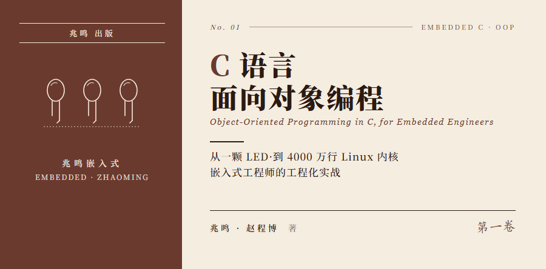

# C 语言面向对象编程·嵌入式实战

从一颗 LED 写到 Linux 内核 4000 万行代码。

这本书讲三件事：封装、继承、多态。不讲 C 语法，不讲 100 个外设驱动 API，只讲工业级 C 代码是怎么组织起来的。

学完之后你能看懂 HAL 库源码、Linux 驱动骨架，能用 C 写出和 C++ class 等价的代码，换芯片时只改驱动文件、应用层一行不动。

永久免费在线阅读·MIT License·不出版纸质书。

## 适合谁

- 学完 C 语法但不知道"工业级代码长什么样"的大二、大三学生
- 写得了 demo 但不会架构的初级嵌入式工程师
- C++ / Java 转嵌入式，想知道 C 怎么手撸 OOP 的人
- 面试准备：把 `container_of`、函数指针、平台抽象讲到底层原理

不适合的：完全没写过 C 程序的零基础读者。先学 C 语法再来。

## 这本书的特点

1. **不实操也能完全理解**：每个 `static`、每个指针、每个 `container_of` 都讲到不开 IDE 也能 follow。有经验的工程师扫读一遍就懂，不用动手
2. **三套代码并行**：前 18 章教学包在 PC 上直接 `gcc` 跑通（零硬件门槛），第五部分配套 Zephyr v3.7.0 LTS 工程（参考板 stm32f4_disco）和 Linux 6.6 主线工程（参考板 Raspberry Pi 4B），有板子能上板，没板子读源也成立
3. **直接读 upstream**：第五部分两章贴的代码段全部从 Zephyr / Linux 上游源码 read 出来，读者能 git clone 字面对照，不是脱敏代码
4. **教学包代码 0 警告**：前 18 章每章配套代码包过 `gcc -Wall -Wextra` 0 警告
5. **Linux 内核风格**：tab 缩进、`struct led` 而非 `Led_t`，读完看 Linux 内核源码不陌生

## 全书目录

[前言](preface.md)

序曲·[5 分钟看见你的第一个 OOP LED](00-序曲/00-五分钟看见OOP.md)

**第一部分 · 封装**

1. [三个 LED 三份代码 · 第一次面对重复](01-封装/01-三个LED三份代码.md)
2. [同事改了一行 LED 全乱了 · static 与信息隐藏](01-封装/02-同事改了一行.md)
3. [你用 C 手搓了一个 class · 句柄与操作函数](01-封装/03-手搓class.md)
4. [你的全局变量该死了 · 数据三级分类](01-封装/04-数据归位.md)
5. [HAL 库源码漫游 · 从抽象接口到平台实现](01-封装/05-HAL映射.md)

**第二部分 · 继承**

6. [你的代码一半是重复的 · 共性提取的痛点](02-继承/06-代码一半重复.md)

**第三部分 · 多态**

7. [写死的函数怎么换 · 函数指针入门](03-多态/07-写死的函数怎么换.md)
8. [把号码给别人拨 · 函数指针传参](03-多态/08-把号码给别人拨.md)
9. [参数长到换行 · ops 操作表](03-多态/09-ops操作表.md)
10. [ops 放进对象 · vptr 落地](03-多态/10-ops放进对象.md)
11. [同名函数不同行为 · 多态完整图景](03-多态/11-多态完整图景.md)

**第四部分 · 工程威力**

12. [一个指针指所有 LED · 向上转型](04-工程威力/12-向上转型.md)
13. [container_of 的地址魔法 · 向下转型](04-工程威力/13-container_of.md)
14. [虚函数不实现 · 三种策略](04-工程威力/14-纯虚与抽象类.md)
15. [换硬件不改应用 · OOP 完整框架](04-工程威力/15-Platform抽象.md)
16. [为什么 Linux 一点都不难 · 你已经在写 Linux 风格代码](04-工程威力/16-Linux不难.md)
17. [4000 万行一招写完 · 链接自动初始化](04-工程威力/17-initcall.md)
18. [全书地图回顾 · 一颗 LED 走过的演化路径](04-工程威力/18-全书地图.md)

**第五部分 · 开源工程实战**

19. [Zephyr 实战 · 用前 18 章的眼睛读 driver subsystem](05-工业实战/19-主控案例.md)
20. [Linux 实战 · 写一个自己的内核驱动](05-工业实战/20-子控案例.md)

**附录**

- [附录 B · Zephyr 完整工程 · stm32f4_disco](附录/B-STM32完整工程.md)
- [附录 C · Linux 完整工程 · Raspberry Pi 4B](附录/C-Linux完整工程.md)
- [附录 D · 配套代码索引](附录/D-配套代码索引.md)

[尾声·致读者](尾声-致读者.md)

## 配套代码

三套独立工程，按章节挂钩：

**教学包**（前 18 章 · 零硬件门槛 · PC 直接跑）

```bash
cd oop-in-c/code/01-three-leds/pc
make
./demo
```

[oop-in-c/code/](https://github.com/ZhaoChengBo/zhaoming-embedded/tree/master/oop-in-c/code/) 目录下，每章一个独立目录。所有代码通过 `platform.h` 抽象 GPIO，PC 上用 printf 模拟，无开发板也能学。

**Zephyr 工程**（ch19 + 附录 B · 参考板 stm32f4_disco · Zephyr v3.7.0 LTS）

```bash
cd industrial-zephyr
west build -b stm32f4_disco -p auto -- -DDEMO=1
west flash
```

[industrial-zephyr/](https://github.com/ZhaoChengBo/zhaoming-embedded/tree/master/industrial-zephyr/) freestanding application 模板，4 个 demo 切换：4 颗 LED 跑马灯 / device tree overlay / CONTAINER_OF / 可空 ops。读者按 Zephyr 官方 Getting Started 装好 SDK + zephyr/ 源即可。

**Linux 工程**（ch20 + 附录 C · 参考板 Raspberry Pi 4B · Linux 6.6 主线）

```bash
cd industrial-linux/ch20-leds-status
make
sudo insmod leds-status.ko
```

[industrial-linux/](https://github.com/ZhaoChengBo/zhaoming-embedded/tree/master/industrial-linux/) 含读者亲手写的内核驱动 `leds-status.c`、用户态 libgpiod 对照 demo、QEMU + gdb 看 container_of、ftrace 追踪 module_init 四个独立子目录。

## 关注作者

| 平台 | 信息 |
|---|---|
| 公众号 | **兆鸣嵌入式** |
| 个人微信 | **zmqrs001** |
| GitHub | [github.com/ZhaoChengBo/zhaoming-embedded](https://github.com/ZhaoChengBo/zhaoming-embedded) |
| Gitee | [gitee.com/zhao-chengbo/zhaoming_embedded](https://gitee.com/zhao-chengbo/zhaoming_embedded) |
| 抖音 | 搜「兆鸣嵌入式」 |
| B 站 | 搜「兆鸣嵌入式」 |
| 视频号 | 搜「兆鸣嵌入式」 |


扫码关注公众号「兆鸣嵌入式」，回复「交流」加入嵌入式技术交流群。后续会持续分享嵌入式架构、工业代码、Linux 内核走读、面试经验等深度内容。

## 反馈与勘误

发现错误、有改进建议、想贡献一章，到 [GitHub Issues](https://github.com/ZhaoChengBo/zhaoming-embedded/issues) 或 [Gitee Issues](https://gitee.com/zhao-chengbo/zhaoming_embedded/issues) 提一个，附章节、你的理解、你认为的问题。我会回。

读完哪章你觉得讲透了，哪章还差点意思，欢迎写出来。这是迭代下一版的最好材料。

---

开始阅读：[前言](preface.md)
